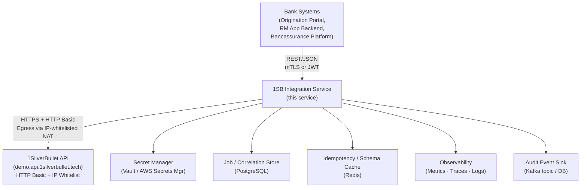
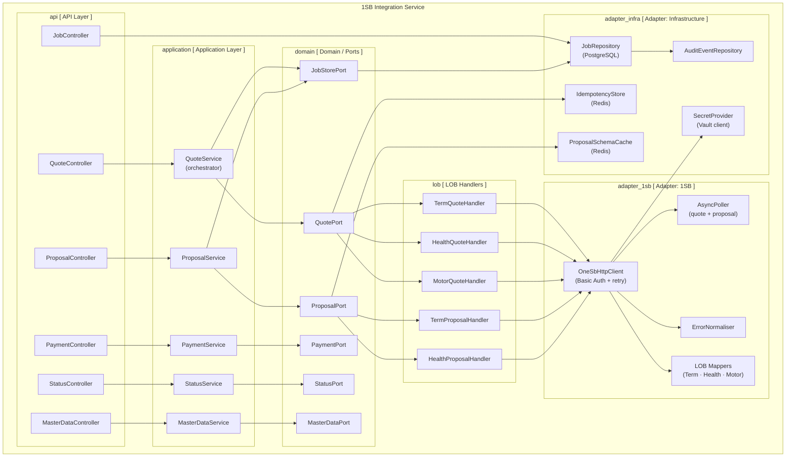
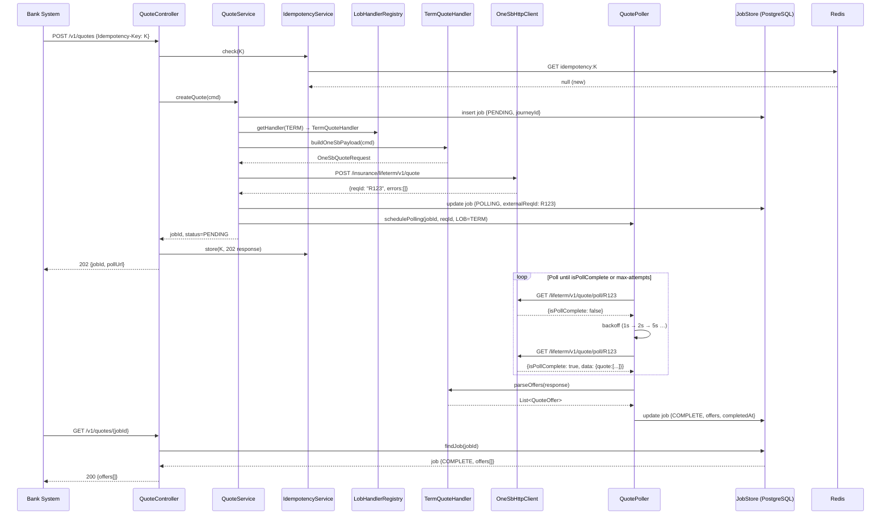
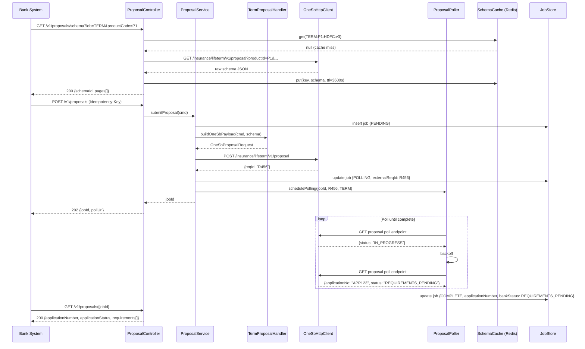
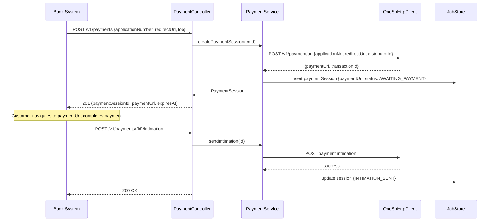
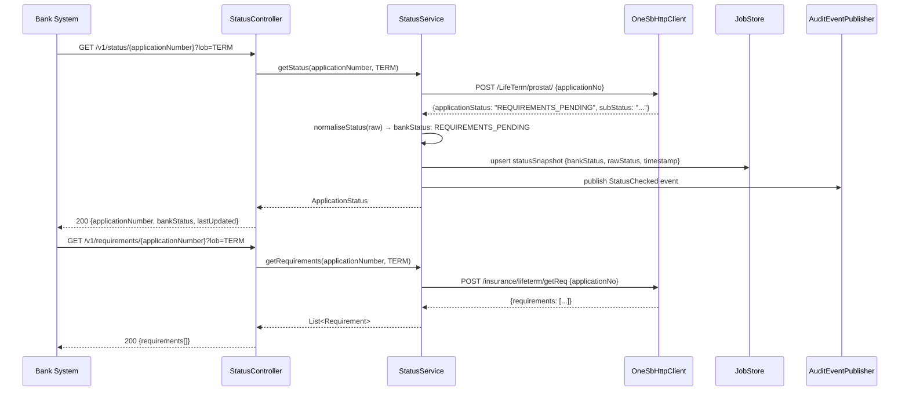

# 1SB Integration Service — Technical Architecture

**Role:** System Architect single source of truth  
**Scope:** The `1sb-integration-service` microservice only — not the full insurance platform  
**Pairing context:** Bank systems call this service; this service calls 1SilverBullet (1SB)  
**Status:** Authoritative design baseline; all implementation decisions must trace back here

---

## Table of Contents

1. [Design Principles](#1-design-principles)
2. [System Context & Component Diagram](#2-system-context--component-diagram)
3. [Module / Package Breakdown](#3-module--package-breakdown)
4. [Shared JARs / Libraries](#4-shared-jars--libraries)
5. [Bank-Facing API Outline](#5-bank-facing-api-outline)
6. [Internal Workflow Sequences](#6-internal-workflow-sequences)
7. [Non-Functional Requirements](#7-non-functional-requirements)
8. [Compliance Technical Controls](#8-compliance-technical-controls)
9. [Data Model — Job / Correlation Store](#9-data-model--job--correlation-store)
10. [Technology Recommendations](#10-technology-recommendations)
11. [Testing Strategy](#11-testing-strategy)
12. [Implementation Backlog](#12-implementation-backlog)
13. [Non-Goals / Anti-Patterns](#13-non-goals--anti-patterns)

---

## 1. Design Principles

### SOLID as applied to this service

| Principle | Concrete rule |
|-----------|---------------|
| **Single Responsibility** | Each LOB handler (`TermQuoteHandler`, `HealthQuoteHandler`, …) owns exactly one LOB's translation concern. `QuoteService` only orchestrates; it does not contain 1SB field names. The `OneSbHttpClient` only manages transport + auth. |
| **Open / Closed** | Adding a new LOB means: (a) register a new `LobQuoteHandler` bean, (b) add a routing entry. Zero changes to `QuoteService`, API controller, or shared infrastructure. |
| **Liskov Substitution** | All LOB handlers implement `LobQuoteHandler` (and analogous interfaces per capability). `QuoteService` depends only on the interface; any handler can substitute without altering orchestrator behaviour. |
| **Interface Segregation** | `OneSbQuotePort`, `OneSbProposalPort`, `OneSbPaymentPort`, `OneSbStatusPort` are separate interfaces even though they share an HTTP client. Callers depend only on the port they need. |
| **Dependency Inversion** | Application layer (use-cases) depends on port interfaces, not Spring beans or HTTP clients. Infrastructure wires the concrete implementations. Enables test doubles and future adapter swaps. |

### DRY (Don't Repeat Yourself) — as applied to this service

| Rule | Concrete application |
|------|----------------------|
| **One workflow, many LOBs** | Quote/proposal/payment/status orchestration lives once in `*Service`. LOB differences live only in handlers/mappers — never copy-paste poll loops or job creation per LOB. |
| **One HTTP + auth stack** | All 1SB calls go through `OneSbHttpClient` (Basic Auth, timeouts, metrics, audit hook). Handlers must not open their own WebClient. |
| **One error model** | Map every failure through shared normalisation → `bank-common-error`. Do not invent per-endpoint ad-hoc error JSON. |
| **One job/poll abstraction** | `JobStore` + `AsyncPoller` are reused for quote and proposal (and any future async 1SB op). |
| **Shared cross-cutting JARs** | Error, security, audit, idempotency, observability are libraries — not reimplemented inside this service or the next bank service. |
| **Masters once** | Enum/lookup fetch + cache is central (`MasterDataService`). Controllers/handlers do not call `/v1/master/lookup` ad hoc. |
| **What DRY is not** | Do **not** force Term/Health/Motor into one mega DTO or one mapper “to avoid duplication”. Different payloads = different handlers. Duplicating *structure* of a handler is OK; duplicating *infrastructure* is not. |

### KISS (Keep It Simple, Stupid) — as applied to this service

| Rule | Concrete application |
|------|----------------------|
| **Integration service only** | Do not build CIF, RM UI, suitability, or journey state machine here. If it is not required to talk to 1SB safely, it is out of scope. |
| **Case 2 is enough** | `Service.create() → LobHandler` — no complex event-sourcing or saga framework for MVP. |
| **Sync API, async inside** | Callers use simple REST + `jobId` poll. Hide 1SB poll complexity inside the service. |
| **Config over frameworks** | LOB feature flags = env vars for MVP. Do not introduce a full feature-flag platform until toggle frequency demands it. |
| **Dynamic forms stay data** | Pass schema through; do not build a generic rules engine to interpret every insurer field in this service. |
| **Start Term only** | Prove one LOB end-to-end before Health/Motor. Simplest path to a working pipeline. |
| **Boring tech** | Prefer Spring Boot + PostgreSQL + Redis + Vault patterns the bank already runs. Avoid novel stacks unless forced. |
| **What KISS is not** | Simple does **not** mean skip audit, masking, idempotency, or ArchUnit boundaries — those are small, mandatory controls, not complexity for its own sake. |

### Domain rules for this service

1. **Bank-canonical first.** Every public API contract uses bank-owned field names. 1SB shapes never appear in controller DTOs, response bodies, or error messages visible to bank callers.
2. **Correlation ownership.** The service creates its own `jobId` before the first 1SB call. The `reqId` returned by 1SB is an external reference stored alongside `jobId`; bank callers never need to know `reqId`.
3. **Async by default.** Quote and proposal operations against 1SB are asynchronous. The service either (a) exposes a `GET /jobs/{jobId}` poll endpoint or (b) delivers a webhook callback. Polling loops run inside this service, not in the caller.
4. **Idempotency at the boundary.** All mutating bank-facing endpoints accept an `Idempotency-Key` header. Repeated requests with the same key return the stored result without re-calling 1SB.
5. **Partial success is success.** Multi-quote responses may have per-insurer failures. The job reaches `PARTIAL` status (not `FAILED`) when at least one offer returns. Failed insurers are surfaced as per-offer error details.
6. **Dynamic forms are data.** Proposal schemas from 1SB are fetched at runtime and passed through as structured data. The service stores a schema cache but does not interpret field semantics; that belongs to the calling system's form renderer.
7. **Secrets never in config files.** `API_Key`, `API_Secret`, `distributorId` are injected from a secret manager at startup; no plain-text credentials in `application.yml` or environment variables baked into images.
8. **Immutable audit trail.** Every outbound 1SB call and every inbound bank request produces an audit event. Audit records are append-only; no UPDATE or DELETE on audit tables.
9. **Error normalisation at the adapter edge.** 1SB `errors[]` arrays are mapped to a bank `ServiceError` model before reaching any application-layer code. Downstream code never inspects `errorCode` strings from 1SB directly.
10. **Replaceability guard.** A ArchUnit test enforces that no class outside `adapter.onesb.*` may import `onesb` client or model types.

---

## 2. System Context & Component Diagram

### Level 1 — System context



### Level 2 — Component diagram



### Text description

The **API Layer** exposes one endpoint family per capability (quote, proposal, payment, status, job, master-data). LOB is always a discriminator field in the request body; there is no separate URL path per LOB at the bank-facing surface.

The **Application Layer** contains use-case orchestrators. `QuoteService.create()` is the canonical example of Case 2 flow: it validates the bank request, creates a `JobRecord`, selects the correct `LobQuoteHandler` by LOB enum, delegates translation + outbound call, initiates async polling, and returns the `jobId` immediately to the caller.

**LOB Handlers** are strategy objects. Each handler knows how to translate the bank canonical `QuoteCommand` (or `ProposalCommand`) into the 1SB-specific payload shape for its LOB. All handlers implement the same interface; the application layer selects by LOB via a handler registry map.

The **1SB Adapter** owns all HTTP transport concerns: credentials injection, retry scheduling, response deserialization, error normalisation, and polling loop management. Nothing above this layer touches 1SB field names.

**Infrastructure Adapters** wire domain ports to concrete stores: PostgreSQL for durable job/audit records, Redis for idempotency keys and schema cache, Vault for secrets.

---

## 3. Module / Package Breakdown

All code lives in one deployable service JAR. Internal module boundaries are enforced by package-private visibility and ArchUnit rules, not by build module separation (a single Gradle/Maven module suffices until team size demands splitting).

```
com.bank.insurance.onesb/
│
├── api/                              # HTTP entry points only
│   ├── v1/
│   │   ├── QuoteController           # POST /v1/quotes, GET /v1/quotes/{jobId}
│   │   ├── ProposalController        # GET+POST /v1/proposals
│   │   ├── PaymentController         # POST /v1/payments
│   │   ├── StatusController          # GET /v1/status
│   │   ├── JobController             # GET /v1/jobs/{jobId}
│   │   └── MasterDataController      # POST /v1/master-data/lookup
│   └── dto/
│       ├── request/                  # Bank-facing inbound DTOs
│       ├── response/                 # Bank-facing outbound DTOs
│       └── error/                    # ServiceErrorResponse, FieldError
│
├── application/                      # Use-case orchestrators; no HTTP, no SQL
│   ├── QuoteService
│   ├── ProposalService
│   ├── PaymentService
│   ├── StatusService
│   ├── MasterDataService
│   └── IdempotencyService
│
├── domain/                           # Pure domain model; zero Spring annotations
│   ├── model/
│   │   ├── QuoteJob                  # Value object: jobId, status, offers[], errors[]
│   │   ├── ProposalJob
│   │   ├── ProposalSchema            # Pass-through schema wrapper
│   │   ├── PaymentSession
│   │   ├── ApplicationStatus
│   │   └── JobStatus                 # PENDING | POLLING | PARTIAL | COMPLETE | FAILED
│   ├── command/
│   │   ├── CreateQuoteCommand        # LOB, members[], distribution, intent
│   │   ├── SubmitProposalCommand
│   │   └── CreatePaymentCommand
│   └── port/                        # Interfaces implemented by adapters
│       ├── outbound/
│       │   ├── OneSbQuotePort
│       │   ├── OneSbProposalPort
│       │   ├── OneSbPaymentPort
│       │   ├── OneSbStatusPort
│       │   ├── OneSbMasterDataPort
│       │   ├── JobStorePort
│       │   ├── AuditPort
│       │   └── SchemaStorePort
│       └── inbound/                 # (optional; for explicit use-case interfaces)
│           ├── QuoteUseCase
│           └── ProposalUseCase
│
├── lob/                             # LOB handler registry + per-LOB strategies
│   ├── LobQuoteHandler              # interface
│   ├── LobProposalHandler           # interface
│   ├── LobHandlerRegistry           # Map<Lob, LobQuoteHandler> Spring bean
│   ├── term/
│   │   ├── TermQuoteHandler
│   │   ├── TermProposalHandler
│   │   └── TermQuoteMapper          # canonical ↔ 1SB Term shapes
│   ├── health/
│   │   ├── HealthQuoteHandler
│   │   ├── HealthProposalHandler
│   │   └── HealthQuoteMapper
│   └── motor/
│       ├── MotorQuoteHandler
│       ├── MotorProposalHandler
│       └── MotorQuoteMapper
│
├── adapter/
│   ├── onesb/                       # Only package that may import 1SB client types
│   │   ├── client/
│   │   │   ├── OneSbWebClient       # Spring WebClient + Basic Auth + retry
│   │   │   ├── OneSbRequestSigner   # Injects Authorization header
│   │   │   └── OneSbResponseParser  # Deserialise + normalise errors
│   │   ├── polling/
│   │   │   ├── QuotePoller          # Scheduled: poll until isPollComplete; backoff
│   │   │   ├── ProposalPoller
│   │   │   └── PollingProperties    # intervals, max-attempts, backoff config
│   │   ├── error/
│   │   │   └── OneSbErrorNormaliser # 1SB errors[] → ServiceError[]
│   │   └── config/
│   │       └── OneSbClientConfig    # baseUrl, timeout, credentials from SecretProvider
│   │
│   ├── persistence/
│   │   ├── JobRepositoryAdapter     # implements JobStorePort
│   │   ├── AuditRepositoryAdapter   # implements AuditPort
│   │   ├── entity/
│   │   │   ├── IntegrationJobEntity
│   │   │   ├── AuditEventEntity
│   │   │   └── RawPayloadEntity
│   │   └── jpa/                     # Spring Data JPA repositories
│   │
│   ├── cache/
│   │   ├── RedisIdempotencyStore    # implements IdempotencyPort
│   │   └── RedisSchemaCache         # implements SchemaStorePort
│   │
│   └── secret/
│       └── VaultSecretProvider      # implements SecretProvider; refreshable
│
├── config/                          # Spring @Configuration classes
│   ├── WebClientConfig
│   ├── RetryConfig
│   ├── SecurityConfig               # JWT validation or mTLS
│   ├── ObservabilityConfig          # Micrometer, tracing
│   └── AsyncConfig                  # Thread pool for pollers
│
└── observability/
    ├── JobMetrics                   # Counter/histogram for job states
    ├── OneSbCallMetrics             # Latency + error-rate per LOB + operation
    └── AuditEventPublisher          # Structured log + Kafka emit
```

### Package-access rules (enforced by ArchUnit)

| Rule | Rationale |
|------|-----------|
| `adapter.onesb.*` only — may import `onesb` client/model | Isolation |
| `application.*` must not import `adapter.*` | Hex arch |
| `domain.*` must not import Spring annotations | Pure domain |
| `api.*` must not import `adapter.*` directly | Force through application layer |
| `lob.*` may import `adapter.onesb.client` and `domain.*` only | Handler boundary |

---

## 4. Shared JARs / Libraries

These modules are candidates for extraction into shared libraries consumed by multiple bank services (e.g., the RM workflow service, the bank origination platform, future LOB services). Extract only when a second consumer exists or is imminent; premature extraction creates maintenance overhead.

### Modules and their public APIs

#### `bank-common-error` — Error model and HTTP problem details

**Why shared:** Every bank service needs a consistent error envelope that partners/bank systems can parse uniformly. Changing this in one service only creates inconsistency.

**Public API surface:**
```java
// Standard error envelope returned by all bank services
ServiceErrorResponse { requestId, timestamp, errors: List<ServiceError> }
ServiceError { code, message, field, extensions }
ErrorCode (enum or registry)
ServiceException (base runtime exception)
```

**What stays service-local:** 1SB-specific error codes, mapping logic from `OneSbErrorNormaliser`.

---

#### `bank-common-security` — JWT validation + principal extraction

**Why shared:** All bank services validate the same JWT issuer and extract the same claims (employee ID, branch, roles). Duplicating this creates drift.

**Public API surface:**
```java
BankPrincipal { employeeId, branchCode, roles: Set<Role>, customerId? }
JwtAuthenticationFilter    // Spring Security filter; configurable via properties
@RequiresRole              // Method-level annotation
SecurityProperties         // jwt.issuer, jwt.audience, jwt.jwksUri
```

**What stays service-local:** Service-specific role definitions, resource-level authorization rules.

---

#### `bank-common-audit` — Audit event model + publisher contract

**Why shared:** Audit events must follow a bank-wide schema for the compliance team's tooling. The event schema and Kafka topic names are governed centrally.

**Public API surface:**
```java
AuditEvent { eventId, timestamp, actorId, actorType, action, resourceType,
             resourceId, outcome, piiFields: Map<String,String>, metadata }
AuditEventPublisher (interface)   // publish(AuditEvent)
AuditAction (enum registry)       // QUOTE_CREATED, PROPOSAL_SUBMITTED, PAYMENT_INITIATED, …
```

**What stays service-local:** Concrete publisher implementation (Kafka vs DB), PII masking rules specific to insurance data.

---

#### `bank-common-idempotency` — Idempotency-Key processing

**Why shared:** Multiple bank services accept `Idempotency-Key` on mutating calls. The Redis-backed store, TTL policy, and response-caching behaviour should be uniform.

**Public API surface:**
```java
IdempotencyFilter           // Spring WebMVC/WebFlux filter
IdempotencyStore (interface)
IdempotencyProperties       // ttl, header-name
IdempotentResponse<T>       // wraps stored response with creation time
```

---

#### `bank-common-observability` — Metrics + tracing conventions

**Why shared:** Prometheus metric naming conventions, MDC propagation, and OpenTelemetry span attribute names must be consistent for the bank's observability platform dashboards to work across services.

**Public API surface:**
```java
TraceHeaders (constants)                // X-Request-Id, X-Correlation-Id
MdcPropagationFilter                    // Propagates trace context into MDC
BankMetricNames (constants)             // Standardized metric name prefixes
TimedOperation (@annotation)            // Wraps method calls with Micrometer Timer
```

---

### Decision matrix: shared vs service-local

| Concern | Shared JAR? | Reason |
|---------|-------------|--------|
| Error model + HTTP problem details | Yes | Multi-service contract |
| JWT validation | Yes | Same issuer, same claims |
| Audit event schema + publisher | Yes | Compliance governance |
| Idempotency-Key handling | Yes | Reusable pattern |
| Metric naming conventions | Yes | Observability dashboard stability |
| 1SB HTTP client + mappers | No — service-local | Only this service calls 1SB |
| LOB handler interfaces | No — service-local | LOB strategies are internal |
| Job/correlation store schema | No — service-local | This service owns the job lifecycle |
| Spring Retry config for 1SB | No — service-local | 1SB-specific timeouts |
| Proposal schema cache | No — service-local | 1SB schema format is opaque to other services |

---

## 5. Bank-Facing API Outline

### Base URL

```
https://insurance-integration.bank.internal/v1
```

### Authentication

All endpoints require one of:
- `Authorization: Bearer <JWT>` — service-to-service (RM App backend, origination portal)
- Mutual TLS client certificate — batch / scheduled callers

### LOB discriminator

`lob` is a required string enum in every request body. Current values: `TERM | HEALTH | MOTOR | SAVING | ULIP | ANNUITY | PENSION`. New LOBs are additive; no breaking change to existing callers.

---

### 5.1 Quotes

#### `POST /v1/quotes` — Create quote job

**Idempotency-Key:** Required header.

**Request DTO — `CreateQuoteRequest`**

```json
{
  "lob": "TERM",
  "mode": "MULTI",
  "category": "SUM_ASSURED",
  "sumAssured": 10000000,
  "members": [
    {
      "role": "LIFE_ASSURED",
      "sequenceNumber": 1,
      "dob": "1990-04-12",
      "gender": "MALE",
      "tobacco": false,
      "annualIncome": 1500000,
      "pincode": "400001"
    }
  ],
  "preferences": {
    "paymentFrequency": "YEARLY",
    "policyTerm": null,
    "includeAlternateFrequency": false
  },
  "distribution": {
    "rmEmployeeId": "E123",
    "channelType": "B2B"
  },
  "correlationContext": {
    "journeyId": "jrn_abc123",
    "sessionId": "sess_xyz"
  }
}
```

Key rules:
- `rmEmployeeId` is a bank internal ID; the adapter resolves it to the insurer `agentID` via agent mapping.
- `sumAssured` / `premiumAmount` are mutually exclusive per `category`.
- `journeyId` is the calling system's journey identifier; stored on the job for tracing.

**Response — `202 Accepted`**

```json
{
  "jobId": "job_01HXZ...",
  "status": "PENDING",
  "lob": "TERM",
  "createdAt": "2026-07-30T07:48:00Z",
  "pollUrl": "/v1/jobs/job_01HXZ..."
}
```

#### `GET /v1/quotes/{jobId}` — Get quote result

**Response — `200 OK`**

```json
{
  "jobId": "job_01HXZ...",
  "status": "COMPLETE",
  "lob": "TERM",
  "offers": [
    {
      "offerId": "off_001",
      "insurer": { "code": "HDFC", "name": "HDFC Life" },
      "product": { "code": "CLICK2PROTECT", "name": "Click 2 Protect" },
      "premium": { "amount": 12300, "frequency": "YEARLY", "gst": 2214 },
      "benefits": { "sumAssured": 10000000, "coverTerm": 30 },
      "flags": { "outOfBound": false },
      "errors": []
    }
  ],
  "partialErrors": [],
  "externalRef": { "provider": "ONE_SB", "reqId": "REDACTED_IN_RESPONSE" }
}
```

Note: `reqId` is stored internally but **not** returned in the response. Bank callers use `jobId` only.

---

### 5.2 Proposals

#### `GET /v1/proposals/schema` — Fetch dynamic proposal form schema

**Query params:** `lob`, `productCode`, `insurerCode`

**Response — `200 OK`**

```json
{
  "schemaId": "scm_term_hdfc_v3",
  "lob": "TERM",
  "productCode": "CLICK2PROTECT",
  "insurerCode": "HDFC",
  "version": "3",
  "pages": [
    {
      "pageId": "personal",
      "title": "Personal Details",
      "sections": [
        {
          "sectionId": "proposer",
          "fields": [
            {
              "fieldId": "proposer.panNumber",
              "label": "PAN Number",
              "type": "TEXT",
              "mandatory": true,
              "pattern": "[A-Z]{5}[0-9]{4}[A-Z]{1}",
              "visibility": "ALWAYS"
            }
          ]
        }
      ]
    }
  ],
  "cachedAt": "2026-07-30T06:00:00Z",
  "ttlSeconds": 3600
}
```

The schema is a pass-through of the 1SB dynamic form, normalised into a bank envelope. The caller's form renderer drives field visibility and validation; this service does not interpret field semantics.

#### `POST /v1/proposals` — Submit proposal

**Idempotency-Key:** Required.

**Request DTO — `SubmitProposalRequest`**

```json
{
  "lob": "TERM",
  "schemaId": "scm_term_hdfc_v3",
  "offerId": "off_001",
  "journeyId": "jrn_abc123",
  "values": {
    "proposer.panNumber": "ABCDE1234F",
    "proposer.annualIncome": "1500000",
    "nominee.name": "Jane Doe",
    "nominee.relationship": "SPOUSE"
  },
  "distribution": {
    "rmEmployeeId": "E123"
  }
}
```

The `values` map uses dot-notation `fieldId` keys matching the schema. The adapter reconstructs the 1SB dynamic payload structure.

**Response — `202 Accepted`**

```json
{
  "jobId": "job_02ABC...",
  "status": "PENDING",
  "pollUrl": "/v1/jobs/job_02ABC..."
}
```

#### `GET /v1/proposals/{jobId}` — Get proposal result

```json
{
  "jobId": "job_02ABC...",
  "status": "COMPLETE",
  "applicationNumber": "APP123456",
  "insurerApplicationId": "HDFC-UW-789",
  "applicationStatus": "REQUIREMENTS_PENDING",
  "requirements": [
    {
      "requirementId": "req_001",
      "type": "DOCUMENT",
      "description": "Income proof",
      "status": "PENDING"
    }
  ]
}
```

---

### 5.3 Payments

#### `POST /v1/payments` — Create payment session

```json
{
  "lob": "TERM",
  "applicationNumber": "APP123456",
  "journeyId": "jrn_abc123",
  "redirectUrl": "https://bank.com/insurance/journey/jrn_abc123/payment-complete",
  "distribution": { "rmEmployeeId": "E123" }
}
```

**Response — `201 Created`**

```json
{
  "paymentSessionId": "pay_001",
  "paymentUrl": "https://payments.insurer.com/pay?token=...",
  "expiresAt": "2026-07-30T08:48:00Z",
  "status": "AWAITING_PAYMENT"
}
```

#### `POST /v1/payments/{paymentSessionId}/intimation` — Payment intimation (when required)

Empty body or minimal reference. Used when 1SB requires explicit notification post-payment. Returns `200 OK` with updated status.

---

### 5.4 Status & Requirements

#### `GET /v1/status/{applicationNumber}` — Application status

**Query:** `lob` (required)

```json
{
  "applicationNumber": "APP123456",
  "bankStatus": "REQUIREMENTS_PENDING",
  "rawStatus": "[masked — internal use only]",
  "policyNumber": null,
  "requirements": [],
  "lastUpdated": "2026-07-30T07:45:00Z"
}
```

`bankStatus` is a bank-normalised enum. `rawStatus` (1SB `applicationStatus` string) is stored internally and available in audit logs but not surfaced in the response.

#### `GET /v1/requirements/{applicationNumber}` — Get pending requirements

**Query:** `lob`

```json
{
  "applicationNumber": "APP123456",
  "requirements": [
    {
      "requirementId": "REQ001",
      "type": "DOCUMENT",
      "subType": "INCOME_PROOF",
      "description": "Last 3 months salary slip",
      "status": "PENDING",
      "dueDate": "2026-08-07"
    }
  ]
}
```

---

### 5.5 Job polling (generic)

#### `GET /v1/jobs/{jobId}` — Generic job status

Works for any job type. Callers can use this instead of capability-specific `GET` endpoints.

```json
{
  "jobId": "job_01HXZ...",
  "jobType": "QUOTE",
  "lob": "TERM",
  "status": "COMPLETE",
  "createdAt": "...",
  "completedAt": "...",
  "resultUrl": "/v1/quotes/job_01HXZ..."
}
```

---

### 5.6 Master data

#### `POST /v1/master-data/lookup` — Enum / lookup value fetch

```json
{ "lob": "TERM", "lookupType": "OCCUPATION", "filters": {} }
```

Response caches 1SB master lookup results. TTL configurable per lookup type.

---

### Error model

All error responses use `application/problem+json` (RFC 7807):

```json
{
  "type": "https://insurance.bank.com/errors/validation-failed",
  "title": "Validation Failed",
  "status": 422,
  "detail": "2 field validation errors",
  "instance": "/v1/quotes",
  "requestId": "req_xyz",
  "errors": [
    { "code": "REQUIRED_FIELD", "field": "members[0].dob", "message": "Date of birth is required" },
    { "code": "INVALID_ENUM",   "field": "lob",            "message": "Unsupported LOB: DENTAL" }
  ]
}
```

**HTTP status map:**

| Scenario | Status |
|----------|--------|
| Input validation failure | 422 |
| Missing auth / invalid JWT | 401 |
| Insufficient role | 403 |
| Duplicate Idempotency-Key with conflicting body | 409 |
| Job not found | 404 |
| Downstream 1SB timeout (no cached result) | 504 |
| Internal error (unexpected) | 500 |
| 1SB returned business error (normalised) | 422 with `source: "ONE_SB"` in error extension |

---

## 6. Internal Workflow Sequences

### 6.1 Quote flow (Case 2 pattern)



### 6.2 Proposal flow



### 6.3 Payment flow



### 6.4 Status / Requirements flow



---

## 7. Non-Functional Requirements

### 7.1 Availability

- **Target:** 99.9% monthly uptime (≈ 43 min/month allowable downtime).
- **Strategy:** Minimum 2 pods in active-active; disruption budget prevents simultaneous pod drain. Health endpoints `/actuator/health/liveness` and `/actuator/health/readiness` separate pod aliveness from dependency health.
- **Graceful degradation:** If 1SB is unreachable, already-polled jobs continue serving from `JobStore`. New job creation fails with `503` + `Retry-After` header. Master-data calls serve from Redis cache if available.
- **Dependency health:** 1SB API, PostgreSQL, Redis, Vault are all tracked as `HealthIndicator` components. `readinessProbe` goes not-ready if PostgreSQL or Redis is down (these are mandatory for job tracking). 1SB unreachability does not affect readiness for jobs already in store.

### 7.2 Latency

| Endpoint | p50 target | p99 target | Notes |
|----------|-----------|-----------|-------|
| `POST /v1/quotes` (create) | < 300 ms | < 800 ms | Returns immediately after job insert + first 1SB call |
| `GET /v1/quotes/{jobId}` (poll) | < 100 ms | < 300 ms | Database read + cache lookup |
| `GET /v1/proposals/schema` (cache hit) | < 50 ms | < 150 ms | Redis hit |
| `GET /v1/proposals/schema` (cache miss) | < 1 s | < 3 s | 1SB round trip |
| `POST /v1/proposals` (submit) | < 500 ms | < 1.5 s | Job insert + 1SB submit |
| `POST /v1/payments` | < 1 s | < 3 s | 1SB payment URL creation |
| `GET /v1/status/{id}` | < 800 ms | < 2 s | 1SB status call (not cached) |

### 7.3 Timeouts

| Call target | Connect timeout | Read timeout | Rationale |
|-------------|----------------|--------------|-----------|
| 1SB (quote, proposal submit) | 3 s | 30 s | 1SB async responds quickly but may be slow under load |
| 1SB (poll endpoints) | 2 s | 10 s | Lightweight poll responses |
| 1SB (payment URL) | 3 s | 15 s | Payment redirect generation |
| 1SB (status) | 2 s | 10 s | Status checks |
| PostgreSQL | 1 s | 5 s | Local network |
| Redis | 500 ms | 1 s | Local network; fail-open for cache |

All timeouts are externalised in `application.yml` under `onesb.client.*` and `spring.datasource.*`.

### 7.4 Retry & Idempotency

**Outbound to 1SB:**

- Submit calls (quote, proposal POST): **no automatic retry** on the same request — 1SB may have processed the request even if the connection dropped. Instead, poll by `reqId` to recover state.
- Poll calls (GET): exponential backoff with jitter, base 1 s, multiplier 2, cap 30 s, max 20 attempts. On max-attempts exceeded: job transitions to `FAILED` with `POLL_TIMEOUT` reason.
- Status calls: 3 retries with 1 s fixed delay; retry on 5xx and connection errors only.
- Master-data lookup: 3 retries with exponential backoff; results are cached on success.

**Inbound from bank callers:**

- `Idempotency-Key` header required on all `POST` endpoints. Stored in Redis with 24-hour TTL.
- Duplicate key + identical body: return stored response (200/201/202 depending on first result).
- Duplicate key + different body: return `409 Conflict`.
- No key provided: return `400 Bad Request` with error code `MISSING_IDEMPOTENCY_KEY`.

### 7.5 Concurrency

- Polling threads: dedicated `ThreadPoolTaskExecutor` named `polling-executor`, core=10, max=50, queue=200. Separate from HTTP handler threads to prevent poll starvation blocking API response.
- Job processing: per-job optimistic locking (`@Version` on `IntegrationJobEntity`) prevents duplicate poll updates if two poller instances race.
- Schema cache: write-through with Redis `SET NX EX` (set-if-not-exists + TTL) to prevent cache stampede on cold-start.

### 7.6 Security

- **Transport:** TLS 1.2 minimum for all inbound and outbound connections. TLS 1.3 preferred.
- **Outbound to 1SB:** `Authorization: Basic base64(API_Key:API_Secret)`. Credentials sourced from Vault at startup, refreshed on Vault lease renewal.
- **Inbound from bank callers:** Bearer JWT (RS256) validated against bank IdP JWKS endpoint. Alternatively, mTLS client certificates for server-to-server callers. Both options supported and feature-flagged per consumer type.
- **IP egress:** 1SB requires IP whitelisting. Service must run on a NAT gateway with a fixed egress IP. Infrastructure team owns this control; documented as a deployment requirement.
- **Secret rotation:** `API_Key`/`API_Secret` rotation is zero-downtime: Vault dynamic secret or manual rotation triggers application-level refresh without restart.
- **Authorization:** `@PreAuthorize` on service methods. Roles: `INSURANCE_QUOTE_READ`, `INSURANCE_QUOTE_WRITE`, `INSURANCE_PROPOSAL_WRITE`, `INSURANCE_PAYMENT_WRITE`, `INSURANCE_STATUS_READ`. RM App backend holds write roles; read-only callers hold read roles.

### 7.7 Data Retention

| Data type | Retention | Location | Rationale |
|-----------|-----------|----------|-----------|
| Raw 1SB request/response payloads | 7 years | Encrypted blob store / `raw_payload` table | Regulatory; claim dispute resolution |
| `integration_job` records | 7 years | PostgreSQL | Audit completeness |
| Audit events | 7 years | Immutable audit sink | Compliance |
| Proposal schema cache | Schema TTL (1 hr) | Redis | Fresh from 1SB |
| Idempotency keys | 24 hours | Redis | Deduplication window |
| PII-containing status snapshots | 7 years (masked) | PostgreSQL | Masked at rest; PII in raw payload store only |

### 7.8 Observability

**Metrics (Micrometer / Prometheus):**

| Metric | Type | Labels |
|--------|------|--------|
| `bank.onesb.job.created` | Counter | `lob`, `jobType` |
| `bank.onesb.job.completed` | Counter | `lob`, `jobType`, `finalStatus` |
| `bank.onesb.poll.attempts` | Histogram | `lob`, `jobType` |
| `bank.onesb.poll.duration` | Timer | `lob`, `jobType`, `outcome` |
| `bank.onesb.http.request.duration` | Timer | `lob`, `operation`, `statusCode` |
| `bank.onesb.error.count` | Counter | `lob`, `errorCode`, `source` |
| `bank.onesb.idempotency.hit` | Counter | `endpoint` |

**Tracing:** OpenTelemetry with trace propagation (`traceparent` header) from bank caller through to 1SB calls. `jobId`, `lob`, `journeyId` added as span attributes.

**Logging:** Structured JSON (Logback + `logstash-logback-encoder`). All logs include: `traceId`, `spanId`, `jobId`, `lob`, `rmEmployeeId` (NOT customer PAN/name/DOB). PII fields scrubbed before log emission (see section 8).

**Alerting rules:**

- `job_failure_rate > 5%` over 5-min window → PagerDuty P2
- `poll_duration_p99 > 60s` → Slack warning
- `http_5xx_rate > 1%` → PagerDuty P1
- 1SB outbound `connection_refused` or `timeout` 3 consecutive → PagerDuty P1

### 7.9 Scalability

- Stateless HTTP tier: horizontal scale by adding pods. `JobStore` and `Redis` are the only shared state.
- Polling workload scales with pod count (each pod runs its own polling threads, but only polls jobs it created; job ownership tracked in `integration_job.owned_by_instance`).
- PostgreSQL connection pool: `HikariCP`, max-pool-size=20 per pod; scale DB connection limits accordingly.
- Expected write volume: low (tens of quote/proposal jobs per minute for a bank retail launch). No sharding needed at launch.

---

## 8. Compliance Technical Controls

### 8.1 PII Handling

PII fields in insurance context include: customer name, date of birth, PAN, Aadhaar number, mobile number, email address, address, income, medical information in proposal forms.

**Rules:**
1. PII **must not** appear in log output. `LogMaskingFilter` (MDC-based + Jackson serialisation interceptor) replaces PII field values with `[MASKED]` before any log appender processes the message.
2. PII **may** appear in `raw_payload` table (encrypted at rest; see section 8.6). This is intentional for compliance and dispute resolution.
3. Status API responses returning customer identifiers: only `applicationNumber` (insurer-assigned) and `journeyId` (bank-assigned) appear in responses. Customer PAN, mobile, or name are never echoed back.
4. Proposal `values` map in `SubmitProposalRequest` may contain PII. The service stores only the job metadata in `integration_job`; proposal field values go only to the raw payload store.

### 8.2 Masking in Logs

**Implementation:** A `PiiMaskingConverter` registered as a Logback conversion word scans all log messages and JSON fields matching a configured list of field names (`pan`, `mobileNumber`, `email`, `dateOfBirth`, `aadhaarNumber`, `accountNumber`, `ifscCode`, `income`) and replaces values with `****`. Applied before any appender writes the record.

Additionally: the `OneSbWebClient` exchange filter extracts `reqId` only from response bodies before logging; the full request/response body is written to the `raw_payload` store (not to application logs).

### 8.3 Audit Events

Every state-changing operation emits an `AuditEvent` to the audit sink:

| Trigger | `action` | Required fields |
|---------|---------|-----------------|
| Quote job created | `QUOTE_JOB_CREATED` | jobId, lob, journeyId, rmEmployeeId, distributorId |
| Quote polled to completion | `QUOTE_COMPLETED` | jobId, offerCount, partialErrorCount |
| Proposal submitted to 1SB | `PROPOSAL_SUBMITTED` | jobId, applicationNumber, insurerCode |
| Proposal poll completed | `PROPOSAL_STATUS_UPDATED` | jobId, applicationStatus |
| Payment session created | `PAYMENT_SESSION_CREATED` | paymentSessionId, applicationNumber, rmEmployeeId |
| Payment intimation sent | `PAYMENT_INTIMATION_SENT` | paymentSessionId |
| Status checked | `APPLICATION_STATUS_CHECKED` | applicationNumber, bankStatus, actorId |
| Document uploaded | `DOCUMENT_UPLOADED` | requirementId, documentType |

Audit events are **append-only**. The sink may be a Kafka topic consumed by the bank's compliance platform, or a dedicated `audit_event` table with `INSERT` permission only for the service account.

### 8.4 Secret Management

- `API_Key` and `API_Secret` for 1SB: stored in HashiCorp Vault (or AWS Secrets Manager) under path `secret/insurance/onesb/credentials`.
- `distributorId`: stored alongside credentials (not a secret per se, but treated as configuration that must not be in source code).
- Database credentials: Vault dynamic secrets or Kubernetes Secrets with rotation.
- JWT public keys (JWKS): fetched from IdP at startup and cached with configurable refresh interval.
- **No secrets in `application.yml`, Dockerfile, or source code.** CI pipeline enforces this with a secret-scanning step (e.g., `gitleaks`).

### 8.5 Agent / Distributor Attribution Fields

Every outbound 1SB request **must** include the `distributor` block with:

| Field | Source | Validation |
|-------|--------|------------|
| `distributorID` | Vault config (set by 1SB RM) | Must be non-blank at startup; service refuses to start if missing |
| `agentID` | Resolved from `rmEmployeeId` via agent mapping | Validated against `GET /sp-data` before first proposal submit |
| `agentType` | From agent mapping record | `POSP \| SP \| BQP` |
| `channelType` | From request `distribution.channelType` | Defaulted to `B2B` for RM-assisted |

The `rmEmployeeId` → `agentID` mapping is stored in the bank's own agent mapping table (not in this service's schema; fetched via an internal `AgentMappingClient`). Attribution fields are included in audit events for regulatory traceability.

### 8.6 Encryption in Transit

- All HTTP connections use TLS 1.2+. TLS 1.0/1.1 disabled in JVM system properties (`-Djdk.tls.disabledAlgorithms`).
- Outbound to 1SB: HTTPS; certificate pinning optional but recommended for demo→production transition.
- Inbound from bank callers: TLS terminated at the ingress/load balancer; internal pod-to-pod traffic on Kubernetes uses mTLS via service mesh (e.g., Istio).
- Database connection: TLS to PostgreSQL enforced (`spring.datasource.url` includes `sslmode=require`).
- Redis connection: TLS enforced (`spring.data.redis.ssl.enabled=true`).

### 8.7 Retention of Raw 1SB Payloads

**Table: `raw_payload`** (see section 9)

- Every outbound 1SB call body and every inbound 1SB response body is stored here, regardless of success or failure.
- Payloads are stored as AES-256-GCM encrypted blobs. The encryption key is fetched from Vault; key rotation re-encrypts blobs in a background job.
- Retention: 7 years from `created_at`. A nightly cleanup job deletes records older than the retention window and emits a deletion audit event.
- Access: only the service's database user and the compliance data team (via a separate read-only user) can read `raw_payload`. Application code reads only the job metadata tables in normal operation.

---

## 9. Data Model — Job / Correlation Store

### Tables

#### `integration_job`

Primary record per bank-initiated operation. One row per job, regardless of how many poll attempts occur.

```sql
CREATE TABLE integration_job (
    job_id              VARCHAR(36)     PRIMARY KEY,           -- bank-generated ULID/UUID
    job_type            VARCHAR(20)     NOT NULL,              -- QUOTE | PROPOSAL | PAYMENT | STATUS
    lob                 VARCHAR(20)     NOT NULL,              -- TERM | HEALTH | MOTOR | …
    status              VARCHAR(20)     NOT NULL,              -- PENDING | POLLING | PARTIAL | COMPLETE | FAILED
    failure_reason      VARCHAR(100),                          -- POLL_TIMEOUT | ONE_SB_ERROR | …
    journey_id          VARCHAR(36),                           -- calling system's journey identifier
    application_number  VARCHAR(50),                          -- insurer application number (post-proposal)
    policy_number       VARCHAR(50),                          -- insurer policy number (post-issuance)
    external_req_id     VARCHAR(100),                         -- 1SB reqId (encrypted at rest)
    external_provider   VARCHAR(20)     NOT NULL DEFAULT 'ONE_SB',
    idempotency_key     VARCHAR(128)    UNIQUE,               -- from Idempotency-Key header
    result_blob_id      VARCHAR(36),                          -- FK → raw_payload.payload_id (job result)
    created_at          TIMESTAMPTZ     NOT NULL DEFAULT now(),
    updated_at          TIMESTAMPTZ     NOT NULL DEFAULT now(),
    completed_at        TIMESTAMPTZ,
    owned_by_instance   VARCHAR(100),                         -- pod name; for poll ownership
    version             BIGINT          NOT NULL DEFAULT 0,    -- optimistic lock
    created_by_actor    VARCHAR(100)    NOT NULL               -- rmEmployeeId or service account
);

CREATE INDEX idx_job_journey ON integration_job(journey_id);
CREATE INDEX idx_job_status ON integration_job(status, created_at);
CREATE INDEX idx_job_application ON integration_job(application_number);
```

#### `integration_job_offer`

Stores individual quote offers resulting from a quote job. Separate table because offer count is variable.

```sql
CREATE TABLE integration_job_offer (
    offer_id            VARCHAR(36)     PRIMARY KEY,
    job_id              VARCHAR(36)     NOT NULL REFERENCES integration_job(job_id),
    insurer_code        VARCHAR(50),
    product_code        VARCHAR(100),
    product_name        VARCHAR(200),
    premium_amount      NUMERIC(15,2),
    premium_frequency   VARCHAR(10),
    sum_assured         NUMERIC(15,2),
    out_of_bound        BOOLEAN         DEFAULT FALSE,
    offer_status        VARCHAR(20),                          -- VALID | INSURER_ERROR
    error_summary       VARCHAR(500),
    raw_offer_blob_id   VARCHAR(36),                         -- FK → raw_payload
    created_at          TIMESTAMPTZ     NOT NULL DEFAULT now()
);

CREATE INDEX idx_offer_job ON integration_job_offer(job_id);
```

#### `job_poll_attempt`

Audit trail of each poll call made to 1SB. Retained for debugging and SLA reporting.

```sql
CREATE TABLE job_poll_attempt (
    attempt_id          BIGSERIAL       PRIMARY KEY,
    job_id              VARCHAR(36)     NOT NULL REFERENCES integration_job(job_id),
    attempt_number      SMALLINT        NOT NULL,
    attempted_at        TIMESTAMPTZ     NOT NULL DEFAULT now(),
    http_status         SMALLINT,
    is_complete         BOOLEAN,
    duration_ms         INTEGER,
    error_message       VARCHAR(500)
);

CREATE INDEX idx_poll_job ON job_poll_attempt(job_id, attempt_number);
```

#### `raw_payload`

Encrypted store for full 1SB request/response bodies.

```sql
CREATE TABLE raw_payload (
    payload_id          VARCHAR(36)     PRIMARY KEY,
    job_id              VARCHAR(36)     NOT NULL,             -- denormalised for fast lookup (no FK; job may not exist yet on first call attempt)
    direction           VARCHAR(3)      NOT NULL,             -- REQ | RES
    operation           VARCHAR(100)    NOT NULL,             -- e.g. TERM_QUOTE_SUBMIT, TERM_QUOTE_POLL
    lob                 VARCHAR(20)     NOT NULL,
    payload_enc         BYTEA           NOT NULL,             -- AES-256-GCM encrypted
    encryption_key_id   VARCHAR(50)     NOT NULL,             -- Vault key version for decryption
    http_status         SMALLINT,
    created_at          TIMESTAMPTZ     NOT NULL DEFAULT now(),
    retain_until        DATE            NOT NULL               -- created_at + 7 years
);

CREATE INDEX idx_payload_job ON raw_payload(job_id, direction, created_at);
```

#### `audit_event`

Immutable audit log for compliance. `INSERT` only for service account.

```sql
CREATE TABLE audit_event (
    event_id            VARCHAR(36)     PRIMARY KEY,
    event_time          TIMESTAMPTZ     NOT NULL DEFAULT now(),
    action              VARCHAR(100)    NOT NULL,
    actor_id            VARCHAR(100)    NOT NULL,             -- rmEmployeeId or service-account
    actor_type          VARCHAR(20)     NOT NULL,             -- RM | SERVICE | SYSTEM
    resource_type       VARCHAR(50)     NOT NULL,             -- JOB | PAYMENT_SESSION | APPLICATION
    resource_id         VARCHAR(100)    NOT NULL,
    outcome             VARCHAR(20)     NOT NULL,             -- SUCCESS | FAILURE | PARTIAL
    lob                 VARCHAR(20),
    journey_id          VARCHAR(36),
    distributor_id      VARCHAR(50),
    agent_id            VARCHAR(50),
    metadata            JSONB,
    trace_id            VARCHAR(64)
);

CREATE INDEX idx_audit_resource ON audit_event(resource_type, resource_id, event_time);
CREATE INDEX idx_audit_actor ON audit_event(actor_id, event_time);
CREATE INDEX idx_audit_journey ON audit_event(journey_id, event_time);
```

#### `payment_session`

```sql
CREATE TABLE payment_session (
    session_id          VARCHAR(36)     PRIMARY KEY,
    job_id              VARCHAR(36)     REFERENCES integration_job(job_id),
    application_number  VARCHAR(50)     NOT NULL,
    lob                 VARCHAR(20)     NOT NULL,
    payment_url         TEXT            NOT NULL,             -- short-lived; store for debugging
    redirect_url        TEXT            NOT NULL,
    status              VARCHAR(30)     NOT NULL,             -- AWAITING_PAYMENT | INTIMATION_SENT | PAYMENT_SUCCESS | PAYMENT_FAILURE
    external_txn_id     VARCHAR(100),
    created_at          TIMESTAMPTZ     NOT NULL DEFAULT now(),
    expires_at          TIMESTAMPTZ,
    updated_at          TIMESTAMPTZ     NOT NULL DEFAULT now(),
    created_by_actor    VARCHAR(100)    NOT NULL
);
```

### Schema notes

- `external_req_id` is encrypted at the column level (or via application-layer AES before insert) — it is a 1SB correlation identifier and qualifies as metadata that should not be freely readable.
- No `UPDATE` or `DELETE` DML is permitted on `audit_event` for the service account. A separate `audit_writer` DB role has `INSERT` only.
- Partitioning: `audit_event` and `raw_payload` are candidates for range partitioning by month once volume grows; defer until needed.

---

## 10. Technology Recommendations

### Core stack assumptions

| Layer | Choice | Rationale |
|-------|--------|-----------|
| Runtime | JVM — Java 21 (LTS) | Bank standard; virtual threads available via Project Loom for high-concurrency polling |
| Framework | Spring Boot 3.3.x | Mature, bank-standard, rich ecosystem for all required concerns |
| HTTP client | Spring WebClient (Reactor Netty) | Non-blocking; well-integrated with Spring Boot retry and micrometer |
| ORM / SQL | Spring Data JPA + Hibernate 6 + HikariCP | Standard; JPQL for queries, native SQL for complex reporting |
| Database | PostgreSQL 16 | ACID, JSON support, mature, cloud-managed (AWS RDS / Azure DB) |
| Cache / Idempotency | Redis 7 (via Spring Data Redis) | Low-latency KV; Lua scripting for atomic idempotency check-and-set |
| Secret management | HashiCorp Vault (Spring Cloud Vault) | Bank-grade secret rotation; AWS Secrets Manager as alternative |
| Observability — metrics | Micrometer + Prometheus | De facto Spring Boot standard |
| Observability — tracing | Micrometer Tracing + OpenTelemetry SDK | OTLP export to bank's tracing backend (Tempo / Jaeger / Datadog) |
| Observability — logs | Logback + logstash-logback-encoder | Structured JSON; integrates with bank's ELK/OpenSearch |
| Retry | Spring Retry | Annotation-driven; integrates with Spring Boot |
| Scheduling (polling) | Spring `@Scheduled` + custom `ThreadPoolTaskExecutor` | Simple; avoid over-engineering with a job queue unless volume demands |
| Build | Gradle (Kotlin DSL) | Fast incremental builds; Kotlin DSL for type safety |
| Container | Distroless Java 21 image | Reduced attack surface |
| API documentation | Springdoc OpenAPI 3 | Auto-generated; kept in sync by tests |

### Deviations from defaults (with rationale)

| Decision | Alternative considered | Why chosen |
|----------|----------------------|------------|
| Spring WebClient (reactive HTTP) for outbound only | RestTemplate | Non-blocking needed for polling; inbound API stays MVC (blocking) for simplicity |
| Virtual threads (`-Dvirtual.threads.enabled=true`) | Reactive Webflux for inbound | Simpler code model; polling thread pool benefits from Loom's light threads |
| Redis for idempotency (not DB) | Postgres unique constraint | Redis TTL is a natural deduplication window; avoids DB write on every read-path check |
| ULID for `job_id` | UUID v4 | ULIDs are time-ordered, improving index locality on `created_at` range scans |
| Encrypted `external_req_id` | Plain text | `reqId` is a 1SB correlation token; storing plain creates a cross-system linkage to PII-adjacent context |
| No Kafka in base design | Kafka for audit events | Audit events to a DB table is simpler for a bank starting out; Kafka can be added when multi-consumer demand arises. Async outbox pattern bridges the gap if needed. |

### Project Loom note

With Java 21 and Spring Boot 3.2+, enabling virtual threads (`spring.threads.virtual.enabled=true`) allows the polling thread pool to be simplified — the OS-thread-backed pool can be replaced with a virtual-thread executor, dramatically increasing the number of concurrent in-flight polls at low memory cost.

---

## 11. Testing Strategy

### 11.1 Unit tests

**Framework:** JUnit 5 + Mockito + AssertJ

**Coverage targets:** 80% line coverage on `application.*`, `lob.*`, `adapter.onesb.error.*`, and all mappers. API controllers excluded from line targets (covered by slice tests).

**Key test classes:**

| Class under test | What to assert |
|-----------------|----------------|
| `TermQuoteHandler` | Given a `CreateQuoteCommand`, the output `OneSbQuoteRequest` has all required 1SB fields (distributor block, member sequence, quoteCategory mapping). Use JSON fixture to assert field-level accuracy. |
| `TermQuoteMapper` | Round-trip: 1SB multi-quote response fixture → `List<QuoteOffer>`; verify premium, insurer code, out-of-bound flag extraction. |
| `OneSbErrorNormaliser` | Each `errorType` / `errorCode` from 1SB fixture maps to expected `ServiceError.code`. Partial errors from multi-quote produce per-offer errors, not a global failure. |
| `QuoteService` | Mock `JobStorePort` and `LobHandlerRegistry`. Verify: job inserted before 1SB call; correct handler selected per LOB; poller scheduled; correct jobId returned. |
| `IdempotencyService` | Verify: first call stores result; second call with same key returns stored result; mismatched body returns `409`. |
| `PiiMaskingConverter` | Assert `pan`, `mobileNumber`, `email` values are replaced with `****` in output strings; non-PII fields unchanged. |

### 11.2 Web / slice tests

**Framework:** Spring Boot `@WebMvcTest` + `MockMvc`

**Scope:** Controller layer only; application services mocked.

**Test cases:**

- Valid `CreateQuoteRequest` → 202 with `jobId` and `pollUrl`
- Missing `lob` field → 422 with field error
- Missing `Idempotency-Key` header → 400
- Unknown LOB value → 422
- `Authorization` header missing → 401
- `jobId` not found → 404
- Application service throws `DownstreamUnavailableException` → 504

### 11.3 Integration / adapter tests (Testcontainers)

**Framework:** JUnit 5 + Testcontainers + Spring Boot `@SpringBootTest`

**Containers:** PostgreSQL, Redis

**Scope:** Full stack inside the service; 1SB replaced by WireMock.

**Key scenarios:**

- Quote job: POST quote → WireMock returns `reqId` → poller resolves → GET job returns `COMPLETE` with offers
- Idempotency: POST quote twice with same key → second call returns cached 202 without calling WireMock twice
- Partial failure: WireMock returns multi-quote response with one insurer error → job status is `PARTIAL`; offer list includes error entry
- Poll timeout: WireMock returns `isPollComplete: false` for all attempts → job transitions to `FAILED` with `POLL_TIMEOUT`
- Retry on 1SB 503: WireMock returns 503 twice, then 200 → verify 2 retries, then success

### 11.4 Contract tests (Consumer-Driven)

**Framework:** Spring Cloud Contract or Pact

**Consumer:** This service is the **consumer** of 1SB APIs. Contract tests verify that the `OneSbWebClient` + mapper correctly handles 1SB response shapes.

**Provider stubs to maintain:**

| Contract | What it tests |
|----------|---------------|
| `term-quote-multi-success` | Full multi-quote response with 3 insurers; 1 partial error |
| `term-quote-poll-in-progress` | `isPollComplete: false` response |
| `term-quote-poll-complete` | `isPollComplete: true` + full offer array |
| `term-proposal-form` | Dynamic form schema for one Term product/manufacturer |
| `term-proposal-submit` | Submit + `reqId` response |
| `payment-url-success` | Payment URL creation response |
| `error-normalisation-cases` | 5 distinct `errorType` variants |

These contracts are stored as JSON fixtures in `src/test/resources/contracts/onesb/`. When 1SB publishes breaking changes, fixture updates drive mapper fix discovery before integration testing.

### 11.5 1SB sandbox E2E tests

**When:** Run manually or on a dedicated CI stage (not on every PR due to external dependency).

**Setup:** Uses `https://demo.api.1silverbullet.tech` with test credentials from Vault (CI secret). IP whitelist must include the CI runner egress IP.

**Scenarios:** Happy-path Term quote → proposal form fetch → proposal submit → status check. No payment E2E (payment URLs lead to real payment gateways even in demo).

**Gate:** E2E tests must pass before any production deployment. Tracked in CI as a separate optional stage gated by the release manager.

### 11.6 Architecture fitness tests

**Framework:** ArchUnit

**Rules verified on every PR:**

- No class in `application.*` imports from `adapter.*`
- No class in `domain.*` imports Spring annotations (exception: `@Value` discouraged, but tolerated in domain properties records)
- No class outside `adapter.onesb.*` imports 1SB model classes
- All `@RestController` classes are in `api.v1.*`
- All `@Service` classes annotated as `@Transactional` use `readOnly = true` for query methods

---

## 12. Implementation Backlog

Stories are organised by priority tier. Within each tier, order reflects technical dependencies.

### Tier 0 — Foundation (must exist before any LOB work)

---

**TECH-001 — Project scaffold and CI pipeline**

**Priority:** P0  
**Type:** Technical enabler

**Description:** Initialise Spring Boot 3.3 project with Gradle Kotlin DSL. Set up: module structure per section 3, ArchUnit rules, Checkstyle, GitHub Actions CI (build + unit tests + ArchUnit).

**Acceptance criteria:**
- `./gradlew build` succeeds with zero warnings
- ArchUnit tests run and report violations as test failures
- CI pipeline runs on every PR and fails on test failure

---

**TECH-002 — Secrets integration and 1SB credential bootstrap**

**Priority:** P0  
**Type:** Technical enabler

**Description:** Integrate Spring Cloud Vault. Load `API_Key`, `API_Secret`, `distributorId` from Vault path `secret/insurance/onesb/credentials`. Service fails `readinessProbe` if credentials are missing or Vault is unreachable at startup.

**Acceptance criteria:**
- Credentials are never read from `application.yml` or environment variables
- `distributorId` injected into every outbound 1SB request; assert in unit test
- Rotating the secret and calling `/actuator/refresh` picks up the new value without restart
- Missing credentials → startup fails with clear error message in logs

---

**TECH-003 — PostgreSQL schema migration (Flyway) and Testcontainers setup**

**Priority:** P0  
**Type:** Technical enabler

**Description:** Write Flyway migrations for all tables in section 9. Configure Testcontainers for PostgreSQL and Redis in integration test profile.

**Acceptance criteria:**
- All tables created by running `V1__init.sql` through `V{n}__...sql` migrations
- `audit_event` table has `INSERT`-only service account constraint documented (separate DB role setup script)
- Integration test `@SpringBootTest` context starts cleanly with Testcontainers
- `raw_payload` encryption key ID column is non-null constraint

---

**TECH-004 — 1SB HTTP client: auth, timeout, retry, error normalisation**

**Priority:** P0  
**Type:** Technical enabler

**Description:** Implement `OneSbWebClient` with Basic Auth header injection, configured connect/read timeouts, `PiiMaskingFilter` on all log output, and `OneSbErrorNormaliser`. Include WireMock tests for retry on 5xx and connection timeout.

**Acceptance criteria:**
- `Authorization: Basic` header present on every outbound request (verify in WireMock test)
- Connect timeout → `OneSbConnectException`; read timeout → `OneSbReadTimeoutException`
- 1SB `errors[]` array → `List<ServiceError>` with correct `code` and `message` (unit test against 5 error fixtures)
- No PII field values in logged request/response bodies (PII masking unit test)
- Retry: WireMock returns 503 twice, 200 third time → single successful response returned

---

**TECH-005 — Job store + idempotency + polling infrastructure**

**Priority:** P0  
**Type:** Technical enabler

**Description:** Implement `JobRepositoryAdapter`, `RedisIdempotencyStore`, `QuotePoller` / `ProposalPoller` with configurable backoff. Include optimistic lock handling on `IntegrationJobEntity`.

**Acceptance criteria:**
- `JobRepositoryAdapter.save()` + `findById()` work against Testcontainers PostgreSQL
- Idempotency: two inserts with same key → second returns stored value; mismatched body → `IdempotencyConflictException`
- `QuotePoller` stops after `isPollComplete: true`; transitions job to `COMPLETE`
- `QuotePoller` stops after `maxAttempts`; transitions job to `FAILED` with `POLL_TIMEOUT`
- Concurrent poll updates: optimistic lock version conflict handled gracefully (retried once, then ignored with log warning)

---

**TECH-006 — Observability: metrics, tracing, structured logging, PII masking**

**Priority:** P0  
**Type:** Technical enabler

**Description:** Wire Micrometer metrics (section 7.8 metric table), OpenTelemetry trace export, structured log encoder, and `PiiMaskingConverter`.

**Acceptance criteria:**
- All metrics from section 7.8 appear in `/actuator/prometheus` output
- `traceId` and `spanId` present in every log line
- `jobId` and `lob` present as span attributes on 1SB outbound calls
- PAN/mobile/email values replaced by `****` in all log appenders (test with log capture)

---

**TECH-007 — Raw payload encryption and secure storage**

**Priority:** P0  
**Type:** Technical enabler

**Description:** Implement `RawPayloadStore` that encrypts payloads with AES-256-GCM before insert, using Vault-sourced key. Store `encryption_key_id` for future re-encryption on key rotation.

**Acceptance criteria:**
- Stored bytes are not plaintext (verify by reading raw DB column)
- Decryption round-trip returns original payload
- `retain_until` column set to `created_at + 7 years`
- Application code only reads `raw_payload` via the store abstraction; no direct JPA entity access outside `adapter.persistence`

---

### Tier 1 — Term LOB (first go-live)

---

**FEAT-001 — Term quote: submit + poll + bank response**

**Priority:** P1

**Description:** Implement `TermQuoteHandler`, `TermQuoteMapper`, `QuoteService.create()` orchestration (Case 2), `QuoteController` `POST /v1/quotes` and `GET /v1/quotes/{jobId}`.

**Acceptance criteria:**
- Given a valid `CreateQuoteRequest` with `lob=TERM` and `mode=MULTI`, a `jobId` is returned and 1SB `POST /insurance/lifeterm/v1/quote` is called with correct distributor block
- Multi-quote poll completes → `QuoteOffer[]` persisted and returned via `GET /v1/quotes/{jobId}`
- Partial insurer error → job status `PARTIAL`; per-offer `errors` populated
- Idempotency: second identical POST returns cached 202 without re-calling 1SB
- `raw_payload` written for both request and response
- Audit event `QUOTE_JOB_CREATED` and `QUOTE_COMPLETED` emitted
- ArchUnit passes: no 1SB type outside `adapter.onesb.*`

---

**FEAT-002 — Term proposal: schema fetch + submit + poll**

**Priority:** P1

**Description:** Implement `TermProposalHandler`, `ProposalService`, `GET /v1/proposals/schema`, `POST /v1/proposals`, `GET /v1/proposals/{jobId}`. Schema cache in Redis.

**Acceptance criteria:**
- Schema fetch returns structured `ProposalSchema` with pages/sections/fields
- Cache hit on second schema fetch (WireMock called only once for two identical GET requests)
- Proposal submission posts 1SB payload reconstructed from `values` flat map + schema structure
- Proposal poll completes → `applicationNumber` persisted; `bankStatus` set from normalised 1SB status
- Audit event `PROPOSAL_SUBMITTED` includes `distributorId`, `agentId`, `applicationNumber`
- PAN value in `values` map does not appear in logs

---

**FEAT-003 — Payment session creation + intimation**

**Priority:** P1

**Description:** Implement `PaymentService`, `POST /v1/payments`, `POST /v1/payments/{id}/intimation`. LOB dispatch for Health/Motor payment URL variants.

**Acceptance criteria:**
- `paymentUrl` returned is the 1SB-generated redirect URL
- `payment_session` record inserted with `AWAITING_PAYMENT` status
- Intimation: 1SB payment intimation API called; session status updated to `INTIMATION_SENT`
- Audit event `PAYMENT_SESSION_CREATED` and `PAYMENT_INTIMATION_SENT` emitted

---

**FEAT-004 — Status and requirements**

**Priority:** P1

**Description:** Implement `StatusService`, `GET /v1/status/{applicationNumber}`, `GET /v1/requirements/{applicationNumber}`.

**Acceptance criteria:**
- 1SB `applicationStatus` string normalised to `bankStatus` enum (test all statuses from `journeys/universal-lob-journey.md`)
- `rawStatus` stored in job snapshot; not returned in API response
- Requirements returned as structured list with `requirementId`, `type`, `description`, `status`
- Audit event `APPLICATION_STATUS_CHECKED` emitted on every call

---

**FEAT-005 — Master data / enum lookup with cache**

**Priority:** P1

**Description:** Implement `MasterDataService`, `POST /v1/master-data/lookup`. Cache results in Redis with configurable TTL per lookup type.

**Acceptance criteria:**
- 1SB `POST /v1/master/lookup` called on cache miss; result cached
- Cache hit: 1SB not called (verify via WireMock call count assertion)
- Supported lookup types enumerated and tested: `OCCUPATION`, `QUALIFICATION`, `RELATIONSHIP`, `CHANNEL`

---

**FEAT-006 — Agent mapping integration**

**Priority:** P1

**Description:** Implement `AgentMappingClient` that resolves `rmEmployeeId` → `agentID` + `agentType` from the bank's agent mapping service. Wire into all LOB handlers.

**Acceptance criteria:**
- `agentID` populated in 1SB distributor block on all outbound calls
- Unmapped `rmEmployeeId` → `400 Bad Request` with `AGENT_NOT_MAPPED` error code
- Agent mapping response cached per `rmEmployeeId` with 5-minute TTL

---

### Tier 2 — Health and Motor LOBs

---

**FEAT-007 — Health LOB: quote + proposal + payment**

**Priority:** P2

**Description:** Add `HealthQuoteHandler`, `HealthProposalHandler`, `HealthQuoteMapper`. Health-specific: `healthProductType`, family member relationships, `GET /insurance/lifehealth/v1/...` path.

**Acceptance criteria:**
- `lob=HEALTH` routes to health handlers (no changes to `QuoteService`)
- Family floater quote: multiple members with `memberType = INSURED`
- Health payment URL uses LOB-specific endpoint
- Existing TERM tests still pass (no regression)

---

**FEAT-008 — Motor LOB: quote + vehicle masters + proposal + payment**

**Priority:** P2

**Description:** Add `MotorQuoteHandler`, `MotorProposalHandler`. Vehicle master looker chain: type → make → model → fuel → variant. `quoteCategory = NEW | ROLL_OVER`.

**Acceptance criteria:**
- Vehicle master endpoint chain callable via `GET /v1/master-data/vehicle-masters?step=MAKE&vehicleType=CAR`
- Motor quote payload includes IDV, NCB, registration fields
- Motor policy download endpoint exposed: `GET /v1/documents/policy/{applicationNumber}?lob=MOTOR`

---

### Tier 3 — Operational excellence

---

**TECH-008 — Chaos / resilience: circuit breaker on 1SB outbound**

**Priority:** P3

**Description:** Add Resilience4j circuit breaker on `OneSbWebClient`. Configure: failure-rate threshold 50%, slow-call threshold 5 s, wait-duration-in-open 30 s. Expose circuit state as custom metric and actuator endpoint.

**Acceptance criteria:**
- Circuit opens after configured failure rate (WireMock simulates 503s)
- Open circuit → `503 Service Unavailable` returned to caller with `Retry-After` header
- Circuit state metric (`bank.onesb.circuit.state`) appears in Prometheus

---

**TECH-009 — Payload retention cleanup job**

**Priority:** P3

**Description:** Implement `@Scheduled` nightly job that deletes `raw_payload` rows where `retain_until < CURRENT_DATE`. Emit deletion count as audit event and metric.

**Acceptance criteria:**
- Rows older than retention window deleted in batches (no full-table scan)
- `PAYLOAD_RETENTION_DELETED` audit event emitted with count and date range
- Job is idempotent (safe to run multiple times on same day)

---

**TECH-010 — API versioning and deprecation strategy**

**Priority:** P3

**Description:** Document `v1` → `v2` migration policy. Add `Deprecation` and `Sunset` headers to any endpoint scheduled for removal. Implement `@ApiVersioned` annotation convention.

**Acceptance criteria:**
- `Deprecation` header returned with a future date when an endpoint version is deprecated
- Deprecation metric `bank.onesb.api.deprecated.call` incremented on each deprecated endpoint call
- OpenAPI spec version reflected in `info.version`

---

## 13. Non-Goals / Anti-Patterns

### Non-goals (explicitly out of scope for this service)

| Item | Rationale |
|------|-----------|
| Bank customer-facing UI or BFF | This service is not a UI backend. It is called by the RM App backend or origination service, which own UX concerns. |
| Suitability / need-analysis engine | Bank-owned business logic; belongs in the calling platform. |
| Journey state machine / stage persistence | The calling system owns the `Journey` aggregate (stages, transitions, SLA timers). This service stores `integration_job` (technical state) only. |
| Storing the selected quote offer as the canonical product selection | The calling system owns "customer accepted offer X". This service stores offer details in `integration_job_offer` for reference, not as source of truth. |
| CIF / KYC data store | Customer identity data lives in the bank's CIF/KYC systems. This service prefills 1SB payloads using data passed in requests; it does not replicate CIF records. |
| Full insurance policy lifecycle management | Policy numbers and status are stored as external references. No policy domain model; no endorsement, renewal, or claims flows. |
| Group / affinity insurance | Deferred to a later phase. Group 1SB APIs have a separate catalog; do not extend this service to handle group until explicit scope expansion. |
| Direct insurer API calls | Phase 1 only calls 1SB. Direct insurer adapters are a future phase B concern and must be plugged in as new adapter implementations without changing application layer. |
| Payment reconciliation ledger | The bank's payment/treasury system owns reconciliation. This service creates payment sessions and records status; it does not reconcile money movement. |
| RM authentication / maker-checker | Bank IAM concern. This service validates the JWT presented; it does not issue tokens or manage RM roles. |

---

### Anti-patterns (must be caught in code review)

| Anti-pattern | Why it is prohibited | Detection |
|--------------|---------------------|-----------|
| Using 1SB field names in controller DTOs | Creates a hard coupling; 1SB schema changes break the bank API contract | ArchUnit: no `adapter.onesb.*` types in `api.*` |
| Calling 1SB directly from application service or controller | Bypasses the adapter boundary; makes replaceability impossible | ArchUnit: `adapter.onesb.client.*` can only be called from `adapter.onesb.*` |
| Hardcoding `applicationStatus` strings from 1SB | Any 1SB status vocabulary change silently breaks bank status normalisation | `OneSbErrorNormaliser` unit tests fail on unknown status |
| Storing the full proposal `values` map in `integration_job` as a column | Proposal forms vary by LOB/insurer; schema drift breaks the column. PII would be at rest in plaintext. | Code review; values go to `raw_payload` store only |
| Polling 1SB in a synchronous HTTP request thread | Exhausts HTTP thread pool; causes cascading latency | ArchUnit / code review: poll methods must be in `adapter.onesb.polling.*` package; no direct poll calls from controllers |
| Returning `reqId` in any bank-facing response | Exposes internal 1SB correlation token; callers might use it directly | Test: no `reqId` field in serialised controller response |
| Putting `distributorId` in application.yml in plaintext | Secret leakage in source control | CI secret scanning (gitleaks); Spring Cloud Vault config enforced in TECH-002 |
| One giant `InsuranceController` with all operations | Violates SRP; makes LOB routing complex and all LOBs share a merge-conflict hot spot | Code review guideline: one controller per capability |
| Treating `GET /v1/proposals/schema` as a bank domain model | Schema is 1SB data; wrapping it minimally preserves replaceability. Interpreting field semantics here would couple the service to insurer logic. | Code review: `ProposalSchema` in domain must be a pass-through wrapper |
| Using `@Transactional` on polling threads | Polling loops are long-running; a transaction held across multiple poll attempts causes lock contention and connection exhaustion | Code review; polling methods must be `@Transactional(propagation = NOT_SUPPORTED)` |
| Ignoring partial errors in multi-quote | Silently dropping a failed insurer means the bank shows fewer quotes than available | Test: partial error fixture must produce `PARTIAL` status and per-offer error entry |
| Hardcoding enum values from Master Lookup | Enums evolve; hardcoded values cause silent mismatches | Field guide rule: use Master Lookup at runtime for enums that 1SB marks as dynamic |

---

*End of 1SB Integration Service Technical Architecture*  
*Maintained by: Bank Insurance Platform — System Architecture*  
*Related docs: [`architecture/replaceable-middleware.md`](./replaceable-middleware.md) · [`canonical-model/contexts.md`](../canonical-model/contexts.md) · [`journeys/universal-lob-journey.md`](../journeys/universal-lob-journey.md)*
