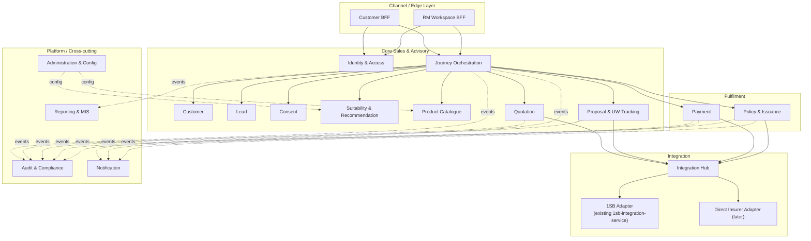

# 02 — Target Microservices Architecture

## Design rule for service boundaries

Each service = one bounded context from `knowledge-base/03-capability-map.md` / `07-information-model-and-rules.md`, owns **one write-model / one datastore**, and exposes a **bank-canonical API** (never a raw 1SB or third-party shape — carried forward from `replaceable-middleware.md`). Services are split further only when a context has a genuinely different scaling profile, team, or release cadence (e.g., Quote vs. Proposal: both "Sales" but Quote is bursty/read-heavy fan-out, Proposal is a long-lived stateful case — different enough to separate).

## Layer view

## Service catalogue (target state — ~16 services)

| # | Service | Owns (canonical objects) | Talks to | Primary datastore |
|---|---------|---------------------------|----------|--------------------|
| 1 | **Customer BFF** | Session, device context | Identity, Journey Orchestration | none (stateless) |
| 2 | **RM Workspace BFF** | RM session, portfolio view | Identity, Journey Orchestration, Lead | none (stateless) |
| 3 | **Identity & Access** | Auth session, roles, entitlements | Bank AD/SSO (federated) | DynamoDB (sessions) + Aurora (roles) |
| 4 | **Customer** | Customer (CIF-linked profile snapshot) | Core Banking System (CBS) facade | Aurora PostgreSQL |
| 5 | **Lead** | Lead | Customer, RM Workspace BFF | Aurora PostgreSQL |
| 6 | **Consent** | Consent (versioned evidence) | Journey Orchestration | Aurora PostgreSQL (append-only table) |
| 7 | **Suitability & Recommendation** | Suitability Assessment | Product Catalogue, Consent | Aurora PostgreSQL |
| 8 | **Product Catalogue** | Product Catalogue, Partner Insurer, eligibility matrix | Administration | Aurora PostgreSQL + Redis (read cache) |
| 9 | **Journey Orchestration** | Journey aggregate (`stage`, `externalRefs`, `partySnapshot`) | almost everything (orchestrator/saga) | DynamoDB (state machine, high write/read rate) |
| 10 | **Quotation** | Quote, Offer | Integration Hub | DynamoDB (job/poll pattern) + Redis (idempotency) |
| 11 | **Proposal & UW-Tracking** | Proposal, Underwriting Case | Integration Hub | Aurora PostgreSQL |
| 12 | **Payment** | Payment (attempt + reconciliation) | Integration Hub, AU Bank PG | Aurora PostgreSQL |
| 13 | **Policy & Issuance** | Policy | Integration Hub | Aurora PostgreSQL + S3 (policy PDFs) |
| 14 | **Integration Hub** | Adapter routing (`RoutingPolicy` per LOB/product) | 1SB Adapter, Direct Insurer Adapter(s) | DynamoDB (routing config), no business data |
| 15 | **1SB Adapter** *(= existing `1sb-integration-service`)* | 1SB job/correlation store, raw payload archive | 1SB Gateway API | Aurora PostgreSQL (job store) + S3 (raw payload, 7yr) |
| 16 | **Audit & Compliance** | Audit Event | Kafka (consumes all domain events) | DynamoDB (append-only, TTL-free) + S3 archive |
| 17 | **Notification** | Communication (template instances) | SNS/SES/SMS gateway | DynamoDB (delivery log) |
| 18 | **Reporting & MIS** | Reporting Metric (read models) | Consumes all domain events | Redshift Serverless / Athena over S3 data lake |
| 19 | **Administration & Config** | Product rules, feature flags, users | All services (config pull) | Aurora PostgreSQL |

That is 19 boxes on paper; several are intentionally thin (BFFs are stateless edge services, Integration Hub is a routing layer, not a data owner). **Realistic target-state count: 16 stateful/logic-bearing microservices + 2 edge BFFs + 1 routing layer.**

## MVP sequencing (don't build all 19 on day one)

Directly mirrors the existing spike's own KISS discipline ("Start Term only," "Case 2 is enough") applied to the whole platform instead of one adapter:

| Phase | Services stood up | Rationale |
|-------|--------------------|-----------|
| **P0 — Walking skeleton** | Identity & Access, Customer, Product Catalogue (Term only), Journey Orchestration, Integration Hub, 1SB Adapter *(already exists)*, Customer BFF, RM Workspace BFF | Prove one Life/Term quote round-trips through the real topology before adding domains |
| **P1 — Core sale path** | + Suitability & Recommendation, Consent, Quotation, Proposal & UW-Tracking, Payment, Policy & Issuance | Completes the mandatory "need analysis → consent → quote → proposal → payment → issuance" path for Group A |
| **P2 — Compliance & ops hardening** | + Audit & Compliance, Notification, Administration & Config | Go-live gates: compliance already treats audit/attribution as non-negotiable, not "later" |
| **P3 — Scale & extend** | + Lead, Reporting & MIS, Direct Insurer Adapter | Lead module and MIS are explicitly allowed to phase per `R0-SCOPE.md`; direct-insurer adapter proves Phase B replaceability from `08-integration-strategy.md` |

## Why these boundaries and not others

- **Quotation split from Proposal:** Quote is a stateless-ish, multi-insurer fan-out/poll workload (bursty reads, short-lived jobs — matches the existing `QuoteJob`/`AsyncPoller` pattern in `1sb-integration-service-architecture.md` almost exactly). Proposal is a long-lived case with underwriting requirements attached over days/weeks. Different lifecycle, different scaling needs, different service.
- **Journey Orchestration is new versus the capability map** because the map explicitly says domains aren't services; something has to own the cross-domain state machine (`canonical-model/contexts.md` §8 "Shared kernel: Journey aggregate") or every BFF reimplements it — that breaks the replaceability goal the whole platform is built around.
- **Integration Hub is separate from the 1SB Adapter** so that adding a direct insurer or a second aggregator (Phase B/C in `08-integration-strategy.md`) is a new adapter behind the Hub's `RoutingPolicy`, not a rewrite of Quotation/Proposal/Payment/Policy services that call it.
- **Audit & Compliance is a dedicated service**, not a shared library call, because the compliance requirement (reconstruct agent/distributor/consent/suitability per transaction) needs a durable, queryable, append-only store fed by every other service's events — a cross-cutting library alone (`bank-common-audit`, which still stays as the *event-shape* contract) can't provide that on its own.
- **Reporting & MIS is deliberately read-only and event-fed**, never queried synchronously by transactional services, so a slow analytics query can never back-pressure a customer-facing journey.
