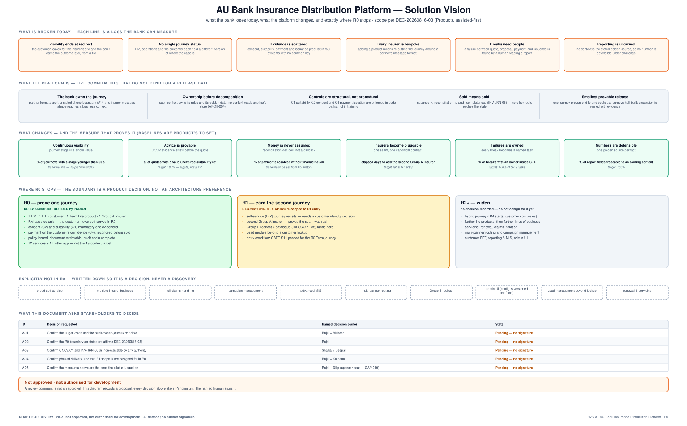

# 01 · Solution Vision

**AU Bank Insurance Distribution Platform — Architecture Pre-Approval Pack v0.2**

> ### ⛔ DRAFT FOR REVIEW · NOT APPROVED · NOT AUTHORISED FOR DEVELOPMENT
> A review comment, a recommendation, or an AI-generated verdict **is not an approval**. Every
> decision in this document stays `Pending` until the named human in [§8](#8-signature-ledger)
> records a decision, a date and a signature. Security (Board 4) and Risk & Compliance (Board 6)
> sign-offs at T4 are **human-only** and cannot be satisfied by anything in this pack.

| | |
|---|---|
| **Workstream** | WS-3 — AU Bank Insurance Distribution Platform (primary) |
| **Canonical stage** | S08 — Engineering Foundation, S09 overlapped ([`CURRENT-STATE.yaml`](../../../governance/state/CURRENT-STATE.yaml)) |
| **Gate criteria addressed** | S07-G1 (partial — documented, not reviewed) |
| **Risk tier** | **T4** — triggers G1, G2, G5, G6, G8 ([`11-REVIEW_GATES §3`](../../../governance/11-REVIEW_GATES.md)) |
| **Evidence level** | E1 — a document, unsigned |
| **Document owner** | Mahesh — Principal Insurance Platform Architect (Board 1 / R2) |
| **Provenance** | **AI-DRAFTED.** Self-review declared (`self_review: true`). Needs ≥ 1 human board |
| **Version** | 0.2 · 2026-08-17 · supersedes v0.1 |

### Relationship to existing architecture (drift control)

This document **summarises and presents** the merged architecture baseline for a stakeholder
review. It does not supersede any of it. Where this document and the baseline differ, **the
baseline wins** and the difference is a defect in this document.

| Artefact | Relationship |
|---|---|
| [`docs/hdl.svg`](../../../hdl.svg) | **Authoritative** R0 high-level design — hand-authored |
| [`platform/architecture-review/01–08`](../../../platform/architecture-review/README.md) | Authoritative; carries ADRs ARCH-001…ARCH-022 |
| [`platform/ws3-platform/00–05`](../../../platform/ws3-platform/00-WS3-ARCHITECTURE-REGISTRATION.md) | Authoritative; domain model, information model, R0 build order, security architecture, NFR catalogue |
| [S06](../../../application-lifecycle-bible/evidence/S06-domain-architecture-evidence.md) / [S07](../../../application-lifecycle-bible/evidence/S07-solution-architecture-evidence.md) evidence | Authoritative gate position |
| v0.1 of this pack | **Superseded.** See [the 360° review](../reviews/PR-55-360-STAKEHOLDER-REVIEW-v1.0.md) for the 68 findings this version answers |

---

---

## 1. The vision, in one sentence

One bank-owned insurance platform on which a customer and a Relationship Manager complete an
insurance journey from first conversation to an **issued, reconciled and evidenced** policy —
with the bank retaining ownership of the journey, the business rules, the evidence and the
operational truth.

The platform supports assisted, self-service and combined journeys **over time**, and multiple
lines and insurers **over time**, without a partner's technical format ever dictating the shape of
the bank's customer journey.

## 2. What is broken today

Each of these is a loss the bank can measure, not a preference.

| # | Problem | What it costs |
|---|---|---|
| P-1 | Visibility ends at the redirect | the customer leaves for the insurer's site; the bank learns the outcome later, from a file |
| P-2 | No single journey status | RM, operations and the customer each hold a different version of where the case is |
| P-3 | Evidence is scattered | consent, suitability, payment and issuance proof sit in four systems with no common key |
| P-4 | Every insurer is bespoke | adding a product means re-cutting the journey around a partner's message format |
| P-5 | Breaks need people | a failure between quote, proposal, payment and issuance is found by a human reading a report |
| P-6 | Reporting is unowned | no context is the stated golden source, so no number is defensible under challenge |

## 3. Five commitments that do not bend for a release date

| # | Commitment | How it is enforced, not just stated |
|---|---|---|
| **CM-1** | The bank owns the journey | partner formats are translated at exactly one boundary (`#14 Integration Hub`); no insurer message shape reaches a business context (`SC-W3-5`) |
| **CM-2** | Ownership precedes decomposition | each context owns its rules and its golden data; no context reads another's store — ArchUnit asserts it in the build, IAM denies it at runtime (`ARCH-004`) |
| **CM-3** | Controls are structural, not procedural | C1 suitability, C2 consent and C4 payment isolation live in code paths. In `apps/rm-workspace-app` there is **no interface method or widget capable of accepting a payment instrument** (DEC-20260816-12) |
| **CM-4** | Sold means sold | `INV-JRN-05` — issuance ∧ reconciliation ∧ audit completeness. No route reaches SOLD by elapsed time, retry count, or an operator's judgement |
| **CM-5** | Smallest provable release | one journey proven end to end beats six journeys half-built; expansion is earned with evidence, not scheduled by optimism |

## 4. Who is served

Existing bank customers · Relationship Managers and branch managers · insurance operations ·
Compliance, Risk, Audit and Security · Product and business teams · Finance and reconciliation ·
partner insurers and service providers · platform engineering and SRE.

**Two of these have no seat in this pack's signature ledger and should have one:** Finance (which
owns reconciliation in [§8](#8-signature-ledger) and in doc 02) and an Executive Sponsor
(GAP-010 — the `FRI-001` funding line has no approver). Both are recorded as blocked, not as
resolved.

## 5. Where R0 stops

**Scope authority: DEC-20260816-03 — DECIDED by Product (Rajal).** Assisted-first; DIY revisits at
R1; hybrid at R2. This supersedes the Day-1 three-journey framing in
[`R0-SCOPE.md` v0.3 §2 A2](../../requirements/R0-SCOPE.md) **for R0 only**, with both deferred
journeys carrying named revisit triggers. The `R0-SCOPE` v0.4 republish remains outstanding
(condition C4) — until it lands, the published business SSOT and this document disagree on their
face, and **this document is not the authority that resolves it**.

### R0 — prove one journey

1 RM · 1 ETB customer · 1 Term Life product · 1 Group A insurer · RM-assisted only · consent (C2)
and suitability (C1) mandatory and evidenced · payment on the customer's own device (C4),
reconciled before sold · policy issued, document retrievable, audit chain complete.

**Twelve services plus one Flutter application** — not the nineteen-context target
([`03-solution-architecture-r0.md §3`](../../../platform/ws3-platform/03-solution-architecture-r0.md)).

### Explicitly not in R0

Broad self-service · multiple lines of business · full claims handling · campaign management ·
advanced MIS · multi-partner routing · **Group B redirect** (R0-SCOPE A5 — lands at R1) · admin UI
(config is versioned artefacts consumed at startup until S13) · Lead management beyond a customer
lookup · renewal and servicing.

Written down so each is a **decision**, never a discovery.

## 6. What changes — and the measure that proves it

Baselines are Product's to set. A measure without a baseline is a slogan.

| Outcome | Measure | Baseline / target |
|---|---|---|
| Continuous visibility | % of journeys whose stage is younger than 60 s | baseline n/a — no platform today |
| Advice is provable | % of quotes with a valid, unexpired suitability reference | **100% — this is a gate, not a KPI** |
| Money is never assumed | % of payments resolved without a manual touch | baseline to be set from PG history |
| Insurers become pluggable | elapsed days to add the second Group A insurer | target set at R1 entry |
| Failures are owned | % of breaks with a named owner inside SLA | 100% of S-19 tasks |
| Numbers are defensible | % of report fields traceable to an owning context | 100% |

## 7. Decisions requested

| ID | Decision | Named owner | State |
|---|---|---|---|
| V-01 | Confirm the target vision and the bank-owned-journey principle | Mahesh + Rajal | Pending |
| V-02 | Confirm the R0 boundary as stated (re-affirms DEC-20260816-03) | Rajal | Pending |
| V-03 | Confirm C1, C2, C4 and INV-JRN-05 as non-waivable by any authority | Shailja + Deepali | Pending |
| V-04 | Confirm phased delivery, and that R1 scope is not designed for during R0 | Rajal + Kalpana | Pending |
| V-05 | Confirm these are the measures the pilot is judged on | Rajal + Executive Sponsor (GAP-010) | **Blocked — no sponsor seated** |

## 8. Signature ledger

The same ledger appears in all eight documents. Roles resolve to the canonical personas in
[`PERSONA-AUTHORITY-MATRIX v1.6`](../../../governance/PERSONA-AUTHORITY-MATRIX.md).

| Board / seat | Named human | Rights | Reviewing here | Decision | Date | Signature |
|---|---|---|---|---|---|---|
| Board 1 — Architecture | Mahesh | AP · B | structure and principles | Pending | | |
| Board 3 — Product | Rajal | AP | vision, scope, actors, outcomes | Pending | | |
| R11 — Business Analysis | Principal BA | RV | traceability and testable expression | Pending | | |
| Board 2 — Engineering | Amit | RV | feasibility against the existing estate | Pending | | |
| **Board 4 — Security** | **Deepali** | **AP · B · HUMAN** | security principles, protected-data posture | Pending | | |
| Data & Database | Aarti | AP | data ownership and integrity | Pending | | |
| Board 5 — Quality | Swapnali | AP | testability of the stated outcomes | Pending | | |
| **Board 6 — Risk & Compliance** | **Shailja** | **AP · B · HUMAN** | regulatory and customer-protection outcomes | Pending | | |
| Board 7 — Operations | Shivanshi | AP | operability of the target | Pending | | |
| R12 — Delivery | Kalpana | RV | feasibility of the phased plan | Pending | | |
| Finance | **SEAT NOT FILLED** | — | reconciliation and settlement ownership | **Blocked** | | |
| Executive Sponsor | **SEAT NOT FILLED (GAP-010)** | — | `FRI-001` funding line | **Blocked** | | |

## 9. Version history

| Version | Date | Change | State |
|---|---|---|---|
| 0.1 | 2026-08-17 | Initial pre-approval draft (DOCX) | Superseded |
| 0.2 | 2026-08-17 | Rebuilt in Markdown with SVG diagrams. Adds decision citations, drift-control table, measures with baselines, the AIGEM header, the missing Finance and Sponsor seats, and the explicit R0-SCOPE v0.3 conflict. Answers review findings F-06, F-09, F-10, F-20, F-55, F-56, F-61 | **Draft for review** |
