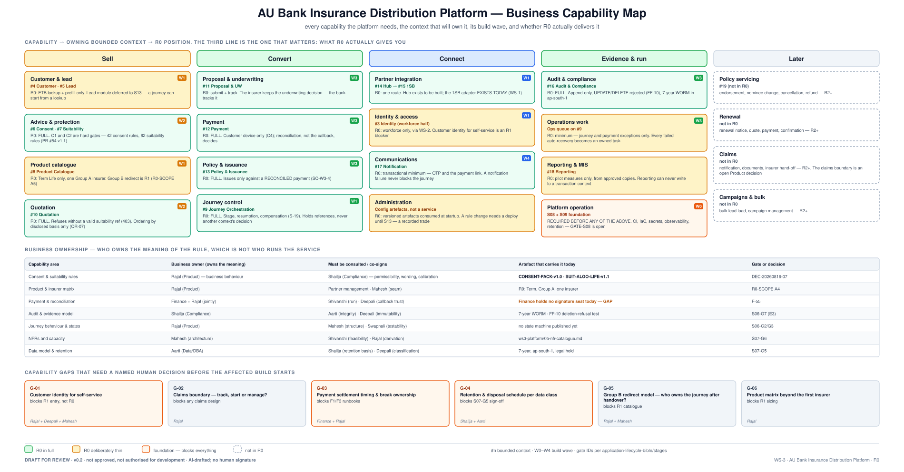

# 02 · Business Capability Map

**AU Bank Insurance Distribution Platform — Architecture Pre-Approval Pack v0.2**

> ### ⛔ DRAFT FOR REVIEW · NOT APPROVED · NOT AUTHORISED FOR DEVELOPMENT
> Every decision stays `Pending` until a named human signs. Boards 4 and 6 are human-only at T4.

| | |
|---|---|
| **Workstream** | WS-3 · stage S08 (S09 overlapped) |
| **Gate criteria addressed** | S07-G7 (R0 build order — met), S06-G5 (ownership — met) |
| **Risk tier** | T4 · **Evidence level** E1 |
| **Owner** | Rajal (business meaning) · Mahesh (solution alignment) |
| **Provenance** | **AI-DRAFTED**, unsigned · self-review declared |
| **Version** | 0.2 · 2026-08-17 · supersedes v0.1 |

**Drift control:** presents [`03-solution-architecture-r0.md`](../../../platform/ws3-platform/03-solution-architecture-r0.md)
(build order), [`business-problem-statement.md §6`](../../../context/business-problem-statement.md)
(the 19 contexts) and [`BRD-P0-CAPABILITIES.md`](../../requirements/BRD-P0-CAPABILITIES.md). Does
not supersede any of them.

---

---

## 1. How to read this

Every capability maps to **one owning bounded context**, a **build wave**, and an honest statement
of what R0 actually delivers. The third column is the one that matters: "included" without a
boundary is how a pilot becomes a programme.

| Position | Meaning |
|---|---|
| **R0 — full** | delivered completely in R0; a gate depends on it |
| **R0 — thin** | delivered deliberately narrow, with the narrowing recorded as a decision |
| **Foundation** | not a business capability; blocks every one of them |
| **Not in R0** | out of scope, with the release that owns it named |

## 2. Capability inventory

### Sell

| Capability | Owning context | Wave | R0 position |
|---|---|---|---|
| Customer & lead | `#4 Customer` · `#5 Lead` | W1 | **thin** — ETB lookup + prefill only. Lead module deferred to S13: a journey can start from a lookup, so Lead adds sales management, not journey capability |
| Advice & protection | `#6 Consent` · `#7 Suitability` | W2 | **full** — C1 and C2 are hard gates. 42 consent rules, 62 suitability rules, `SUIT-ALGO-LIFE-v1.1` (PR #54) |
| Product catalogue | `#8 Product Catalogue` | W1 | **thin** — Term Life, one Group A insurer. Group B redirect is R1 (R0-SCOPE A5) |
| Quotation | `#10 Quotation` | W2 | **full** — refuses without a valid suitability reference (403). Ordering by disclosed customer-relevant basis only (QR-07 / DEC-20260816-08) |

### Convert

| Capability | Owning context | Wave | R0 position |
|---|---|---|---|
| Proposal & underwriting | `#11 Proposal & UW` | W3 | **full** — submit and track. The insurer keeps the underwriting decision; the bank tracks it and never re-derives it |
| Payment | `#12 Payment` | W3 | **full** — customer device only (C4). Reconciliation, not the callback, decides |
| Policy & issuance | `#13 Policy & Issuance` | W3 | **full** — issues only against a RECONCILED payment (`SC-W3-4`) |
| Journey control | `#9 Journey Orchestration` | W1 | **full** — stage, resumption, compensation (S-19). Holds references, never another context's decision (`SC-W3-6`) |

### Connect

| Capability | Owning context | Wave | R0 position |
|---|---|---|---|
| Partner integration | `#14 Hub` → `#15 1SB` | W1 | **full**, one route. **The Hub is to be built; the 1SB adapter EXISTS TODAY** as a WS-1 supplier deliverable |
| Identity & access | `#3 Identity` (workforce half) | W1 | **thin** — workforce only, via WS-2 (IF-2). Customer identity for self-service is an R1 blocker, not an R0 gap |
| Communications | `#17 Notification` | W4 | **full** for transactional minimum — OTP and the payment link. A notification failure never blocks a journey (S-18) |
| Administration | versioned config artefacts | — | **thin** — consumed at startup, not a service with a UI. A rule-pack change requires a deployment until S13. **An explicit, recorded trade** |

### Evidence & run

| Capability | Owning context | Wave | R0 position |
|---|---|---|---|
| Audit & compliance | `#16 Audit & Compliance` | W3 | **full** — append-only; UPDATE and DELETE rejected (`FF-10`); 7-year WORM in `ap-south-1` |
| Operations work | ops queue on `#9` | W3 | **thin** — journey and payment exceptions only. Every failed auto-recovery becomes an owned task |
| Reporting & MIS | `#18 Reporting` | — | **thin** — pilot measures from approved copies. No write path into any transaction context (`FF-15`) |
| Platform operation | S08 + S09 foundation | W0 | **Foundation. Required before any of the above.** CI, IaC, secrets, observability, retention. GATE-S08 is open |

### Not in R0

Policy servicing (`#19`) · renewal · claims · campaigns and bulk. All R2+. **The claims boundary —
track, initiate, or manage — is an open Product decision (G-02)**, and no design commitment is made
in R0.

## 3. Business ownership

Who owns the **meaning** of a rule is not who runs the service that executes it.

| Capability area | Business owner | Must be consulted / co-signs | Artefact that carries it today | Anchor |
|---|---|---|---|---|
| Consent & suitability rules | Rajal — business behaviour | **Shailja — permissibility, wording, calibration** | `CONSENT-PACK-v1.0` · `SUIT-ALGO-LIFE-v1.1` | DEC-20260816-07 |
| Product & insurer matrix | Rajal | Partner management · Mahesh (seam) | R0: Term, Group A, one insurer | R0-SCOPE A4 |
| Payment & reconciliation | **Finance + Rajal jointly** | Shivanshi (run) · Deepali (callback trust) | ⚠️ **Finance holds no signature seat — F-55** | — |
| Audit & evidence model | Shailja | Aarti (integrity) · Deepali (immutability) | 7-year WORM · FF-10 deletion-refusal test | S06-G7 (E3) |
| Journey behaviour & states | Rajal | Mahesh (structure) · Swapnali (testability) | [`journey-state-machine.svg`](../../../diagrams/journey-state-machine.svg) — **new in v0.2** | S06-G2/G3 |
| NFRs and capacity | Mahesh | Shivanshi (feasibility) · Rajal (derivation) | [`05-nfr-catalogue.md`](../../../platform/ws3-platform/05-nfr-catalogue.md) | S07-G6 |
| Data model & retention | Aarti | Shailja (retention basis) · Deepali (classification) | 7-year, `ap-south-1`, legal hold | S07-G5 |

## 4. Alignment rules

- One capability may be served by more than one component; one component may serve closely related
  capabilities. **A capability name never justifies a separately deployed service** — deployment
  grouping is an architecture decision requiring an ADR (`AP-7`).
- The owner of a business rule owns changes to its **meaning**. Technical ownership does not
  replace business ownership.
- Shared reporting may read approved copies. It never becomes the owner of the fact.
- A partner supplies facts and decisions within its role. **It does not own the bank's journey.**

## 5. Capability gaps requiring a named human decision

| ID | Gap | What it blocks | Decision owner |
|---|---|---|---|
| G-01 | Customer identity for self-service | **R1 entry** — not R0. Deciding it late forces a session redesign | Rajal + Deepali + Mahesh |
| G-02 | Claims boundary — track, initiate or manage? | any claims design | Rajal |
| G-03 | Payment settlement timing & break ownership | the F1 and F3 runbooks in [doc 04](./04-high-level-design.md) | Finance + Rajal |
| G-04 | Retention & disposal schedule per data class | S07-G5 sign-off | Shailja + Aarti |
| G-05 | Group B redirect — who owns the journey after handover? | R1 catalogue | Rajal + Mahesh |
| G-06 | Product matrix beyond the first insurer | R1 sizing | Rajal |

## 6. Traceability

⚠️ **Known gap carried into v0.2.** Capabilities here are not yet mapped to `BG-001…BG-006` and the
`BRD-P0` capability IDs. Until that matrix exists, **coverage cannot be proven and impact cannot be
assessed** — it is registered as action A-12 in the [360° review](../reviews/PR-55-360-STAKEHOLDER-REVIEW-v1.0.md)
and is owned by the R11 BA with Rajal. This document states the gap rather than implying coverage
it does not have.

## 7. Signature ledger

As [doc 01 §8](./01-solution-vision.md#8-signature-ledger) — identical ledger, all seats, all
`Pending`. Boards 4 and 6 human-only. Finance and Executive Sponsor seats **unfilled**.

## 8. Version history

| Version | Date | Change | State |
|---|---|---|---|
| 0.1 | 2026-08-17 | Initial draft (DOCX) | Superseded |
| 0.2 | 2026-08-17 | Capabilities mapped to owning contexts and build waves; R0 position stated honestly per capability; Group B, Lead and claims positions corrected against R0-SCOPE; rule packs cited; traceability gap declared rather than implied. Answers F-07, F-08, F-10, F-11 | **Draft for review** |
