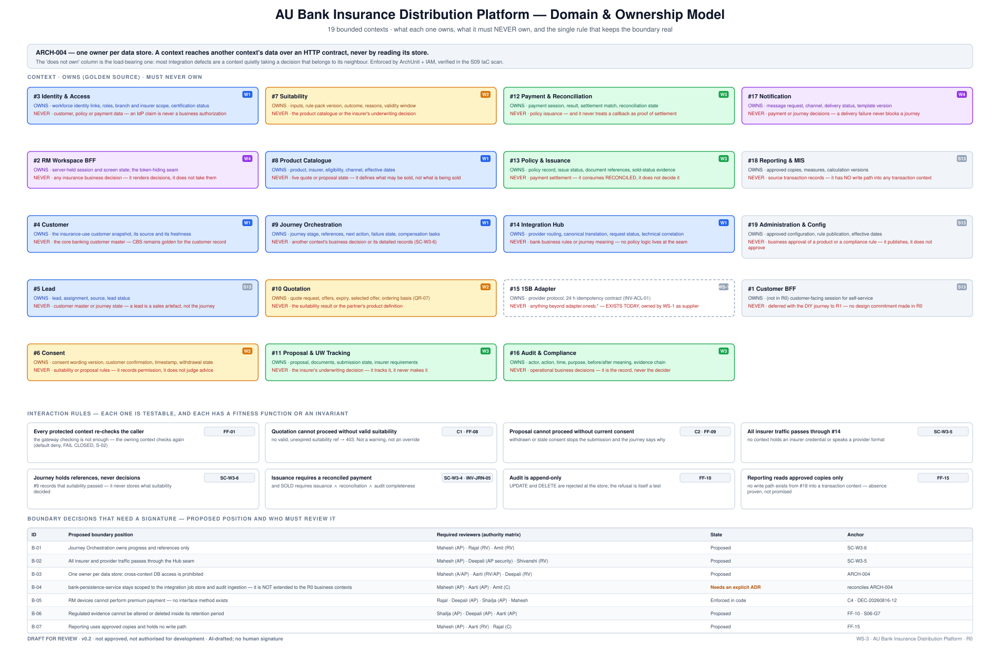
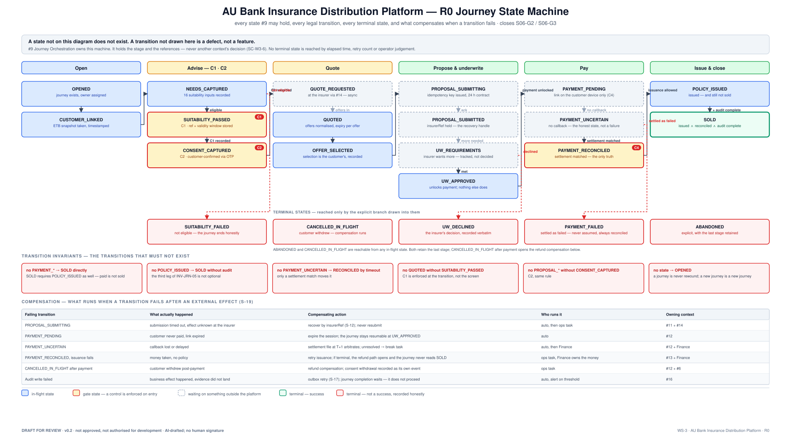

# 03 · Domain & Ownership Model

**AU Bank Insurance Distribution Platform — Architecture Pre-Approval Pack v0.2**

> ### ⛔ DRAFT FOR REVIEW · NOT APPROVED · NOT AUTHORISED FOR DEVELOPMENT

| | |
|---|---|
| **Workstream** | WS-3 · stage S08 (S09 overlapped) |
| **Gate criteria addressed** | S06-G1 ✅ · S06-G2 ✅ · S06-G3 ✅ · S06-G5 ✅ · S06-G6 ✅ · S06-G8 ⚠️ partial · **S06-G4 open** (logical data model — Aarti's artefact) · **S06-G7 open** (E3, needs an executed reconstruction) |
| **Risk tier** | T4 · **Evidence level** E1 (E2 on signature) |
| **Owner** | Mahesh — Principal Insurance Platform Architect |
| **Provenance** | **AI-DRAFTED**, unsigned · self-review declared |

**Drift control:** presents [`01-domain-model-and-invariants.md`](../../../platform/ws3-platform/01-domain-model-and-invariants.md)
and [`02-information-model.md`](../../../platform/ws3-platform/02-information-model.md). Does not
supersede them.

---

---

## 1. The rule

> **`ARCH-004` — one owner per data store.** A context reaches another context's data over an HTTP
> contract, never by reading its store.

Enforced three ways, because a rule enforced one way is a convention: **ArchUnit** asserts it in
the build, **IAM** denies it at runtime, and the **S09 IaC scan** proves the policy is actually
deployed.

The **"does not own"** column below is the load-bearing half of this document. Most integration
defects are a context quietly taking a decision that belongs to its neighbour, and that is
invisible if you only write down what each context owns.

## 2. The nineteen contexts

| # | Context | Wave | Owns (golden source) | Must **never** own |
|---|---|---|---|---|
| 3 | Identity & Access | W1 | workforce identity links, roles, branch and insurer scope, certification status | customer, policy or payment data. **An IdP claim is never a business authorization** |
| 2 | RM Workspace BFF | W4 | server-held session and screen state; the token-hiding seam | any insurance business decision — it renders decisions, it does not take them |
| 4 | Customer | W1 | the insurance-use customer snapshot, its source and its freshness | the core banking customer master — **CBS stays golden** |
| 5 | Lead | S13 | lead, assignment, source, lead status | customer master or journey state |
| 6 | Consent | W2 | consent wording version, customer confirmation, timestamp, **withdrawal state** | suitability or proposal rules |
| 7 | Suitability | W2 | inputs, rule-pack version, outcome, reasons, validity window | the catalogue, or the insurer's underwriting decision |
| 8 | Product Catalogue | W1 | product, insurer, eligibility, channel, effective dates | live quote or proposal state |
| 9 | Journey Orchestration | W1 | journey stage, references, next action, failure state, compensation tasks | **another context's business decision or its detailed records (`SC-W3-6`)** |
| 10 | Quotation | W2 | quote request, offers, expiry, selected offer, ordering basis | the suitability result, or the partner's product definition |
| 11 | Proposal & UW Tracking | W3 | proposal, documents, submission state, insurer requirements | **the underwriting decision — it tracks it, it never makes it** |
| 12 | Payment & Reconciliation | W3 | payment session, result, settlement match, reconciliation state | policy issuance. And it never treats a callback as proof of settlement |
| 13 | Policy & Issuance | W3 | policy record, issue status, document references, sold-status evidence | payment settlement — it consumes RECONCILED, it does not decide it |
| 14 | Integration Hub | W1 | provider routing, canonical translation, request status, technical correlation | bank business rules or journey meaning |
| 15 | 1SB Adapter | **WS-1 — exists today** | provider protocol, 24 h idempotency contract (`INV-ACL-01`) | anything beyond `adapter.onesb.*` |
| 16 | Audit & Compliance | W3 | actor, action, time, purpose, before/after meaning, evidence chain | operational business decisions — it is the record, never the decider |
| 17 | Notification | W4 | message request, channel, delivery status, template version | payment or journey decisions |
| 18 | Reporting & MIS | S13 | approved copies, measures, calculation versions | source transaction records. **No write path exists (`FF-15`)** |
| 19 | Administration & Config | S13 | approved configuration, rule publication, effective dates | business approval of a product or a compliance rule — it publishes, it does not approve |
| 1 | Customer BFF | S13 | *(not in R0)* customer-facing session for self-service | deferred with the DIY journey to R1 |

## 3. Interaction rules

Each rule is testable, and each names the thing that tests it.

| Rule | What it means in practice | Proven by |
|---|---|---|
| Every protected context re-checks the caller | the gateway checking is not enough — the owning context checks again, default deny, fail closed | `FF-01` · `S-02` |
| Quotation cannot proceed without valid suitability | no valid, unexpired reference → **403**. Not a warning, not an override, no supervisor bypass | **C1** · `FF-08` |
| Proposal cannot proceed without current consent | withdrawn or stale consent stops the submission and the journey states why | **C2** · `FF-09` |
| All insurer traffic passes through `#14` | no context holds an insurer credential or speaks a provider format | `SC-W3-5` |
| Journey holds references, never decisions | `#9` records *that* suitability passed — never *what* it decided | `SC-W3-6` |
| Issuance requires a reconciled payment | and SOLD additionally requires audit completeness | `SC-W3-4` · `INV-JRN-05` |
| Audit is append-only | UPDATE and DELETE rejected at the store; **the refusal is itself the test** | `FF-10` |
| Reporting reads approved copies only | absence of a write path is proven, not promised | `FF-15` |

## 4. The journey state machine

New in v0.2 — v0.1 described the journey as fourteen prose steps, which is not a design.

Seventeen states, every legal transition, five terminal states reached **only** by an explicit
branch, six forbidden transitions, and a compensation per failing transition (`S-19`). Closes
**S06-G2** and **S06-G3**.

The forbidden transitions are the useful half:

- no `PAYMENT_*` → `SOLD` directly — **paid is not sold**
- no `POLICY_ISSUED` → `SOLD` without audit — the third leg of `INV-JRN-05` is not optional
- no `PAYMENT_UNCERTAIN` → `PAYMENT_RECONCILED` by timeout — only a settlement match moves it
- no `QUOTED` without `SUITABILITY_PASSED`; no `PROPOSAL_*` without `CONSENT_CAPTURED`
- no state → `OPENED` — a journey is never rewound; a new journey is a new journey

## 5. Boundary decisions requiring a signature

| ID | Proposed position | Required reviewers | State |
|---|---|---|---|
| B-01 | `#9` owns progress and references only | Mahesh (AP) · Rajal (RV) · Amit (RV) | Pending |
| B-02 | All provider traffic passes through the Hub seam | Mahesh (AP) · Deepali (AP) · Shivanshi (RV) | Pending |
| B-03 | One owner per data store; cross-context DB access prohibited | Mahesh (A/AP) · Aarti (RV/AP) · Deepali (RV) | Pending |
| **B-04** | **`bank-persistence-service` stays scoped to the integration job store and audit ingestion — it is NOT extended to the R0 business contexts** | Mahesh (AP) · Aarti (AP) · Amit (C) | **Needs an explicit ADR — see §6** |
| B-05 | RM devices cannot perform premium payment | Rajal · Deepali (AP) · Shailja (AP) · Mahesh | **Enforced in code** (DEC-20260816-12) |
| B-06 | Regulated evidence cannot be altered or deleted inside retention | Shailja (AP) · Deepali (AP) · Aarti (AP) | Pending |
| B-07 | Reporting uses approved copies and holds no write path | Mahesh (AP) · Aarti (RV) · Rajal (C) | Pending |

## 6. B-04 — reconciling `ARCH-004` with the existing shared persistence service

This is the most important correction in v0.2, and v0.1 did not mention it at all.

**The apparent contradiction.** This document says *one owner per data store, no cross-context
database access*. The Decision Register records as **Accepted**: *"Persistence is platform-common
(`bank-persistence-service`), reached over HTTP"* — and that service exists in `services/` today.

**Why both are true.** `ARCH-004` governs **who may decide and who may write**, not how many
physical database instances exist. `bank-persistence-service` is reached **over an HTTP contract**,
which is precisely the mechanism `ARCH-004` prescribes; it is not a shared schema that multiple
contexts write into directly.

**The boundary being proposed.** `bank-persistence-service` remains scoped to (a) the WS-1
integration job store and (b) audit ingestion. It is **not** extended to hold the R0 business
contexts' golden data — those get per-context stores per the target in
[`hdl.svg`](../../../hdl.svg).

**What is required.** An ADR stating exactly this, extending `ARCH-001…022`. Without it, a reviewer
reading only this pack would sign a topology different from the one implemented — which is how
architecture documents become fiction.

## 7. Open at this gate

| Criterion | Why this pack does not close it |
|---|---|
| **S06-G4** — logical data model per context | not in this pack. An ownership table is not a data model. **Aarti's artefact** |
| **S06-G7** — audit model proven to reconstruct a journey | **E3 means executed.** A diagram cannot close it; a reconstruction run can |
| **S06-G8** — canonical model provider-neutral | asserted at the `#14` seam; the existing ArchUnit provider-isolation rule needs citing as evidence |

## 8. Signature ledger

As [doc 01 §8](./01-solution-vision.md#8-signature-ledger). Adds R11 BA and Kalpana, absent from
v0.1's version of this document (F-11).

## 9. Version history

| Version | Date | Change | State |
|---|---|---|---|
| 0.1 | 2026-08-17 | Initial draft (DOCX) | Superseded |
| 0.2 | 2026-08-17 | Mapped to the 19 canonical contexts; added the state machine (S06-G2/G3); added B-04 reconciling the persistence ADR; every interaction rule tied to a fitness function; open criteria declared. Answers F-04, F-11, F-12, F-13 | **Draft for review** |
