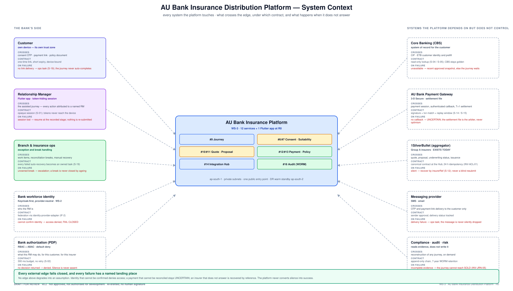
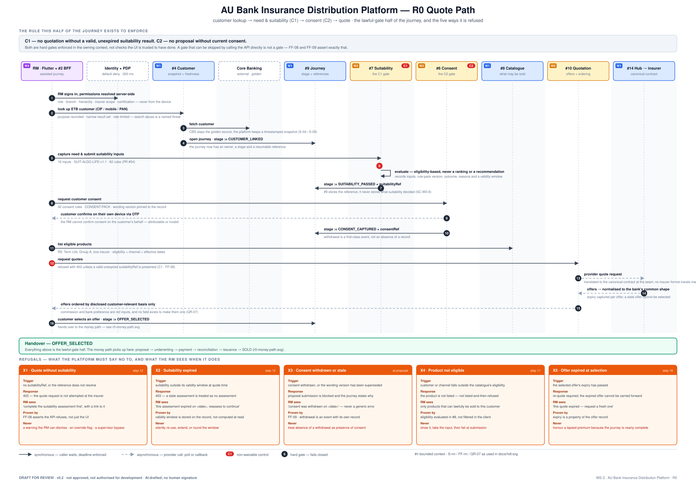
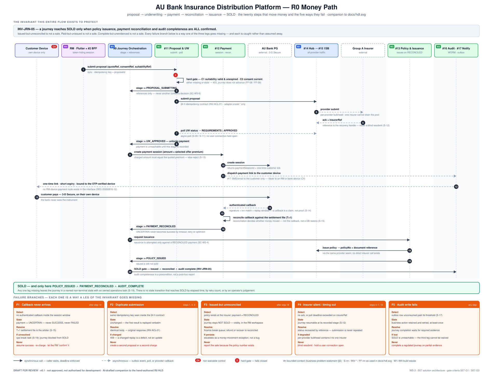

# 04 · High-Level Design

**AU Bank Insurance Distribution Platform — Architecture Pre-Approval Pack v0.2**

> ### ⛔ DRAFT FOR REVIEW · NOT APPROVED · NOT AUTHORISED FOR DEVELOPMENT

| | |
|---|---|
| **Workstream** | WS-3 · stage S08 (S09 overlapped) |
| **Gate criteria addressed** | S07-G1 ⚠️ partial · S07-G7 ✅ · S07-G6 ⚠️ partial · **S07-G2 open** (ADRs) · **S07-G8 partial** (fitness functions) |
| **Risk tier** | T4 — G1, G2, G3, G5, G6, G8 all fire · **Evidence level** E1 |
| **Owner** | Mahesh — Principal Insurance Platform Architect |
| **Provenance** | **AI-DRAFTED**, unsigned · self-review declared |

> **The authoritative high-level design is [`docs/hdl.svg`](../../../hdl.svg)** — hand-authored,
> and the standard this pack is built to. This document is its written companion: it states the
> decisions, the interfaces and the failure behaviour that a diagram cannot carry. Where the two
> differ, **the diagram wins**.

---

## 1. Design scope

A bank-owned insurance distribution platform carrying customer and RM journeys from customer
identification through policy issuance and payment reconciliation, connecting to bank systems,
insurers, payment services and communications providers through one canonical seam.

R0 is an assisted Term Life sale to an existing bank customer through one Group A insurer
(DEC-20260816-03). The design permits later expansion without requiring any of it now.

## 2. System context

Every external edge states three things: what crosses it, under which contract, and what happens
when it does not answer. **No edge degrades into an assumption** — identity that cannot be
confirmed denies access; a payment that cannot be reconciled stays `UNCERTAIN`; an insurer that
does not answer is recovered by reference, never resubmitted blindly.

## 3. Components — and what already exists

⚠️ **v0.1's most serious omission was reading as greenfield.** Five services and one Flutter
application exist in this repository today and are built by CI. The table below is the honest map.

| Component | Bounded context | Wave | Status in the repo today |
|---|---|---|---|
| RM Workspace (Flutter) | — | W4 | ✅ **`apps/rm-workspace-app`** — interface half delivered, 105 tests, `flutter build web` succeeds (DEC-20260816-12). Not S11 evidence: no backend exists |
| Session & access seam | `#2` | W4 | ✅ **`services/workforce-access-bff`** exists |
| Identity — provider adapter | `#3` | W1 | ✅ **`services/identity-provider-adapter-service`** — Keycloak behind a provider-neutral adapter |
| Identity — authorization (PDP) | `#3` | W1 | ✅ **`services/identity-authorization-service`** — the business source of truth for authorization |
| Provider adapter | `#15` | WS-1 | ✅ **`services/1sb-integration-service`** — exists, hardening (L7) |
| Shared persistence | — | — | ✅ **`services/bank-persistence-service`** — scoped to the integration job store + audit ingestion. **Not extended to R0 business contexts** — see [doc 03 §6](./03-domain-and-ownership-model.md#6-b-04--reconciling-arch-004-with-the-existing-shared-persistence-service) |
| Integration Hub | `#14` | W1 | ⬜ to build — places the existing adapter behind a routing seam before four services depend on it directly |
| Journey Orchestration | `#9` | W1 | ⬜ to build |
| Customer | `#4` | W1 | ⬜ to build |
| Product Catalogue | `#8` | W1 | ⬜ to build |
| Consent | `#6` | W2 | ⬜ to build |
| Suitability | `#7` | W2 | ⬜ to build |
| Quotation | `#10` | W2 | ⬜ to build |
| Proposal & UW | `#11` | W3 | ⬜ to build |
| Payment & Reconciliation | `#12` | W3 | ⬜ to build |
| Policy & Issuance | `#13` | W3 | ⬜ to build |
| Audit & Compliance | `#16` | W3 | ⬜ to build |
| Notification | `#17` | W4 | ⬜ to build |

**Twelve deployable services plus one app — not nineteen.** Deferred to S13: Lead (`#5`),
Customer BFF (`#1`), Reporting (`#18`), Administration (`#19`), direct insurer adapter.

Components describe responsibility boundaries. **Deployment grouping is a separate decision
requiring an ADR** (`AP-7`) — combining is permitted where ownership, scale and failure isolation
do not require separation.

## 4. Hosting and network

| Property | Value |
|---|---|
| Region | **`ap-south-1`** primary · **`ap-south-2`** warm standby for DR |
| Compute | EKS, private subnets · every service stateless at pod level · ≥ 2 pods across ≥ 2 AZs |
| Ingress | one public entry point — WAF · CDN · API Gateway / ALB. TLS terminated at the edge |
| Service identity | each service a distinct identity with least privilege; mTLS between services |
| Data | private subnets, reachable only by the owning service; encrypted at rest with a KMS CMK hierarchy |
| Secrets | managed store, never in application files or images |
| Residency | personal, financial and audit data — including backups, logs and archives — stay in India |
| Payment | only the customer reaches the payment page. **No RM-device payment route exists in the interface** |

## 5. The two journeys, end to end

### 5.1 Quote path — the lawful-gate half

Sixteen steps from sign-in to `OFFER_SELECTED`, and the five refusals: quote without suitability,
expired suitability, withdrawn consent, ineligible product, expired offer. Each refusal states
what the RM actually sees — a control that produces a generic error is a control nobody trusts.

### 5.2 Money path — proposal to SOLD

Twenty steps and five failure branches (F1 missing callback · F2 duplicate submission ·
F3 issued-but-unreconciled · F4 silent insurer · F5 audit write failure), each with detect /
state / resolve / escalate / **never**.

## 6. Integration design

| Integration | Direction | Method | Failure behaviour |
|---|---|---|---|
| Workforce identity | platform → bank IdP | federation (IF-2) | cannot confirm → **access denied**, fail closed |
| Authorization (PDP) | platform → PDP | sync, **300 ms budget, no retry** | no decision → denied. **Silence is never assent** (`S-02`) |
| Core banking | platform → CBS | sync read (`S-04`/`S-05`) | recent approved snapshot, else the journey waits |
| Insurance provider | platform → `#14` → `#15` → insurer | submit + async status poll | **no blind resubmission**; recovered by `insurerRef` (`S-12`); 24 h idempotency contract (`INV-ACL-01`); per-provider bulkhead |
| Payment | platform + customer → PG | session, customer 3-DS, signed callback, T+1 settlement | unknown → `UNCERTAIN`. **Reconciliation decides, never the callback** (`S-14`/`S-15`) |
| Messaging | platform → provider | delivery request | failure creates an ops task; never silently dropped (`S-18`) |
| Audit | services → `#16` | durable transactional outbox (`S-17`), at-least-once | business action retained for retry; **journey completion waits for evidence** |

⚠️ **Open (F-16):** interfaces are described, not contracted. `AP-5` requires OpenAPI as the source
of truth. The contract set, error model and per-interface timeout table are **not in this pack** —
`1sb-integration-service` already carries its own numbers and is the model to follow.

## 7. Data design

Each context owns its golden data; others use service contracts or approved reporting copies
(`ARCH-004`). Partner messages are translated before entering the bank model. Highly sensitive
proposal and payment data is encrypted. Audit, consent and suitability evidence is append-only.
Duplicate requests return the original result; a changed replay is rejected (409). Reporting is
read-only.

**Stores:** Aurora PostgreSQL (one per service, Multi-AZ, PITR) · DynamoDB (journey state, quote
jobs, PITR) · S3 + Object Lock (raw payloads, policy documents, 7-year WORM, replicated to
`ap-south-2`) · Secrets Manager + KMS.

⚠️ **Open (S07-G5):** the logical data model per context, the data classification table and the
retention/disposal schedule are **not in this pack**. They are Aarti's artefacts and S07-G5 cannot
be signed without them.

## 8. Reliability, recovery and NFRs

Numbers here are **not invented in this document**. They are the numbers in
[`architecture-review/06`](../../../platform/architecture-review/06-security-compliance-and-nfrs.md)
and [`ws3-platform/05-nfr-catalogue.md`](../../../platform/ws3-platform/05-nfr-catalogue.md),
which assign IDs, a measurement method and a verification stage to each.

| Target | Value | Note |
|---|---|---|
| RTO — core sale services | **≤ 1 hour** | regional recovery to `ap-south-2` |
| RPO — transactional data | **≤ 5 minutes** | asynchronous replication |
| **RPO — audit evidence** | **0 — no loss** | ⚠️ **a different architecture and a different cost** from the line above. Stated as a separate NFR because synchronous replication is what it requires. Needs Aarti + Shivanshi to confirm feasibility and cost |
| Latency | p50/p95/p99 per journey step | the SRE canon states journey SLOs in **p95**; the architecture review states p50/p99. `05-nfr-catalogue` reconciles them — cite its IDs, do not restate numbers |
| Capacity | derived from `CAP-A1` (250 RMs) · `CAP-A2` (20% concurrent) · `CAP-A3` (2 journeys/RM/hr) | **assumptions, not approved baselines.** Rajal + Shivanshi to confirm |

Behaviour: deadlines on anything a user waits for · long-running work tracked by status, not by
holding a connection · retries only where repeating is safe · **payment and proposal submissions
are never repeated blindly** · one failing insurer isolated by bulkhead · backups encrypted and
**restore-tested** · failed automatic recovery creates a named ops task.

> **Payment reconciliation, not database restoration, determines whether money moved.**

## 9. Key design decisions

⚠️ **Open (S07-G2 / `AP-7`):** none of these carries an ADR ID, and `ARCH-001…ARCH-022` already
exist. Writing these as ADRs is action A-11.

| # | Decision | Reason | State |
|---|---|---|---|
| D-01 | The bank owns the journey and its business meaning | prevents partner systems shaping customer behaviour | Pending |
| D-02 | Prove one assisted Term Life journey first | reduces risk while proving the complete path | **Decided — DEC-20260816-03** |
| D-03 | Separate ownership by responsibility and data | makes rules, changes and failures accountable | Pending |
| D-04 | Combine or separate components only where ownership, scale or failure isolation requires it | avoids unnecessary operational complexity | Pending — needs an ADR each |
| D-05 | All insurer communication through one seam | isolates partner formats and credentials | Pending |
| D-06 | Staff credentials remain server-side | reduces credential exposure on devices | **Implemented** — `workforce-access-bff` |
| D-07 | Valid suitability mandatory before quotation | protects customer and bank | Pending signature; rules exist |
| D-08 | Valid consent mandatory before proposal | preserves evidence and customer control | Pending signature; rules exist |
| D-09 | Payment only on the customer's device | separates the sales role from payment authorization | **Enforced in code — DEC-20260816-12** |
| D-10 | Sale complete only on issuance ∧ reconciliation ∧ audit | prevents false or disputed sales reporting | Pending |
| D-11 | Regulated data stays in India | bank and regulatory expectation — **the specific obligation is named in [doc 05](./05-security-design-review.md)** | Pending |
| D-12 | No shared messaging platform in R0 | at-least-once outbox is sufficient at this volume; no Kafka in R0 | Pending |
| **D-13** | **`bank-persistence-service` is not extended to R0 business contexts** | reconciles `ARCH-004` with the accepted platform-common persistence ADR | **New in v0.2 — needs an ADR** |

## 10. Open design decisions

Customer identity for self-service (blocks R1) · final product and insurer list · consent and
suitability rule ratification · payment settlement timing and break ownership · retention and
disposal periods · partner service limits and maintenance windows · final deployment grouping ·
recovery capacity and cost approval (`FRI-001` — **no approver seated, GAP-010**).

## 11. Signature ledger

As [doc 01 §8](./01-solution-vision.md#8-signature-ledger).

## 12. Version history

| Version | Date | Change | State |
|---|---|---|---|
| 0.1 | 2026-08-17 | Initial draft (DOCX) | Superseded |
| 0.2 | 2026-08-17 | Existing estate mapped component-by-component; `ap-south-1`/`ap-south-2` named; NFRs cited by ID rather than restated, RPO conflict surfaced explicitly; both journeys given real flow diagrams with failure branches; D-13 added; ADR, contract and data-model gaps declared. Answers F-02, F-03, F-04, F-15, F-16, F-18, F-32, F-33 | **Draft for review** |
