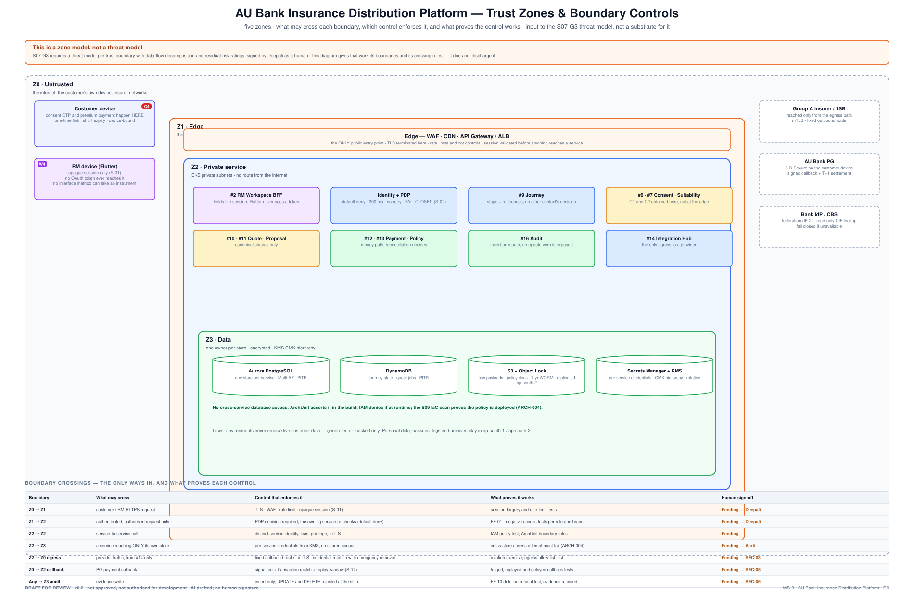

# 05 · Security & Compliance Design Review

**AU Bank Insurance Distribution Platform — Architecture Pre-Approval Pack v0.2**

> ### ⛔ DRAFT FOR REVIEW · NOT APPROVED · NOT AUTHORISED FOR DEVELOPMENT
> **Permission to treat this design as security-approved: NO.**
> Development affecting customer identity, access, personal data, consent, suitability, payment,
> partner credentials or audit evidence must not treat this draft as a signed security decision.

| | |
|---|---|
| **Workstream** | WS-3 · stage S08 (S09 overlapped) |
| **Gate criteria addressed** | **S07-G3 — NOT closable by this document** · **S07-G4 — NOT closable by this document** · S06-G6 ✅ (hard-gate enforcement points named) |
| **Risk tier** | T4 — G1, G2, G3, G4, G5, G6, G8 · **Evidence level** E1 |
| **Owner** | Deepali — Principal Security Architect (security decision) · Mahesh (structure) |
| **Provenance** | **AI-DRAFTED**, unsigned. **Boards 4 and 6 require `reviewer_type: HUMAN` at T4. Nothing here satisfies that** |

---

---

## 1. What this document is, and what it is not

**It is** the zone model, the crossing rules, the control inventory and the regulatory obligation
map — the input a security architect needs to start.

**It is not a threat model.** `S07-G3` requires a threat model **per trust boundary** with
data-flow decomposition and residual-risk ratings, signed by Deepali as a human. v0.1 offered a
flat fourteen-row threat table and that is not the same artefact. This version gives that work its
boundaries; it does not discharge it.

## 2. Regulatory obligations

⚠️ **v0.1 named no regulation anywhere.** Eight documents about a regulated bancassurance platform
in which the words IRDAI, RBI, DPDP, PMLA and "corporate agency" did not appear. Compliance cannot
rule on permissibility against an unnamed obligation.

The minimum map below is **proposed by architecture and owned by Shailja**. Clause-level citation
is Compliance's to complete — this document names the regime and the control, and deliberately
does **not** invent citations.

| # | Regime | Why it applies here | Control in this design | Owner |
|---|---|---|---|---|
| REG-1 | **IRDAI — corporate agency conduct** | the bank distributes multiple insurers' products | suitability before quote (C1); offer ordering by disclosed customer-relevant basis only, with no field capable of carrying commission (QR-07) | Shailja |
| REG-2 | **IRDAI — protection of policyholders' interests** | disclosure, free-look, nominee, grievance | ⚠️ **gap — free-look, nominee handling and grievance routing are not designed in R0** | Shailja + Rajal |
| REG-3 | **RBI — outsourcing / IT governance** | insurer and aggregator are material service providers | partner isolation at `#14`; credential rotation with emergency removal; per-provider bulkheads | Deepali + Shivanshi |
| REG-4 | **DPDP Act 2023** | personal data of customers is processed throughout | consent as a first-class record with **withdrawal** as an event; purpose recorded on customer search; retention schedule; masking in lower environments | Shailja + Deepali |
| REG-5 | **PMLA / KYC** | insurance sale to a bank customer | CBS-sourced identity; ⚠️ **AML/CFT screening is not designed in R0** | Shailja |
| REG-6 | **Data localisation** (incl. payment data) | protected data, backups, logs and archives | `ap-south-1` primary, `ap-south-2` DR — **no data leaves India** | Shailja + Shivanshi |
| REG-7 | Record retention & reconstruction | regulator may ask for any journey | append-only chain, 7-year WORM, `FF-10` deletion-refusal test | Shailja + Aarti |

## 3. Information requiring protection

| Class | Protection requirement |
|---|---|
| Customer identity and contact | restricted to approved staff and recorded business purposes |
| Financial and income information | strong access control, encryption, audit |
| **Health and underwriting information** | highest restriction, minimum collection |
| Consent and suitability evidence | immutable after issue; full history retained |
| Proposal and policy documents | encrypted, access recorded, shared only for the journey |
| Payment references and reconciliation records | protected from alteration and duplicate processing |
| Staff identity, role, certification | server-verified; **never trusted from device input** |
| Partner credentials and keys | managed store, rotation, emergency removal |
| Audit records | append-only; UPDATE and DELETE rejected at the store |

## 4. Access control

| Control | Design | Parameter | State |
|---|---|---|---|
| Staff sign-in | bank workforce identity via provider-neutral adapter (IF-2) | ⚠️ **MFA posture not stated** | Pending |
| Device credentials | no long-lived credential in the Flutter app; opaque session only (`S-01`) | ⚠️ **session lifetime, idle timeout, device-binding mechanism not stated** | Pending |
| Permission checks | role, branch, hierarchy, insurer scope, assignment, certification | `S-02` — **300 ms, no retry, fail closed** | Pending |
| Default action | deny unless an explicit permission is returned | — | Pending |
| Double checking | edge **and** owning service both check | `FF-01` | Pending |
| Customer confirmation | OTP for consent; PG confirms the paying customer | ⚠️ **OTP length, attempts, lockout not stated** | Pending |
| Service identity | distinct identity per service, least privilege, mTLS | ⚠️ **rotation interval not stated** | Pending |
| Privileged change | second approver for high-risk and bulk changes (`CMP-4`) | ⚠️ **maker-checker scope not enumerated** | Pending |
| Revocation | suspension, expired certification and removed access take effect without a long cache delay | ⚠️ **maximum propagation delay not stated** | Pending |

⚠️ **Finding F-24 carried forward:** a control without a parameter cannot be tested. The
right-hand column is the v0.3 work list, and it is Deepali's to set — architecture should not
invent security parameters.

## 5. Data protection

All connections carrying protected data encrypted · stored personal, financial, health, proposal
and policy data encrypted · keys separated from data (KMS CMK hierarchy) · each service holds its
own database credential · production stores private, unreachable from the internet · **no personal
or sensitive data in application logs**, verified by an automated scan, not by review (`SEC-2`) ·
partner request/response bodies not written to ordinary logs · stored partner payloads and
documents encrypted with access recorded · backups, logs and archives remain in India · retention
and disposal per the approved schedule · **lower environments never receive live customer data**.

## 6. Customer-protection controls

| Control | Required outcome | Status |
|---|---|---|
| Suitability (C1) | no quotation without a valid, unexpired suitability result | designed; **62 rules exist**; Compliance signature outstanding |
| Consent (C2) | no proposal without current consent; withdrawal is an event | designed; **42 rules exist**; Compliance signature outstanding |
| Sales attribution | staff and distributor identity inserted **by the server** | designed; security review pending |
| Payment separation (C4) | the RM cannot enter or authorize customer payment | **enforced structurally** — no interface method can accept an instrument (DEC-20260816-12) |
| Payment correctness | charged amount must equal the selected premium | designed (`S-13`); Finance + QA review pending |
| Sold status | issuance ∧ reconciliation ∧ audit completeness | designed (`INV-JRN-05`); pending |
| Data location | protected data, backups, logs, archives stay in India | designed; **REG-6 confirmation pending** |
| Evidence retention | retained and protected from alteration | designed; **retention period approval pending** |

## 7. Threats and planned protections

Structured by the boundary they cross — see the zone diagram above. This is threat *inventory*, not
the per-boundary threat *model* that `S07-G3` requires.

| Boundary | Threat | Planned protection | What must prove it |
|---|---|---|---|
| Z0→Z1 | stolen staff session | server-held session, short lifetime, device binding, revocation | session-forgery test |
| Z0→Z1 | customer search abuse — mass exposure | rate limits, recorded purpose, narrow results, audit | Product + Security review |
| Z1→Z2 | role or branch claimed from the device | permissions resolved server-side only | negative access tests per role and branch |
| Z2→Z2 | direct call bypassing the edge | private services, service identity, repeated checks | network and access-policy test |
| Z2→Z3 | cross-context data access | separate identities and stores | cross-store access attempt must fail (`ARCH-004`) |
| Z2→Z0 | partner credential theft | managed store, rotation, fixed egress, emergency removal | **rotation exercise (SEC-03)** |
| Z2→Z0 | partner response manipulation | TLS, validation and translation at the seam | contract and tampering tests |
| Z0→Z2 | **forged or replayed payment callback** | ⚠️ **signature scheme, replay window and clock-skew tolerance are NOT specified** — this is the entire control against a fabricated payment (G5) | **forged, replayed and delayed callback tests (SEC-05)** |
| Z0→Z2 | **payment link misuse** | ⚠️ one-time use, expiry and device binding are asserted but **not specified** | link-reuse and forwarding tests |
| any | personal information in logs | structured logging, field masking, automated scan | **automated proof (SEC-04)** |
| any | replayed business request | request key, stored result, changed-content rejection | duplicate-request tests |
| Z3 | audit deletion or alteration | insert-only, locked archive | **deletion-refusal test (`FF-10`, SEC-06)** |
| Z2→Z0 | one partner's outage consumes the pool | per-provider bulkheads | load and failure test |
| build | harmful dependency | SAST, SCA, SBOM, secret scanning — **in CI today** | pipeline evidence |
| — | **RM impersonation, velocity abuse, mis-selling detection** | ⚠️ **no fraud/abuse model exists** | F-27 — v0.3 work |

## 8. Open security risks

| ID | Risk | Required evidence | Owner |
|---|---|---|---|
| SEC-01 | Customer identity for self-service not selected | approve the approach before R1 | Rajal + Deepali + Mahesh |
| SEC-02 | Consent and suitability packs unsigned | **Shailja's E2 signature** — the rules themselves exist | Shailja |
| SEC-03 | Partner credential rotation unproven | rotation and emergency-removal exercise | Deepali + Shivanshi |
| SEC-04 | PII-in-logs prevention unproven | automated full-journey log scan | Amit + Deepali + Swapnali |
| SEC-05 | Payment callback protection unproven **and unspecified** | specify the scheme, then run forged/replayed/delayed tests | Deepali + Finance |
| SEC-06 | Audit immutability unproven | attempt update and delete; retain the refusal as evidence | Aarti + Deepali + Swapnali |
| SEC-07 | Retention periods unapproved | approve the schedule (7-year WORM is the working number) | Shailja + Aarti |
| SEC-08 | Partner security posture and limits unconfirmed | partner assessment and operating agreement | Deepali + Shivanshi + Rajal |
| **SEC-09** | **No threat model per trust boundary (S07-G3)** | the artefact itself | **Deepali** |
| **SEC-10** | **No security parameters set (§4)** | timeouts, lifetimes, rotation intervals, rate limits | **Deepali** |
| **SEC-11** | **No pen test / VAPT planned before go-live** | a scheduled engagement | Deepali + Kalpana |

## 9. Review outcome

| Item | Outcome |
|---|---|
| Architecture security input | **Prepared** |
| Zone model and crossing rules | **Prepared** |
| Regulatory obligation map | **Prepared — named, not clause-cited** |
| Threat model per trust boundary (S07-G3) | **NOT DONE** |
| Security Head review | **Pending — human** |
| Compliance & Risk review | **Pending — human** |
| **Permission to treat design as approved** | **NO** |

## 10. Signature ledger

As [doc 01 §8](./01-solution-vision.md#8-signature-ledger). **Boards 4 and 6 are human-only at T4;
no aggregate override exists.**

## 11. Version history

| Version | Date | Change | State |
|---|---|---|---|
| 0.1 | 2026-08-17 | Initial security review (DOCX) | Superseded |
| 0.2 | 2026-08-17 | Adds the regulatory obligation map (REG-1…REG-7) — v0.1 named no regulation; threats restructured by trust boundary; missing security parameters declared explicitly rather than glossed; SEC-09/10/11 added; callback and payment-link specification gaps raised as G5 issues. Answers F-23, F-24, F-25, F-26, F-27, F-28, F-39, F-42, F-43 | **Draft for review** |
