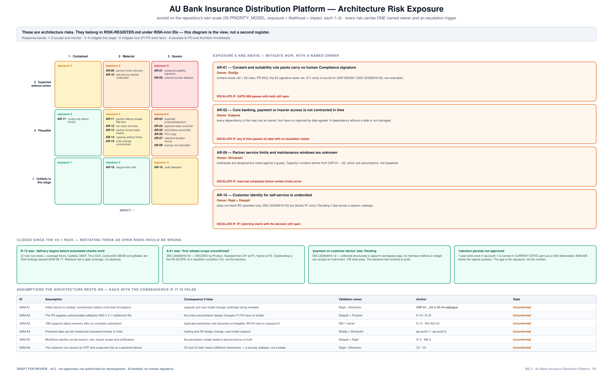
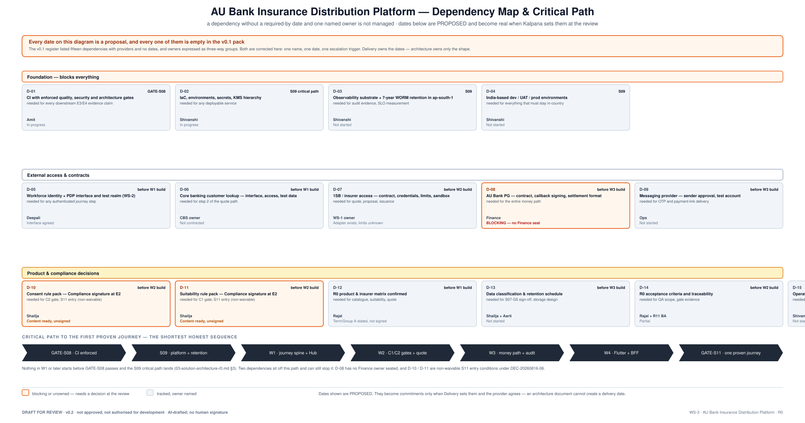

# 06 · Risks, Dependencies & Assumptions

**AU Bank Insurance Distribution Platform — Architecture Pre-Approval Pack v0.2**

> ### ⛔ DRAFT FOR REVIEW · NOT APPROVED · NOT AUTHORISED FOR DEVELOPMENT

| | |
|---|---|
| **Workstream** | WS-3 · stage S08 (S09 overlapped) |
| **Risk tier** | T4 · **Evidence level** E1 |
| **Owner** | Mahesh (architecture risk) · Kalpana (register, dates and escalation) |
| **Provenance** | **AI-DRAFTED**, unsigned |

> **This is a view, not a second register.** Items here belong in
> [`RISK-REGISTER.md`](../../../governance/registers/RISK-REGISTER.md),
> [`DEPENDENCY-REGISTER.md`](../../../governance/registers/DEPENDENCY-REGISTER.md) and
> [`ASSUMPTION-REGISTER.md`](../../../governance/registers/ASSUMPTION-REGISTER.md) under their
> canonical `RISK-nnn` / `DEP-nnn` / `ASM-nnn` IDs. v0.1 created a parallel `R-`/`D-`/`A-`
> numbering, which is how two registers disagree six weeks later (F-13, F-50, F-51).

---

---

## 1. Scoring

The repository's own scale ([`05-PRIORITY_MODEL §4`](../../../governance/05-PRIORITY_MODEL.md)):
`exposure = likelihood × impact`, each 1–3.

| Exposure | Response |
|---|---|
| 1–2 | accept and monitor |
| 3–4 | mitigate this stage |
| **6** | mitigate now — a P1/P2 work item |
| **9** | escalate to PO and Architect immediately |

**Every risk below has exactly one named owner.** v0.1 expressed ownership as three-way groups
("Product, Security and Architecture"), which is no ownership at all.

## 2. Architecture risks

| ID | Risk | L | I | Exp | Owner | Mitigation | Escalate if |
|---|---|:-:|:-:|:-:|---|---|---|
| AR-01 | Consent and suitability packs carry no human Compliance signature | 3 | 3 | **9** | **Shailja** | content exists (42 + 62 rules); obtain the E2 signature. S11 entry is bound on GAP-006/007 (DEC-20260816-06, **non-waivable**) | GATE-S08 passes with both still open |
| AR-02 | Core banking, payment or insurer access not contracted in time | 3 | 3 | **9** | **Kalpana** | name owners and required-by dates; test alternatives; state delivery impact | any dependency passes its date with no escalation raised |
| AR-03 | Duplicate proposal or payment creates financial or customer harm | 2 | 3 | **6** | Amit | request key, first-result replay, changed-replay rejection (409), 24 h contract | a duplicate reaches an insurer or a PG |
| AR-04 | Payment state remains uncertain after a missing callback | 2 | 3 | **6** | Finance | settlement match arbitrates; ops task; **never assume success** | an UNCERTAIN payment is resolved by judgement |
| AR-05 | Policy reported sold before issuance or reconciliation | 2 | 3 | **6** | Rajal | `INV-JRN-05` enforced at the transition | any SOLD without all three legs |
| AR-06 | Personal or health information appears in logs | 2 | 3 | **6** | Deepali | block body logging, mask fields, automated scan | scan not running by W2 |
| AR-07 | Retention or data-location implemented incorrectly | 2 | 3 | **6** | Shailja | approve the schedule; verify location and disposal automatically | any protected data outside India |
| AR-08 | Backup exists but cannot be restored within the business need | 2 | 3 | **6** | Aarti | timed restore and regional recovery exercises | no restore exercise by S09 exit |
| AR-09 | Partner service limits and maintenance windows unknown | 3 | 2 | **6** | Shivanshi | obtain written limits; size bulkheads against them, not against a guess | load test scheduled before limits arrive |
| AR-10 | Customer identity for self-service undecided | 3 | 2 | **6** | Rajal | keep R0 assisted; decide before R1 entry | R1 planning starts with it open |
| AR-11 | Partner latency makes the RM journey unusable | 2 | 2 | 4 | Mahesh | acknowledge + track status; isolate capacity; support resume | p95 quote breaches its NFR in UAT |
| AR-12 | Too many independently deployed components | 2 | 2 | 4 | Mahesh | combine unless ownership, scale or failure isolation requires separation; ADR each | service count exceeds 12 at R0 |
| AR-13 | Partner formats leak into the bank model | 2 | 2 | 4 | Amit | translate at `#14`; test provider replacement | any provider type outside the adapter package |
| AR-14 | Capacity increased without checking DB or partner limits | 2 | 2 | 4 | Shivanshi | scale from business load and measured bottleneck, never from CPU alone | a scaling change with no downstream check |
| AR-15 | Rules change without version history | 2 | 2 | 4 | Rajal | published rule versions with effective dates; prior versions preserved | any rule change without a version bump |
| AR-16 | Audit evidence can be altered or deleted | 1 | 3 | 3 | Aarti | insert-only, locked archive, deletion-refusal test (`FF-10`) | `FF-10` not in CI by W3 |
| AR-17 | Config-only administration creates change friction | 2 | 1 | 2 | Rajal | accepted, recorded trade until S13 | a rule change needs an emergency deploy |
| AR-18 | Documents and diagrams drift from the built system | 1 | 2 | 2 | Mahesh | diagrams generated from committed sources; regenerate on decision change | a diagram contradicts the code at a gate |

### Closed since v0.1 — restating these as open risks would be wrong

| v0.1 said | The actual position |
|---|---|
| "delivery begins before automated checks work" | CI runs tests + coverage floors, CodeQL, Trivy SCA, CycloneDX SBOM, gitleaks; **ten SCA findings cleared 2026-08-17**. Residual risk is gate *coverage*, not absence |
| "first release scope unconfirmed" | **DEC-20260816-03 — DECIDED by Product.** Outstanding is the `R0-SCOPE` v0.4 republish, not the decision |
| "payment on customer device — Pending" | **DEC-20260816-12** — enforced structurally in `apps/rm-workspace-app`, 105 tests. Backend half remains |
| "retention periods not approved" | 7-year write-once in `ap-south-1` is named in `CURRENT-STATE.yaml`; `ASM-005` tracks the regime. The gap is the **signature**, not the number |

## 3. Dependencies

**Every date below is PROPOSED.** Delivery owns dates; an architecture document cannot create one.
v0.1 listed fifteen dependencies with providers and **no dates at all** — which is a list, not a
managed dependency set.

### Foundation — blocks everything

| ID | Dependency | Owner | Needed by | State |
|---|---|---|---|---|
| D-01 | CI with enforced quality, security and architecture gates | Amit | GATE-S08 | In progress |
| D-02 | IaC, environments, secrets, KMS hierarchy | Shivanshi | S09 critical path | In progress |
| D-03 | Observability substrate + 7-year WORM retention in `ap-south-1` | Shivanshi | S09 | Not started |
| D-04 | India-based dev / UAT / prod environments | Shivanshi | S09 | Not started |

### External access and contracts

| ID | Dependency | Owner | Needed by | State |
|---|---|---|---|---|
| D-05 | Workforce identity + PDP interface and test realm (WS-2) | Deepali | before W1 | Interface agreed |
| D-06 | Core banking lookup — interface, access, test data | CBS owner | before W1 | Not contracted |
| D-07 | 1SB / insurer — contract, credentials, **limits**, sandbox | WS-1 owner | before W2 | Adapter exists; **limits unknown** |
| D-08 | AU Bank PG — contract, callback signing, settlement format | Finance | before W3 | ⛔ **BLOCKING — no Finance seat filled** |
| D-09 | Messaging provider — sender approval, test account | Ops | before W3 | Not started |

### Product and compliance decisions

| ID | Dependency | Owner | Needed by | State |
|---|---|---|---|---|
| D-10 | Consent rule pack — **E2 human signature** | Shailja | before W2 | Content ready, unsigned |
| D-11 | Suitability rule pack — **E2 human signature** | Shailja | before W2 | Content ready, unsigned |
| D-12 | R0 product & insurer matrix confirmed | Rajal | before W1 | Stated, not signed |
| D-13 | Data classification & retention schedule | Shailja + Aarti | before W3 | Not started |
| D-14 | R0 acceptance criteria and traceability | Rajal + R11 BA | before W2 | Partial |
| D-15 | Operations ownership, runbooks, response targets | Shivanshi | before W3 | Not started |

**D-10 and D-11 are non-waivable S11 entry conditions** under DEC-20260816-06 — enforced at four
layers (Rule SM-4, the WS-3 charter, Product verdict condition C5, and the rule packs themselves).

## 4. Assumptions

Each carries a **pre-computed consequence if false**, per
[`16 §4`](../../../governance/16-DECISION_MODEL.md) — so invalidation triggers a known action
rather than a debate.

| ID | Assumption | If false | Validation owner | State |
|---|---|---|---|---|
| ASM-A1 | Initial volume modest; correctness matters more than throughput | capacity and cost model change; bulkhead sizing revisited | Rajal + Shivanshi | Unconfirmed |
| ASM-A2 | The PG supplies authenticated callbacks **and** a T+1 settlement file | the entire reconciliation design changes; F1 and F3 lose their arbiter | Deepali + Finance | Unconfirmed |
| ASM-A3 | 1SB supports status recovery after an uncertain submission | duplicate-submission risk becomes unmitigable; **AR-03 rises to exposure 9** | WS-1 owner | Unconfirmed |
| ASM-A4 | Protected data can be hosted and recovered entirely in India | hosting and DR design change; cost model reopens | Shailja + Shivanshi | Unconfirmed |
| ASM-A5 | Workforce identity carries branch, role, insurer scope and certification | the permission model needs a second source of truth | Deepali + Rajal | Unconfirmed |
| ASM-A6 | The customer can receive an OTP and a payment link on a personal device | **C2 and C4 both need a different mechanism** — a journey redesign, not a tweak | Rajal + Shivanshi | Unconfirmed |
| ASM-A7 | The bank accepts a phased platform rather than every line at launch | programme scope and funding change | Executive Sponsor (**GAP-010**) | **Blocked — no sponsor** |

## 5. Mitigation decisions requested

| Decision | Named owner | State |
|---|---|---|
| Approve the R0 boundary | Rajal | Re-affirms DEC-20260816-03 |
| Sign the consent and suitability rule packs | **Shailja** | Pending — **blocks S11** |
| Approve the customer identity direction | Rajal + Deepali + Mahesh | Pending — blocks R1 |
| Approve payment and reconciliation ownership | **Finance seat unfilled** | **Blocked** |
| Approve data classification, location and retention | Shailja + Deepali + Aarti | Pending |
| Approve component grouping and the partner boundary | Mahesh + Amit | Pending — needs ADRs |
| Approve recovery targets and the operating model | Shivanshi + Aarti + Mahesh | Pending |
| Approve security controls and residual risk | **Deepali (human)** | Pending |
| Approve the `FRI-001` funding line | **Executive Sponsor — GAP-010** | **Blocked — no approver exists** |

## 6. Signature ledger

As [doc 01 §8](./01-solution-vision.md#8-signature-ledger).

## 7. Version history

| Version | Date | Change | State |
|---|---|---|---|
| 0.1 | 2026-08-17 | Initial register (DOCX) | Superseded |
| 0.2 | 2026-08-17 | Re-scored on the repository's 1–3 scale with exposure bands; single named owner and escalation trigger per risk; stale risks moved to a "closed" section with evidence; dependencies given proposed dates and blocking states; assumptions given pre-computed consequences. Answers F-13, F-21, F-50, F-51, F-53 | **Draft for review** |
