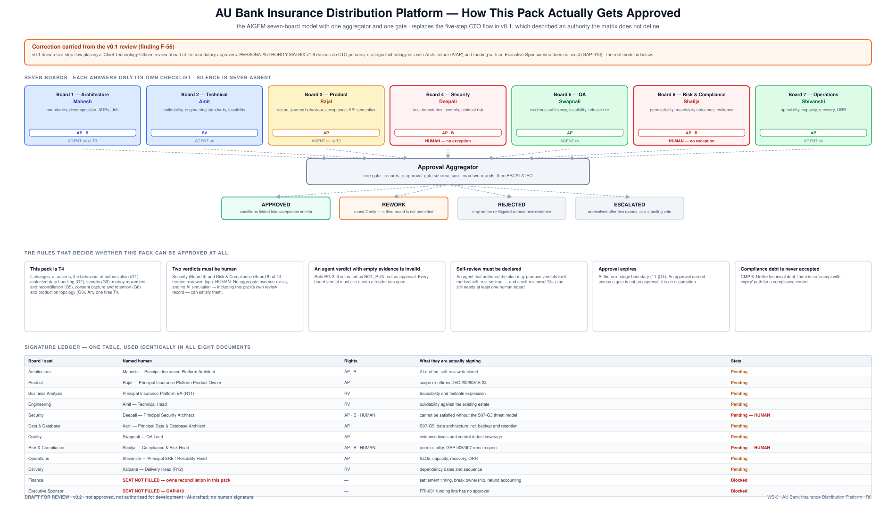
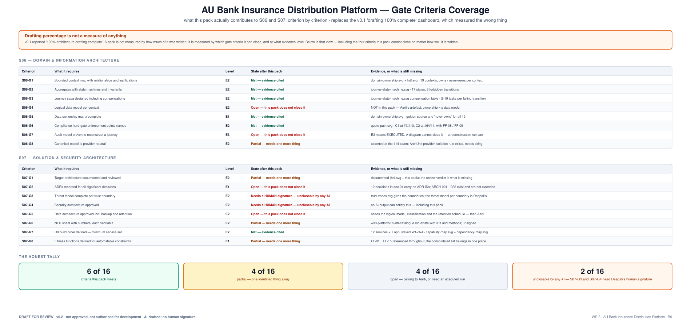

# 07 · Architecture Review Record

**AU Bank Insurance Distribution Platform — Architecture Pre-Approval Pack v0.2**

> ### ⛔ DRAFT FOR REVIEW · NOT APPROVED · NOT AUTHORISED FOR DEVELOPMENT
> **No review meeting has been held. No decision has been recorded. Nothing in this document
> claims otherwise.**

| | |
|---|---|
| **Workstream** | WS-3 · stage S08 (S09 overlapped) |
| **Risk tier** | **T4** · **Evidence level** E1 |
| **Owner** | Mahesh — Principal Insurance Platform Architect |
| **Provenance** | **AI-DRAFTED**, unsigned · self-review declared |

---

## 1. Why this document was renamed

v0.1 called this the *"CTO Architecture Review Record"* and asked a Chief Technology Officer for
seven endorsements including funding.

**`PERSONA-AUTHORITY-MATRIX v1.6` defines no CTO persona.** Strategic platform technology sits with
**Architecture** (`A/AP`); funding sits with an **Executive Sponsor who does not exist** — GAP-010,
which is why the `FRI-001` funding line is recorded as `BLOCKED`. A five-step flow placing a CTO
review ahead of the mandatory approvers described an approval model this organisation does not
operate.

This version presents the **actual** model: seven boards, one aggregator, one gate. If the bank
does have a CTO whose decision rights should be recorded, that is a **change request against the
authority matrix** — not an assumption an architecture pack may make on its own.

---

## 2. Review status

| Activity | State |
|---|---|
| Architecture material prepared | **Complete** |
| Diagram set at the `hdl.svg` standard | **Complete — 11 diagrams, generated from committed sources** |
| Review meeting held | **No** |
| Board verdicts recorded to [`approval-gate.schema.json`](../../../governance/schemas/approval-gate.schema.json) | **No** |
| Human Security (Board 4) verdict | **No — required, cannot be simulated** |
| Human Risk & Compliance (Board 6) verdict | **No — required, cannot be simulated** |
| Technical direction decision | **Pending** |

## 3. Executive summary

The platform gives the bank control of the insurance journey from customer identification through
policy issuance and payment reconciliation. R0 proves **one** assisted Term Life sale to an
existing customer through **one** Group A insurer (DEC-20260816-03).

Responsibilities separate into nineteen bounded contexts, of which **twelve services plus one
Flutter application** are built for R0. Six of those already exist in the repository. The bank owns
the journey and its business meaning; partner formats are translated at exactly one seam.
Suitability (C1), consent (C2), customer-device payment (C4), reconciliation and durable evidence
are structural controls, not procedures.

**The unresolved items are, honestly:** two human signatures that no amount of drafting can supply
(Boards 4 and 6); a threat model per trust boundary; a logical data model and retention schedule;
ADRs for the design decisions; contracted external access; and two organisational seats that are
simply empty — Finance and Executive Sponsor.

## 4. What this pack can and cannot close

| | Count | |
|---|---|---|
| **Met** | 6 of 16 | S06-G1, G2, G3, G5, G6 · S07-G7 |
| **Partial** | 4 of 16 | S06-G8 · S07-G1, G6, G8 — each one identified thing away |
| **Open** | 4 of 16 | S06-G4, G7 · S07-G2, G5 — belong to Aarti, or need an executed run |
| **Unclosable by any AI** | 2 of 16 | **S07-G3, S07-G4 — Deepali's human signature** |

A pack is not measured by how much of it was written. v0.1 reported *"architecture drafting 100%
complete"*, which measured effort, not readiness.

## 5. Decisions requested

Routed to the authority that actually holds each one.

| ID | Decision | Board / seat | Named human |
|---|---|---|---|
| AR-01 | Endorse the bank-owned end-to-end platform direction | Board 1 — Architecture | Mahesh |
| AR-02 | Endorse the phased R0 boundary | Board 3 — Product | Rajal |
| AR-03 | Endorse responsibility-based ownership and partner isolation | Board 1 | Mahesh |
| AR-04 | Endorse India-only hosting and recovery as a design requirement | Board 6 — Compliance | **Shailja (human)** |
| AR-05 | Endorse S08/S09 foundations as development-entry conditions | Board 7 — Operations | Shivanshi |
| AR-06 | Approve the `FRI-001` funding line | **Executive Sponsor** | ⛔ **GAP-010 — no approver exists** |
| AR-07 | Confirm Product, Security and Compliance matters remain with their owners | all boards | separation of duties |
| **AR-08** | **Decide whether a CTO decision right exists and raise a CR if so** | Board 1 + Governance | Mahesh + Kalpana |
| **AR-09** | **Seat a Finance signatory for reconciliation and settlement** | Delivery | Kalpana |
| **AR-10** | **Declare which artefact is canonical across PRs #32, #54, #55/#56** | Board 1 | Mahesh |

## 6. Questions the review should actually ask

**Strategy and scope** — is R0 small enough to deliver and complete enough to prove value? Is any
deferred capability actually required at R0? Is the R1 revisit trigger real, or aspirational?

**Structure** — are the boundaries supportable? Is "combine unless separation is justified"
acceptable as a deployment rule? Does B-04 (`bank-persistence-service` scope) hold?

**Security, risk, compliance** — are C1, C2, C4 and `INV-JRN-05` accepted as non-waivable by any
authority including Product? Which residual risks need accountable human acceptance? Is the
regulatory map in [doc 05 §2](./05-security-design-review.md#2-regulatory-obligations) complete
enough to start from?

**Delivery and investment** — are the foundations funded? Are the external owners committed? Who
owns D-08 with no Finance seat filled? What happens to the S11 date if D-10/D-11 stay unsigned?

## 7. Conditions that remain independent of this review

Product approves business scope and acceptance · **Security approves security outcomes and residual
security risk — human** · **Compliance & Risk approves permissibility and required evidence —
human** · Data & Database approves physical integrity and recovery · Quality approves evidence
sufficiency · Operations approves operational readiness · **material risk acceptance remains with
the authorised human risk owner.**

## 8. Review discussion record

*To be completed during the review. Empty by design — this record does not pre-fill a conversation
that has not happened.*

| Topic | Question or observation | Response | Owner | Due | State |
|---|---|---|---|---|---|
| | | | | | |
| | | | | | |
| | | | | | |

## 9. Review outcome

| Field | Value |
|---|---|
| Outcome | **Pending** |
| Conditions | none recorded |
| Required changes | none recorded |
| Risks accepted | **none** |
| Follow-up review | to be decided |

Permitted values: `APPROVED` · `REWORK` · `REJECTED` · `ESCALATED`
([`approval-gate.schema.json`](../../../governance/schemas/approval-gate.schema.json)).
Maximum two rounds; a third becomes `ESCALATED`. **The outcome is entered by the authorised
reviewer after the review, never before it.**

## 10. Signature ledger

As [doc 01 §8](./01-solution-vision.md#8-signature-ledger).

## 11. Version history

| Version | Date | Change | State |
|---|---|---|---|
| 0.1 | 2026-08-17 | "CTO Architecture Review Record" (DOCX) | Superseded |
| 0.2 | 2026-08-17 | Renamed and re-routed to the seven-board model; CTO authority question raised as AR-08 rather than assumed; decisions routed to the board that holds them; gate coverage replaces the drafting percentage; AR-09 and AR-10 added. Answers F-38, F-52, F-56, F-01 | **Draft for review** |
