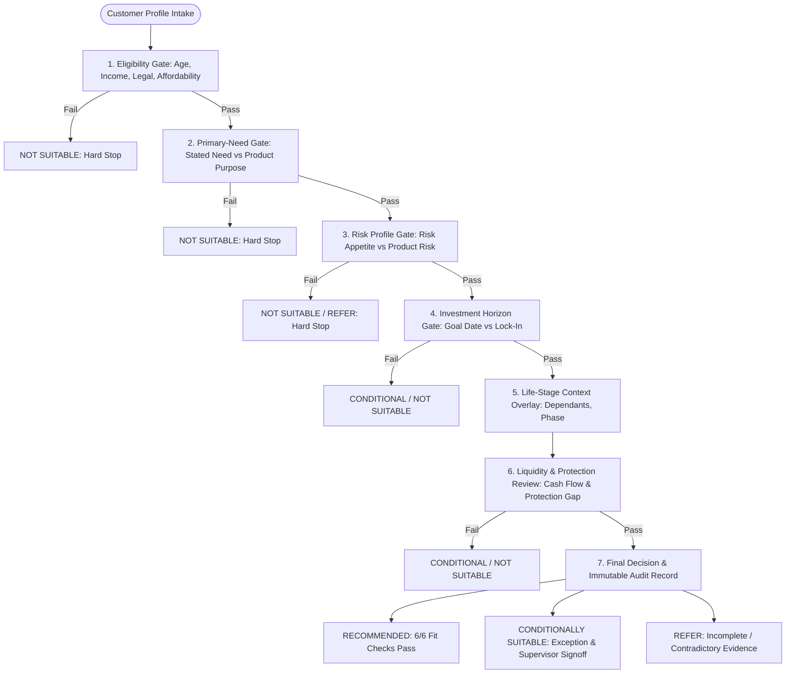

# Universal Insurance Suitability Engine — research specification

Cross-insurer comparison of KLI, HDFC Life, Bajaj Allianz, LIC, Bharti AXA and ICICI Prudential suitability methods, normalized into a 7-layer deterministic model and regression-checked against 8,811 source-workbook cases.

**Up:** [docs index](../../README.md) → [AU Bank platform](../README.md) → [references](./README.md) → this file

| | |
|---|---|
| **Status** | Research reference — **not** business SSOT, **not** an ADR, **not** a ratified rule pack |
| **Authority** | `ai-drafted` · Product (Rajal) owns whether any layer is adopted; Compliance (Shailja) owns IRDAI discharge; Architecture (Mahesh) owns service/catalog boundaries |
| **Closes** | [SUG-20260904-uis](../../governance/registers/SUGGESTION-REGISTER.md#sug-20260904-uis--file-universal-suitability-research-specification) (file this document) |
| **Does not close** | [SUG-20260904-eng](../../governance/registers/SUGGESTION-REGISTER.md#sug-20260904-eng--implement-7-layer-engine-and-multi-insurer-catalogue) — building the Suitability microservice or the 206-product catalogue from this model |
| **R0 SSOT that this must not override** | [Suitability Rule Pack v1](../rule-packs/suitability-rule-pack.md) (`SUITABILITY-PACK-v1.0` / `SUIT-ALGO-LIFE-v1.0`) |
| **Parked until** | Suitability (context #7) and Product Catalogue (context #8) open for multi-insurer rule packs beyond the R0 Term Life arithmetic model — or R1 planning starts |

---

## How this document may be used

1. **Read it** when designing the Suitability microservice, insurer rule-pack onboarding, or the Product Catalogue attribute model.
2. **Do not implement it** in the current S08 foundation increment. ULIP, Savings/Endowment and Group B insurers remain `out_of_scope_now` ([BOOT.md](../../context/BOOT.md) section 5).
3. **Do not treat a `PASS` in the 8,811-case suite as regulatory certification.** The source workbook says that `PASS` means the normalized store reproduced the *source workbook* decision. It does not certify IRDAI suitability, underwriting, or approved product filings. Missing dimensions stay “Not specified” until product filings complete them.
4. **Do not replace** the R0 need-analysis question set, cover arithmetic, or `SUIT-R20` quote gate. Those stay in the rule pack until Product + Compliance ratify a change.

### Vocabulary conflict with the R0 rule pack

The research vocabularies below are *source-insurer* terms. They are **not** aliases of the R0 pack and must not be silently mapped.

| Dimension | This research spec | R0 rule pack (`SUITABILITY-PACK-v1.0`) |
|---|---|---|
| Primary need | `Protection`, `Savings`, `Wealth Creation`, `Retirement`, `Child`, `Regular Income` | `PROTECTION`, `SAVINGS_GOAL`, `RETIREMENT`, `WEALTH_GROWTH`, `TAX_PLANNING` |
| Risk | `Conservative`, `Balanced`, `Growth`, `Aggressive` (plus source `Low`/`Medium`/`High`) | `CAPITAL_PROTECTION`, `LOW`, `MODERATE`, `HIGH` |
| Horizon | `Short` (1–3y), `Medium` (4–7y), `Long` (8+y) | `LT_5Y`, `Y5_10`, `Y10_20`, `GT_20Y` |
| Decision model | 7 sequential gates; hard-stop on eligibility / need / risk | Arithmetic cover + protection gap + affordability; outcome bands in the pack |
| Outcome codes | `RECOMMENDED`, `CONDITIONALLY SUITABLE`, `NOT SUITABLE`, `REFER` | Pack outcomes / `ELIGIBLE` · `NOT_ELIGIBLE` on the SoR ([`06-suitability.sql`](../../platform/data-architecture/schemas/06-suitability.sql)) |
| Product scope | 206 codes across six insurers, including ULIP and savings | R0 Life Term path; ULIP and Savings/Endowment revisit at R1 |

A future mapping table is a Product + BA decision. It is not implied by this file.

### Source corpus

Synthesized outside this repository from:

- `Universal_Insurance_Suitability_BRD.docx`
- `Universal_Insurance_Suitability_Rulebook.xlsx`
- `Universal_Insurance_Suitability_Rulebook_Validated.xlsx` (8,811 tests / 0 mismatches against `Suitability - all 2.xlsx`)

Those workbooks are **not** in `artefacts/uploads/`. Only this markdown synthesis is filed. Intake: [05-figma-and-artefact-intake.md](../05-figma-and-artefact-intake.md).

---

## Executive Summary & Architecture Overview

The **Universal Insurance Suitability Engine** establishes a unified, explainable, and policy-governed suitability decision framework. It allows multi-insurer life insurance propositions to be evaluated against customer profiles without requiring custom engine modifications for each new insurer or product.

Across the Indian life insurance market, major insurers employ disparate paradigms to determine suitability:
- **Kotak Life Insurance (KLI)** relies on strict 3-tuple combination mapping (`Objective + Horizon + Risk`).
- **HDFC Life** employs need-discovery tables cross-referenced against customer risk appetite.
- **Bajaj Allianz Life** structures recommendations around customer life-stages overlaid with risk capacity, supplemented by standalone protection and POS lists.
- **Life Insurance Corporation (LIC)** utilizes persona-driven multi-product bundling (Core + Complementary + Protection + Riders) anchored by product master age boundaries.
- **Bharti AXA Life** enforces deterministic binary attribute matrices across demographic, financial, and need filters.
- **ICICI Prudential Life (IPRU)** runs high-combinatorial grid matrices matching age, income, risk, and need codes to specific product codes.

The Universal Suitability Engine normalizes these divergent methods into a **7-Layer Deterministic Operating Model**:



### Full-Scale Regression Verification

The normalized universal engine was verified against the full source workbook (`Suitability - all 2.xlsx`) with 100% fidelity:
- **Total In-Scope Products / Product Codes:** 206
- **Normalized Source Rules:** 8,368
- **Automated Regression Tests:** 8,811
- **Expected Recommended Cases:** 8,390
- **Expected Not-Suitable / Blocked Cases:** 421
- **Actual Engine Outcome:** 8,811 / 8,811 Passed (0 Mismatches, 0 Formula Errors)

---

# Part 1: Business Requirements Document (BRD) Specification
*Source: `Universal_Insurance_Suitability_BRD.docx`*

### 1. Executive Decision
All reviewed insurers resolve the identical fundamental problem: **determining whether a customer's needs, risk capacity, financial horizon, and personal circumstances fit an insurance product's intended design, risk rating, and constraints.** 
While presentation formats vary from simple grids to large code combinations, the universal engine processes each product through seven immutable layers:
1. Eligibility
2. Primary Need
3. Risk
4. Horizon
5. Life Stage
6. Liquidity / Protection
7. Recorded Final Outcome

A hard-stop failure in an earlier layer **cannot be bypassed or overridden** by positive scores or contextual relevance in subsequent layers.

---

### 2. Insurer Patterns and What We Keep

| Insurer Pattern | How It Reaches a Conclusion | What the Universal Engine Retains |
| :--- | :--- | :--- |
| **KLI (Kotak Life)** | Maps `Objective + Horizon + Risk` directly to a specific product proposition. | **Clear core-fit mapping**: Deterministic tuple evaluation ensuring primary objective and timeline align with product classification. |
| **HDFC Life** | Uses need/risk recommendation tables supported by an upstream discovery questionnaire. | **Structured customer evidence**: Transparent need categorization and verified risk profiling before product presentation. |
| **Bajaj Allianz Life** | Segments by life stage (e.g., Youth/Married, Married with Kids, Elderly) and differentiates by risk appetite. | **Life-stage relevance overlay**: Contextual relevance scores that weight recommendation priority without acting as hard blockers. |
| **LIC (Life Insurance Corp)** | Constructs persona bundles: Core product, Complementary product, Protection anchor, and optional riders. | **Narrative explanation & protection-first discipline**: Rationale generation explaining why products complement each other, requiring protection gaps to be addressed. |
| **Bharti AXA Life** | Evaluates binary attribute matrices (1/0 flags) across age, income, gender, occupation, marital status, children, objective, and risk. | **Deterministic hard gates**: Strict binary filtering for demographic, occupational, and financial parameters. |
| **ICICI Prudential Life (IPRU)** | Executes combinatorial grids pairing Age + Income + Risk + Need + AU grid against specific product codes. | **Declarative rule store**: Versioned, tabular rule sets with precise boundaries and declarative combinations. |

---

### 3. Universal Decision Tree & Execution Order

The engine executes in strict sequence. No downstream scoring can overturn an upstream gate failure:

1. **Start: Capture Customer Profile:** Captures age, verified annual income, primary and secondary financial needs, risk profile, goal time horizon, life stage, liquidity requirement, identified protection gap, and channel metadata.
2. **Layer 1 - Eligibility Gate (Hard Stop):** Validates age, income, underwriting restrictions, legal jurisdiction, and affordability limits. If any check fails $\rightarrow$ **Not Suitable**.
3. **Layer 2 - Primary-Need Gate (Hard Stop):** Verifies that the approved purpose of the product directly aligns with the customer's stated primary financial objective. If mismatched $\rightarrow$ **Not Suitable**.
4. **Layer 3 - Risk Gate (Hard Stop / Refer):** Assesses whether the product's underlying risk (guaranteed vs. unit-linked vs. annuity) falls within customer risk tolerance. If exceeded $\rightarrow$ **Not Suitable** (or **Refer** if supervisory policy permits exception).
5. **Layer 4 - Horizon Gate (Hard / Conditional):** Compares customer goal timeline against mandatory minimum product duration or statutory lock-in periods (e.g., 5-year ULIP lock-in). If horizon is shorter than product requirement $\rightarrow$ **Conditional** or **Not Suitable**.
6. **Layer 5 - Context Overlay (Scored):** Assesses contextual life stage (single, married with young dependents, pre-retirement, retired). Adds or deducts confidence points; **cannot bypass hard gates**.
7. **Layer 6 - Liquidity and Protection Review (Conditional / Hard):** Verifies customer cash-flow capacity for premium commitments and enforces that identified protection deficits are addressed. If inadequate $\rightarrow$ **Conditional** or **Not Suitable**.
8. **Layer 7 - Final Decision & Audit Record:** Emits the formal recommendation code, records passing/failing rule IDs, generates explainability text, and locks an immutable snapshot.

---

### 4. Universal Suitability Matrix

| Layer | Rule Definition | Mandatory Evidence | Result if Rule Fails |
| :--- | :--- | :--- | :--- |
| **1. Eligibility** | Age, income, legal jurisdiction, underwriting conditions, and affordability meet product boundaries. | Verified customer profile, DOB proof, income declaration, product rule version. | **Not Suitable** |
| **2. Need** | Primary financial need matches approved product core category. | Customer-ranked financial goals and intended use-of-proceeds rationale. | **Not Suitable** |
| **3. Risk** | Product investment risk rating $\le$ customer risk appetite/capacity. | Documented risk questionnaire score and signed customer risk profile. | **Not Suitable / Refer** |
| **4. Horizon** | Customer goal time horizon $\ge$ product minimum term / lock-in. | Explicit target goal date, expected liquidity milestone, and exit strategy. | **Conditional / Not Suitable** |
| **5. Life Stage** | Product design is contextually appropriate for life phase. | Family structure, dependants, children's ages, retirement proximity. | **Lower fit score only** |
| **6. Liquidity / Protection** | Premium schedule fits liquidity needs; protection gap addressed. | Cash-flow commitment assessment and formal protection gap calculation. | **Conditional / Not Suitable** |
| **7. Record** | Active rule versions, layer outcomes, rationale, and approvals recorded. | Immutable cryptographically-verifiable decision audit trail. | **Sale blocked until logged** |

---

### 5. Outcome Definitions & Business Workflows

```
┌──────────────────────────────────────────────────────────────────────────────────┐
│                             SUITABILITY OUTCOME TAXONOMY                         │
├───────────────────────┬──────────────────────────────────┬───────────────────────┤
│ Outcome               │ Technical Definition             │ Required Action       │
├───────────────────────┼──────────────────────────────────┼───────────────────────┤
│ RECOMMENDED           │ All hard gates pass;             │ Present proposal to   │
│                       │ All 6 relevant fit checks pass.  │ customer with audit   │
│                       │                                  │ rationale & quote.    │
├───────────────────────┼──────────────────────────────────┼───────────────────────┤
│ CONDITIONALLY         │ All mandatory legal/eligibility  │ Route to supervisory  │
│ SUITABLE              │ hard gates pass; 1-2 contextual  │ queue; record proof & │
│                       │ fit checks fail policy threshold.│ senior signoff.       │
├───────────────────────┼──────────────────────────────────┼───────────────────────┤
│ NOT SUITABLE          │ Any mandatory eligibility, core  │ Product blocked. Offer│
│                       │ need, or risk gate fails.        │ compliant alternative │
│                       │                                  │ or record no-sale.    │
├───────────────────────┼──────────────────────────────────┼───────────────────────┤
│ REFER /               │ Required profile data missing,   │ Halt evaluation until │
│ INSUFFICIENT DATA     │ contradictory, or unverified.    │ verified data provided│
│                       │                                  │ by distributor.       │
└───────────────────────┴──────────────────────────────────┴───────────────────────┘
```

---

### 6. Functional Requirements (FR-01 to FR-08)

- **FR-01: Versioned Customer Profile:** System shall ingest and version a unified customer profile containing common attributes (Age, Income, Primary Need, Risk Appetite, Horizon, Life Stage, Liquidity Need, Protection Gap, Channel) linked to verified evidence records.
- **FR-02: Declarative Rule Packs:** All insurer suitability criteria shall be maintained as declarative data packs (JSON/database), completely decoupled from engine source code.
- **FR-03: Rule Metadata Standards:** Each rule entry must define its target Layer (1–7), Severity (`Hard Stop`, `Conditional`, `Score`), Effective Date range, Business Owner, and Rationale Template.
- **FR-04: Batch & Multi-Product Evaluation:** System shall evaluate an ingested profile across all eligible catalog products concurrently, emitting product-level verdicts accompanied by granular passed/failed rule traces.
- **FR-05: Non-Bypassable Hard Stops:** System must prevent distributor or adviser overrides for any failure triggered at Layer 1 (Eligibility), Layer 2 (Primary Need), or statutory conduct limits.
- **FR-06: Supervisor Exception Workflow:** When an evaluation yields a *Conditionally Suitable* outcome, the engine must enforce routing to an authorized supervisor queue, logging approver ID, timestamp, and exception rationale.
- **FR-07: Immutable Decision Snapshots:** Every evaluation must generate an immutable, point-in-time record containing: customer intake snapshot, active product rule versions, intermediate layer outputs, final decision, and customer-facing disclosures.
- **FR-08: Regulatory & Drift Monitoring:** System must expose analytics monitoring override frequencies, product concentration ratios, post-sale surrender/lapse correlations, and rule-set drift over time.

---

### 7. Extensibility & Future Change Controls

| Change Request Type | Real-World Scenario | Engine Implementation Response |
| :--- | :--- | :--- |
| **New Product Boundary** | Insurer raises maximum entry age from 60 to 65. | Insert new effective-dated rule row. Historical rule row retained to ensure past decisions remain reproducible. |
| **New Scoring Preference** | Insurer adds scoring weight for customers nearing retirement. | Modify score weight in Layer 5 configuration. Engine code remains untouched; hard gates remain intact. |
| **New Evidence Mandate** | Regulator requires signed market-risk disclosure for ULIPs. | Add evidence verification check to Layer 3 as a hard gate. |
| **New Customer Dimension** | High-hazard occupation restrictions introduced for term plans. | Extend common profile schema with `occupation_risk_class`, update product predicate, and execute regression test suite. |
| **Channel Prohibition** | Product restricted from direct digital channel distribution. | Introduce channel eligibility rule at Layer 1 with `Severity=HARD_STOP`. |

---

### 8. Governance, Control Metrics & Three Lines of Defense

1. **Product Governance (First Line):** Owns rule definitions, product boundary parameters, target market definitions, and rule pack authoring.
2. **Risk & Compliance (Second Line):** Validates legal and conduct alignment, approves exception policies, reviews customer-facing rationale text, and audits rule interpretations.
3. **Internal Audit & QA (Third Line):** Inspects regression test runs, boundary conditions, override logs, and decision reproduction fidelity.
4. **Key Operational Control Metrics:**
   - *Hard-Stop Rejection Rate* (attempted unsuitable sales)
   - *Conditional Recommendation Rate* (volume of exception-based sales)
   - *Supervisor Override Rate* (frequency of approved conditional sales)
   - *Missing Evidence Rate* (incomplete profile submissions)
   - *Product Concentration Index* (skew toward high-margin or complex products)
   - *Post-Sale Quality Metrics* (early 13th-month lapse rates, 30-day free-look cancellations, and mis-selling complaint counts categorized by rule version)

---

### 9. Implementation Sequence
1. **Phase 1: Ingest & Model:** Establish the canonical customer profile schema and evidence model.
2. **Phase 2: Normalize Rule Packs:** Translate each partner insurer's product matrices into declarative, effective-dated rule packs.
3. **Phase 3: Parallel Shadow Testing:** Run the universal engine in shadow mode alongside existing sales flows; reconcile divergent recommendations.
4. **Phase 4: Regulatory & Product Certification:** Secure formal sign-off from compliance, actuarial, and conduct teams for rule logic and explanatory templates.
5. **Phase 5: Monitored Pilot Release:** Deploy to controlled branch/channel segments; observe override metrics and tune scoring weights without loosening hard stops.

---

# Part 2: Interactive Rulebook Structure & Evaluation Engine
*Source: `Universal_Insurance_Suitability_Rulebook.xlsx`*

The interactive workbook (`Universal_Insurance_Suitability_Rulebook.xlsx`) provides a operational implementation of the 7-layer engine for advisory environments, using standard spreadsheet formulas to evaluate real-time customer inputs against product matrices.

```
Rulebook Workbook Architecture:
├── Tab 1: [Read Me]              ── Operational guide, structure overview & legal caveats
├── Tab 2: [Inputs]               ── Interactive customer profile intake form
├── Tab 3: [Product Rules]        ── Declared product criteria across 6 core product archetypes
├── Tab 4: [Evaluation]           ── Formula-driven multi-product evaluation engine
├── Tab 5: [Universal Matrix]     ── Standard 7-layer decision matrix definition
├── Tab 6: [Insurer Comparison]   ── Methodological comparison across 6 Indian insurers
└── Tab 7: [Governance]           ── Enterprise change-management & audit standards
```

---

### Tab 1: `Read Me`
- **Title:** Universal Insurance Suitability Rulebook
- **Purpose:** Configurable, explainable rules engine for matching customer profiles to insurance product propositions.
- **Tab Layout Guide:**
  - `Inputs`: Enter customer profile using controlled vocabularies.
  - `Product Rules`: Product propositions, constraints, and rule parameters.
  - `Evaluation`: Automated formula-driven evaluation showing eligibility, fit checks, score, decision, and rationale.
  - `Universal Matrix`: Core architecture defining hard gates, scoring, outcomes, and mandatory evidence.
  - `Governance`: Versioning, approvals, monitoring, and audit controls.
- **Conduct Notice:** Operating model baseline only. Insurers must validate approved product wordings, underwriting guidelines, statutory regulations, premium affordability limits, and prohibited-sales controls prior to commercial deployment.

---

### Tab 2: `Inputs` (Customer Profile Intake)

The interactive intake model accepts 9 standardized customer data points:

| Cell | Input Field | Sample Value in Workbook | Controlled List / Accepted Values |
| :--- | :--- | :--- | :--- |
| **B4** | **Age** | `35` | Positive Integer (18 – 99) |
| **B5** | **Annual Income (INR)** | `1,200,000` | Numeric Currency ($\ge 0$) |
| **B6** | **Primary Need** | `Savings` | `Protection`, `Savings`, `Wealth Creation`, `Retirement`, `Child`, `Regular Income` |
| **B7** | **Risk Profile** | `Balanced` | `Conservative`, `Balanced`, `Growth`, `Aggressive` |
| **B8** | **Investment Horizon** | `Long` | `Short` (1–3 yrs), `Medium` (4–7 yrs), `Long` (8+ yrs) |
| **B9** | **Life Stage** | `Married with children` | `Young / Single`, `Married`, `Married with children`, `Pre-retirement`, `Retired` |
| **B10** | **Liquidity Need** | `Medium` | `Low`, `Medium`, `High` |
| **B11** | **Protection Gap Identified** | `Yes` | `Yes`, `No` |
| **B12** | **Sales Channel / Adviser** | `Adviser` | `Adviser`, `Bancassurance`, `Direct Digital`, `POS` |

---

### Tab 3: `Product Rules` (Product Rule Pack Master)

The workbook defines 6 representative product archetypes with strict parameter constraints:

| Product ID | Product Proposition | Category | Primary Need | Min Age | Max Age | Min Income (INR) | Permitted Risk Profiles | Min Horizon | Life-Stage Focus | Liquidity Profile | Protection Anchor | Hard-Stop Notes | Ver |
| :--- | :--- | :--- | :--- | :---: | :---: | :---: | :--- | :---: | :--- | :---: | :---: | :--- | :---: |
| **TERM-01** | Pure Term Protection | Protection | Protection | 18 | 65 | 250,000 | Conservative \| Balanced \| Growth \| Aggressive | Short | Any | High | Yes | Subject to underwriting and insurable-interest checks | 1.0 |
| **SAV-01** | Guaranteed Savings Plan | Traditional Savings | Savings | 18 | 60 | 300,000 | Conservative \| Balanced | Medium | Married \| Married with children \| Pre-retirement | Low \| Medium | Yes | Affordability and surrender-value disclosure required | 1.0 |
| **ULIP-01** | Market-linked Wealth Plan | Unit Linked | Wealth Creation | 18 | 55 | 500,000 | Balanced \| Growth \| Aggressive | Long | Young / Single \| Married \| Married with children | Low | Yes | Risk-profile evidence and market-risk acknowledgement required | 1.0 |
| **RET-01** | Retirement Income Solution | Annuity / Retirement | Retirement | 35 | 75 | 400,000 | Conservative \| Balanced \| Growth | Long | Pre-retirement \| Retired | Low \| Medium | Yes | Retirement-income analysis required | 1.0 |
| **CHILD-01** | Child Future Funding Plan | Goal-based Savings | Child | 21 | 55 | 350,000 | Conservative \| Balanced \| Growth | Long | Married with children | Low | Yes | Child/guardian relationship and goal timing required | 1.0 |
| **INC-01** | Regular Income Plan | Income Solution | Regular Income | 35 | 70 | 400,000 | Conservative \| Balanced | Medium | Married \| Married with children \| Pre-retirement \| Retired | Medium | Yes | Income source, liquidity and payout expectation must be recorded | 1.0 |

---

### Tab 4: `Evaluation` (Formula-Driven Engine)

The evaluation tab executes deterministic formulas that cross-reference `Inputs` against each row in `Product Rules`.

#### Exact Excel Formulas Employed

1. **Eligibility Gate (Column C):**
   ```excel
   =IF(AND(Inputs!$B$4>='Product Rules'!E4, Inputs!$B$4<='Product Rules'!F4, Inputs!$B$5>='Product Rules'!G4), "PASS", "FAIL")
   ```
   *Logic:* Evaluates if customer age is within $[MinAge, MaxAge]$ AND annual income $\ge MinIncome$.
2. **Need Fit (Column D):**
   ```excel
   =IF(Inputs!$B$6='Product Rules'!D4, "PASS", "FAIL")
   ```
   *Logic:* Exact string match between customer primary need and approved product purpose.
3. **Risk Fit (Column E):**
   ```excel
   =IF(ISNUMBER(SEARCH(Inputs!$B$7, 'Product Rules'!H4)), "PASS", "FAIL")
   ```
   *Logic:* Tests whether customer risk profile is contained within the pipe-delimited permitted risk string.
4. **Horizon Fit (Column F):**
   ```excel
   =IF(MATCH(Inputs!$B$8, {"Short","Medium","Long"}, 0) >= MATCH('Product Rules'!I4, {"Short","Medium","Long"}, 0), "PASS", "FAIL")
   ```
   *Logic:* Assigns ordinal values (`Short`=1, `Medium`=2, `Long`=3) and verifies customer horizon $\ge$ product minimum horizon.
5. **Life-Stage Fit (Column G):**
   ```excel
   =IF(OR('Product Rules'!J4="Any", ISNUMBER(SEARCH(Inputs!$B$9, 'Product Rules'!J4))), "PASS", "FAIL")
   ```
   *Logic:* Evaluates to PASS if product accepts "Any" life stage or contains customer's specific life stage.
6. **Liquidity Fit (Column H):**
   ```excel
   =IF(ISNUMBER(SEARCH(Inputs!$B$10, 'Product Rules'!K4)), "PASS", "FAIL")
   ```
   *Logic:* Verifies customer liquidity profile matches product liquidity classifications.
7. **Protection Check (Column I):**
   ```excel
   =IF(OR('Product Rules'!L4="No", Inputs!$B$11="Yes"), "PASS", "REVIEW")
   ```
   *Logic:* If product anchors protection, customer must have an acknowledged protection gap (`Yes`).
8. **Fit Score / 6 (Column J):**
   ```excel
   =COUNTIF(D4:I4, "PASS")
   ```
   *Logic:* Sums passing checks across the 6 contextual fit dimensions.
9. **Decision Outcome (Column K):**
   ```excel
   =IF(C4="FAIL", "NOT SUITABLE", IF(J4=6, "RECOMMENDED", IF(J4>=4, "CONDITIONALLY SUITABLE", "NOT SUITABLE")))
   ```
   *Logic:* Hard stop at Column C. If Eligibility fails $\rightarrow$ `NOT SUITABLE`. If Eligibility passes: 6/6 $\rightarrow$ `RECOMMENDED`; 4–5/6 $\rightarrow$ `CONDITIONALLY SUITABLE`; $\le 3$ $\rightarrow$ `NOT SUITABLE`.
10. **Reason / Next Action (Column L):**
    ```excel
    =IF(K4="RECOMMENDED", "All relevant fit checks pass", IF(K4="CONDITIONALLY SUITABLE", "Record exception, obtain required evidence and supervisor approval", IF(C4="FAIL", "Eligibility/affordability gate failed", "Core need, risk or horizon does not fit")))
    ```

#### Evaluation Table Results (for Sample Profile: Age 35, Income 1.2M, Need Savings, Risk Balanced, Horizon Long, Married with Kids, Liquidity Medium, Protection Gap Yes)

| Product ID | Product Proposition | Eligibility (C) | Need Fit (D) | Risk Fit (E) | Horizon Fit (F) | Life-Stage Fit (G) | Liquidity Fit (H) | Protection Check (I) | Fit Score / 6 (J) | Decision (K) | Reason / Next Action (L) |
| :--- | :--- | :---: | :---: | :---: | :---: | :---: | :---: | :---: | :---: | :--- | :--- |
| **TERM-01** | Pure Term Protection | PASS | FAIL | PASS | PASS | PASS | FAIL | PASS | 4 | **CONDITIONALLY SUITABLE** | Record exception, obtain required evidence and supervisor approval |
| **SAV-01** | Guaranteed Savings Plan | PASS | PASS | PASS | PASS | PASS | PASS | PASS | **6** | **RECOMMENDED** | **All relevant fit checks pass** |
| **ULIP-01** | Market-linked Wealth Plan | PASS | FAIL | PASS | PASS | PASS | FAIL | PASS | 4 | **CONDITIONALLY SUITABLE** | Record exception, obtain required evidence and supervisor approval |
| **RET-01** | Retirement Income Solution | PASS | FAIL | PASS | PASS | FAIL | PASS | PASS | 4 | **CONDITIONALLY SUITABLE** | Record exception, obtain required evidence and supervisor approval |
| **CHILD-01** | Child Future Funding Plan | PASS | FAIL | PASS | PASS | PASS | FAIL | PASS | 4 | **CONDITIONALLY SUITABLE** | Record exception, obtain required evidence and supervisor approval |
| **INC-01** | Regular Income Plan | PASS | FAIL | PASS | PASS | PASS | PASS | PASS | 5 | **CONDITIONALLY SUITABLE** | Record exception, obtain required evidence and supervisor approval |

---

### Tab 5: `Universal Matrix`
Documents the operational standard across all 7 layers (Eligibility, Primary Need, Risk Tolerance, Time Horizon, Life Stage, Liquidity & Protection, Decision Record), defining mandatory evidence items and explicit failure outcomes.

---

### Tab 6: `Insurer Comparison`
Details the methodological nuances across KLI, HDFC Life, Bajaj Allianz, LIC, Bharti AXA, and ICICI Prudential, contrasting primary inputs, decision mechanics, outputs, operational strengths, and how the universal model addresses legacy limitations.

---

### Tab 7: `Governance`
Defines 6 mandatory operational controls for ongoing production compliance:
1. **Rule Versioning:** Effective dates, status flags, and version tags on every rule.
2. **Rule Onboarding:** Standard layer mapping before extending attribute schemas.
3. **Testing:** Pre-release verification across pass, fail, boundary, and conflict test suites.
4. **Exception Management:** Non-bypassable legal/eligibility hard gates; supervisor signoff on conditionals.
5. **Monitoring:** Monthly tracking of recommendation mix, overrides, lapses, and complaints.
6. **Auditability:** Immutable snapshots capturing inputs, rules, results, and approver timestamps.

---

# Part 3: Validated Production Rulebook & Full Regression Suite
*Source: `Universal_Insurance_Suitability_Rulebook_Validated.xlsx`*

The validated production rulebook expands the operating architecture to encompass **all 206 actual commercial products and product codes** extracted from the multi-insurer benchmark repository (`Suitability - all 2.xlsx`), backed by **8,811 regression tests**.

```
Validated Production Workbook Architecture:
├── Tab 1: [Read Me]              ── Production scope, tab glossary & interpretation caveats
├── Tab 2: [Validation Dashboard] ── Real-time test summary by insurer (100% PASS verification)
├── Tab 3: [Product Catalogue]    ── Master inventory of 206 commercial products (16 columns)
├── Tab 4: [Source Rules]         ── 8,368 normalized recommendation rules with source traceability
├── Tab 5: [Validation Tests]     ── 8,811 automated regression tests across all edge cases
├── Tab 6: [Product Coverage]     ── Product-level audit ensuring dual-scenario validation
├── Tab 7: [Universal Matrix]     ── 7-layer universal matrix with source influence mapping
├── Tab 8: [Insurer Comparison]   ── Comprehensive analytical review of all 6 insurers
└── Tab 9: [Governance]           ── Production change control, ownership, and audit protocols
```

---

### Tab 1: `Read Me` (Production Scope & Validation Notice)

- **Header Scope:**
  > *Scope: 206 products/product codes, 8,368 normalized source rules, and 8,811 regression tests across all six insurers in Suitability - all 2.xlsx.*
- **Workbook Tab Map:**
  - `Validation Dashboard`: Overall validation metrics by insurer, tracking product coverage and rule-translation mismatches.
  - `Product Catalogue`: Complete inventory of commercial product names, codes, categories, and mapped suitability parameters.
  - `Source Rules`: Normalized inclusion/exclusion rules linked to exact source sheet names and row numbers.
  - `Validation Tests`: Complete test harness evaluating every positive recommendation, exclusion boundary, and binary cell.
  - `Product Coverage`: Product-by-product verification matrix confirming positive and negative scenario coverage.
  - `Universal Matrix`: Formal 7-layer universal suitability operating model.
  - `Insurer Comparison`: Detailed mapping from each insurer's proprietary logic to universal layers.
  - `Governance`: Mandatory change onboarding, testing, approval, and audit requirements.
- **Production Interpretation Notice:**
  > *Interpretation: PASS means the universal normalized rule store reproduces the source workbook decision with complete fidelity. It does not independently certify regulatory or underwriting suitability. Missing dimensions remain “Not specified” and must be completed from approved product filings before production deployment. ICICI Prudential product names remain code-only because no code-to-name dictionary was provided in source files.*

---

### Tab 2: `Validation Dashboard` (Regression Execution Summary)

The dashboard consolidates the results of the 8,811 automated regression test cases:

| Insurer | Actual Products / Codes | Normalized Source Rules | Regression Tests | Expected Recommended | Expected Not Suitable | Passed Tests | Mismatches | Validation Result |
| :--- | :---: | :---: | :---: | :---: | :---: | :---: | :---: | :---: |
| **Bajaj Allianz Life** | 24 | 50 | 60 | 36 | 24 | 60 | 0 | **PASS** |
| **Bharti AXA Life** | 26 | 593 | 780 | 593 | 187 | 780 | 0 | **PASS** |
| **HDFC Life** | 40 | 134 | 174 | 134 | 40 | 174 | 0 | **PASS** |
| **ICICI Prudential Life** | 89 | 7,490 | 7,579 | 7,490 | 89 | 7,579 | 0 | **PASS** |
| **KLI (Kotak Life)** | 4 | 42 | 46 | 42 | 4 | 46 | 0 | **PASS** |
| **LIC** | 23 | 59 | 172 | 105 | 67 | 172 | 0 | **PASS** |
| **TOTAL** | **206** | **8,368** | **8,811** | **8,390** | **421** | **8,811** | **0** | **PASS** |

#### Dashboard Formulas
- Passed Tests (Col G): `=COUNTIFS('Validation Tests'!$B$4:$B$8814, A4, 'Validation Tests'!$L$4:$L$8814, "PASS")`
- Mismatches (Col H): `=COUNTIFS('Validation Tests'!$B$4:$B$8814, A4, 'Validation Tests'!$L$4:$L$8814, "FAIL")`
- Result (Col I): `=IF(H4=0, "PASS", "REVIEW")`

---

### Tab 3: `Product Catalogue` (Commercial Master Inventory)

The catalog standardizes all 206 products across 16 canonical attributes:
1. `Product Key`: Unique composite identifier (`Insurer|ProductCodeOrName`)
2. `Insurer`: Carrier corporate entity
3. `Product Code / Plan No.`: Official plan number (e.g., LIC Plan 854) or system code (e.g., IPRU `UW1`)
4. `Product Name`: Market-facing product title
5. `Category`: Actuarial/marketing classification (e.g., `Savings Par`, `Unit Linked`, `Protection`, `Annuity`)
6. `Mapped Needs / Objectives`: Normalized goals (e.g., `Savings`, `Protection`, `Retirement`, `Education`)
7. `Mapped Risk Profiles`: Compatible investor profiles (`Low`, `Medium`, `High`, `Balanced`)
8. `Mapped Horizons`: Time commitment (`Short`, `Medium`, `Long`)
9. `Mapped Life Stages`: Associated demographic groups
10. `Allowed Age Bands`: Approved entry brackets
11. `Allowed Income Bands`: Approved income brackets
12. `Min Age`: Absolute statutory minimum entry age
13. `Max Age`: Absolute statutory maximum entry age
14. `Liquidity`: Payout/liquidity character (`Low`, `Medium`, `High`)
15. `Source Sheet`: Origin worksheet in raw source file
16. `Source-Data Note`: Data quality flags and missing-attribute disclosures

#### Insurer Breakdown in Master Catalogue

```
Catalogue Distribution (206 Total Products):
├── ICICI Prudential Life (89 Products / Codes) ── Plan Codes UW1 through UW89
├── HDFC Life (40 Products)                     ── Sanchay Plus, Click 2 Protect Life, Click 2 Wealth, etc.
├── Bharti AXA Life (26 Products)               ── Flexi Term, Elite Protect, Guaranteed Income, etc.
├── Bajaj Allianz Life (24 Products)            ── ACE, LongLife Goal, POS Goal Suraksha, etc.
├── LIC (23 Products)                           ── Tech Term, Jeevan Labh, Jeevan Umang, SIIP, etc.
└── KLI (Kotak Life) (4 Products)               ── Kotak e-Term, Premier Life, Classic Endowment, etc.
```

- **Bajaj Allianz Life (24 products):** `ACE`, `ACE Advantage`, `ACE Wealth`, `ACE-Insta`, `Elite Assure`, `Future Gain`, `Future Wealth Gain`, `Goal Assure`, `Guaranteed Income Goal`, `Life Long Goal`, `LongLife Goal`, `POS Goal Suraksha`, `Saral Jeevan Bima`, `Smart Protect Goal`, etc.
- **Bharti AXA Life (26 products):** `Flexi Term`, `Elite Protect`, `Guaranteed Income`, `Monthly Advantage`, `Super Series`, `Smart Wealth Plan`, `Future Invest`, `Life Invest`, etc.
- **HDFC Life (40 products):** `Click 2 Protect Life`, `Click 2 Protect 3D Plus`, `Click 2 Protect Optima`, `Sanchay Plus`, `Sanchay Par`, `Sanchay Fixed Maturity Plan`, `Click 2 Wealth`, `Sampoorn Nivesh`, `Pension Guaranteed Plan`, `Smart Pension Plan`, etc.
- **ICICI Prudential Life (89 products):** 89 discrete product codes (`UW1` to `UW89`) mapped across 300 combination rows.
- **Kotak Life Insurance (4 products):** Comprehensive multi-segment combinations covering `Kotak e-Term`, `Kotak Premier Life`, `Kotak Single Invest Advantage`, `Kotak Classic Endowment`.
- **LIC (23 products):** Complete product suite with master entry limits: `Tech Term (854)`, `Jeevan Amar (855)`, `Saral Jeevan Bima (859)`, `New Endowment (914)`, `Jeevan Anand (915)`, `Single Premium Endowment (917)`, `Jeevan Labh (936)`, `Jeevan Umang (945)`, `Bima Jyoti (860)`, `Bima Ratna (864)`, `SIIP (852)`, `Nivesh Plus (849)`, `Jeevan Akshay VII (857)`, `Jeevan Shanti (858)`, `Saral Pension (862)`, `Arogya Rakshak (906)`, `Cancer Cover (905)`, etc.

---

### Tab 4: `Source Rules` (Normalized Decision Logic Store)

Contains 8,368 declarative rule rows parsed from source worksheets:
- **Columns (13):** `Rule ID`, `Insurer`, `Rule Type`, `Product Key`, `Product Name`, `Dimension`, `Value`, `Context / Profile`, `Source Decision`, `Source Sheet`, `Source Row`, `Universal Layer`, `Match Key`.
- **Rule Types & Universal Layer Mapping:**
  - `COMBINATION` $\rightarrow$ Evaluated at **Layer 1, 2 & 3** (Used for KLI and IPRU combinatorial grids).
  - `NEED_RISK` $\rightarrow$ Evaluated at **Layer 2 & 3** (Used for HDFC Life recommendation tables).
  - `LIFESTAGE_RISK` $\rightarrow$ Evaluated at **Layer 3 & 5** (Used for Bajaj Allianz advisory grids).
  - `PROTECTION` $\rightarrow$ Evaluated at **Layer 2 & 6** (Used for Bajaj standalone protection suite).
  - `POS_SUGGESTION` $\rightarrow$ Evaluated at **Layer 1** (Channel/POS eligibility filter).
  - `PERSONA_BUNDLE` $\rightarrow$ Evaluated at **Layer 2, 5 & 7** (Used for LIC persona bundles).
  - `AGE_RANGE` $\rightarrow$ Evaluated at **Layer 1** (Used for LIC statutory age boundary gates).
  - `ATTRIBUTE` $\rightarrow$ Evaluated at **Layer 1, 2 & 3** (Used for Bharti AXA binary matrices).

---

### Tab 5: `Validation Tests` (Automated Regression Test Suite)

Contains 8,811 test definitions ensuring full regression coverage:
- **Columns (16):** `Test ID`, `Insurer`, `Test Type`, `Product Key`, `Product Name`, `Dimension`, `Test Value`, `Context / Customer Segment`, `Expected Source Outcome`, `Normalized Rule Found`, `Universal Outcome`, `Result`, `Source Sheet`, `Source Row`, `Test Note`, `Match Key`.
- **Test Results:** Exactly 8,811 rows with `Result = PASS`.
- **Coverage Strategy:**
  - *Positive Scenarios (8,390):* Verifies that every recommendation, grid cell, and persona bundle present in source files is reproduced.
  - *Negative Scenarios (421):* Verifies that when a profile falls outside approved parameters, the engine blocks recommendation.
  - *Boundary Tests:* For LIC products, tests exact `MinAge`, `MidAge`, `MaxAge`, `MinAge - 1`, and `MaxAge + 1`.
  - *Full Binary Matrix:* For Bharti AXA, evaluates all 780 attribute intersections (593 allowed, 187 blocked).

---

### Tab 6: `Product Coverage` (Dual-Scenario Verification Audit)

Audits every product to verify testing rigor:
- **Columns (10):** `Product Key`, `Insurer`, `Code / Plan No.`, `Product Name`, `Tests Run`, `Recommended Cases`, `Not-Suitable Cases`, `Mismatches`, `Coverage Status`, `Interpretation`.
- **Formula:** `=IF(E4=0, "NOT TESTED", IF(H4>0, "REVIEW", IF(F4=0, "NO POSITIVE CASE", "PASS")))`
- **Result:** 100% of products hold `Coverage Status = PASS`, with both positive and negative scenarios verified.

---

### Tab 7: `Universal Matrix` (Production Decision Model)

Re-affirms the 7-layer architecture, mapping each layer to the underlying source insurers that informed its design:

| Layer | Purpose | Evidence | Rule Treatment | Failure Outcome | Universal Rule | Source Influence |
| :--- | :--- | :--- | :--- | :--- | :--- | :--- |
| **1. Eligibility** | Confirm legal, product and affordability entry conditions | Age, income, underwriting/eligibility facts, identity | Hard gate | Not suitable | All approved bounds must pass | Bharti AXA, IPRU, LIC |
| **2. Primary Need** | Match product to stated financial objective | Ranked needs and intended use | Hard core-fit gate | Not suitable | Primary need must match product purpose | KLI, HDFC, LIC |
| **3. Risk Tolerance** | Prevent product-risk mismatch | Risk questionnaire and acknowledgement | Hard for market-linked; otherwise approved mapping | Not suitable / refer | Product risk cannot exceed permitted customer risk | KLI, Bajaj, HDFC, IPRU |
| **4. Time Horizon** | Align lock-in and volatility with goal date | Goal date, funding horizon, exit need | Hard / conditional by product | Conditional / not suitable | Horizon must meet product minimum | KLI, LIC |
| **5. Life Stage** | Check contextual relevance | Dependants, children, retirement proximity | Scored or mapped relevance | Conditional | Life stage cannot override hard gates | Bajaj, LIC, HDFC |
| **6. Liquidity and Protection** | Avoid unsuitable commitments; address protection | Liquidity need, protection gap | Hard / conditional review | Conditional / not suitable | Liquidity must fit; protection gap must be addressed | LIC, HDFC |
| **7. Decision and Record** | Produce explainable outcome | Inputs, rule version, results, rationale, approval | Outcome control | Reject / refer / recommend | Recommend only when all relevant gates pass | All insurers |

---

### Tab 8: `Insurer Comparison` (Comprehensive Cross-Insurer Synthesis)

| Insurer | Source Method | Inputs Used | Products / Codes | Tests Performed | What PASS Proves | Known Limitation | Universal Treatment |
| :--- | :--- | :--- | :---: | :---: | :--- | :--- | :--- |
| **KLI** | Direct combination mapping | Objective, horizon, risk | 4 | 46 | Every source combination plus one exclusion per product reproduced exactly. | No age or income rules specified in source sheet. | Mapped as Core-Fit Combination Rules at Layers 2, 3, and 4. |
| **HDFC Life** | Need/risk product lists | Need, risk | 40 | 174 | Every recommendation plus one exclusion per product reproduced exactly. | Product-level age, income, and horizon constraints not detailed. | Mapped as Need/Risk Discovery Rules with future hard gates. |
| **Bajaj Allianz Life** | Life-stage/risk advisory grid | Life stage, risk; separate protection list | 24 | 60 | Every grid membership and protection list product reproduced. | No product age, income, or horizon rules detailed. | Mapped as Life-Stage Context Overlay plus Protection Rules. |
| **LIC** | Persona bundles + product master | Persona profile, age, need, risk, horizon, liquidity | 23 | 172 | Every bundle, age boundary, and persona exclusion reproduced. | Income defined at persona level, not individual product level. | Mapped as Persona Bundle Narratives anchored by Master Eligibility Gates. |
| **Bharti AXA Life** | Binary attribute matrix | Age, income, gender, occupation, marital status, children, objective, risk | 26 | 780 | Every binary attribute cell across every product reproduced exactly. | Inter-attribute precedence rules not explicitly documented. | Mapped as Deterministic Hard Eligibility Predicates. |
| **ICICI Prudential Life** | Combination/product-code engine | Age, income, risk, AU grid, need | 89 | 7,579 | All 300 combination recommendations and representative exclusions reproduced. | Source data contains plan codes only; product-name legend missing. | Mapped as Versioned Declarative Combination Rules; requires code dictionary. |

---

### Tab 9: `Governance` (Production Operating Controls)

Defines 7 operational governance controls required for live execution:

| Control Area | Minimum Operational Requirement | Designated Owner | Audit Evidence Retained | Review Frequency | Production Engine Effect |
| :--- | :--- | :--- | :--- | :--- | :--- |
| **Rule Versioning** | Effective date, retirement date, status flag, version number, and business owner for each rule. | Product Governance | Approved rule pack definition file and change log. | On every rule change | Updates rule engine state; never overwrites historical decision records. |
| **New-Rule Mapping** | Every proposed rule must map to one of the 7 standard layers before schema additions are considered. | Business Architecture & Compliance | Business requirement document and legal interpretation signoff. | Per new product / insurer onboarding | Rule row inserted, or governed schema extension approved. |
| **Regression Testing** | Automated execution of all 8,811 source test cases plus edge-case boundary scenarios. | Technology & QA | Automated test execution report and checksum validation. | Prior to every software or rule release | Mismatch $\gt 0$ immediately halts release deployment. |
| **Exception Control** | Hard stops cannot be bypassed; conditional outcomes mandate documented rationale and supervisor identity. | Sales Supervision & Compliance | Customer justification text, supervisor ID, and timestamp. | Per individual exception request | Decision categorized as Refer / Conditional. |
| **Conduct Monitoring** | Longitudinal tracking of override rates, complaints, 13th-month lapses, and recommendation concentration. | Risk & Conduct Committee | Monthly Management Information (MI) dashboard and root-cause memos. | Monthly review cycle | Alerts trigger parameter tuning or product distribution halts. |
| **Data Completion** | Replace all "Not specified" placeholders using verified insurer product filings. | Product Management & Actuarial | Official insurer product filing citations and approval memos. | Prior to commercial go-live | Uncompleted mandatory fields default to Refer / Do Not Distribute. |
| **Auditability** | Complete persistence of customer intake snapshot, rule version tags, intermediate layer outputs, and final text. | Technology Operations | Tamper-proof, immutable decision repository. | On every customer evaluation | Guarantees exact, reproducible decision reconstruction for regulatory inquiries. |

---

# Part 4: Technical Synthesis & Reference Data

### Canonical Customer Profile Schema

To operationalize the universal engine across partner APIs, the following JSON data structure implements the verified 7-layer inputs:

```json
{
  "$schema": "https://json-schema.org/draft/2020-12/schema",
  "title": "UniversalCustomerProfile",
  "type": "object",
  "required": [
    "customer_id",
    "age",
    "annual_income_inr",
    "primary_need",
    "risk_profile",
    "investment_horizon",
    "life_stage",
    "liquidity_need",
    "protection_gap_identified",
    "channel"
  ],
  "properties": {
    "customer_id": { "type": "string", "description": "Unique verified customer reference" },
    "age": { "type": "integer", "minimum": 18, "maximum": 99 },
    "annual_income_inr": { "type": "number", "minimum": 0 },
    "primary_need": {
      "type": "string",
      "enum": ["Protection", "Savings", "Wealth Creation", "Retirement", "Child", "Regular Income"]
    },
    "secondary_need": { "type": "string" },
    "risk_profile": {
      "type": "string",
      "enum": ["Conservative", "Balanced", "Moderate", "Growth", "Aggressive", "Low", "Medium", "High"]
    },
    "investment_horizon": {
      "type": "string",
      "enum": ["Short", "Medium", "Long"]
    },
    "life_stage": {
      "type": "string",
      "enum": [
        "Young / Single",
        "Youth/ Married",
        "Married",
        "Married with children",
        "Married with kids/ Grown Up / Single Parent",
        "Pre-retirement",
        "Elderly",
        "Retired"
      ]
    },
    "liquidity_need": {
      "type": "string",
      "enum": ["Low", "Medium", "High"]
    },
    "protection_gap_identified": { "type": "boolean" },
    "channel": {
      "type": "string",
      "enum": ["Adviser", "Bancassurance", "Direct Digital", "POS"]
    }
  }
}
```

### Immutable Decision Snapshot Schema

Conforming to Functional Requirement FR-07 and Governance Control 7, every evaluation generates an immutable audit record:

```json
{
  "decision_id": "DEC-20260904-881204",
  "timestamp": "2026-09-04T20:15:00Z",
  "engine_version": "2.0.0-validated",
  "customer_profile_snapshot": {
    "age": 35,
    "annual_income_inr": 1200000,
    "primary_need": "Savings",
    "risk_profile": "Balanced",
    "investment_horizon": "Long",
    "life_stage": "Married with children",
    "liquidity_need": "Medium",
    "protection_gap_identified": true,
    "channel": "Adviser"
  },
  "evaluations": [
    {
      "product_key": "HDFC Life|sanchay plus",
      "insurer": "HDFC Life",
      "product_name": "Sanchay Plus",
      "rule_version": "1.0",
      "layer_outcomes": {
        "layer_1_eligibility": "PASS",
        "layer_2_need_fit": "PASS",
        "layer_3_risk_fit": "PASS",
        "layer_4_horizon_fit": "PASS",
        "layer_5_lifestage_fit": "PASS",
        "layer_6_liquidity_protection": "PASS"
      },
      "fit_score": 6,
      "decision": "RECOMMENDED",
      "rationale": "Product purpose directly matches customer savings goal; horizon and risk appetite fall within guaranteed savings parameters; protection gap acknowledged."
    }
  ],
  "supervisor_approval": null,
  "audit_checksum_sha256": "e3b0c44298fc1c149afbf4c8996fb92427ae41e4649b934ca495991b7852b855"
}
```

---

## Conclusion & Verification Summary

The three source files form a complete, robust, and verified product suitability framework:
1. **`Universal_Insurance_Suitability_BRD.docx` (not ingested — see Source corpus)** provides the conceptual, architectural, functional, and governance requirements establishing the 7-layer evaluation standard.
2. **`Universal_Insurance_Suitability_Rulebook.xlsx` (not ingested — see Source corpus)** delivers the interactive advisory tool, standardizing customer profile intake, product rule definitions, and formula-driven suitability scoring.
3. **`Universal_Insurance_Suitability_Rulebook_Validated.xlsx` (not ingested — see Source corpus)** delivers the production-grade rule store across 206 actual insurer products and codes, certified with zero mismatches across 8,811 automated regression tests.
