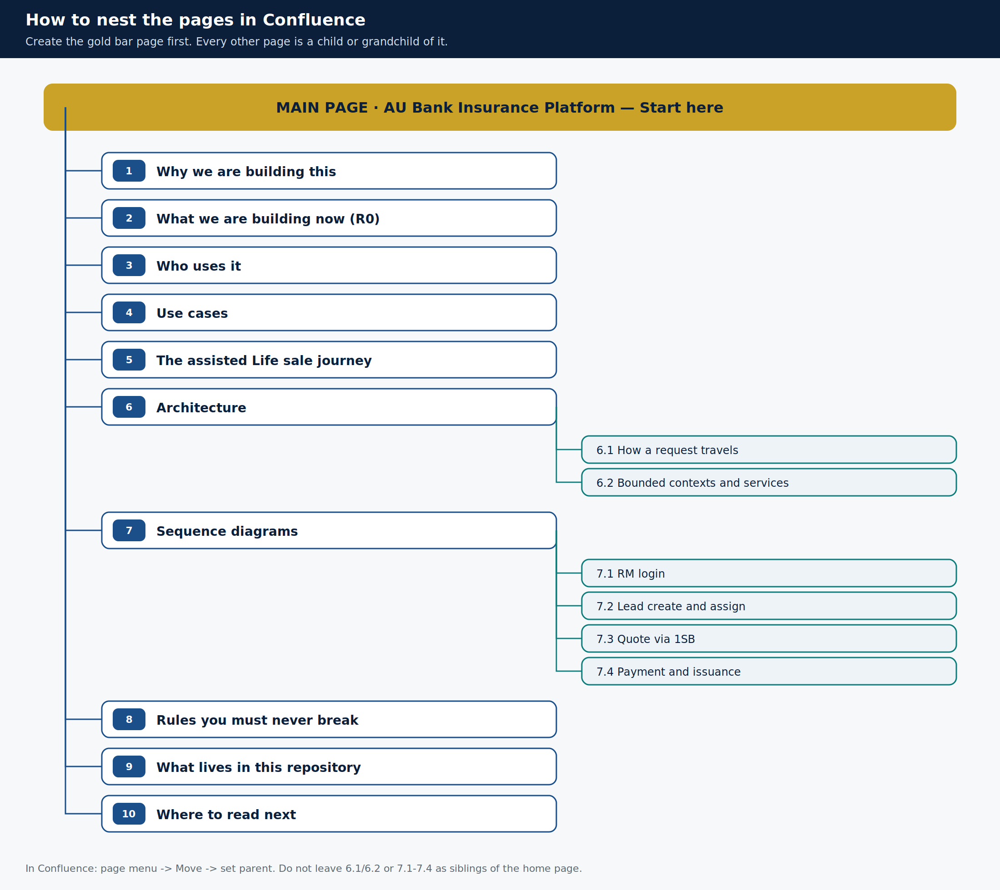

# PAGE TREE — how to nest the Confluence pages

**Main page** = the gold bar. Everything else hangs from it.



## Nesting rule

```
AU Bank Insurance Platform — Start here          ← MAIN / parent (create first)
├── 1. Why we are building this
├── 2. What we are building now (R0)
├── 3. Who uses it
├── 4. Use cases
├── 5. The assisted Life sale journey
├── 6. Architecture
│   ├── 6.1 How a request travels
│   └── 6.2 Bounded contexts and services
├── 7. Sequence diagrams
│   ├── 7.1 Sequence — RM login
│   ├── 7.2 Sequence — Lead create and assign
│   ├── 7.3 Sequence — Quote via 1SB
│   └── 7.4 Sequence — Payment and issuance
├── 8. Rules you must never break
├── 9. What lives in this repository
└── 10. Where to read next
```

In Confluence this is **parent / child**, not folders. A page "sits under" another when you set its **parent** (page menu → *Move*).

## Exact parent for every page

| Confluence page title | Parent page title | Depth | File to paste |
|-----------------------|-------------------|-------|---------------|
| AU Bank Insurance Platform — Start here | *(space home, or a "Programme" root you already have)* | **0 — MAIN** | `pages/00-home.md` |
| Why we are building this | AU Bank Insurance Platform — Start here | 1 | `pages/01-why.md` |
| What we are building now (R0) | AU Bank Insurance Platform — Start here | 1 | `pages/02-what.md` |
| Who uses it | AU Bank Insurance Platform — Start here | 1 | `pages/03-who.md` |
| Use cases | AU Bank Insurance Platform — Start here | 1 | `pages/04-use-cases.md` |
| The assisted Life sale journey | AU Bank Insurance Platform — Start here | 1 | `pages/05-sale-journey.md` |
| Architecture | AU Bank Insurance Platform — Start here | 1 | `pages/06-architecture.md` |
| How a request travels | Architecture | 2 | `pages/06a-hops.md` |
| Bounded contexts and services | Architecture | 2 | `pages/06b-contexts.md` |
| Sequence diagrams | AU Bank Insurance Platform — Start here | 1 | `pages/07-sequences.md` |
| Sequence — RM login | Sequence diagrams | 2 | `pages/07a-login.md` |
| Sequence — Lead create and assign | Sequence diagrams | 2 | `pages/07b-lead.md` |
| Sequence — Quote via 1SB | Sequence diagrams | 2 | `pages/07c-quote.md` |
| Sequence — Payment and issuance | Sequence diagrams | 2 | `pages/07d-payment.md` |
| Rules you must never break | AU Bank Insurance Platform — Start here | 1 | `pages/08-hard-rules.md` |
| What lives in this repository | AU Bank Insurance Platform — Start here | 1 | `pages/09-this-repo.md` |
| Where to read next | AU Bank Insurance Platform — Start here | 1 | `pages/10-read-next.md` |

## How to link them to one another

After the tree exists, Confluence's **Children Display** macro on the home page and on Architecture / Sequence diagrams will list the nested pages automatically.

Until then, each markdown file already has a "In this pack" table with relative links. When pasting, either:

- leave the markdown links (they work in the git copy), or
- replace them with Confluence page links (`[Why we are building this]`) once the titles exist.

## Labels (optional, recommended)

Apply these labels on every page so the space is searchable:

`onboarding` `r0` `au-insurance` `teaching-pack`

Plus one extra label per page: `why` `what` `actors` `use-cases` `journey` `architecture` `sequence` `rules` `repo`.
