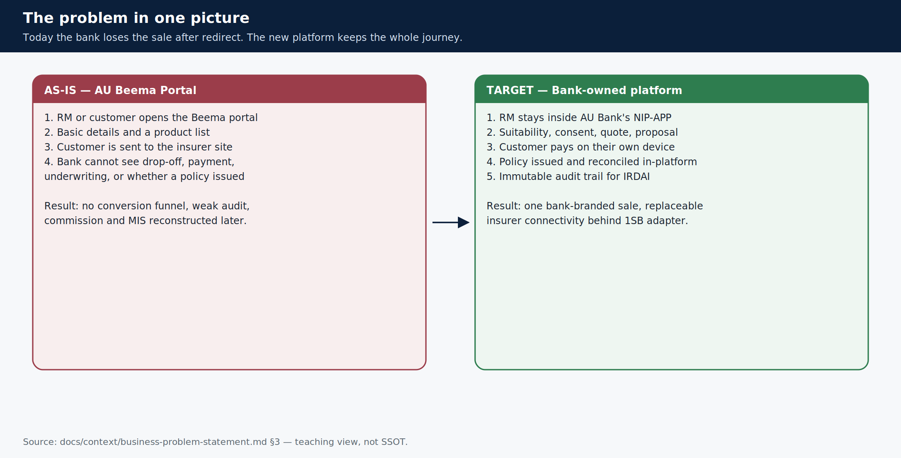

# AU Bank Insurance Platform — Start here

> **Teaching pack** · `SUG-20261005-cfp` · not a source of truth.
> If this page disagrees with a BRD, HLD, ADR or `CURRENT-STATE.yaml`, **the document wins**.
>
> **This is the MAIN Confluence page.** Create it first. Every other page in this pack is a child or grandchild of this page.

**AU Small Finance Bank** (IRDAI Composite Corporate Agent, CA0515) is building a **bank-owned multi-insurer insurance distribution platform**. Relationship managers sell Life insurance to existing bank customers inside an AU Bank journey — suitability, consent, quote, proposal, payment on the customer's phone, issued policy, audit trail — without disappearing into an insurer's website.

## Read this in one minute

**Why.** The current AU Beema portal redirects the customer to the insurer. After that redirect the bank cannot see drop-off, payment, underwriting or issuance.

**What, now (R0).** One certified Relationship Manager sells a complete Life policy — Term or Savings/ULIP — to one existing-to-bank customer of one Group A insurer, end to end, through a real interface.

**What is not R0.** Customer self-service (DIY), hybrid mode-switching, Health/Motor/Travel, New-to-Bank, Group B redirect as a product, claims, renewals.

**How traffic runs.** Flutter app → BFF → bank domain services → Integration Hub → 1SB adapter → 1Silverbullet → insurer. Bank apps never call 1SB or a database. Flutter never receives OAuth tokens.

## The page tree — create pages in this shape

| # | Page (create as a **child** of this page) | One-line job |
|---|-------------------------------------------|--------------|
| 1 | [Why we are building this](./01-why.md) | Problem, as-is vs target, regulation |
| 2 | [What we are building now (R0)](./02-what.md) | The R0 sentence, in/out of scope |
| 3 | [Who uses it](./03-who.md) | RM, partner rep, customer as participant |
| 4 | [Use cases](./04-use-cases.md) | UC-01 … UC-35 grouped |
| 5 | [The assisted Life sale journey](./05-sale-journey.md) | The spine from Lead to Sold |
| 6 | [Architecture](./06-architecture.md) | Contexts, hops, three workstreams |
| 7 | [Sequence diagrams](./07-sequences.md) | Login, Lead, quote, payment |
| 8 | [Rules you must never break](./08-hard-rules.md) | Fail-closed gates |
| 9 | [What lives in this repository](./09-this-repo.md) | Java services vs the Flutter app |
| 10 | [Where to read next](./10-read-next.md) | SSOT map when this pack is not enough |

Under **Architecture** nest *How a request travels* and *Bounded contexts*. Under **Sequence diagrams** nest the four sequence pages.

## The problem, pictured

## The R0 path, pictured

## Three workstreams, one platform

| Workstream | Stage (as of 2026-09-30) | What it is |
|------------|--------------------------|------------|
| **WS-3** Platform | S08 Foundation (`GATE-S08` CANDIDATE) | The bank-owned product and services |
| **WS-1** 1SB integration | L7 Hardening (`GATE-P4` BLOCKED) | Thin adapter to 1Silverbullet |
| **WS-2** Workforce IAM | L4/L6 (`GATE-IAM-P1` OPEN) | Token-hiding BFF, Keycloak behind adapter, PDP |

Stage fields are human-owned. This table is a snapshot of [`docs/context/BOOT.md`](../../../context/BOOT.md), not a gate advance.

## Pin these before you design or code

- No quote without a valid, unexpired **suitability** assessment.
- No proposal without an unexpired **customer-device OTP** consent grant.
- Premium payment executes only on the **customer's device**.
- A policy is **Sold** only when it is issued, confirmed, **RECONCILED**, and audit-complete.
- `distributorId` is never caller-supplied.
- UI speaks **bank language**. 1SB wire codes stop at the Integration Hub.

Sources: [`business-problem-statement.md`](../../../context/business-problem-statement.md) · [`R0-HLD.md`](../../../architecture/R0-HLD.md) · [`BOOT.md`](../../../context/BOOT.md).
