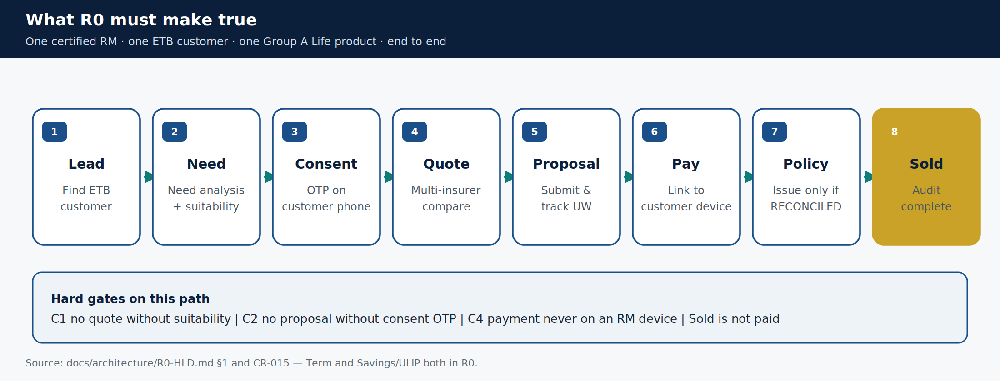
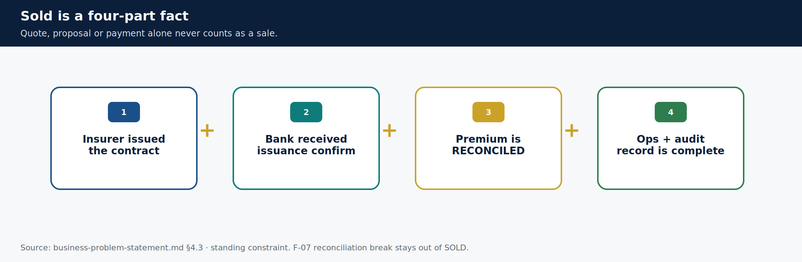
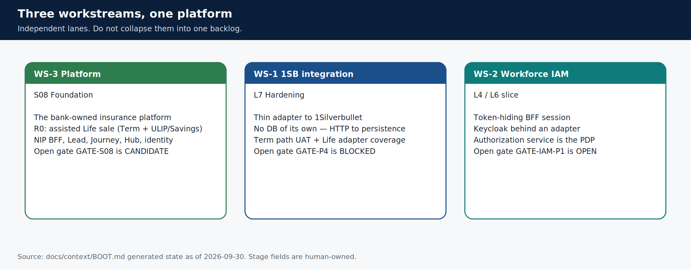

# What we are building now (R0)

> **Teaching pack** · `SUG-20261005-cfp` · not a source of truth.
>
> **Confluence parent:** AU Bank Insurance Platform — Start here  
> **This page:** child #2

## The R0 sentence

> One Relationship Manager — the certified Specified Person — sells a complete Life insurance policy (Term or Savings/ULIP) to one existing-to-bank customer of one Group A insurer, end to end, through a real interface, with consent and suitability evidence, payment on the customer's own device, an issued and reconciled policy, and a complete audit trail.

That sentence is `R0-ASSISTED-LIFE-SALE` ([CR-015](../../../governance/change-requests/CR-015-ws3-r0-savings-ulip-journey.md)). Everything in R0 either makes it true or is deferred until it is.

## In scope now

| In | Meaning |
|----|---------|
| Assisted journey | RM drives; customer participates on their own device |
| Life LOB | `lob = LIFE`. Product classes: Term **and** Savings/ULIP |
| ETB customer | Existing-to-bank; CIF/KYC from CBS via bank APIs |
| Group A insurer | Live quote/proposal via 1SB |
| Workforce login | Token-hiding BFF; Keycloak behind an adapter; PDP separate |
| Lead module | Single on-platform way in (`#5 Lead`) |
| Audit + payment recon | Sold cannot be inferred |

## Out of scope now — do not design these into R0 screens

| Out | Revisit |
|-----|---------|
| Customer self-service (DIY) | R1, after a real assisted sale in pilot |
| Hybrid / mode switching | R2, after both journeys have stable hand-off |
| Group B catalogue + redirect | R1 |
| Customer BFF + customer Flutter | R1, with DIY |
| Health, Motor, Travel | R2+, after WS-1 Phase 5 unfreezes |
| New-to-Bank / V-KYC | R2+ |
| Renewals, servicing, claims | R2+ / never for claims admin |
| Multi-aggregator routing | When a second aggregator is committed |
| Branch kiosk, vernacular beyond sequenced hi-IN | Pending / R1 |

The North Star picture (`docs/hdl.svg`) shows later releases **on purpose**. It is not permission to build them.

## When a policy is Sold

A sale is **never** counted at quote, proposal or payment. All four of these must be true:

1. Insurer issued the contract
2. Bank received issuance confirmation
3. Premium is `RECONCILED` against AU Bank PG
4. Ops record + required audit events are complete

## Three workstreams

R0 is delivered by **WS-3** (platform), enabled by **WS-2** (workforce identity) and supplied by **WS-1** (1SB adapter). Do not merge the three backlogs.

**Next child:** [Who uses it](./03-who.md)

Sources: [`R0-HLD.md` §1](../../../architecture/R0-HLD.md) · [`BOOT.md`](../../../context/BOOT.md) · CR-015.
