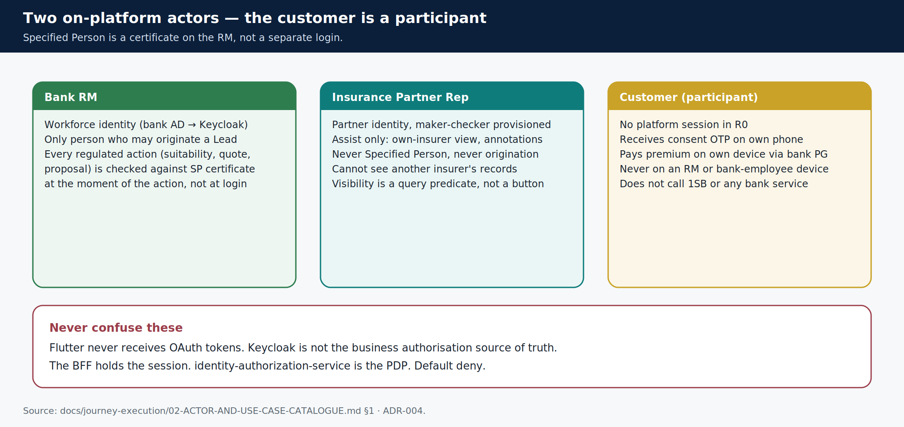

# Who uses it

> **Teaching pack** · `SUG-20261005-cfp` · not a source of truth.
>
> **Confluence parent:** AU Bank Insurance Platform — Start here  
> **This page:** child #3

R0 has **two on-platform human actors**. The customer is a **participant**, not an actor: their phone receives an OTP and a payment link and never holds a platform session.

## The two actors

| Actor | Identity | May do | Never does |
|-------|----------|--------|------------|
| **Bank RM** | Workforce. Bank AD federated via Keycloak | Sole origination. Every regulated action. Accountable Specified Person on the record for its life | Never anonymous. Never replaceable as the SP after the fact |
| **Insurance Partner Representative (IPR)** | Partner, maker-checker provisioned | Assist: own-insurer view/select, gated journey read, annotations | Never an SP. No origination, no advice, no regulated action |
| *Customer* | none on-platform in R0 | Receives OTP; pays on **their** device | Never a platform session in R0 |

Specified Person is a **certification attribute on the RM**, not a third login and not a channel (`ADR-004`). It is evaluated **at the instant of each regulated action**, not at login. An RM whose certificate lapsed overnight can still log in and do non-selling work; quote and proposal will fail closed.

## IPR visibility is a query, not a hidden button

A partner user only sees records that were created by a Bank RM, for **their** insurer, explicitly shared, and inside their branch scope. A row that fails the predicate is **absent**, never a `403` that names the id (naming the id would confirm it exists).

## What the app is

One Flutter **NIP-APP** (web + Android + iOS) in a **separate repository**. RM, IPR and admin/ops are **roles** on that app, not three apps (`ADR-015`). This git repo holds the Java BFFs and services the app calls.

**Next child:** [Use cases](./04-use-cases.md)

Sources: [`02-ACTOR-AND-USE-CASE-CATALOGUE.md`](../../../journey-execution/02-ACTOR-AND-USE-CASE-CATALOGUE.md) · [`R0-HLD.md` §2.1](../../../architecture/R0-HLD.md).
