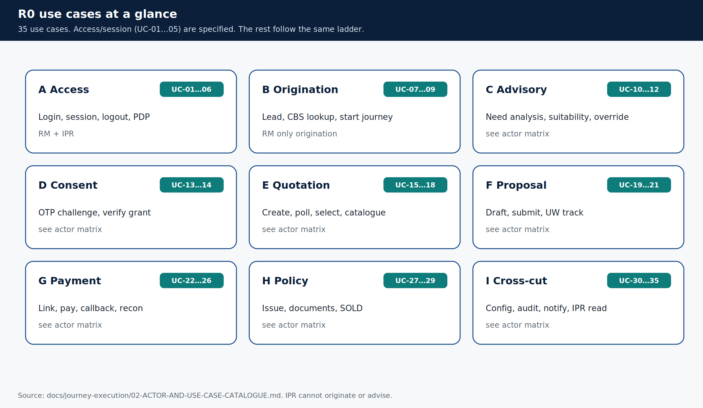

# Use cases

> **Teaching pack** · `SUG-20261005-cfp` · not a source of truth.
>
> **Confluence parent:** AU Bank Insurance Platform — Start here  
> **This page:** child #4

R0 is 35 use cases. Five (login / session / PDP) are specified as hop-by-hop flow files. The rest follow the same request ladder.

## Catalogue

### A — Access and session

| UC | Use case | Actors |
|----|----------|--------|
| UC-01 | RM login | RM |
| UC-02 | IPR login | IPR |
| UC-03 | Session status and refresh | RM, IPR |
| UC-04 | Logout, disablement, revocation | RM, IPR, admin |
| UC-05 | Authorization decision (PDP) | service |
| UC-06 | Principal snapshot `GET /me` (incl. SP state) | RM, IPR |

### B — Origination

| UC | Use case | Actors |
|----|----------|--------|
| UC-07 | Create Lead / opportunity | **RM only** |
| UC-08 | Customer lookup from CBS | RM via Journey |
| UC-09 | Start journey from a QUALIFIED Lead | RM |

### C — Advisory

| UC | Use case |
|----|----------|
| UC-10 | Complete need analysis |
| UC-11 | Evaluate suitability (**C1 producer**) |
| UC-12 | Override a suitability outcome |

### D — Consent

| UC | Use case |
|----|----------|
| UC-13 | Issue consent OTP to the **customer device** |
| UC-14 | Verify OTP and bind the grant (**C2 producer**) |

### E — Quotation

| UC | Use case |
|----|----------|
| UC-15 | Create quote — **C1 gate**, async poll to 1SB |
| UC-16 | Poll quote; partial success is success |
| UC-17 | Select an offer |
| UC-18 | Browse catalogue / offerings (RM; IPR own-insurer) |

### F — Proposal

| UC | Use case |
|----|----------|
| UC-19 | Create proposal draft from the selected offer |
| UC-20 | Submit proposal — **C2 gate**, no auto-retry on submit |
| UC-21 | Track underwriting (IPR gated read) |

### G — Payment

| UC | Use case |
|----|----------|
| UC-22 | Create payment; link goes to the **customer device** (**C4**) |
| UC-23 | Customer pays on the hosted PG page (outside the platform) |
| UC-24 | PG authorisation callback (IP-allowlisted) |
| UC-25 | Settlement reconciliation batch |
| UC-26 | Resolve UNCERTAIN / RECONCILIATION_BREAK |

### H — Policy

| UC | Use case |
|----|----------|
| UC-27 | Issue policy — only against a **RECONCILED** payment |
| UC-28 | Retrieve policy and documents |
| UC-29 | Journey reaches **SOLD** — audit-complete |

### I — Cross-cutting

| UC | Use case |
|----|----------|
| UC-30 | Resolve configuration (fail closed) |
| UC-31 | Audit event via transactional outbox |
| UC-32 | Notification (never blocks the journey) |
| UC-33 | Compensation on a failed journey |
| UC-34 | IPR gated read |
| UC-35 | Partner user provisioning under maker-checker |

## Who can reach what

| Group | Bank RM | IPR | Customer |
|-------|:-------:|:---:|:--------:|
| A Access | yes | yes | — |
| B Origination | yes | **no** | — |
| C Advisory | yes | **no** | — |
| D Consent | yes | **no** | receives OTP |
| E Quote | yes | catalogue, own insurer | — |
| F Proposal | yes | gated read | — |
| G Payment | create only | **no** | **pays on own device** |
| H Policy | yes | gated read | — |

Every "no" for IPR is default-deny at the PDP, not a hidden UI control.

**Next child:** [The assisted Life sale journey](./05-sale-journey.md)

Source: [`02-ACTOR-AND-USE-CASE-CATALOGUE.md`](../../../journey-execution/02-ACTOR-AND-USE-CASE-CATALOGUE.md).
