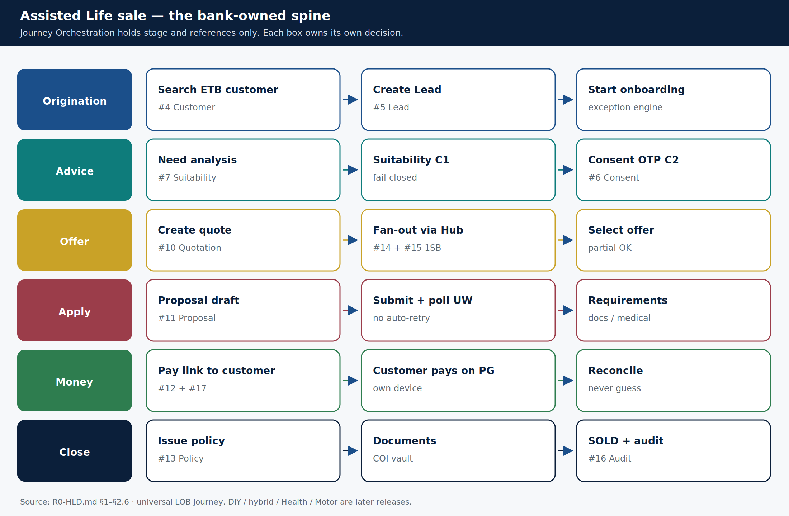
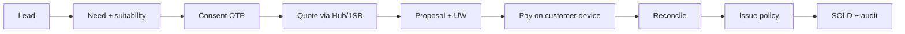

# The assisted Life sale journey

> **Teaching pack** · `SUG-20261005-cfp` · not a source of truth.
>
> **Confluence parent:** AU Bank Insurance Platform — Start here  
> **This page:** child #5

This is the bank-owned spine. **Journey Orchestration (`#9`) holds stage and references only.** It never copies another context's business decision.



## Happy-path stages

```text
INITIATED
  → NEED_ANALYSIS
  → SUITABILITY_COMPLETE     (C1)
  → CONSENT_CAPTURED         (C2)
  → QUOTING
  → QUOTE_SELECTED
  → PROPOSAL_IN_PROGRESS
  → UNDERWRITING
  → PAYMENT_PENDING          (C4 — link to customer device)
  → PAYMENT_SETTLED          (RECONCILED, not merely captured)
  → ISSUANCE_PENDING
  → ISSUED
  → SOLD                     (policy ACTIVE + payment RECONCILED
                              + issuance confirmed + audit complete)
```

## What each band owns

| Band | Contexts | Hard rule |
|------|----------|-----------|
| Origination | `#4` Customer, `#5` Lead | RM-only create. Dedupe before a second Lead |
| Advice | `#7` Suitability, `#6` Consent | C1 then C2. OTP on customer phone |
| Offer | `#10` Quote, `#14` Hub, `#15` adapter | C1 re-checked. Partial insurer success is success |
| Apply | `#11` Proposal & UW | C2 still valid. No auto-retry on submit |
| Money | `#12` Payment, `#17` Notification | Link never lands in an RM session |
| Close | `#13` Policy, `#16` Audit | Issue only against RECONCILED. SOLD waits for audit |

## Failures that a timeout must never "fix"

| Id | Failure | Platform behaviour |
|----|---------|--------------------|
| F-05 | Paid, not issued | Bounded issuance retry, then maker-checked refund. Never auto-refund above threshold |
| F-07 | Reconciliation break | Stay out of SOLD. Manual finance procedure |
| F-08 | PG response lost | `UNCERTAIN`. Block a new attempt. Next settlement file decides |

## Same skeleton, later LOBs

Term, Savings and ULIP share this spine in R0. Health and Motor will reuse it with **their own** `#10` and `#11` (LOB-owned execution). Do not `if (lob == …)` inside Life quote.



**Next child:** [Architecture](./06-architecture.md) · then the [sequence diagrams](./07-sequences.md)

Sources: [`R0-HLD.md` §2.6](../../../architecture/R0-HLD.md) · [`universal-lob-journey.md`](../../../1sb-insurance-integration/journeys/universal-lob-journey.md).
