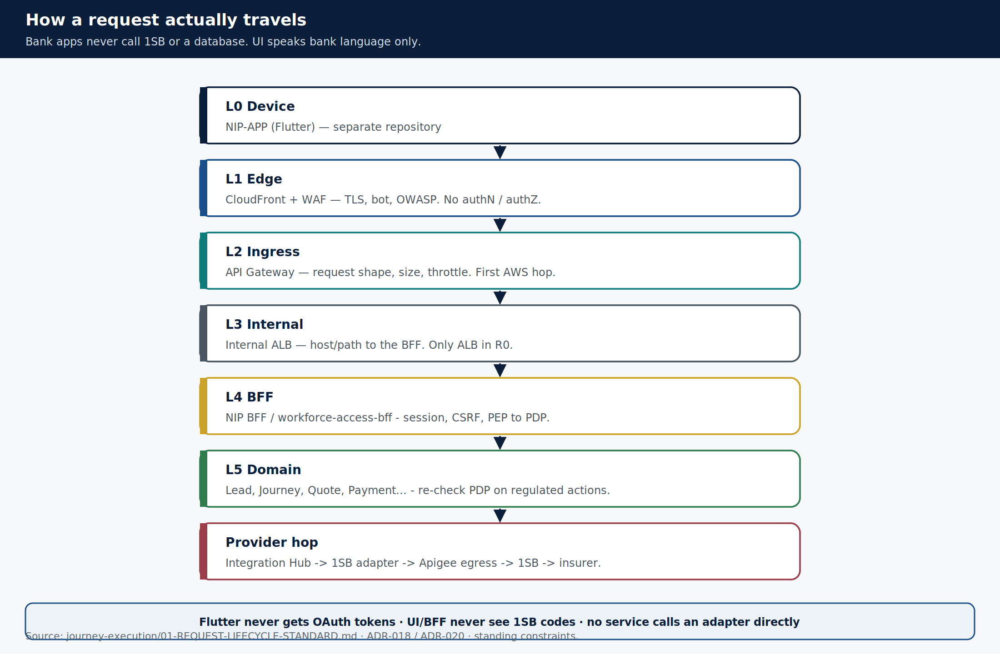
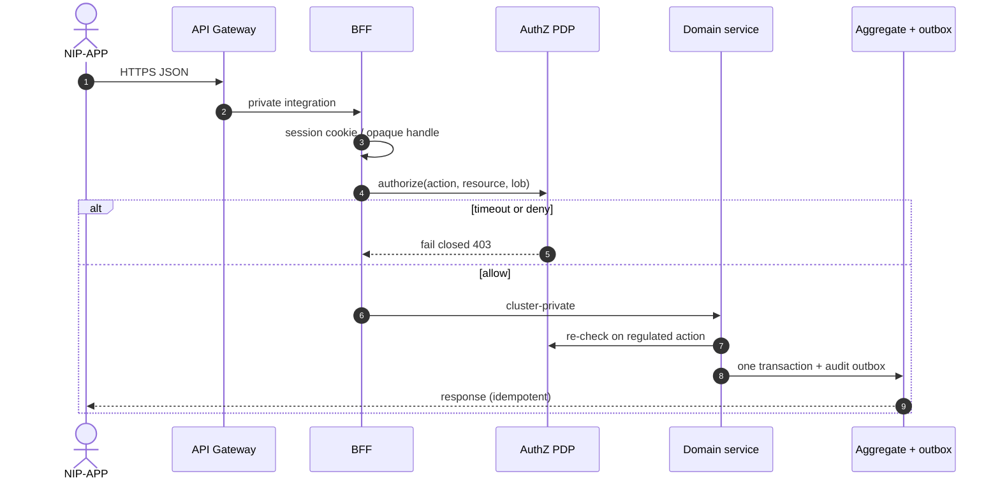

# How a request travels

> **Teaching pack** · `SUG-20261005-cfp` · not a source of truth.
>
> **Confluence parent:** Architecture  
> **This page:** grandchild 6.1

Every authenticated mutating request climbs the same ladder. A use-case flow file only records what **differs**.

## The eight layers

| Layer | What it is | Never |
|-------|------------|-------|
| L0 Device | NIP-APP (Flutter) | Hold OAuth access/refresh tokens |
| L1 Edge | CloudFront + WAF | Authenticate, authorize, cache authenticated JSON |
| L2 Ingress | API Gateway | Use an API key as authN; hold business logic |
| L3 Internal | Internal ALB | Exist per microservice; terminate a business decision |
| L4 BFF | Session, CSRF, PEP → PDP | Be the **only** enforcer of a rule; accept `distributorId` |
| L5 Domain | Service identity, PDP re-check, orchestration | Call a provider adapter directly; read another context's DB |
| L6 Aggregate | Domain invariants in one transaction | Permit a transition not drawn on the state machine |
| L7 Store | NOT NULL / CHECK / INSERT-only | UPDATE/DELETE on consent, suitability or audit |

A rule enforced **only** at the BFF is not enforced. Jobs, other BFFs and service-to-service calls never see L4.

## Standard mutations, condensed

1. WAF / Gateway refuse shape, size, floods — no platform audit event at WAF.
2. BFF loads the **session from the vault**, never from the body.
3. Missing `Idempotency-Key` on a mutation → 400.
4. Body contains `distributorId` → 422, security event.
5. PEP asks the PDP (300 ms, **no retry**, fail closed).
6. Domain service **re-checks** the PDP for regulated actions.
7. Configuration is resolved; missing rule → refuse (no compiled default).
8. Aggregate applies the transition and writes the audit **outbox in the same transaction**.
9. Journey cannot reach SOLD until required audit events are acknowledged.

Source: [`01-REQUEST-LIFECYCLE-STANDARD.md`](../../../journey-execution/01-REQUEST-LIFECYCLE-STANDARD.md).
