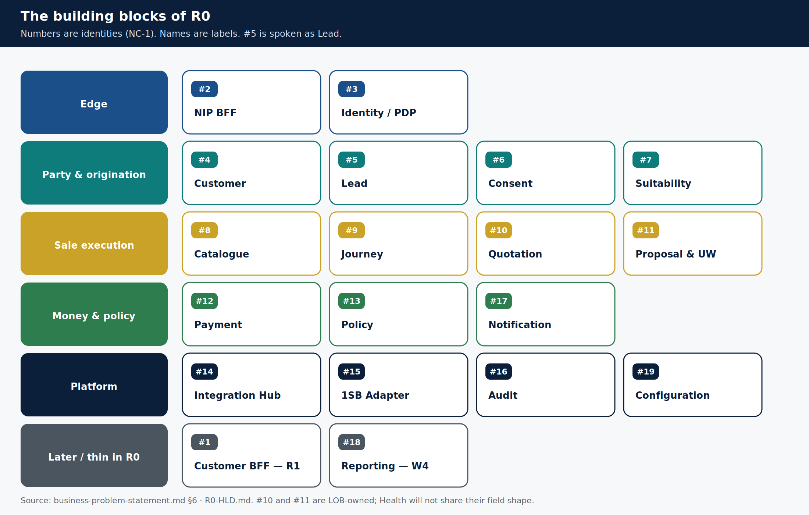

# Bounded contexts and services

> **Teaching pack** · `SUG-20261005-cfp` · not a source of truth.
>
> **Confluence parent:** Architecture  
> **This page:** grandchild 6.2

Numbers are **identities**. Names are labels. Do not invent a second `#5`.

## R0 map

| # | Context | Owns | Notes |
|---|---------|------|-------|
| 1 | Customer BFF | Customer edge | **R1** with DIY — not built now |
| 2 | NIP BFF | RM/IPR/admin edge | One BFF. Workforce token-hiding is the access BFF + identity adapter |
| 3 | Identity & Access | AuthN adapter + PDP | Keycloak is not the PDP |
| 4 | Customer | ETB snapshot from CBS | Not CBS itself |
| 5 | Lead | Origination | Spoken name Lead; Opportunity is the durable-demand alias |
| 6 | Consent | Immutable grant + evidence | Append-only |
| 7 | Suitability | Need analysis outcome | C1 producer |
| 8 | Product Catalogue | Eligibility, products | Configuration-keyed by LOB |
| 9 | Journey Orchestration | Stage + references | Never copies another decision |
| 10 | Quotation | Price discovery | **LOB-owned execution** |
| 11 | Proposal & UW | Application + UW track | **LOB-owned execution** |
| 12 | Payment | Link, capture, recon | No card data; no RM on the pay path |
| 13 | Policy & Issuance | Issued record + docs | Shared evidence, not LOB-forked |
| 14 | Integration Hub | Routing, bank language | UI/BFF never see 1SB codes |
| 15 | 1SB Adapter | Aggregator anti-corruption | `adapter.onesb.*` only |
| 16 | Audit | Append-only evidence | Outbox + WORM archive are the record |
| 17 | Notification | OTP and payment-link delivery | Must not block the journey |
| 18 | Reporting & MIS | Isolated read path | W4 in R0; warehouse ETL still out |
| 19 | Configuration | Versioned rules | Fail closed. Admin UI is a consumer |

## LOB encoding — why Health is not a copy-paste

| Class | R0 members | When Health arrives |
|-------|------------|---------------------|
| LOB-owned execution | `#10` `#11` | **Own instance**. Field shape is not shared |
| LOB-partitioned shared | `#2` `#3` `#6` `#7` `#8` `#9` `#14` `#19` | One deploy; behaviour from config keyed by `(lob, …)` |
| LOB-agnostic shared | `#4` `#5` `#12` `#13` `#16` `#17` | One instance forever |

Partitioning **rules** makes Health possible. Duplicating **evidence** makes it unauditable.

Source: [`business-problem-statement.md` §6](../../../context/business-problem-statement.md#6-business-capabilities--bounded-contexts) · [`R0-HLD.md`](../../../architecture/R0-HLD.md).
