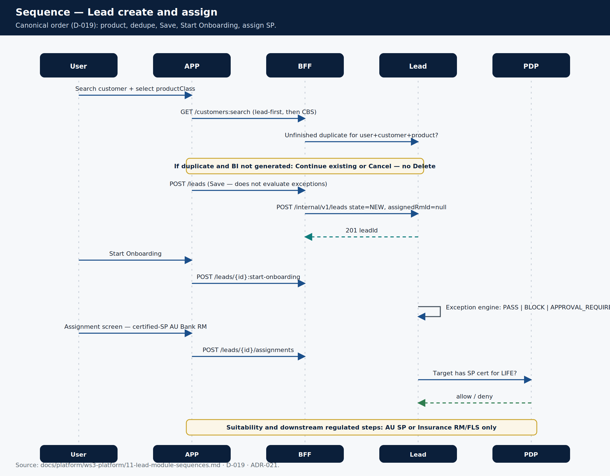
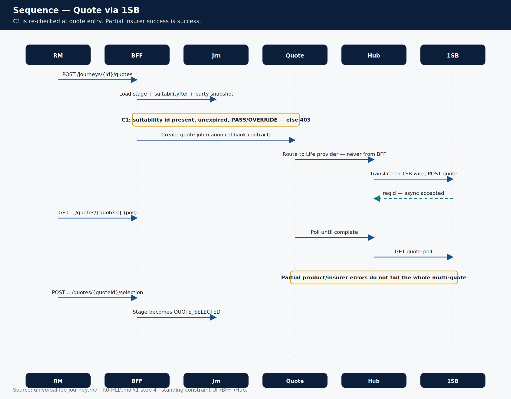
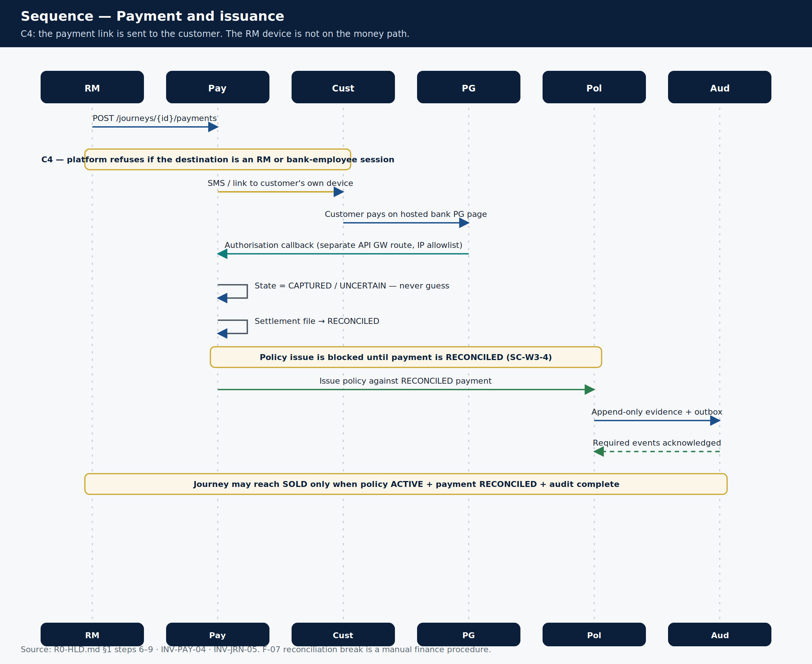

# Sequence diagrams

> **Teaching pack** · `SUG-20261005-cfp` · not a source of truth.
>
> **Confluence parent:** AU Bank Insurance Platform — Start here  
> **This page:** child #7  
> **Nest under this page:** the four sequence pages below.

These are the four pictures a new engineer should be able to redraw on a whiteboard. Each child page has a PNG plus a mermaid source.

| # | Page | Why it exists |
|---|------|----------------|
| 7.1 | [Sequence — RM login](./07a-login.md) | Token hiding. SP is **not** checked at login |
| 7.2 | [Sequence — Lead create and assign](./07b-lead.md) | Dedupe → Save → Start Onboarding → assign SP (`D-019`) |
| 7.3 | [Sequence — Quote via 1SB](./07c-quote.md) | C1 gate, Hub translation, async poll, partial success |
| 7.4 | [Sequence — Payment and issuance](./07d-payment.md) | C4 customer device, RECONCILED before issue, SOLD after audit |

## Thumbnails

Lead-module extras (resume, exception hold, convert) live in
[`11-lead-module-sequences.md`](../../../platform/ws3-platform/11-lead-module-sequences.md) — attach that file if a Lead engineer joins, do not paste it onto this overview.

**Next child:** [Rules you must never break](./08-hard-rules.md)
