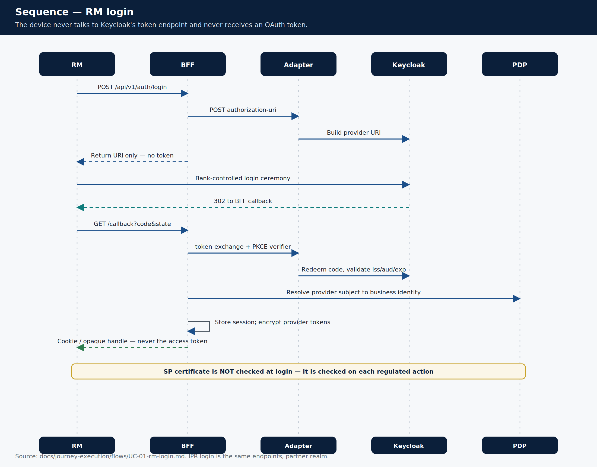

# Sequence — RM login

> **Teaching pack** · `SUG-20261005-cfp` · not a source of truth.
>
> **Confluence parent:** Sequence diagrams  
> **This page:** grandchild 7.1

The device **never** talks to Keycloak's token endpoint and **never** receives an OAuth access or refresh token. That is a standing constraint, not a preference.



## What people assume vs what is designed

There is **no** separate "authentication service" on this path.

- `workforce-access-bff` owns login, callback, session and logout.
- It calls `identity-provider-adapter-service` — a **provider-neutral port**. The adapter is stateless and is not a second IdP.
- **Keycloak** runs the ceremony and (later) federates to bank AD.
- `identity-authorization-service` is the **PDP**. It is **not** on the authentication path except to resolve the business identity after the code is redeemed. Keycloak is never the source of truth for business authorization.

Production IdP (Keycloak vs Cognito) can still change behind the adapter without touching the BFF contract.

## Preconditions

| Must be true | If absent |
|--------------|-----------|
| Bank AD account (or Keycloak-local user in R0 dev) | Ceremony fails |
| Business identity ACTIVE in the PDP | `401 AUTHENTICATION_FAILED` |
| Employment + at least one branch mapping | `401 AUTHENTICATION_FAILED` |
| Return location on the allow-list | `400 RETURN_LOCATION_NOT_ALLOWED` |
| SP certificate valid | **Not required to log in** |

## Mermaid (paste into a Confluence mermaid macro if you have one)

```mermaid
sequenceDiagram
  autonumber
  actor RM as RM device
  participant BFF as workforce-access-bff
  participant AD as IdP adapter
  participant KC as Keycloak
  participant PDP as identity-authorization

  RM->>BFF: POST /api/v1/auth/login
  BFF->>AD: POST authorization-uri
  AD->>KC: Build provider URI
  BFF-->>RM: URI only — no token
  RM->>KC: Bank-controlled ceremony (MFA in prod)
  KC-->>RM: 302 to BFF callback
  RM->>BFF: GET /callback?code&state
  BFF->>AD: token-exchange + PKCE verifier
  AD->>KC: Redeem code; validate iss/aud/exp
  BFF->>PDP: Resolve provider subject to business identity
  BFF->>BFF: Store session; encrypt provider tokens
  BFF-->>RM: Cookie / opaque handle — never the access token
  Note over RM,PDP: SP certificate is checked on each regulated action, not at login
```

IPR login uses the same endpoints on the partner realm path ([`UC-02`](../../../journey-execution/flows/UC-02-ipr-login.md)).

Source: [`UC-01-rm-login.md`](../../../journey-execution/flows/UC-01-rm-login.md).
