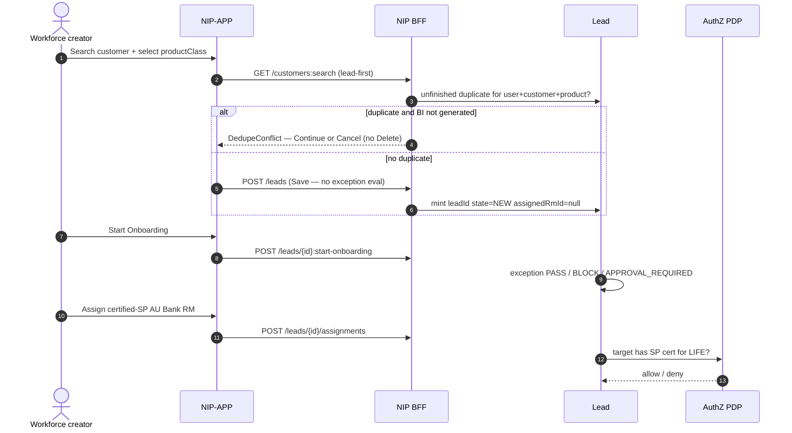

# Sequence — Lead create and assign

> **Teaching pack** · `SUG-20261005-cfp` · not a source of truth.
>
> **Confluence parent:** Sequence diagrams  
> **This page:** grandchild 7.2

Canonical order (`D-019`, Lead BRD): **product → dedupe → Save → Start Onboarding (exception) → assign certified-SP RM**.

Save does **not** evaluate exception rules. Start Onboarding does.

## Dedupe

Key: `(loggedInUserId, customerId, productClass)` with unfinished Lead and `biGenerated = false`.

If a duplicate exists: **Continue existing** or **Cancel**. There is **no Delete** on that popup (Lead BRD Table 18).

Search is **lead-first**, then CBS via Apigee (`ARCH-025`).

## Assignment

After exception PASS (or hold released):

- Assignee must have a valid Specified Person certificate for `LIFE` at the moment of assignment.
- Meeting capture is optional and is not a completion workflow. Meeting SMS/email is deferred.

Suitability and every downstream regulated step: **AU SP-certified Bank RM or Insurance RM/FLS only**. Create/Save/dedupe/onboarding/assign may be a broader workforce creator (`ADR-021` / `D-018` / `D-019`).

Source: [`11-lead-module-sequences.md`](../../../platform/ws3-platform/11-lead-module-sequences.md) · `D-019` · `ADR-021`.
