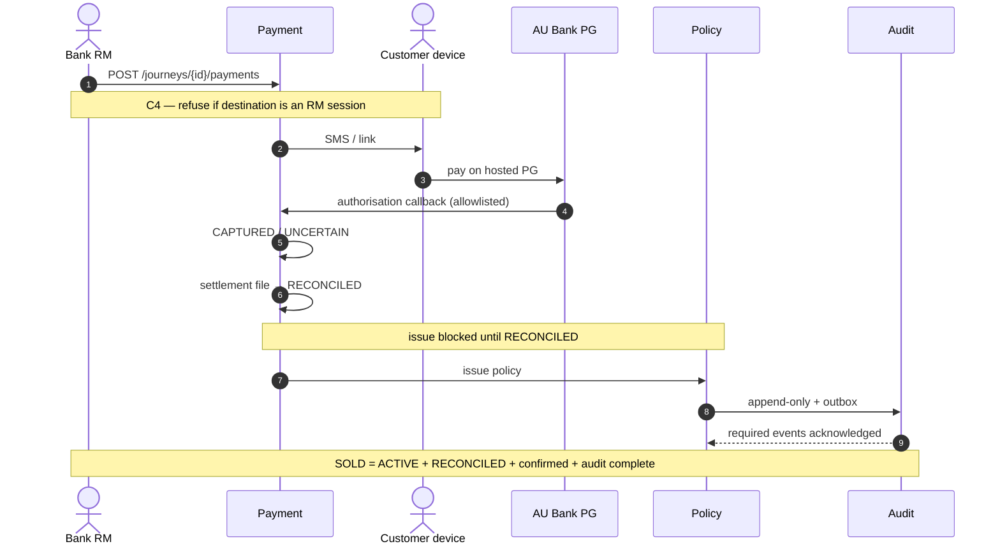

# Sequence — Payment and issuance

> **Teaching pack** · `SUG-20261005-cfp` · not a source of truth.
>
> **Confluence parent:** Sequence diagrams  
> **This page:** grandchild 7.4

**C4:** the payment link is sent to the **customer's device**. There is no API path that issues a payment link into an RM or bank-employee session.

A policy is issued only against a **RECONCILED** payment. `CAPTURED` is not enough. `UNCERTAIN` blocks a second attempt.

## Money path

1. RM asks the platform to create a payment for the journey.
2. Platform refuses if the destination would be the RM session.
3. Notification delivers the link to the customer's phone (`#17`).
4. Customer pays on the **AU Bank Payment Gateway** hosted page — outside the platform.
5. PG calls back on a **separate API Gateway route**, IP-allowlisted.
6. Payment stays `UNCERTAIN` until the settlement file says otherwise. Never guess.
7. `#13` Policy issues only when payment is `RECONCILED`.
8. Audit events go out via the transactional outbox. Journey reaches `SOLD` only when policy is `ACTIVE`, payment is `RECONCILED`, issuance is confirmed, and required audit events are acknowledged.

Reconciliation break (`F-07`) is a **manual finance procedure**. A timeout must not auto-resolve money.

Source: [`R0-HLD.md` §1 steps 6–9](../../../architecture/R0-HLD.md) · `INV-PAY-04` · `INV-JRN-05`.
