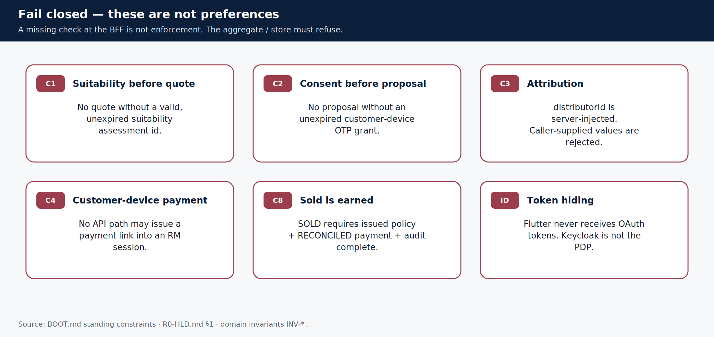

# Rules you must never break

> **Teaching pack** · `SUG-20261005-cfp` · not a source of truth.
>
> **Confluence parent:** AU Bank Insurance Platform — Start here  
> **This page:** child #8 · **Pin this page.**

These are standing constraints. They apply in every workstream. A missing BFF check is not enforcement — the aggregate and the store must still refuse.

## Compliance and sale integrity

| Id | Rule |
|----|------|
| C1 | No quote without a valid, unexpired suitability assessment |
| C2 | No proposal without an unexpired customer-device OTP consent grant |
| C3 | `distributorId` is server-injected. Caller-supplied attribution is rejected |
| C4 | Payment executes only on the customer's device. No pay path on an RM session |
| C8 | `SOLD` requires issued policy + RECONCILED payment + audit complete |
| | Consent, suitability and audit evidence are immutable (no UPDATE/DELETE) |
| | Policy Sold is never inferred from quote, proposal or payment alone |
| | No quote / proposal / payment "success" from a timeout |

## Architecture and engineering

| Rule |
|------|
| Bank apps never call 1SB or a database directly |
| 1SB specifics live only in `adapter.onesb.*` (ArchUnit) |
| `1sb-integration-service` owns no Flyway and no JPA |
| Persistence is platform-common (`bank-persistence-service`) |
| No platform service calls a provider adapter directly — Hub in the middle |
| UI and BFF never receive 1SB or insurer wire codes |
| Journey Orchestration holds stage and references only |
| Flutter never receives OAuth tokens; the BFF holds them |
| Keycloak is not the source of truth for business authorization |
| No PII in logs |
| Regulated data, backups, logs, archives stay in AWS India regions |
| OpenSearch is not the regulatory record. Audit store + S3 WORM are |
| Render.com is dev-preview only and is never a PII data path |

## Product / domain

| Rule |
|------|
| Claims administration is not this platform |
| An insurer or aggregator API does not define the bank's canonical journey |
| An agentic-AI action does not substitute for a deterministic hard gate |
| Adding an actor type is an authorization change, not a new service |

## Coverage (when you write Java here)

Libs: line ≥ 80% / branch ≥ 70%. Services: interim line floor. Every `TODO` carries a work item id.

**Next child:** [What lives in this repository](./09-this-repo.md)

Sources: [`BOOT.md` standing constraints](../../../context/BOOT.md) · [`R0-HLD.md`](../../../architecture/R0-HLD.md).
