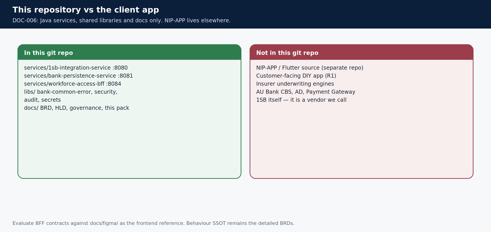

# What lives in this repository

> **Teaching pack** · `SUG-20261005-cfp` · not a source of truth.
>
> **Confluence parent:** AU Bank Insurance Platform — Start here  
> **This page:** child #9

**DOC-006:** this git repository holds **Java services, shared libraries and docs**. Client application source (NIP-APP / Flutter) is **not** here. There is still one workforce client (`ADR-015`); it lives in a separate repository. Evaluate BFF contracts against [`docs/figma/`](../../../figma/README.md). Behaviour SSOT remains the detailed BRDs.



## Services in this repo

| Module | Port | Required for local | Notes |
|--------|------|--------------------|-------|
| `1sb-integration-service` | 8080 | Phase 1+ | Bank-facing 1SB adapter. **No datasource**. Job store via HTTP to persistence |
| `bank-persistence-service` | 8081 | Job-store / audit HTTP | Flyway + JPA + `/internal/v1`. H2 locally, PostgreSQL UAT/prod |
| `workforce-access-bff` | 8084 | Workforce login | Token-hiding BFF |
| `audit-consumer-service` | — | Future | Will call persistence `/internal/v1/audit-events`. No second audit DB |

Shared libraries: `libs/bank-common-error`, `bank-common-security`, `bank-common-audit`, `bank-common-secrets`.

## Local run (JDK 21)

```bash
./gradlew :services:bank-persistence-service:bootRun --args='--spring.profiles.active=local'
./gradlew :services:1sb-integration-service:bootRun --args='--spring.profiles.active=local'
./gradlew test
```

Integration job-store calls need persistence on `http://localhost:8081` (override `BANK_PERSISTENCE_BASE_URL`).

## Where documents live

| Bucket | Question |
|--------|----------|
| `docs/governance/` | Should this work be done, and when? **Binding process** |
| `docs/au-bank-insurance-platform/` | What are we building and why? **Business SSOT** |
| `docs/platform/` | How should the whole platform be built? |
| `docs/1sb-insurance-integration/` | How is the 1SB **adapter** built? (one module, not the platform) |
| `docs/architecture/` | Pictures. Renderings, not SSOT |
| `docs/journey-execution/` | Hop-by-hop use cases |
| `docs/confluence/` | **This pack** — teaching, non-binding |

Agents start at [`docs/context/BOOT.md`](../../../context/BOOT.md). Humans start at this Confluence tree, then [`docs/README.md`](../../../README.md).

**Next child:** [Where to read next](./10-read-next.md)

Sources: [`AGENTS.md`](../../../../AGENTS.md) · [`docs/README.md`](../../../README.md) · `DOC-006`.
