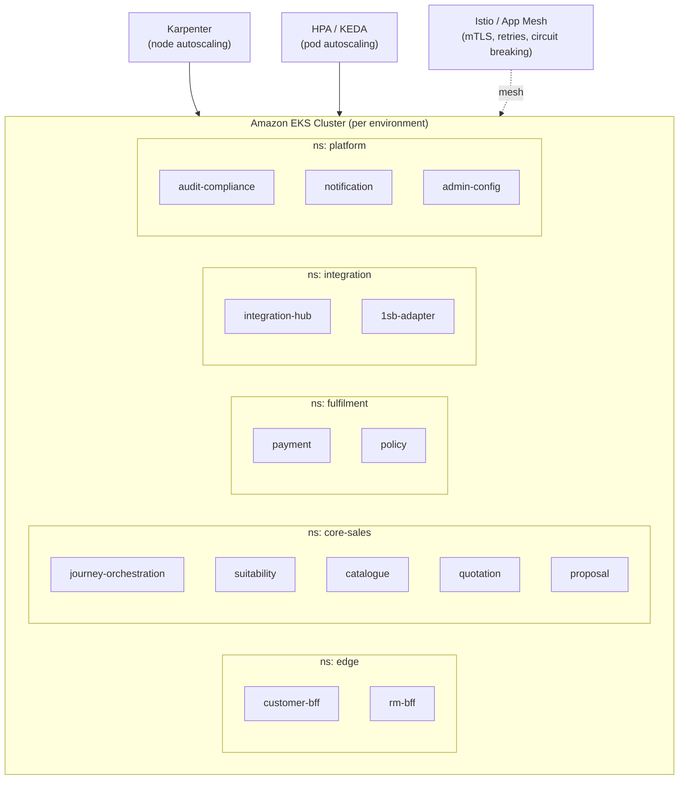

# 04 — AWS Infrastructure Architecture

**Constraint honored throughout:** AWS-only, Kubernetes (Amazon EKS) as the compute substrate, elastic by design.

> **R0 cut.** This file is the **target-state** AWS estate. It still names MSK, ElastiCache,
> Istio and a cluster-per-service reading of data topology. Those are **not** R0. The
> provisioning contract for the current slice is
> [`../../architecture/R0-LLD.md`](../../architecture/R0-LLD.md), which derives from
> [`../ws3-platform/03-solution-architecture-r0.md`](../ws3-platform/03-solution-architecture-r0.md)
> and `ADR-001` / `ADR-008`. Do not raise a landing-zone request from this file alone.

## Landing zone shape

- **AWS Organizations** with separate accounts per environment: `dev`, `uat`, `prod`, plus a `shared-services` account (CI/CD, container registry, central logging) and a `security` account (GuardDuty, Security Hub, Config aggregator). This is standard enterprise multi-account isolation — a compliance-mandated audit trail is much cleaner when prod is a hard account boundary, not a namespace convention.
- **Region:** `ap-south-1` (Mumbai) as primary, assumed for India data residency (flagged as an assumption to confirm with compliance — see [06](./06-security-compliance-and-nfrs.md)). DR region `ap-south-2` (Hyderabad) for cross-region backup/replication.
- **VPC:** one VPC per environment, 3 Availability Zones, private subnets for EKS nodes/RDS/ElastiCache, public subnets only for NAT Gateways and internet-facing load balancers.
- **NAT Gateway with fixed EIP:** required because 1SB (and likely direct insurers later) enforce IP whitelisting — same constraint the existing `1sb-integration-service-architecture.md` §7.6 already calls out ("Service must run on a NAT gateway with a fixed egress IP"). This carries forward unchanged; it's an infra requirement, not a service-level one.

## Kubernetes (EKS) layout

- **One EKS cluster per environment**, namespace-per-layer (as above), not namespace-per-service-only — keeps RBAC and NetworkPolicy boundaries aligned with the layers in [02](./02-target-microservices-architecture.md).
- **Node groups:** managed node groups on-demand/reserved for always-on transactional services (Journey Orchestration, Payment, Policy — anything on the customer-facing critical path); **Karpenter-managed Spot capacity** for bursty/batch workloads (Reporting/MIS jobs, reconciliation, document generation) where interruption is tolerable.
- **Elasticity:**
  - **Karpenter** for node-level autoscaling — replaces the older Cluster Autoscaler, provisions right-sized nodes within seconds as pods are unschedulable.
  - **HPA (Horizontal Pod Autoscaler)** on CPU/memory for standard services; **custom-metrics HPA** (via Amazon Managed Service for Prometheus adapter) on request latency/queue depth for Quotation and Proposal, where load is bursty (multi-insurer fan-out) rather than CPU-bound.
  - **KEDA** for Kafka-consumer services (Audit, Notification, Reporting) — scale consumer pods on MSK consumer-group lag, not on CPU, so a backlog after an outage drains fast without over-provisioning steady-state.
  - **PodDisruptionBudgets** on every service to guarantee the existing 99.9% availability target (`1sb-integration-service-architecture.md` §7.1) survives node rotation/Karpenter consolidation.
- **Service mesh:** Istio (or AWS App Mesh) for mTLS between pods, retries/timeouts/circuit-breaking at the mesh layer (keeps Resilience4j config in-app for business-level retry semantics, mesh-level for transport-level resilience — no conflict, different layers).
- **Ingress:** AWS Load Balancer Controller provisioning ALBs per Ingress; Amazon API Gateway in front of the BFFs for the public edge (rate limiting, API key management for any future partner integrations, request validation before it ever reaches EKS).

## Full AWS service mapping

| Concern | AWS service | Notes |
|---------|-------------|-------|
| Compute (all microservices) | **Amazon EKS** | Per constraint; Fargate profiles as an option for the lowest-traffic platform services (Administration) to avoid managing nodes for near-idle workloads |
| Event-driven glue | **AWS Lambda** | S3-triggered doc processing, scheduled reconciliation kick-offs, webhook receivers from AU Bank PG / insurers where a full service is overkill |
| Public edge / API management | **Amazon API Gateway** | Customer & RM BFF public entry points; throttling, API keys, request validation |
| CDN / DDoS / WAF | **Amazon CloudFront + AWS WAF + AWS Shield** | Customer-facing web/mobile assets and API edge protection |
| DNS | **Amazon Route 53** | Latency-based routing to primary/DR region |
| Relational data | **Amazon Aurora PostgreSQL (Multi-AZ)** | Per-service databases — see [05](./05-data-architecture.md) |
| Key-value / high-throughput | **Amazon DynamoDB** | Journey state, sessions, job/poll stores, audit event store |
| Cache / idempotency / session | **Amazon ElastiCache for Redis** | Catalogue cache, schema cache, idempotency store, rate limiting |
| Object storage | **Amazon S3** | Raw payload archive, policy PDFs, KYC documents; S3 Object Lock for immutability where compliance needs it |
| Event backbone | **Amazon MSK (Kafka)** | Domain event bus — see [03](./03-communication-patterns.md) |
| Point-to-point async / fan-out | **Amazon SQS + Amazon SNS** | Task queues, notification fan-out |
| Secrets | **AWS Secrets Manager** | 1SB/insurer API keys, DB credentials, rotated without redeploy — same non-negotiable already in `1sb-integration-service-architecture.md` §8.4, now platform-wide |
| Encryption | **AWS KMS** | Envelope encryption for PII at rest across Aurora, DynamoDB, S3 |
| Workforce identity | **Provider-neutral identity adapter; private Keycloak initially**, federated to bank AD/SSO via SAML/OIDC/LDAP | Cognito remains a replaceable future adapter; see `docs/platform/authentication-authorization/README.md` |
| Service-to-service auth | **IAM Roles for Service Accounts (IRSA)** on EKS | No long-lived credentials inside pods |
| Observability — metrics | **Amazon Managed Service for Prometheus + Amazon Managed Grafana** | Feeds HPA custom metrics and dashboards |
| Observability — tracing | **AWS X-Ray** or self-hosted OpenTelemetry Collector | Distributed traces across sync + async hops |
| Observability — logs | **Amazon CloudWatch Logs** | Structured JSON logs, PII-scrubbed before emission (existing `PiiMaskingConverter` pattern, platform-wide) |
| Account-level audit | **AWS CloudTrail + AWS Config + Security Hub + GuardDuty** | Infrastructure-level compliance evidence, distinct from application-level `Audit & Compliance` service |
| CI/CD | **Amazon ECR + AWS CodePipeline/CodeBuild** (or GitHub Actions) + **Argo CD** (GitOps) | Container images to ECR, GitOps-driven deploys to EKS |
| Analytics / MIS | **AWS Glue + Amazon Athena + Amazon Redshift Serverless + Amazon QuickSight** | Reporting & MIS service's read side, decoupled from OLTP |
| Config (lightweight) | **AWS Systems Manager Parameter Store** | Non-secret runtime config, feature flags at the infra layer (LOB enable/disable flags, as already done via env vars in the 1SB spike, now centrally managed) |
| Batch | **AWS Batch** or **EKS CronJobs** | Reconciliation runs, scheduled report generation |

## Multi-region / DR posture

- **Aurora Global Database** (primary `ap-south-1`, secondary `ap-south-2`) for the transactional stores that must survive a regional event.
- **MSK MirrorMaker 2** (or Cluster Linking) to replicate the event backbone to DR region.
- **S3 Cross-Region Replication** for the raw payload/document archive.
- **RTO/RPO targets:** RTO ≤ 1 hour, RPO ≤ 5 minutes for the transactional core (Journey, Proposal, Payment, Policy); looser for Reporting/MIS (RTO ≤ 4 hours acceptable — analytics, not transactional).
