# Stakeholder LLD and Architecture Approval Baseline

| Field | Value |
|---|---|
| Document ID | `DOC-005` |
| Version | `0.1` |
| Status | **DRAFT — FOR STAKEHOLDER REVIEW; NOT AN APPROVED BUILD MANDATE** |
| Date | 2026-08-12 |
| Owner | Solution Architect |
| Origin | `SUG-20260812-lld` |
| Scope | AU Bank Insurance Distribution Platform, workforce identity, and the implemented 1SB integration slice |
| Approval required | Product Owner, Solution Architect, Technical Head, Security Architect, Risk & Compliance, QA Lead, DevOps/SRE |

This is the stakeholder entry point for understanding what exists, what is accepted, what is
only proposed, and what must be decided before broader platform development. It consolidates the
existing architecture documents; it does **not** approve their proposed decisions.

The content precedence remains the one in the [documentation master index](../../README.md#which-document-wins):
business SSOT first, accepted workforce identity SSOT next, module engineering SSOT after that,
and the target platform architecture review as a recommendation until stakeholders approve it.

---

## 1. How to read this baseline

### 1.1 Status legend

Every service and technology is labelled. Status is not implied by its appearance in a diagram.

| Marker | Meaning | May development rely on it? |
|---|---|---|
| `[I]` | Implemented in this repository | Yes, within its current documented scope |
| `[A]` | Accepted architecture decision or authoritative module design | Yes, subject to the workstream plan and gate |
| `[P]` | Proposed by the target architecture review | **No** until stakeholder approval is recorded |
| `[F]` | Future/deferred capability | No; it must unpark and pass governance first |
| `[X]` | External system or managed infrastructure | Only after its contract/environment is confirmed |

### 1.2 The service count stakeholders should use

| View | Count | Meaning |
|---|---:|---|
| Custom services implemented now | **5** | Two 1SB-platform services plus three workforce-identity services |
| Separate identity infrastructure implemented for local use | **1** | Keycloak; infrastructure workload, not a custom microservice |
| Target architecture catalogue | **19 boxes** | 16 logic/state-bearing services + 2 edge BFFs + 1 routing layer |
| Reconciled target deployables under current accepted boundaries | **21–22, pending Q-01/Q-03** | Identity reconciliation produces 20–21, then the separately deployed `bank-persistence-service` adds one because the older catalogue counted only the 1SB Adapter |

The approved workforce identity design and the separate persistence boundary are more concrete
than the original 19-box catalogue. Replacing its `Identity & Access` and possibly `RM Workspace
BFF` boxes with the three accepted identity services produces 20–21 deployables; retaining the
separate persistence service produces 21–22. This is arithmetic reconciliation, not a new
architecture decision. Stakeholders must answer Q-01 and Q-03 in
[section 13](#13-decisions-required-before-baseline-approval) before a single target deployable
count is frozen.

### 1.3 Non-negotiable boundaries

1. Bank applications never call 1SB or a database directly.
2. 1SB-specific types remain inside `adapter.onesb.*`.
3. `1sb-integration-service` owns no JPA, Flyway migration, or datasource.
4. Current integration job, offer, poll, payment-session, raw-payload, and audit tables are owned
   by `bank-persistence-service` and reached over internal HTTP.
5. Flutter never receives OAuth access or refresh tokens.
6. Keycloak owns credentials and authentication ceremonies; it is not the source of truth for
   business authorization.
7. PII must not appear in logs.
8. Proposed Kafka, Redis expansion, EKS production topology, additional domains, and database
   decomposition are not authorised merely because they appear in this document.

---

## 2. Large end-to-end platform diagram

Solid arrows are synchronous request/response. Dotted arrows are proposed asynchronous events.
Database arrows always terminate at the owning service's store; callers never connect to another
service's database.

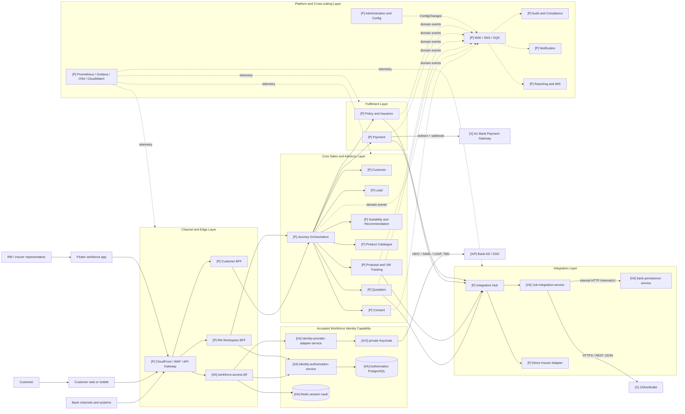

### 2.1 What is operational today

The current repository path is much smaller than the target diagram:

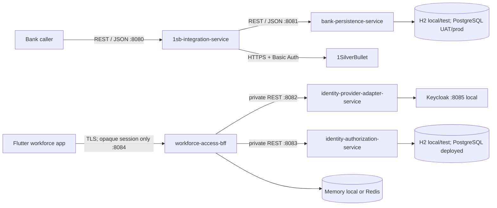

There is no Kafka/MSK event backbone in the current WS-1 topology. Redis idempotency and
multi-instance job ownership for the 1SB adapter are deferred to Phase 5.4. Production EKS,
dashboards, autoscaling, DR testing, and retention jobs remain later-stage work.

---

## 3. Layer 1 — Channel and Edge

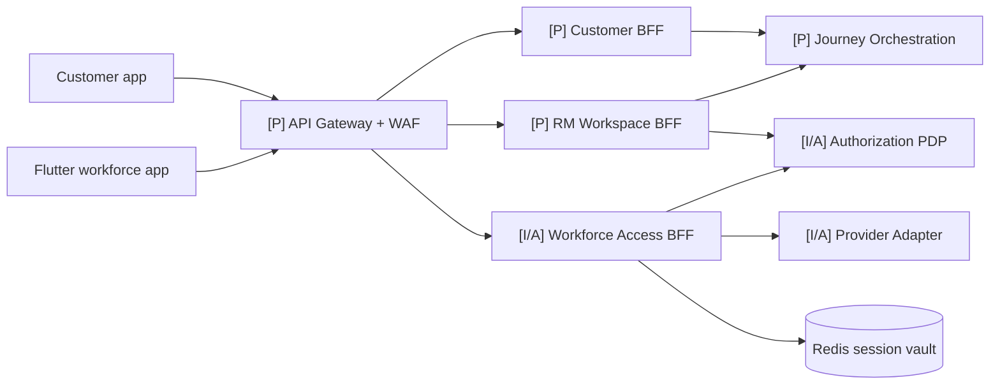

| Component | Status | Responsibility | State/cache | Communication |
|---|---|---|---|---|
| API Gateway + WAF | P | Public routing, throttling, request validation, edge protection | No business state | TLS/HTTPS to BFFs |
| Customer BFF | P | Customer-channel aggregation and response shaping | Stateless; opaque customer session design is not yet approved | Sync REST to Journey and identity capability |
| RM Workspace BFF | P | RM workspace aggregation, portfolio/journey view, first PEP | Stateless in target proposal | Sync REST to Journey, Lead, authorization |
| `workforce-access-bff` | I/A | Login/callback/session/logout, PKCE/state/nonce, token hiding, CSRF, first workforce PEP | Encrypted memory store locally or Redis; pending login 5 min, native completion 1 min, session 8 h | Public `/api/v1/auth/**`; private REST to provider adapter and authorization |

The RM Workspace BFF and `workforce-access-bff` may be one deployable or two. The former owns
workspace aggregation; the latter currently owns only authentication/session seams. Q-01 must
decide whether these responsibilities share a deployable while preserving component separation.

---

## 4. Layer 2 — Core Sales and Advisory

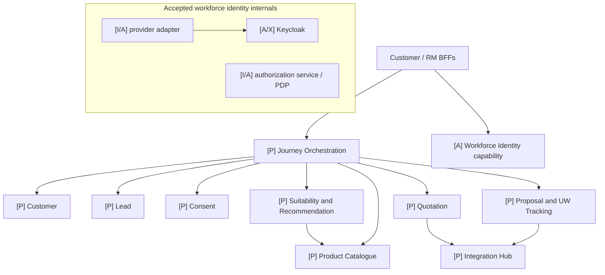

| Service/capability | Status | Owns | Backend and cache | Primary communication |
|---|---|---|---|---|
| Workforce identity capability | A, partially I | Credentials/session ceremonies through Keycloak; business identities, roles, scopes, certification and decisions through authorization service | Dedicated authorization PostgreSQL; separate Keycloak PostgreSQL; Redis BFF sessions | OIDC at auth boundary; private REST for provider and PDP APIs |
| Customer | P | CIF-linked customer profile snapshot; never the core banking master | Aurora PostgreSQL | Sync REST to bank customer/CBS facade and Journey |
| Lead | P | Lead lifecycle, assignment and sharing state | Aurora PostgreSQL | Sync REST to RM BFF/Journey; events for reporting/audit |
| Consent | P | Versioned, immutable consent evidence | Append-only Aurora PostgreSQL | Sync gate from Journey; `ConsentCaptured` event |
| Suitability and Recommendation | P | Assessment inputs, rule version, result and evidence | Aurora PostgreSQL | Sync from Journey; reads Catalogue and Consent |
| Product Catalogue | P | Product, insurer, eligibility and product-rule source of truth | Aurora PostgreSQL + Redis read-through cache | Sync cached reads; `ConfigChanged` invalidation |
| Journey Orchestration | P | Cross-domain journey aggregate, stage, external refs, snapshot and saga coordination | DynamoDB proposed | Sync orchestration; emits `JourneyStageChanged` |
| Quotation | P | Quote job and returned offers; multi-insurer fan-out and partial success | DynamoDB job store + Redis idempotency proposed | Sync 202 acknowledgement and polling; Integration Hub calls; `QuoteCompleted` |
| Proposal and UW Tracking | P | Proposal and long-lived underwriting case/requirements | Aurora PostgreSQL | Sync 202 acknowledgement, async completion/events, Integration Hub calls |

The core services use bank-canonical contracts. No provider DTO or 1SB field may cross the
Integration layer boundary.

---

## 5. Layer 3 — Fulfilment

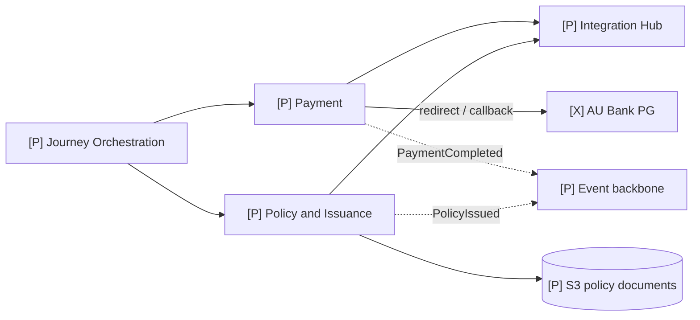

| Service | Status | Responsibility | Backend/cache | Communication |
|---|---|---|---|---|
| Payment | P | Payment attempt/session, bank PG redirect/callback state, payment completion and reconciliation references | Aurora PostgreSQL; Redis idempotency proposed for mutating APIs | Sync session creation; async webhook; `PaymentInitiated`/`PaymentCompleted` events |
| Policy and Issuance | P | Policy reference, issuance lifecycle, retrieval metadata and customer-visible document link | Aurora PostgreSQL + S3 for PDFs | Sync status/read; Integration Hub for provider operations; `PolicyIssued` event |

Payment owns platform payment state but not the bank's financial ledger. AU Bank PG remains the
payment rail and reconciliation authority.

---

## 6. Layer 4 — Integration

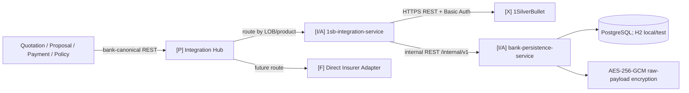

| Component | Status | Responsibility | Backend/cache | Communication |
|---|---|---|---|---|
| Integration Hub | P | Adapter selection and routing policy by LOB/product; no business-domain state | DynamoDB routing configuration only | Sync bank-canonical API to adapters |
| `1sb-integration-service` | I/A | Bank-canonical 1SB API, Term translation, job orchestration, polling, status normalization, payment URL, master/schema lookup | No database; current in-process caches/idempotency; durable technical state through persistence HTTP | Bank-facing REST; internal REST to persistence; HTTPS/Basic Auth to 1SB |
| `bank-persistence-service` | I/A | Current common technical persistence API, Flyway schema, JPA repositories, encrypted raw payload storage | H2 local/test; PostgreSQL UAT/prod; AES-256-GCM raw payloads | Private `/internal/v1/**` REST; JDBC only inside this service |
| Direct Insurer Adapter | F | Future insurer-specific translation behind Integration Hub | Must define its own technical store/archive during approval | Same bank-canonical adapter contract; insurer HTTPS |

The target database-per-service proposal does not permit new business domains to use
`bank-persistence-service` as a generic shared database. Its current scope remains integration
technical state and the present audit-ingestion shortcut until an approved migration says otherwise.

---

## 7. Layer 5 — Platform and Cross-cutting

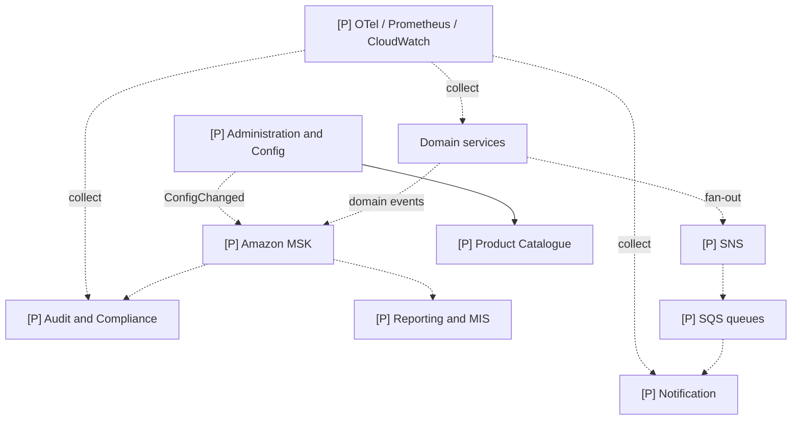

| Service/capability | Status | Responsibility | Backend/cache | Communication |
|---|---|---|---|---|
| Audit and Compliance | P | Immutable application-level audit evidence and regulator/dispute queries | DynamoDB hot append-only store + S3 archive proposed | Consumes domain events; never blocks the primary transaction |
| Notification | P | Template resolution, delivery attempts, retry/backoff, provider result | DynamoDB delivery log | SNS fan-out to SQS; SES/SMS adapter calls |
| Reporting and MIS | P | Event-fed read models, metrics and management reporting | S3 data lake + Athena/Redshift Serverless | Kafka consumption only; never queried by transactional services |
| Administration and Config | P | Versioned product/config/rule administration and feature control | Aurora PostgreSQL; distributed read caches | Sync admin APIs; `ConfigChanged` event |
| Observability platform | P | Metrics, traces, PII-safe logs, alerts and operational evidence | Managed Prometheus/Grafana, OpenTelemetry/X-Ray, CloudWatch | OTLP/metrics/log shipping, out of business request semantics |

The current `LoggingAuditEventPublisher` is not the proposed Audit and Compliance service. The
future `audit-consumer-service` stub also does not select a broker. Kafka/MSK must remain proposed
until the integration-architecture stage admits and approves it.

---

## 8. Implemented service component LLDs

### 8.1 `1sb-integration-service` — port 8080

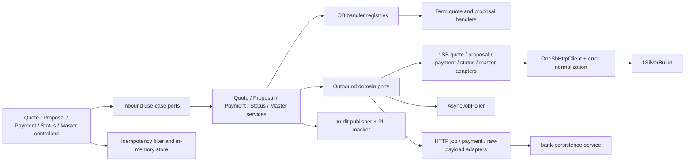

| Component group | Responsibility |
|---|---|
| API controllers and DTOs | Validate and translate HTTP requests/responses; expose `/v1/quotes`, `/v1/proposals`, `/v1/payments`, `/v1/status`, and `/v1/master-data` |
| Application services | Orchestrate use cases; choose LOB handlers; create/read jobs; schedule provider polling; publish audit events |
| Domain models and ports | Bank-canonical commands, models, inbound use cases and outbound dependency contracts; no Spring dependency in domain |
| LOB handlers | Isolate Term mappings and paths; future Health/Motor handlers plug into registries only after their stages admit them |
| 1SB adapters | Own every 1SB-specific request shape, URL, response interpretation and error normalization |
| `OneSbHttpClient` | Shared outbound transport, Basic Auth, timeouts, metrics/audit hook and normalized errors |
| `AsyncJobPoller` | Executes the asynchronous-inside polling flow with exponential backoff; controllers never hold a request thread for the provider lifecycle |
| Persistence HTTP adapters | Implement job, payment-session, and raw-payload ports through `bank-persistence-service`; no shared datasource |
| Idempotency filter/store | Replays responses for repeated mutating requests; currently in-memory and single-instance only |
| Cache components | Master lookup cache and proposal schema cache; currently `ConcurrentHashMap` per process |
| Cross-cutting components | Shared error/security/audit/observability/secrets libraries, PII masking, health/metrics/OpenAPI |

Current bank-facing endpoints:

| Method | Path | Purpose |
|---|---|---|
| `POST` | `/v1/master-data/lookup` | Normalized 1SB master lookup with cache/stale fallback |
| `POST` | `/v1/quotes` | Submit Term quote job |
| `GET` | `/v1/quotes/{jobId}` | Read job and offers |
| `GET` | `/v1/proposals/schema` | Read dynamic proposal schema |
| `POST` | `/v1/proposals` | Submit Term proposal job |
| `GET` | `/v1/proposals/{jobId}` | Read proposal job/result |
| `POST` | `/v1/payments` | Create payment URL/session |
| `GET` | `/v1/status/{applicationNumber}` | Retrieve normalized application status |

Payment intimation, Health/Motor handlers, Redis idempotency, circuit breaker, and production
operability features are not part of the implemented endpoint set above.

### 8.2 `bank-persistence-service` — port 8081

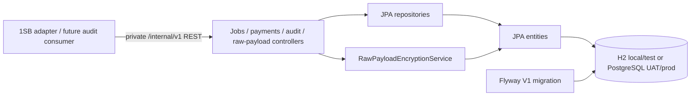

| Component group | Responsibility |
|---|---|
| Internal controllers | CRUD for jobs, offers, poll attempts, payment sessions, audit events and raw payloads |
| DTOs/error handling | Stable internal contract, validation and RFC 7807 not-found responses |
| JPA entities/repositories | Exclusive persistence implementation for six current tables |
| Flyway | Sole owner of schema creation/evolution for the current integration technical store |
| Raw payload encryption | AES-256-GCM encrypt/decrypt, mandatory 32-byte key outside tests, retention metadata default 7 years |
| OpenAPI/Actuator | Internal API discovery and liveness/readiness/metrics |

Current tables: `integration_job`, `integration_job_offer`, `job_poll_attempt`, `raw_payload`,
`audit_event`, and `payment_session`.

### 8.3 Accepted workforce identity implementation — ports 8082–8084

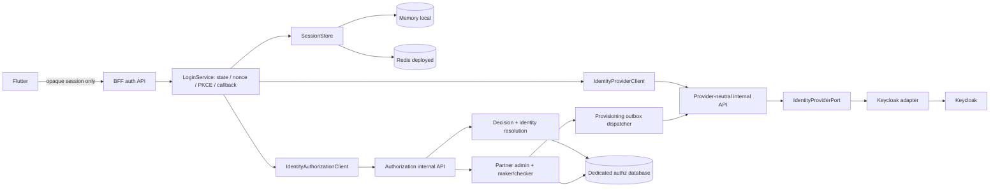

| Deployable | Responsibility | Data/cache | Communication |
|---|---|---|---|
| `workforce-access-bff` | Public auth endpoints, CSRF, login/callback, native completion exchange, session status/logout, provider-token custody | Encrypted in-memory store local; Redis option for deployed sessions | `/api/v1/auth/**` to Flutter; private REST to ports 8082/8083 |
| `identity-provider-adapter-service` | Provider-neutral auth URI, code exchange, refresh/revoke, identity provisioning/status; Keycloak-specific adapter | Stateless | `/internal/v1/auth/**`, `/internal/v1/identities/**`; HTTPS/OIDC to Keycloak |
| `identity-authorization-service` | PDP, identity resolution, partner-user maker/checker, lifecycle, roles/scopes/permissions, provisioning outbox | Dedicated PostgreSQL with Flyway; H2 local/test | `/internal/v1/authorization/decisions`, identity/admin APIs; REST to provider adapter |
| Keycloak | Credential store, MFA/authentication ceremonies, provider sessions and token issuance | Separate Keycloak-managed PostgreSQL | OIDC/SAML/LDAP federation; private admin/API access |

---

## 9. Backend, data ownership, and persistence rules

### 9.1 Implemented backend stack

| Concern | Implemented choice |
|---|---|
| Language/runtime | Java 21; Spring Boot 3.3.4; embedded Tomcat; virtual threads enabled |
| API style | REST/JSON; OpenAPI via springdoc; RFC 7807-style shared error model |
| Internal clients | Spring `RestClient` using JDK HTTP client |
| Relational persistence | Spring Data JPA + Flyway; H2 PostgreSQL mode locally/tests; PostgreSQL UAT/prod |
| Session cache | In-memory by default locally; Redis selectable for workforce BFF |
| Integration caches | Per-process `ConcurrentHashMap` for master/schema/idempotency today |
| Encryption | AES-256-GCM for raw 1SB payloads and BFF token/session vault values |
| Observability | Actuator health/liveness/readiness, metrics/Prometheus exposure, trace/MDC shared library |
| Packaging | Gradle multi-module build, Boot JARs and Dockerfiles |

### 9.2 Proposed target data ownership

| Owning service | Proposed source of truth | Cache/archive | Notes |
|---|---|---|---|
| Workforce BFF | No business data | Redis encrypted session vault | Provider tokens never reach Flutter |
| Identity authorization | Dedicated PostgreSQL | Bounded policy-decision cache only after approval | Keycloak DB remains separate |
| Customer | Aurora PostgreSQL | None initially | CIF is external master; store only approved snapshot/reference |
| Lead | Aurora PostgreSQL | None initially | Own workflow and assignment state |
| Consent | Append-only Aurora PostgreSQL | Immutable archive as required | Exact retention pending Compliance |
| Suitability | Aurora PostgreSQL | Optional rule/reference cache after measurement | Version every assessment/rule result |
| Product Catalogue | Aurora PostgreSQL | Redis read-through | Cache invalidated by version/`ConfigChanged` |
| Journey Orchestration | DynamoDB | Optional bounded read cache only if measured | Single-key journey state |
| Quotation | DynamoDB | Redis idempotency | Short-lived, high-churn job/offer state |
| Proposal and UW | Aurora PostgreSQL | None initially | Long-lived relational case |
| Payment | Aurora PostgreSQL | Redis idempotency only | Financial state remains ACID |
| Policy and Issuance | Aurora PostgreSQL | S3 policy PDFs | DB stores metadata/key, not binaries |
| Integration Hub | DynamoDB routing configuration | Local bounded config cache | No business payload storage |
| 1SB adapter technical store | Current `bank-persistence-service` PostgreSQL | Proposed S3 raw-payload archive | Any move requires a migration plan and approval |
| Audit and Compliance | Proposed DynamoDB hot store | S3 immutable archive | Replaces current shortcut only after migration approval |
| Notification | DynamoDB delivery log | Template cache may be added with evidence | TTL-friendly delivery records |
| Reporting and MIS | S3 data lake + Athena/Redshift | Derived read models | Never an OLTP source of truth |
| Administration and Config | Aurora PostgreSQL | Redis/distributed read cache | Versioned config; publishes invalidation |

### 9.3 Database ownership rules

- One service owns each target business write model and its migration history.
- No service reads another service's schema directly.
- Cross-service reads use the owning API or an event-fed read model.
- `bank-persistence-service` is an approved current exception for integration technical state and
  audit ingestion; it is not a template for all future domain services.
- Schema/database changes require an approved work item, migration/rollback plan, and relevant
  Architecture, Technical, Security and Risk reviews.
- Raw payload or PII migrations automatically require human Security and Risk/Compliance review.

---

## 10. Caching and ephemeral-state design

| Use case | Current mechanism | Current TTL/behaviour | Proposed evolution | Consistency/invalidation rule |
|---|---|---|---|---|
| 1SB master lookup | In-process map | 14,400 s (4 h); stale value may be returned on 1SB failure | Redis only at Phase 5.4/scale-out if re-triaged | Key includes LOB and entity IDs; response signals hit/stale |
| 1SB proposal schema | In-process map | 3,600 s (1 h) | Redis at multi-instance stage | Key = LOB/product/manufacturer/version; TTL expiry |
| 1SB mutating idempotency | In-process map | Process lifetime; single-instance correctness only | Redis, 24 h target proposal | Hash request body; same key/different body must conflict |
| Workforce pending login | Encrypted memory or Redis | 5 min | Redis in deployed multi-instance environment | One-time `take`; state/nonce/PKCE bound together |
| Native completion code | Encrypted memory or Redis | 1 min | Redis | One-time `take`; never reusable |
| Workforce session | Encrypted memory or Redis | 8 h current config; policy to become role/risk based | Redis with KMS-managed encryption key | Logout/delete, token rotation and policy-version invalidation |
| Authorization decisions | No implemented distributed cache | N/A | Only narrowly defined read decisions within policy TTL | Disable/scope/permission changes increment `policy_version` and invalidate |
| Product catalogue | Not implemented | N/A | Redis read-through in target | Versioned keys plus `ConfigChanged` invalidation |
| Integration routing/config | Not implemented | N/A | DynamoDB source + bounded local/Redis cache | Versioned routing policy; invalidate on approved config change |

Cache rules:

1. A cache never becomes the system of record.
2. PII, credentials, access tokens, and refresh tokens are encrypted before entering Redis.
3. Cache keys contain identifiers or hashes, not PII.
4. Every entry has an owner, key structure, TTL, maximum size/eviction policy, and invalidation
   trigger before implementation approval.
5. Fail-open is allowed only for explicitly approved stale reads. Authentication and sensitive
   authorization writes fail closed.
6. Redis is not introduced into the WS-1 adapter before the parked Phase 5.4 item is re-triaged.

---

## 11. Communication design

### 11.1 Media and ownership

| Medium | Status | Use | Contract and failure rule |
|---|---|---|---|
| Public HTTPS REST/JSON | I for current APIs; P for target BFF edge | User/channel request-response | OpenAPI versioning, validation, idempotency on mutations, bounded timeout |
| Private HTTPS REST/JSON | I | BFF→identity services; 1SB adapter→persistence | `/internal/v1`; private network/service authentication required in deployed environments |
| OIDC authorization code + PKCE | A/I | Workforce login through BFF/provider adapter/Keycloak | Tokens terminate in the BFF; Flutter receives only opaque session material |
| OIDC/SAML/LDAP federation | F/open decision | Keycloak to bank AD/SSO | Adapter/federation detail must not change BFF or authz contracts |
| HTTPS + Basic Auth | I | 1SB adapter to 1SilverBullet | Secrets provider, connect/read timeouts, normalized errors, whitelisted egress |
| JDBC | I, owner-local only | Persistence and authz services to their own databases | Never cross a service boundary |
| Kafka/MSK | P | Durable cross-domain events and replayable side effects | At-least-once; schema/version, partition key, idempotent consumer and DLQ/recovery required |
| SNS + SQS | P | Fan-out and point-to-point tasks, especially notifications | Subscriber isolation, retry/backoff, DLQ and replay runbook |
| Webhook/callback | P | AU Bank PG/provider completion | Signature/authentication, replay prevention, idempotency and audit correlation |
| OTLP/Prometheus/log shipping | P, basic metrics I | Telemetry | PII-safe structured data; telemetry failure must not alter business result |

### 11.2 Synchronous vs asynchronous rule

- Use synchronous communication when a person is waiting for the result in the same screen action.
- Use a synchronous acknowledgement plus asynchronous processing for long-running insurer work.
- Use asynchronous events for completed-step side effects: audit, notification, reporting and
  reconciliation.
- Never hold an HTTP request open while polling 1SB or an insurer.
- A side-effect consumer is idempotent because delivery is at least once.
- Each sync dependency has a timeout, normalized error, retry decision, correlation ID and
  documented degraded mode. Retries are never added automatically to non-idempotent operations.

### 11.3 Initial proposed domain events

| Event | Producer | Consumers | Required correlation |
|---|---|---|---|
| `ConsentCaptured` | Consent | Journey, Audit | journey, actor, consent version, trace |
| `SuitabilityCompleted` | Suitability | Journey, Audit | journey, assessment/rule version, actor, trace |
| `QuoteCompleted` | Quotation | Journey, Audit | journey, quote job, LOB, trace |
| `ProposalSubmitted` / `ProposalStatusChanged` | Proposal | Journey, Audit, Notification | journey, proposal/application ref, actor, trace |
| `PaymentInitiated` / `PaymentCompleted` | Payment | Journey, Audit, Notification, Reporting | journey, payment ref, trace; no card/credential data |
| `PolicyIssued` | Policy | Journey, Audit, Notification, Reporting | journey, policy ref, trace |
| `JourneyStageChanged` | Journey | Audit, Reporting | journey, previous/new stage, actor, trace |
| `ConfigChanged` | Administration | Affected services | config type, version, effective time, trace |

This is a proposed event catalogue. Topic names, schemas, partitions, retention, replay, DLQs and
ownership must be approved in a separate integration-architecture work item before MSK is built.

---

## 12. Deployment, security, resilience, and operations

### 12.1 Proposed deployment topology

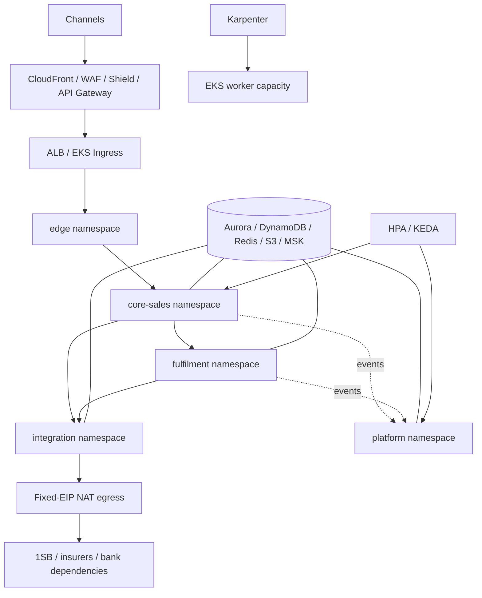

The proposed production platform uses one EKS cluster per environment, private subnets across
three availability zones, namespace-per-layer, NetworkPolicy, service identity/mTLS, HPA/KEDA,
Karpenter and PodDisruptionBudgets. This production topology is a T4 approval subject and is not
implemented by this document.

### 12.2 Security responsibilities

| Boundary | Required control |
|---|---|
| Public edge | WAF/Shield, TLS, throttling, input validation, generic authentication errors |
| Browser/native app | HttpOnly secure cookie for browser or opaque native handle; CSRF and origin validation; no OAuth tokens |
| Service-to-service | Private networking, workload identity, mTLS/service authentication, least-privilege NetworkPolicy |
| Provider access | Secrets Manager, rotation, fixed egress, timeouts, no secret or raw token logs |
| Authorization | Default deny; RBAC + ABAC + relationship policy; BFF and domain-service PEPs; maker-checker for privileged/bulk changes |
| Data at rest | KMS/customer-managed keys by sensitivity; AES-256-GCM current raw-payload/session encryption |
| Audit | Immutable, correlated, PII-minimized application evidence plus CloudTrail/Config infrastructure evidence |

### 12.3 Target operational requirements

- Critical customer path availability target: 99.9% monthly; advisory/read-heavy target 99.5%+.
- Proposed p99 targets: BFF reads under 400 ms, quote ack under 800 ms, quote poll under 300 ms,
  proposal ack under 1.5 s, payment session under 3 s, status/policy under 2 s.
- Proposed core DR targets: RTO at most 1 hour and RPO at most 5 minutes; compliance and Ops must
  validate these before approval.
- Each service needs liveness/readiness, metrics, tracing, alert rules, capacity policy, runbook,
  dependency dashboard, backup/restore evidence and rollback steps appropriate to its stage.
- Current WS-1 dashboards, alerting, autoscaling, DR drills, and retention jobs remain Phase 6 work;
  they are documented here as target outcomes, not prematurely admitted implementation.

---

## 13. Decisions required before baseline approval

| ID | Decision required | Current evidence/default | Required approvers |
|---|---|---|---|
| Q-01 | Is `workforce-access-bff` the auth component inside RM Workspace BFF, or a separate deployable? Resolve whether the accepted identity decomposition contributes one or two net-new boxes. | Accepted three-service identity SSOT; older 19-box catalogue | Architect, Product, Security |
| Q-02 | Approve AWS-only EKS target and per-environment cluster/account layout. | `ARCH-001`, `ARCH-002` proposed | Architect, Technical Head, Ops, Security |
| Q-03 | Approve database-per-service for new business domains, confirm `bank-persistence-service` remains a separately counted integration-technical deployable, and define its target scope. | `ARCH-004` proposed; current separate persistence boundary is authoritative | Architect, Technical Head, Data/DBA, Ops |
| Q-04 | Approve MSK/SNS/SQS roles and the event-governance standard. | `ARCH-007` proposed; Kafka explicitly out of current WS-1 scope | Architect, Technical Head, Ops, Security |
| Q-05 | Choose the evolution path from current audit rows in common persistence to the proposed Audit and Compliance store. | Current HTTP audit API + future consumer stub; target DynamoDB/S3 proposal | Architect, Compliance, Security, Data/DBA |
| Q-06 | Confirm India regions, data residency, PII/audit/raw-payload retention and Object Lock requirements. | Mumbai/Hyderabad and 7-year default are assumptions | Compliance, Security, Architect |
| Q-07 | Confirm Customer BFF versus workforce/RM BFF boundaries and customer-identity phase. | Workforce identity accepted; retail customer identity deferred | Product, Architect, Security |
| Q-08 | Select Istio versus another supported service-mesh approach, or approve no mesh initially. | Istio/App Mesh expressed as alternatives | Architect, Ops, Security |
| Q-09 | Select CI/CD implementation (GitHub Actions or CodePipeline/CodeBuild) and GitOps tool. | ECR + Argo CD proposed; runner choice open | Technical Head, Ops, Security |
| Q-10 | Ratify availability, latency, RTO/RPO and cost/capacity assumptions. | Architecture-review NFR targets | Product, Architect, QA, Ops |

No proposed item above becomes implementation-ready through this document. Each approved answer
must be recorded in the architecture decision log or an ADR/change request as required.

---

## 14. Approval and controlled evolution

### 14.1 Document lifecycle

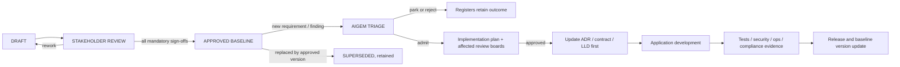

### 14.2 Approval record

Blank signatures mean the document remains a draft.

| Role | Name | Decision | Date | Conditions/evidence |
|---|---|---|---|---|
| Product Owner |  | Pending |  | Business scope, journeys and service outcomes |
| Solution Architect |  | Pending |  | Boundaries, coupling, decisions and target count |
| Technical Head |  | Pending |  | Feasibility, build sequence and engineering standards |
| Security Architect |  | Pending |  | Trust boundaries, identity, secrets, crypto and attack surface |
| Risk & Compliance |  | Pending |  | Consent, audit, retention, residency and regulatory evidence |
| QA Lead |  | Pending |  | Testability, NFR evidence, contract and quality gates |
| DevOps/SRE |  | Pending |  | Deployability, operability, observability, scaling, DR and rollback |

Approval rules:

1. Conditional approval records each condition as an acceptance criterion with an owner and due
   stage.
2. Silence is not approval.
3. Security and Risk/Compliance sign-offs are human for T4 subjects.
4. Proposed `ARCH-*` entries change status only in the architecture decision log; diagrams follow
   the decision log, never the reverse.
5. Stage state is changed only through the governance stage-gate process.

### 14.3 How future changes enter this baseline

| Change | Required route before editing/building |
|---|---|
| Spelling/link/explanation with no semantic change | DOC work item; author + reviewer; patch version |
| Service responsibility or boundary | ARCH work item + Architecture/Technical review + ADR/log update |
| Public/internal API or event contract | ARCH/FUNC work item; consumer impact, compatibility and contract tests |
| Database ownership/schema/migration | ARCH/MIGRATION; migration, rollback, data-validation and Ops review |
| Cache technology, key, TTL or fail-open policy | NFR/ARCH; evidence, correctness analysis, Security if sensitive data |
| Broker/topic/queue introduction | ARCH/INFRA; Architecture, Ops, Security and event-governance approval |
| Authentication/authorization/session/secret/crypto change | SEC, automatically T4; human Security review |
| Consent/audit/retention/residency change | COMP, automatically T4; human Risk/Compliance and Security review |
| Production topology, region, DR or breaking contract | T4 change request and mandatory human sign-offs |

For every admitted semantic change:

1. Run the governance freshness check and triage the input.
2. Record the decision/ADR and affected consumers.
3. Update this LLD and its diagrams **before** implementation.
4. Increment the version: patch for editorial, minor for backward-compatible design addition,
   major for a boundary/topology/contract break.
5. Re-run affected review boards and record approval evidence.
6. Implement only after Definition of Ready passes.
7. Attach tests, operational evidence and any migration result before closing the work item.
8. Retain superseded versions/decisions; do not erase architectural history.

### 14.4 Version history

| Version | Date | Status | Change | Origin |
|---|---|---|---|---|
| 0.1 | 2026-08-12 | Draft | Initial stakeholder LLD consolidation | `SUG-20260812-lld` / `DOC-005` |

---

## 15. Traceability and detailed sources

| Topic | Authoritative or detailed source |
|---|---|
| Business scope and decisions | [Business working decisions](../../au-bank-insurance-platform/07-BUSINESS-CLARIFICATIONS-WORKING-DECISIONS.md) and [decision log](../../au-bank-insurance-platform/DECISION-LOG.md) |
| Target service decomposition | [02 — Target microservices architecture](./02-target-microservices-architecture.md) |
| Sync/async and event proposal | [03 — Communication patterns](./03-communication-patterns.md) |
| AWS/EKS proposal | [04 — AWS infrastructure](./04-aws-infrastructure-architecture.md) |
| Target data ownership | [05 — Data architecture](./05-data-architecture.md) |
| Security, compliance and NFRs | [06 — Security, compliance and NFRs](./06-security-compliance-and-nfrs.md) |
| Architecture decision status | [08 — Architecture decision log](./08-architecture-decision-log.md) |
| Accepted workforce identity | [Workforce authentication and authorization SSOT](../authentication-authorization/README.md) |
| Implemented 1SB adapter | [1SB integration service architecture](../../1sb-insurance-integration/architecture/1sb-integration-service-architecture.md) |
| Current common persistence | [Bank persistence service contract](../../1sb-insurance-integration/architecture/bank-persistence-service.md) |
| Current implementation truth | `services/*/src/main`, service `README.md` files and runtime configuration |
| Governance and future changes | [AIGEM governance](../../governance/README.md) |

If this baseline conflicts with a higher-precedence SSOT or implemented accepted contract, mark
the conflict, stop implementation, and route it through change control. Do not silently choose the
diagram because it is easier to read.
