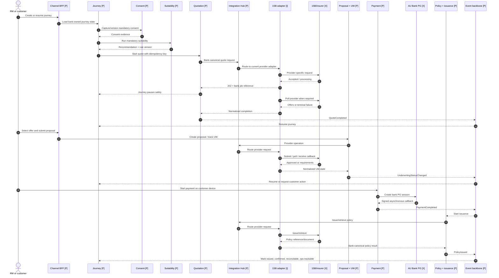
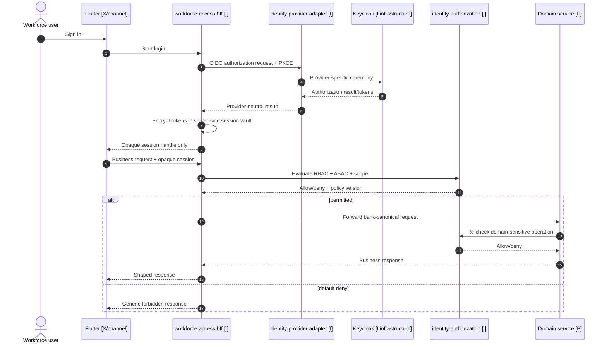
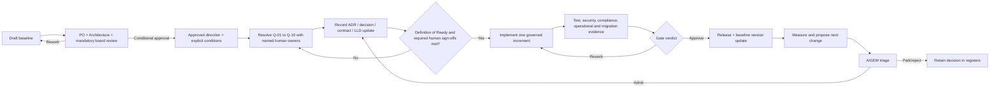

# CTO approval workflows — target insurance distribution platform

| Field | Value |
|---|---|
| Document ID | `DOC-007` |
| Version | `0.1` |
| Status | **DRAFT — PRESENTATION AID; NOT AN APPROVED BUILD MANDATE** |
| Date | 2026-08-12 |
| Governing baseline | [DOC-005 stakeholder LLD](./09-stakeholder-lld-approval-baseline.md) |
| Intended use | Editable Mermaid source for the CTO architecture-approval presentation |

These diagrams simplify the governed LLD for presentation. If a label or relationship conflicts
with DOC-005 or a higher-precedence SSOT, DOC-005/SSOT wins and the presentation must be corrected.

## Status and connector legend

- `[I]` implemented now; `[A]` accepted design; `[P]` proposed target; `[F]` future; `[X]` external.
- Solid arrow: synchronous request/response or user action.
- Dashed arrow: event, callback, polling completion, or other asynchronous interaction.
- Red gate: mandatory compliance/security/business control.

## 1. Complete target-state insurance lifecycle

```mermaid
flowchart LR
    classDef implemented fill:#d9f2e6,stroke:#16794f,color:#10231c
    classDef accepted fill:#dcecff,stroke:#2864a8,color:#10233b
    classDef proposed fill:#fff1c7,stroke:#a66a00,color:#382400
    classDef external fill:#eeeeee,stroke:#666666,color:#222222
    classDef gate fill:#ffe0e0,stroke:#b42318,color:#4a0a06
    classDef terminal fill:#c9f2d8,stroke:#137a3d,color:#083b20

    subgraph CH[Channels and edge]
      RM[RM workspace [P]]:::proposed
      CU[Customer app/web [P]]:::proposed
      EDGE[API Gateway + WAF [P]]:::proposed
      BFF[Customer / RM BFF boundary [P]\nQ-01 and Q-07 open]:::proposed
    end

    subgraph ID[Identity and authorization]
      LOGIN[Workforce access BFF [I]]:::implemented
      IDP[IdP adapter [I]]:::implemented
      AUTHZ[Authorization PDP [I]]:::implemented
      KC[Keycloak [I infrastructure]]:::implemented
    end

    subgraph CORE[Bank-owned sales and advisory]
      CUST[Customer [P]]:::proposed
      LEAD[Lead [P]]:::proposed
      JOURNEY[Journey orchestration [P]]:::proposed
      CONSENT{Consent valid? [P]}:::gate
      SUIT{Suitability passed? [P]}:::gate
      CAT[Catalogue [P]]:::proposed
      QUOTE[Quotation [P]]:::proposed
      PROP[Proposal + UW [P]]:::proposed
    end

    subgraph FULL[Fulfilment]
      PAY[Payment [P]]:::proposed
      POLICY[Policy + issuance [P]]:::proposed
      SOLD[Sold = issued + bank confirmed\n+ reconcilable + ops-trackable]:::terminal
    end

    subgraph INT[Integration]
      HUB[Integration Hub [P]]:::proposed
      ONE[1SB adapter [I]]:::implemented
      PERSIST[Bank persistence [I]\nintegration technical state]:::implemented
      DIRECT[Direct insurer adapter [F]]:::proposed
    end

    subgraph EXT[External systems]
      BANK[Bank customer/CBS facade [X]]:::external
      PG[AU Bank payment gateway [X]]:::external
      AGG[1SilverBullet [X]]:::external
      INS[Insurers / redirect destinations [X]]:::external
    end

    subgraph CROSS[Asynchronous cross-cutting capabilities]
      AUDIT[Audit + compliance [P]]:::proposed
      NOTIFY[Notification [P]]:::proposed
      REPORT[Reporting + MIS [P]]:::proposed
      EVENT[MSK / SNS / SQS roles [P]\nQ-04 open]:::proposed
    end

    RM --> EDGE --> BFF
    CU --> EDGE
    BFF --> LOGIN --> IDP --> KC
    BFF --> AUTHZ
    BFF --> CUST --> BANK
    CUST --> LEAD --> JOURNEY --> CONSENT --> SUIT --> CAT --> QUOTE
    QUOTE --> HUB --> ONE --> AGG --> INS
    HUB --> DIRECT --> INS
    ONE --> PERSIST
    QUOTE -. quote completed .-> JOURNEY
    JOURNEY --> PROP --> HUB
    PROP -. UW callback or poll .-> JOURNEY
    JOURNEY --> PAY --> PG
    PG -. signed callback .-> PAY
    PAY -. payment completed .-> JOURNEY
    JOURNEY --> POLICY --> HUB
    POLICY -. issuance completed .-> SOLD
    JOURNEY -. domain events .-> EVENT
    EVENT -.-> AUDIT
    EVENT -.-> NOTIFY
    EVENT -.-> REPORT
```

The Group B path stops at bank-owned recommendation/audit and redirects to the external insurer;
the Group A path continues through quote, proposal, payment, issuance and the bank's sold definition.

## 2. Quote-to-policy workflow with pause and resume



## 3. Workforce login and authorization workflow



## 4. Payment, callback, reconciliation and issuance workflow

```mermaid
flowchart LR
    START[Customer selects approved proposal] --> SESSION[Payment service creates attempt + idempotency record [P]]
    SESSION --> REDIRECT[Redirect customer device to AU Bank PG [X]]
    REDIRECT --> RESULT{Signed callback valid and not replayed?}
    RESULT -->|No| HOLD[Reject + audit + operations investigation]
    RESULT -->|Yes, failed| RETRY[Persist failure; allow governed retry/resume]
    RESULT -->|Yes, paid| PAID[Persist payment completion]
    PAID -. PaymentCompleted .-> ISSUE[Policy + issuance starts provider operation [P]]
    ISSUE --> WAIT[Pause while provider processes]
    WAIT -. callback or poll .-> DONE{Issued?}
    DONE -->|No / timeout| OPS[Operations task + reconciliation exception]
    DONE -->|Yes| CONFIRM[Record policy + document metadata; confirm to bank]
    CONFIRM --> RECON[Reconciliation reference available]
    RECON --> SOLD[Sold: issued + confirmed + reconcilable + ops-trackable]
    SESSION -.-> AUDIT[Immutable correlated audit evidence [P]]
    RESULT -.-> AUDIT
    DONE -.-> AUDIT
    SOLD -.-> NOTIFY[Notify customer/RM [P]]
    SOLD -.-> MIS[Reporting/MIS read model [P]]
```

## 5. Approval and controlled architecture evolution



Approval of this presentation establishes a direction and decision backlog. It does not change any
`[P]` component to `[A]` or `[I]`; that requires the human decisions and governance route recorded
in DOC-005.
