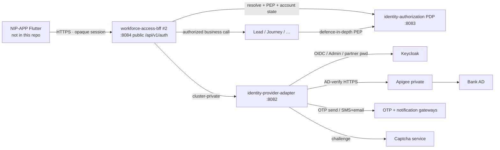

# 20 — Authentication & authorization module HLD (Login BRD, R0)

**Status:** `AI-DRAFTED` · T3 · human Board 1 / 3 / 4 / 6 signatures outstanding  
**Origin:** `SUG-20261005-amp` · `EPIC-006` · `ARCH-030` · `PLAN-009`  
**Authority:** Architecture design pack. Behaviour SSOT for screens remains the Login BRD (`DOC-005`). Invariants remain [`README.md`](./README.md). Keycloak-collapse answer remains [`AUTHN-AUTHZ-LLD.md`](./AUTHN-AUTHZ-LLD.md) (`ADR-022`). Public BFF edge already published is [`workforce-access-bff.openapi.yaml`](./workforce-access-bff.openapi.yaml) (`ARCH-029`).  
**Persona:** Mahesh (R2) — structure and contracts only. Security outcome is Deepali (`R8`). Does not rewrite Product semantics or claim T4.

---

## 1. What this pack is

Design the **Login, Authentication and Account Recovery** module from
[`Login_Module_BRD_Detailed_CONTEXT.md`](../../au-bank-insurance-platform/requirements/brd-detailed/Login_Module_BRD_Detailed_CONTEXT.md),
without treating the request as a greenfield rewrite of already-admitted artefacts.

| Artefact | Role in this pack |
|---|---|
| Login BRD (DOC-005) | Business behaviour SSOT for the module |
| Auth SSOT README | Ratified deployables, token-hiding, four identity planes, one PDP |
| `AUTHN-AUTHZ-LLD` + `ADR-022` | Why adapter + PDP stay; GATE-IAM-P1 slices |
| UC-01 | Current OIDC / token-hiding hop list — **amended** by BRD OTP (see §7) |
| Figma login strip | Layout only (`D-012`). Forgot Password / mPIN are **not** requirements |
| **This HLD + sequences + API + algorithms** | BRD→architecture map for login, OTP, lock, Unlock User, partner password |

**Not from scratch.** `ARCH-029` / `ADR-022` stay. This pack adds the **Login BRD field catalogue** (Captcha, OTP, lock, Unlock User, partner password) onto those boundaries.

---

## 2. Governing outcomes (from BRD §2–§3, platform-aligned)

1. Bank RM authenticates with Employee ID + **bank-system** password; the platform never creates, stores or resets that password (`BR-LOGIN-001/002`, `KBR-01/07`).
2. Insurance Partner RM authenticates with Corporate Email ID + **platform-managed** password (`BR-LOGIN-004`, `KBR-02`).
3. Every successful credential check requires a six-digit OTP sent to **both** registered mobile and email before a dashboard session exists (`BR-LOGIN-003/006`, `KBR-03`, `SEC-006`).
4. Three consecutive wrong passwords lock the account; 30 days without login also requires Unlock User (`BR-LOGIN-007/009`, `KBR-04/05`).
5. Unlock User is the **only** recovery function on the login page (`KBR-06/13`). Outcomes differ by actor and account condition (BRD §7.7).
6. Partner first-time / forgotten / expired password is created through Unlock User; no temporary password; 60-day expiry; 8–20 complexity (`BR-LOGIN-005`, `BR-PWD-*`, `KBR-08/09/11/12`).
7. Audit every authentication and recovery event **without** password or OTP values (`KBR-14`, `SEC-002`).
8. Flutter never receives OAuth tokens; Keycloak is never business-authorization SoT (standing constraints).

---

## 3. Boundaries

| Context | Owns | Must not own |
|---|---|---|
| **NIP BFF** | Token-hiding session, CSRF, public REST shaping, pending-OTP upgrade, Unlock User chrome APIs | Bank password storage; Keycloak admin; business grants; Flutter tokens |
| **Provider adapter** | Provider-neutral OIDC, AD-verify hop, partner credential actions, Captcha/OTP orchestration | Business authorization; public exposure; being a second IdP |
| **PDP** | Business identity, lifecycle (incl. platform lock), certification, grants, `policyVersion` | Passwords, OTP values, OIDC tokens |
| **Keycloak** | Partner credentials, IdP ceremony, token issue | Bank AD master; business authz; Unlock outcome matrix |
| **Bank AD** | Workforce employment and bank password (`TI-01`) | Partners; platform lock overlay unless IT confirms |
| **OTP / Captcha / SMS / Email** | Challenge generation and delivery | Account lock; session minting |

Standing constraints that apply: Flutter never talks to Keycloak/Apigee/AD; Flutter never sees OAuth tokens; no PII in logs; no LDAP from EKS (`ADR-020`); adapter + PDP stay (`ADR-022`).

---

## 4. R0 cut — BRD §4.1 mapped

| BRD in-scope item | R0 design posture | Authority |
|---|---|---|
| Bank RM login via Employee ID + bank password | **IN** — credential *verification* via AD-verify (Apigee). **Host of the password field** is `OPEN-AUTH-CEREMONY` (`ID-11`) | `ADR-020`; Login BRD `BR-LOGIN-001` |
| Partner login via Corporate Email + platform password | **IN** — credential verification at partner IdP (Keycloak). Same ceremony OPEN | `ARCH-018`; `BR-LOGIN-004` |
| Captcha validation | **IN** algorithm + private/public challenge APIs. Product/complexity `OPEN-AUTH-CAPTCHA` | `SEC-010`; BRD §7.1 |
| OTP on every login (mobile **and** email) | **IN** as **platform OTP**. IdP MFA may be *additional* (`OPEN-AUTH-MFA-STEPUP`), not a substitute for KBR-10 | `BR-LOGIN-003/006`; `KBR-03/10` |
| Lock after 3 wrong passwords | **IN** algorithm. Bank RM reflection into AD `OPEN-AUTH-BANK-LOCK` | `BR-LOGIN-007/008` |
| Lock after 30 days inactivity | **IN** algorithm (last-successful-login timestamp on business identity) | `BR-LOGIN-009` |
| Unlock User for both types | **IN** — platform journey (BFF + adapter + PDP + OTP). Not a Keycloak admin screen | BRD §7.6–§7.7 |
| Partner first-time / forgot / expired password via Unlock | **IN** — after unlock OTP; Keycloak `UPDATE_PASSWORD` / adapter set-password. No temp password | `BR-LOGIN-005`; `BR-PWD-001/002` |
| Partner password 8–20 + 60-day expiry | **IN** algorithm `ALG-PWD-POLICY` | BRD §7.8 |
| Audit + user-facing errors | **IN** — VAL-001…022 mapped to problem+json; no secret in logs | BRD §8, §10 |
| Get Help / Unlock guide | **IN** as BFF content resources; payload `OPEN-AUTH-HELP` (IT) | BRD §4.1 |
| Successful login → role dashboard | **IN** session + `userType` route hint. Exact dashboard IA `OPEN-AUTH-DASHBOARD` | `SEC-006`; BRD §4.2 out for dashboard *functionality* |

| Explicitly out | Why |
|---|---|
| Bank RM password create / reset / change in this platform | BRD §4.2; `BR-LOGIN-002` |
| Separate Forgot Password for either type | BRD §4.2; `KBR-13`; Figma filename is not SSOT |
| User onboarding / user-master create | BRD §4.2; partner create is PDP maker-checker (`ARCH-022`) |
| Maintenance of registered mobile / email | BRD §4.2 |
| Bank enterprise auth policy definition | BRD §4.2 |
| Admin of Captcha / SMS / email gateways | BRD §4.2 |
| Dashboard after login (widgets, pipeline) | BRD §4.2; Lead pack owns pipeline |
| mPIN | Not in Login BRD; Figma concept (`D-012`) |
| Password field on public BFF **login** | `ID-11` / `OPEN-AUTH-CEREMONY` — do not add until Deepali + Mahesh close it |
| Retail-customer / DIY login | BOOT out of scope |
| Collapsing adapter or PDP into Keycloak | `ADR-022` |

---

## 5. Session states (BRD `SEC-006` vs current UC-01)

| State | Meaning | Client holds |
|---|---|---|
| `UNAUTHENTICATED` | No session | CSRF only |
| `PENDING_LOGIN` | PKCE `state` minted (option A) | Nothing secret |
| `PENDING_OTP` | Credentials succeeded; OTP session live | Opaque pending handle / cookie — **not** a dashboard session |
| `AUTHENTICATED` | OTP verified; `SEC-006` session | HttpOnly cookie or native handle. No OAuth tokens |
| `PENDING_UNLOCK` | Unlock OTP live | Unlock session id only |
| `UNLOCK_PASSWORD` | Partner must set password | Unlock session id (password set, then return to login — **not** auto-login, `BR-PWD-002`) |

**UC-01 delta (named, not silent):** UC-01 §4 B10 currently mints an authenticated session at callback. Login BRD requires OTP **before** dashboard (`AC-001/002/015`, `SEC-006`). This pack amends the hop: callback (or credential success) yields `PENDING_OTP`; `ALG-OTP-VERIFY` success is what creates `AUTHENTICATED`. Runtime Java still implements the old hop until a GATE-IAM-P1 slice lands. This document does not change code.

---

## 6. Actor authentication model (BRD §5)

| Concern | Bank RM | Insurance Partner RM |
|---|---|---|
| Identifier | Employee ID | Corporate Email ID |
| Password SoR | Bank AD (never stored here) | Partner IdP (Keycloak). Platform policy + expiry live on business identity |
| Password reset in platform | Forbidden | Unlock User only |
| First-time password | N/A | Unlock User; no temp password |
| Expiry | Bank policy | 60 days (platform) |
| OTP every login | Mandatory, platform | Mandatory, platform |
| Unlock User | Removes platform (and, if IT agrees, AD) lock; password unchanged | Unlock and/or create/reset password per §7.7 matrix |

---

## 7. Open conflicts (must not be silently resolved)

| ID | Conflict | Owner | Design until closed |
|---|---|---|---|
| **OPEN-AUTH-CEREMONY** (`ID-11`) | Where does NIP-APP collect Employee ID / email + password + Captcha without sending OAuth tokens to the client? **A** = IdP/Fireframe chrome (current UC-01). **B** = BFF credential-step calling AD-verify / partner IdP. | Deepali + Mahesh (`A3_JOINT_REVIEW`) | Keep `POST /api/v1/auth/login` as authorization-URI only. **Do not** add a login-password body. Algorithms stay host-agnostic |
| **OPEN-AUTH-MFA-STEPUP** | Does Infosec also require IdP MFA on top of platform OTP? | Deepali / InfoSec | Platform OTP is **IN** (KBR-10 cannot be expressed as generic IdP OTP). Extra MFA is additive, not a substitute |
| **OPEN-AUTH-CAPTCHA** | Captcha product, case-sensitivity, expiry, complexity | InfoSec (`SEC-010`) | Challenge/verify API exists; rules follow the chosen service |
| **OPEN-AUTH-SESSION** | Idle / absolute timeout and concurrent-session rules | InfoSec (`SEC-009`) | Vault + cookie exist; numeric limits not invented here |
| **OPEN-AUTH-BANK-LOCK** | Bank RM 3-fail / 30-day lock: platform overlay only, or AD must reflect lock? | IT + Deepali | Platform records lock and blocks login; AD write-back is a seam, not assumed |
| **OPEN-AUTH-HELP** | Support contact copy and Unlock PDF | IT | BFF resources return 503/`VAL-022` until content is supplied |
| **OPEN-AUTH-DASHBOARD** | Exact post-login route per role | Rajal | BFF returns `userType` + allow-listed `returnUri`; Flutter chooses the shell |

Do **not** pick A or B in this pack. [`LOGIN-BFF-FIGMA-EVALUATION.md`](../../au-bank-insurance-platform/requirements/LOGIN-BFF-FIGMA-EVALUATION.md) §4 already forbids assuming either.

---

## 8. Integration map (BRD §11 → platform)

| BRD integration | Platform seam |
|---|---|
| Bank Authentication Service | Adapter → Apigee private → existing AD-verify API (`ADR-020`) |
| Partner User Master / Authentication | PDP business identity + Keycloak credentials via adapter |
| User Profile / Contact | Business identity contact refs; UI gets **masked** mobile/email only (`SEC-003`) |
| OTP Service | Adapter-orchestrated platform OTP (10 min / 5 tries / 2 min / 3 resends) |
| SMS / Email gateway | Notification / OTP delivery; delivery status back; never log OTP |
| Captcha Service | Adapter-orchestrated challenge; BFF exposes issue/verify |
| Audit / Logging | Audit #16; `SEC-002` forbid-list |
| Support / Unlock guide | Content repository; `OPEN-AUTH-HELP` |

---

## 9. Security & compliance posture (design only)

- Token-hiding BFF; no OAuth tokens on the device (standing constraint).
- Passwords and OTPs never in application, API, audit or monitoring logs (`SEC-002`).
- Generic login errors: do not confirm whether an identifier exists beyond the agreed VAL strings (`SEC-007`). Partner invalid-id copy is already generic (`VAL-005`).
- Default-deny PDP after session exists; certification is **not** a login gate (`UC-01` VR-017, `ID-20`).
- Partner create remains maker-checker (`ARCH-022`). Unlock does not onboard a missing user (`BR-UNLOCK-003`).
- Retention of auth events: 7 years configurable (Shailja, GATE-IAM-P1 A.5).

Deepali / Shailja human review required before GATE-IAM-P1 PASSED. This document does not waive them.

---

## 10. Traceability

| This section | Sources |
|---|---|
| §2–4 | Login BRD §2–4, §16; BOOT WS-2; `ADR-020`/`022` |
| §5 | `SEC-006`; UC-01 §4; BRD §6 / §7.5 |
| §6–7 | BRD §5, §7.7; `ID-11`; LOGIN-BFF-FIGMA §4 |
| Sequences | `21-auth-module-sequences.md` |
| API | `22-auth-module-api-lld.md` + existing + extended OpenAPI |
| Algorithms | `23-auth-module-flows-and-algorithms.md` |

---

## 11. Done for this document

- [x] Boundaries and R0 cut table
- [x] OPEN conflicts named with interim design
- [x] UC-01 OTP-before-session delta named
- [ ] Human Board 1 / Product / Security / Compliance signatures
