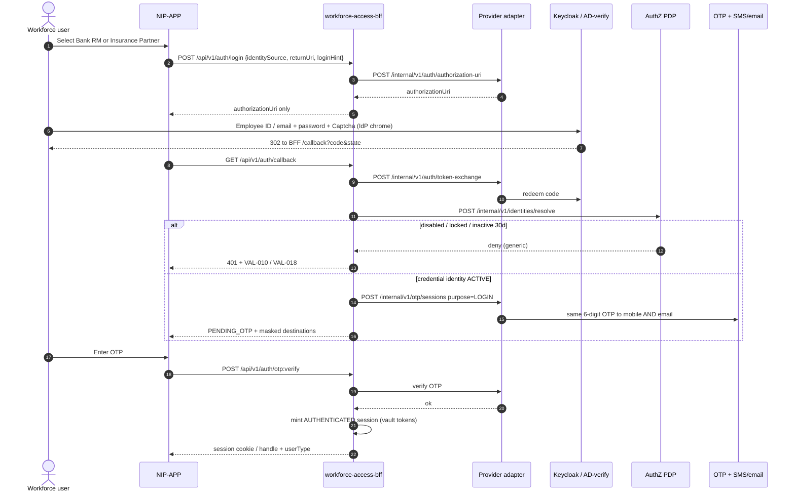
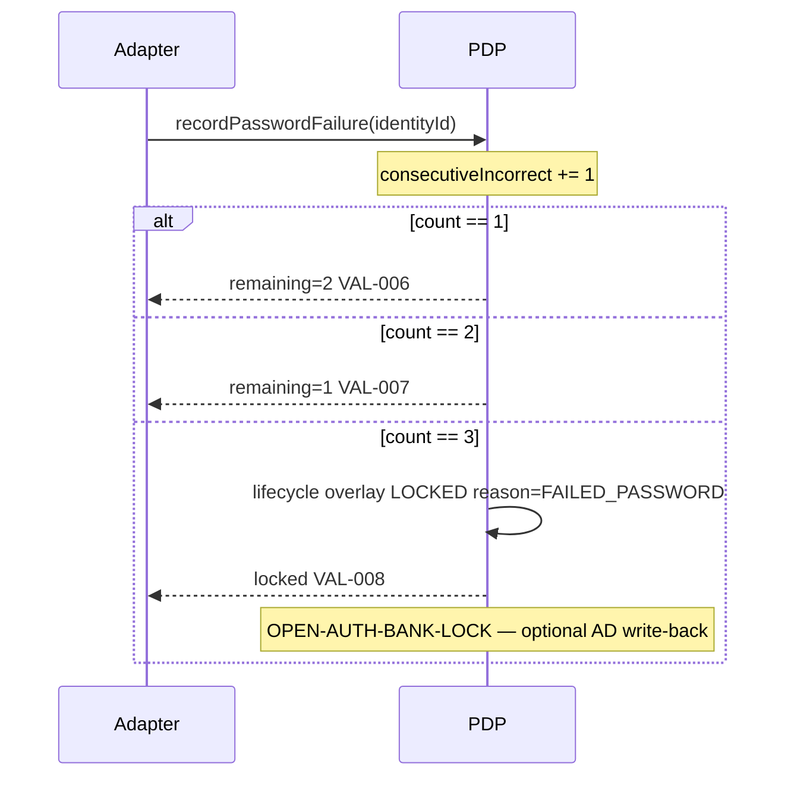
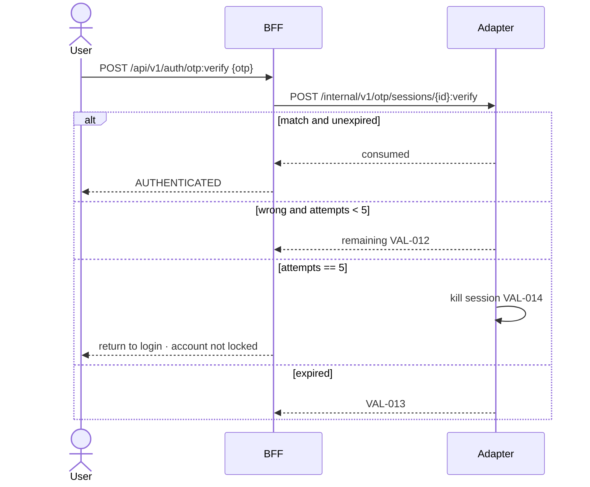
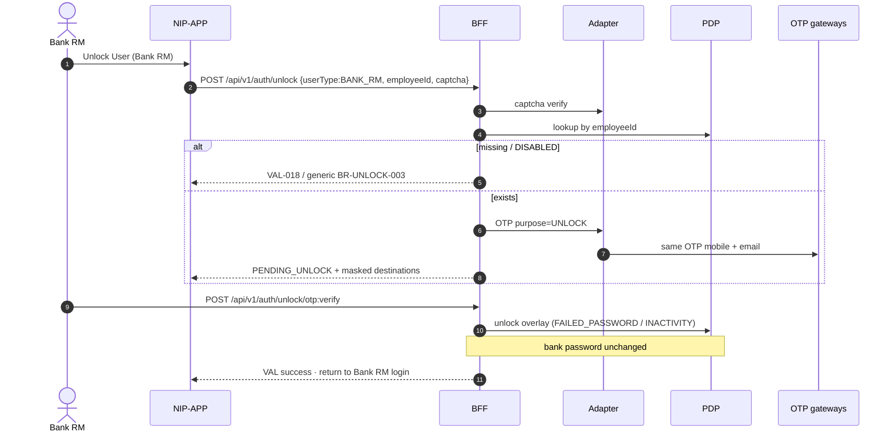
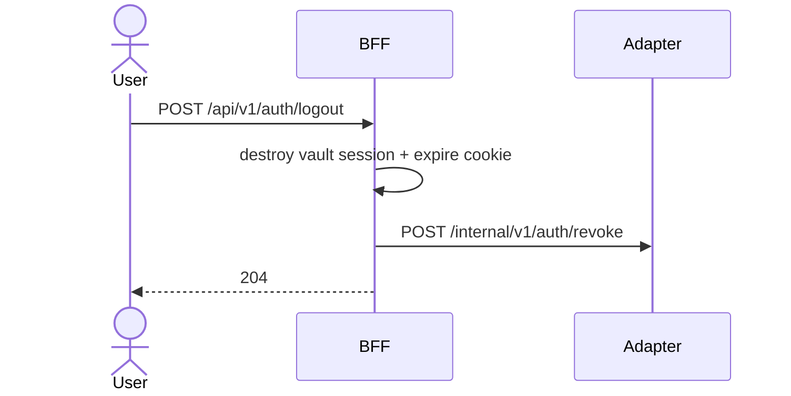
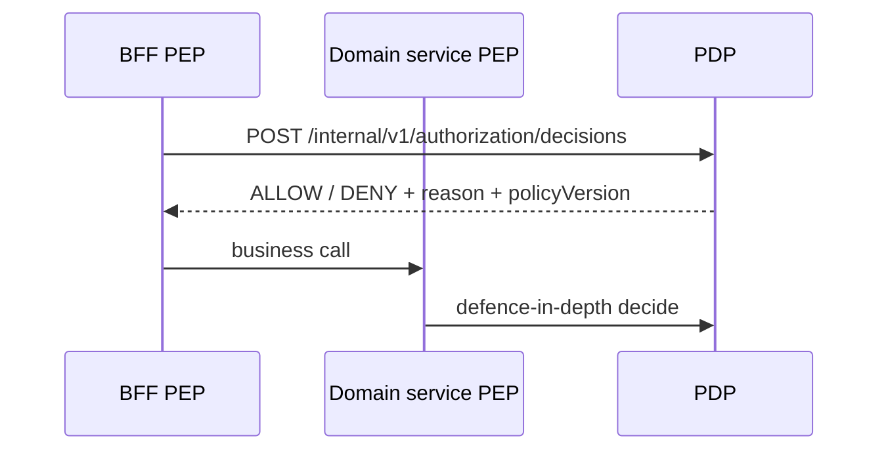

# 21 — Authentication & authorization sequences (R0)

**Status:** `AI-DRAFTED` · T3 · human Board 1 / 4 outstanding  
**Origin:** `SUG-20261005-amp` · `EPIC-006` · `ARCH-031` · `PLAN-009`  
**Companion:** [`20-auth-module-hld.md`](./20-auth-module-hld.md) · [`UC-01-rm-login.md`](../../journey-execution/flows/UC-01-rm-login.md)  
**Actors:** Bank RM (`BANK_AD`) and Insurance Partner RM (`PARTNER_IDP`). Ceremony host for the password field is `OPEN-AUTH-CEREMONY`.

---

## 1. Option A — IdP chrome login, then platform OTP (current public BFF)

This is what `POST /api/v1/auth/login` already returns. Captcha and password stay **inside** Fireframe/IdP until `OPEN-AUTH-CEREMONY` closes.



Rules:

- Device never receives provider tokens (standing constraint).
- Session is **not** authenticated at callback (`20` §5 vs UC-01 B10).
- Certification is snapshotted, not gated (`UC-01` VR-017).

---

## 2. Option B — BFF credential step (OPEN-AUTH-CEREMONY — not admitted)

Shown so engineers do not invent it. **Not** on the public OpenAPI until Deepali + Mahesh close `ID-11`.

```mermaid
sequenceDiagram
  autonumber
  actor User as Workforce user
  participant APP as NIP-APP
  participant BFF as BFF
  participant ADT as Adapter
  participant AD as AD-verify / partner IdP
  participant PDP as PDP

  User->>APP: identifier + password + captcha
  APP->>BFF: POST /api/v1/auth/credentials  # FORBIDDEN until ID-11
  BFF->>ADT: captcha verify then credentials:verify
  Note over BFF,ADT: password never logged; never returned
  ADT->>AD: AD-verify or partner password check
  ADT->>PDP: account state / failed-attempt increment
  ADT-->>BFF: success or remaining-attempts / locked
  Note over BFF: then same PENDING_OTP hop as §1
```

If this option is later admitted, tokens still never leave the BFF.

---

## 3. Password failure and lock (BR-LOGIN-007/008)



Successful `AUTHENTICATED` login resets the counter to 0 and writes `lastSuccessfulLoginAt` (BRD table 9 row 4).

Five wrong **OTP** attempts do **not** lock (`BRD` table 9 row 5) — they terminate the OTP session only (`VAL-014`).

---

## 4. Login OTP verify / resend / expire



Resend: enabled after 2 minutes; max 3 per session; previous OTP immediately invalid (`KBR-10`).

---

## 5. Unlock User — Bank RM (AC-010)



---

## 6. Unlock User — Insurance Partner (AC-011/012)

```mermaid
sequenceDiagram
  autonumber
  actor User as Partner RM
  participant BFF as BFF
  participant ADT as Adapter
  participant PDP as PDP
  participant KC as Keycloak

  User->>BFF: POST /api/v1/auth/unlock {userType:PARTNER, email, captcha}
  BFF->>PDP: load partner identity
  alt DISABLED / missing
    BFF-->>User: VAL-018
  else already ACTIVE and intent=unlock-only
    BFF-->>User: VAL-017 after OTP (no password change)
  else FIRST_TIME / FORGOT / EXPIRED / explicit reset intent
    BFF->>ADT: OTP purpose=UNLOCK
    User->>BFF: verify OTP
    BFF-->>User: UNLOCK_PASSWORD
    User->>BFF: POST /api/v1/auth/partner/password {new, confirm}
    BFF->>BFF: ALG-PWD-POLICY
    BFF->>ADT: credential-actions UPDATE_PASSWORD / set-password
    ADT->>KC: replace credential · no plaintext persist
    BFF->>PDP: passwordExists=true; expiry=+60d; unlock if locked
    BFF-->>User: success · return to Partner login  BR-PWD-002
  end
```

Intent selection (account state vs explicit “I forgot my password”) is UX (`BRD` table 14) — both outcomes must be reachable. Do not auto-login after set-password.

---

## 7. Logout and session expiry



Browser back after logout must not revive authenticated pages (`SEC-008`) — Flutter / cookie expiry. Concurrent and idle limits: `OPEN-AUTH-SESSION`.

---

## 8. Authorized business action (after login) — PEP/PDP

Unchanged from `AUTHN-AUTHZ-LLD` / UC-05. Shown so this pack is complete:



Fail closed 300 ms, no retry. Default deny. Keycloak is not on this hop (`ADR-022`).

---

## 9. Sync vs async

| Interaction | Mode |
|---|---|
| Login start, callback, OTP, unlock, set-password, logout, PDP decide | Sync |
| OTP SMS + email delivery | Sync request to gateway; delivery receipt may be async |
| Partner provision after checker | Async outbox (existing) |
| Audit events | Sync write or outbox — never include secrets |
| AD lock write-back | Deferred until `OPEN-AUTH-BANK-LOCK` |

---

## 10. Done for this document

- [x] Option A login + platform OTP
- [x] Option B marked OPEN, not admitted
- [x] Lock, unlock (both actors), partner password, logout, PEP
- [ ] Human Board 1 / 4 signatures
