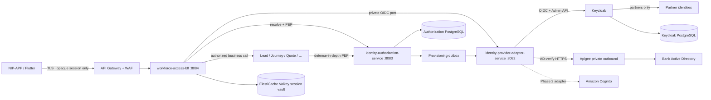

# Workforce Authentication & Authorization — LLD and implementation pack

**Status:** `AI-DRAFTED` · T3 · human Board 1 (Architecture) and Board 4 (Security) outstanding  
**Workstream:** WS-2 · `GATE-IAM-P1`  
**Origin:** `SUG-20261002-iap` · `ARCH-029` · `PLAN-008` · `ADR-022`  
**Persona:** Mahesh — Principal Insurance Platform Architect (Board 1 / `R2`)  
**Security outcome owner:** Deepali (Board 4 / `R8`) — structure is Mahesh's; the security property is not  
**SSOT (invariants):** [`README.md`](./README.md) — this pack does not replace it; it makes it implementable  
**Doctrine:** [`15-actor-identity-and-authorization.md`](../../context/roles/mahesh-principal-insurance-platform-architect/15-actor-identity-and-authorization.md) (`ID-01`–`ID-24`)  
**PDP algorithm (normative):** [`UC-05-authorization-decision.md`](../../journey-execution/flows/UC-05-authorization-decision.md)

> **Confluence paste.** This file is the page. Headings, tables and Mermaid diagrams paste as-is. OpenAPI companions are the machine contracts: attach them as children, do not retype them into the page.

| Companion | Role |
|---|---|
| [`workforce-access-bff.openapi.yaml`](./workforce-access-bff.openapi.yaml) | Public BFF auth contract (Flutter / NIP-APP) |
| [`identity-provider-adapter.openapi.yaml`](./identity-provider-adapter.openapi.yaml) | Private IdP adapter contract |
| [`identity-authorization.openapi.yaml`](./identity-authorization.openapi.yaml) | Private PDP + administration contract |

---

## 0. Executive answer — is Keycloak enough?

**No. Keycloak being present does not remove `identity-provider-adapter-service` or `identity-authorization-service`.** Both remain **MUST** for Phase 1 and for every later horizon.

| Question | Verdict | Why in one sentence |
|---|---|---|
| Do we need Keycloak? | **Yes, as an IdP product** for partner credentials and as the initial broker. It is **not** the architecture. | `ARCH-018`: Keycloak is the first implementation, replaceable. |
| Do we need `identity-provider-adapter-service` even though Keycloak exists? | **Yes. Keep it.** | Provider protocols (Keycloak Admin/OIDC, bank AD-verify via Apigee, a future Cognito) must not leak into the BFF or any business service (`ID-04`). |
| Do we need `identity-authorization-service` (PDP) even though Keycloak has roles? | **Yes. Keep it.** | Keycloak must never be the source of truth for business authorization (standing constraint, `ID-06`, `GATE-IAM-P1` A.3). |
| Can we delete either service and talk to Keycloak directly? | **Technically possible. Architecturally forbidden. Not good practice.** | Collapse requires a new ADR that supersedes `ARCH-018`/`ARCH-020`/`ARCH-021`, Deepali joint review (`ID-11` / `A3_JOINT_REVIEW`), and a human T4 if default-deny or a trust boundary is weakened (`A4_HUMAN_REQUIRED`). |

**Horizon:** `H0` (WS-2 Phase 1). Production IdP product selection stays deferred to Phase 2 **because** the adapter exists. Removing the adapter would force that decision now, which this stage is not allowed to take.

This is not a new topology. It restates accepted decisions `ARCH-018`, `ARCH-019`, `ARCH-020`, `ARCH-021`, `ARCH-022` and `ADR-020` IDENTITY, with an explicit **reject** of the Keycloak-only collapse (`ADR-022`). Authority class: **`A3_JOINT_REVIEW` with Deepali**. Mahesh does not adjust the trust boundary alone.

---

## 1. Purpose, scope, authority

### 1.1 What this pack gives the delivery team

A developer who has not read the rest of `docs/` can implement Phase 1 workforce authn/authz from this page plus the three OpenAPI files:

1. Which processes to run, in which order, against which classes.
2. Exact public and private HTTP contracts (request/response, errors, headers).
3. Sequence of hops for login, logout, partner provision, and an authorized business action.
4. The PDP decision algorithm and reason-code catalogue (aligned to UC-05).
5. What is already in the repo versus what still has to be written to close `GATE-IAM-P1`.
6. Tests that constitute evidence for A.1–A.6.

### 1.2 In scope (WS-2 Phase 1)

- Bank employees (RM and other bank workforce) and insurer representatives (partners / IPR).
- Token-hiding BFF session (`workforce-access-bff`, port `8084`).
- Provider-neutral adapter (`identity-provider-adapter-service`, port `8082`) with a Keycloak adapter first.
- Business PDP (`identity-authorization-service`, port `8083`) — default-deny RBAC + ABAC + relationship.
- Maker-checker for partner create / bulk / privileged grants.
- Provisioning outbox from the PDP to the adapter.

### 1.3 Out of scope now

| Item | Revisit |
|---|---|
| Retail-customer authentication | Later bounded context (`ID-14`) |
| Production IdP selection (Cognito vs Keycloak vs other) | WS-2 Phase 2 — deferred **behind the adapter** |
| Exact bank AD protocol (OIDC / SAML / LDAP) | Phase 2; `ID-04` keeps this a configuration + adapter change |
| Password-in-NIP vs Fireframe SSO ceremony | Deepali `ID-11` joint review — do not invent a password API on the BFF |
| Customer BFF, DIY, hybrid | WS-3 out of scope now |
| Collapsing adapter or PDP into Keycloak | Forbidden by `ADR-022` unless a superseding ADR is accepted |

### 1.4 Never

- Flutter talks to Keycloak, Cognito, Apigee or AD.
- Flutter receives an OAuth access or refresh token.
- Keycloak (or any IdP) is treated as the business authorization source of truth.
- LDAP bind from EKS to Bank AD (`ADR-020`).
- Keycloak admin console shown to bank users (NIP-APP / Fireframe is the chrome).
- A PEP fail-open when the PDP is slow or down.
- Permissions modelled as URLs.
- Certification evaluated only at login.
- Caller-supplied `distributorId` / `agentId` / `subjectId`.

### 1.5 Authority split (do not silently cross)

| Decision | Owner |
|---|---|
| Service boundaries, ports, PDP integration pattern, permission vocabulary shape | Mahesh `A1_AUTONOMOUS` (this pack); durable form is `ADR-022` |
| Authentication ceremony, federation, token handling, trust boundary | Deepali `A3_JOINT_REVIEW` (`ID-11`) |
| Which actions require which certification | Shailja |
| Retention of auth/admin events (currently 7 years, configurable) | Shailja (`GATE-IAM-P1` A.5) |
| Product behaviour of login screens | Rajal / Login BRD (`DOC-005`); Figma is layout only (`D-012`) |
| Persistence of the authorization schema | Aarti (already drafted in `01-identity.sql`; runtime Flyway is in the service) |
| QA evidence sufficiency for A.1–A.6 | Swapnali |
| Operability of Keycloak, Valkey, NetworkPolicy | Shivanshi |

An AI may draft this reasoning. It **must not** manufacture Board 1 or Board 4 human T4 signatures.

---

## 2. Why two services exist when Keycloak is already there

### 2.1 Capability ≠ product ≠ deployable

Keycloak is an **identity-provider product**. It owns credentials, authentication ceremonies, MFA, provider sessions and token issuance (`README.md` §1.5).

It is not:

- the bank's workforce directory (Bank AD is, `TI-01` / `ID-01`);
- the partner business-identity store (the PDP is, `ARCH-022`);
- the authorization decision point for regulated insurance actions (`ID-06`, `ID-13`);
- a safe public-path dependency (only Gateway + BFF are public, `ID-10`).

Mahesh's boundary test (persona card rule 2 and decision framework §4): a business noun is not evidence for a service; independent **data ownership**, **rate of change**, **security isolation** and **failure isolation** are. Those four tests pass for both custom services. They fail for "just use Keycloak".

### 2.2 What Keycloak is good at — and where it stops

| Concern | Keycloak (or any OIDC IdP) | Platform |
|---|---|---|
| Password / OTP / MFA ceremony | Yes | Must not duplicate |
| Token issue, refresh, revoke | Yes | BFF stores tokens; Flutter never sees them |
| Partner user credentials | Yes (private realm) | Provisioned **after** maker-checker in the PDP |
| Workforce employment status | **No** — Bank AD is SoR | Adapter reaches AD-verify via Apigee; platform mirrors, never masters |
| Branch ∩ role intersection | Realm roles cannot express it safely | PDP `VR-044` |
| Insurer tenancy (IPR never sees another insurer) | Groups/attributes are claims, not a query filter | PDP `VR-043` + persistence-layer scope (`ARCH-025` / `ADR-004`) |
| SP certification validity **at the action** | Login-time claim goes stale mid-journey | PDP `VR-040` / `ID-20` |
| Journey stage as an authorization input | Not an IdP concept | `ID-18` |
| Assist-but-not-sell | A role named "partner" will be granted selling permissions by accident (and already is in the Phase 1 seed — see §10.3) | `ID-15b`, `VR-041` |
| Policy version for a 7-year audit replay | Token snapshot, not a versioned policy | PDP returns `matchedPolicy` + `policyVersion` |
| Fail closed in 300 ms with no retry | Availability of an IdP is not an authorization decision | `ID-07`, `S-02` |
| Production IdP still unchosen | Choosing Keycloak as *the* architecture locks Phase 2 | Adapter is the deferral mechanism |

Keycloak Authorization Services (fine-grained authz, UMA) is the usual "then why a PDP?" objection. It fails the same tests: business policy would live in a vendor, PEPs would speak Keycloak, a Cognito (or bank-mandated) replacement becomes a rewrite, and certification/branch/insurer/relationship/stage cannot be expressed as realm roles without lying.

### 2.3 Options considered (including collapse)

| Option | What it is | Verdict | Why |
|---|---|---|---|
| **A — Keep three custom deployables + Keycloak as IdP product** (current) | BFF · adapter · PDP · Keycloak infra | **MANDATORY — selected** | Satisfies `ARCH-018`–`022`, standing constraints, `GATE-IAM-P1` A.2/A.3, Phase 2 IdP deferral |
| **B — Delete the adapter; BFF talks Keycloak** | BFF holds OIDC + Admin API | **REJECT** | Public-path service holds Keycloak admin secrets; BFF contract becomes Keycloak-shaped; Phase 2 IdP swap is a BFF + Flutter ceremony change; NetworkPolicy "no BFF→Keycloak" is lost; `A.2` cannot be evidenced |
| **C — Delete the PDP; Keycloak roles are authorization** | Realm roles / token claims as grants | **REJECT** | Standing constraint violated; `ID-06` anti-pattern; certification checked at login; branch union instead of intersection; no `policyVersion`; IPR selling roles become a configuration accident; `A.3` cannot be evidenced |
| **D — Delete both; BFF + Keycloak only** | B + C combined | **REJECT** | Union of B and C failures; every domain service must trust the BFF's allow (`ID-08` defence in depth lost) |
| **E — Adapter as a library inside the BFF** | Same port, one deployable | **REJECT for Phase 1** | Admin credentials and OIDC client secrets would sit in the only public-path Java process; Keycloak outage and BFF outage become the same blast radius; `ID-10` isolation lost. Revisit only if Deepali accepts the blast-radius change (`A3`) |
| **F — PDP as a library copied into every service** | Same evaluator, many copies | **REJECT** | `ID-13` — four identity planes, **one** PDP. Copies drift; default-deny fails in the service that forgot to upgrade |
| **G — Use AWS Cognito / IAM Identity Center as the PDP** | Cloud IdP as SoT | **REJECT now; Phase 2 product choice only** | Same as C, plus it pre-empts the deferred production IdP decision |

**Simplest architecture that works:** option A. "Fewer boxes" is not simpler when it couples a replaceable vendor to regulated authorization.

### 2.4 If we were forced to remove them — how, and why it is still a bad practice

This section exists so the question is answered honestly. It is **not** an implementation path.

**To remove the adapter (option B):**

1. Raise a new ADR that **supersedes** `ARCH-018` and `ARCH-021`. Status cannot be "we just deleted the module".
2. Deepali joint review (`ID-11`). Subject: BFF now holds Keycloak admin credentials and talks to the IdP on the public path.
3. Freeze production IdP as Keycloak (Phase 2 decision is no longer deferrable).
4. Move `IdentityProviderPort` into `workforce-access-bff` and delete `identity-provider-adapter-service`.
5. Rewrite NetworkPolicy to allow BFF→Keycloak; accept that every future IdP change is a BFF release.
6. Re-run GATE A.1 (token-hiding still required) and **withdraw** GATE A.2 (the criterion becomes inexpressible).
7. Cost to reverse later: **high** — every BFF build, secret, and policy is Keycloak-shaped.

**To remove the PDP (option C):**

1. Raise a new ADR that **supersedes** `ARCH-020`, `ARCH-021` and the standing constraint "Keycloak is not the source of truth for business authorization". That constraint is `A4_HUMAN_REQUIRED` to weaken (`ID` doctrine §8).
2. Deepali + Shailja joint review. Subject: certification, tenancy, maker-checker and 7-year decision replay now live in an IdP.
3. Encode branch/insurer/certification as token claims. Accept that a claim issued at 09:00 is still trusted at 17:00 after the SP certificate expired (`ID-20` destroyed).
4. Point every PEP at Keycloak Authorization Services or at claim inspection. Delete `identity-authorization-service` and its database.
5. Withdraw GATE A.3. Re-evidence every regulated action (quote, proposal, consent, payment) because the decision point moved.
6. Cost to reverse later: **high** — policy data has been written into a vendor; audit replay of `policyVersion` is gone.

**Good practice?** No. Industry IAM for a regulated multi-tenant distributor is **PEP/PDP** (NIST ABAC, XACML shape, Envoy/OPA external authz, AWS Verified Permissions, etc.). Putting business authorization inside the workforce IdP is a known failure mode: roles become entitlements nobody governed (`15` anti-patterns table). Bancassurance adds insurer tenancy and IRDAI certification on top of ordinary RBAC — that is exactly why this platform already separated the two.

### 2.5 What *would* justify revisiting

`ADR-022` revisit triggers (all must be written evidence, not preference):

- The bank mandates a single enterprise PDP that already evaluates certification, branch intersection, insurer tenancy and journey stage, with fail-closed SLO and audit replay — and Deepali accepts it as meeting the same security outcome.
- Production IdP is irrevocably Keycloak **and** Keycloak is banned from the public path by a different structural control that Deepali signs.
- A measured Phase 1 operation shows the adapter hop (not Keycloak itself) as the actual latency bottleneck, **and** collapsing it does not move admin credentials onto the BFF.

Until one of those is true, "Keycloak is there" is not a reason.

---

## 3. System context and trust boundaries



| Trust boundary | From → to | Rule |
|---|---|---|
| `TB-1` Device → Gateway | Flutter → API Gateway | Opaque session cookie or `X-Session-Handle`. No OAuth tokens. |
| `TB-2` Gateway → BFF | Public path ends at BFF | Only Gateway and BFF are public (`ID-10`). |
| `TB-3` BFF/service → PDP | PEP → `POST /internal/v1/authorization/decisions` | 300 ms, **no retry**, fail closed. No business payload. |
| `TB-4` PDP → its DB | Authorization PostgreSQL | Dedicated DB; not `bank-persistence-service`. |
| `TB-5` Adapter → IdP | Adapter → Keycloak / Apigee | Only the adapter speaks provider protocol. NetworkPolicy denies BFF→Keycloak and domain→Keycloak. |
| `TB-6` Adapter → AD-verify | Adapter → Apigee private | Never LDAP from EKS (`ADR-020`). |

---

## 4. Deployable map (today vs target)

### 4.1 Four runtimes

| Deployable | Port | Public? | Owns | Does not own |
|---|---|---|---|---|
| `workforce-access-bff` | 8084 | Yes (via Gateway) | Login ceremony orchestration, PKCE, session vault, first PEP | Passwords, Keycloak Admin API, business grants |
| `identity-provider-adapter-service` | 8082 | **No** | Provider-neutral port; Keycloak adapter; future AD-verify / Cognito adapters | Business identity, roles, sessions |
| `identity-authorization-service` | 8083 | **No** | Business users, roles, entitlements, certifications, maker-checker, PDP evaluator, outbox | Credentials, tokens |
| Keycloak (product) | infra | **No** | Partner credentials, OIDC tokens, MFA | Business authorization, Flutter chrome |

### 4.2 Java packages — implement against these, do not invent a second shape

**Adapter** `com.bank.identity.provider`

| Package | Responsibility | Canonical type |
|---|---|---|
| `domain` | Provider-neutral port | `IdentityProviderPort` |
| `adapter.keycloak` | Keycloak OIDC + Admin API | `KeycloakIdentityProviderAdapter` |
| `adapter.adverify` | **To add** — bank AD-verify via Apigee | `AdVerifyIdentityProviderAdapter` (or a strategy selected by `identitySource`) |
| `api` | `/internal/v1/**` | `IdentityProviderController` |
| `config` | URIs, secrets | `KeycloakProperties`, `ProviderClientConfig` |

**PDP** `com.bank.identity.authz`

| Package | Responsibility | Canonical type |
|---|---|---|
| `domain` | Evaluator + models | `AuthorizationPolicyEvaluator`, `AuthorizationModels` |
| `application` | Decision, resolve, partner admin, outbox | `AuthorizationDecisionService`, `IdentityResolutionService`, `PartnerUserAdministrationService`, `ProvisioningOutboxProcessor` |
| `persistence` | Facts load + JPA | `AuthorizationFactsRepository`, `BusinessUserEntity` |
| `adapter` | HTTP to provider adapter | `ProviderProvisioningClient` |
| `api` | `/internal/v1/**` | `IdentityAuthorizationController` |

**BFF** `com.bank.workforce.bff`

| Package | Responsibility | Canonical type |
|---|---|---|
| `api` | `/api/v1/auth/**` | `AuthenticationController` |
| `application` | Login/session | `LoginService` |
| `session` | Encrypted vault | `SessionStore`, `RedisSessionStore`, `TokenVaultCipher` |
| `client` | Downstream HTTP | `IdentityProviderClient`, `IdentityAuthorizationClient` |
| `pep` | **To add** — BFF PEP for business APIs | `AuthorizationPepFilter` (see §7.5) |

Provider-specific DTOs must not cross `IdentityProviderPort`. ArchUnit already exists on sibling services; add the same rule here (slice A.2).

---

## 5. Authentication LLD

### 5.1 Actors and identity sources

| `identitySource` | Who | Identifier in Login BRD | Credential owner | IdP path |
|---|---|---|---|---|
| `BANK_AD` | Bank employee / RM | Employee ID | Bank AD via **AD-verify API** (Apigee private) | Adapter; **not** Keycloak LDAP |
| `PARTNER_IDP` | Insurer representative | Corporate email | Keycloak (private realm) | Adapter → Keycloak |

NIP-APP is the only UI chrome. The Keycloak admin console is not shown to bank users (`ADR-020`).

Login BRD extras (captcha, OTP to mobile **and** email, lock after 3 password fails, Unlock User) are **behaviour SSOT** (`DOC-005`) and are **not** all on the BFF today. Where they are enforced (IdP MFA vs platform OTP) is Deepali `ID-11`. This LLD does **not** add a password field to `POST /api/v1/auth/login`. The current contract returns an **authorization URI**. Do not "fix" that by collecting AD passwords on the BFF.

### 5.2 Bank-employee login sequence

```mermaid
sequenceDiagram
    autonumber
    actor RM as NIP-APP
    participant BFF as workforce-access-bff
    participant ADP as identity-provider-adapter
    participant IdP as Keycloak or AD-verify
    participant PDP as identity-authorization-service
    participant Vault as Valkey session vault

    RM->>BFF: POST /api/v1/auth/login {clientType, identitySource=BANK_AD, returnUri}
    BFF->>BFF: mint state, nonce, PKCE verifier; store pending login
    BFF->>ADP: POST /internal/v1/auth/authorization-uri
    ADP-->>BFF: authorizationUri
    BFF-->>RM: 200 {authorizationUri, expiresInSeconds}
    RM->>IdP: browser/webview follows URI (bank-controlled ceremony)
    IdP-->>BFF: GET /api/v1/auth/callback?code&state
    BFF->>BFF: take pending by state; reject unknown/expired
    BFF->>ADP: POST /internal/v1/auth/token-exchange {code, codeVerifier, expectedNonce}
    ADP->>IdP: authorization_code + PKCE
    IdP-->>ADP: tokens; ADP verifies ID-token nonce + audience
    ADP-->>BFF: providerSubject, username, email, tokens, claims
    BFF->>PDP: POST /internal/v1/identities/resolve
    PDP-->>BFF: businessUserId, status, policyVersion, userType, insurerCode
    alt status != ACTIVE
        BFF->>ADP: POST /internal/v1/auth/revoke
        BFF-->>RM: fail closed (generic login error)
    else ACTIVE
        BFF->>Vault: encrypt provider tokens; store WorkforceSession
        BFF-->>RM: Set-Cookie HttpOnly WORKFORCE_SESSION (web) or native completion code
    end
```

Native clients: callback returns a one-time `completionCode` on the allow-listed `returnUri`; `POST /api/v1/auth/native-session` exchanges it for an opaque handle stored in Keychain/Keystore. Still no OAuth tokens on the device.

### 5.3 Partner login

Same BFF flow with `identitySource=PARTNER_IDP`. The user must already exist as a business identity in `ACTIVE` state. Provisioning is §6.3 (maker-checker → outbox → adapter → Keycloak required action `UPDATE_PASSWORD`). No initial password is stored in platform data.

### 5.4 Logout, disablement, revocation

| Event | BFF | Adapter | PDP |
|---|---|---|---|
| Logout | Delete session; expire cookie | `POST /internal/v1/auth/revoke` | — |
| Account SUSPENDED/DISABLED | Next PEP call denies (`ACCOUNT_SUSPENDED`); cached allows invalidated | `PATCH .../status` enabled=false | `policy_version++` |
| Refresh reuse | Terminate session family | Provider reuse detection | — |
| Emergency suspension | Absolute deny even if stale grants remain | Disable provider identity | `VR-026` |

Revocation of a missed provider signal is bounded by short access-token TTL (target 5–10 minutes) plus refresh rotation (`README.md` §6).

### 5.5 Public BFF API (normative)

Base path `/api/v1/auth`. Errors: `application/problem+json` (ADR-017). Public messages **never** reveal whether a username exists.

| Method | Path | Auth | Body / params | Success |
|---|---|---|---|---|
| `GET` | `/csrf` | none | — | `{headerName, token}` |
| `POST` | `/login` | CSRF (browser) | `{clientType, identitySource, returnUri, loginHint?}` | `{authorizationUri, expiresInSeconds}` |
| `GET` | `/callback` | none (one-time code) | `code`, `state` | `302` to allow-listed `returnUri`; Set-Cookie (web) |
| `POST` | `/native-session` | none (one-time) | `{completionCode}` | `{sessionHandle, expiresInSeconds}` |
| `GET` | `/session` | cookie or `X-Session-Handle` | — | `{businessUserId, username, userType, status, policyVersion, insurerCode}` — **no tokens** |
| `POST` | `/logout` | cookie or handle | — | `204` + expired cookie |

`clientType`: `WEB` | `NATIVE`. `identitySource`: `BANK_AD` | `PARTNER_IDP`. `returnUri` must be on the BFF allow-list.

Do **not** add `/forgot-password` (Login BRD). Unlock User is a later administration flow.

### 5.6 Session vault

Decided: Amazon ElastiCache for Valkey (`ADR-011`). Properties that the BFF must preserve:

- Per-service ACL user with a key prefix — no other service reads this keyspace.
- Vault is **never** an idempotency or evidence store.
- Provider tokens encrypted at rest in the vault (`TokenVaultCipher`); never logged.
- Local tests may use `InMemorySessionStore`; Compose sets `WORKFORCE_SESSION_STORE=redis`.

---

## 6. Identity-provider-adapter LLD

### 6.1 Port (already in code — do not leak provider types past it)

```text
IdentityProviderPort
  beginAuthorization(state, nonce, codeChallenge, loginHint, identitySource) → URI
  exchangeCode(code, codeVerifier, expectedNonce) → ProviderSession
  refresh(refreshToken) → ProviderSession
  revoke(refreshToken)
  provision(businessUserId, username, email, names, insurerCode, enabled) → providerSubjectId
  setEnabled(providerSubjectId, enabled)
  requestCredentialAction(providerSubjectId, action)   ← ADD (SSOT §11; missing in controller today)
```

`ProviderSession` contains tokens. It is an **internal** type. It must never be returned toward Flutter. Only the BFF may receive it, and the BFF must put tokens in the vault before any client response.

### 6.2 Private adapter API

Base `/internal/v1`. mTLS / mesh identity. Not on API Gateway.

| Method | Path | Purpose | Status today |
|---|---|---|---|
| `POST` | `/auth/authorization-uri` | Build provider authorize URL (PKCE S256) | Implemented |
| `POST` | `/auth/token-exchange` | Code → session; verify nonce + audience | Implemented |
| `POST` | `/auth/refresh` | Rotating refresh | Implemented |
| `POST` | `/auth/revoke` | End provider session | Implemented |
| `POST` | `/identities` | Provision partner in IdP | Implemented (Keycloak Admin) |
| `PATCH` | `/identities/{providerSubjectId}/status` | Enable / disable | Implemented |
| `POST` | `/identities/{providerSubjectId}/credential-actions` | e.g. `UPDATE_PASSWORD` | **Missing — add in slice A.2** |

`identitySource=BANK_AD` currently only adds `kc_idp_hint` if configured. Target: call the **existing bank AD-verify API through Apigee private** (`ADR-020`). Until Bank IT publishes the AD-verify contract, keep the hint path behind the same port so the BFF does not change.

### 6.3 Partner provision sequence

```mermaid
sequenceDiagram
    autonumber
    actor Maker as Maker (BANK_ADMIN / PARTNER_ADMIN)
    actor Checker as Checker (different principal)
    participant PDP as identity-authorization-service
    participant Outbox as outbox_event
    participant ADP as identity-provider-adapter
    participant KC as Keycloak

    Maker->>PDP: POST /internal/v1/partner-users (Idempotency-Key, X-Actor-Id)
    PDP->>PDP: insert business_user PENDING; approval_request PENDING
    PDP-->>Maker: 202 {businessUserId, approvalId, status:PENDING}
    Checker->>PDP: POST /internal/v1/approval-requests/{id}/approve (X-Actor-Id ≠ maker)
    PDP->>PDP: status ACTIVE; insert IDENTITY_PROVISIONING_REQUESTED
    PDP->>Outbox: row unpublished
    Outbox->>ADP: POST /internal/v1/identities
    ADP->>KC: Admin create user + requiredActions=[UPDATE_PASSWORD]
    KC-->>ADP: Location → providerSubjectId
    ADP-->>Outbox: 201
    PDP->>PDP: store provider_subject; policy_version++; IdentityProvisioned
```

Maker cannot approve their own request (already coded). Add `POST .../reject` (SSOT §11; missing today).

### 6.4 Keycloak isolation rules (GATE A.2 evidence)

1. ArchUnit: `adapter.keycloak` types do not appear in BFF or PDP or any `services/*` outside this module.
2. NetworkPolicy: deny from `workforce-access-bff` and every business service to Keycloak; allow only from `identity-provider-adapter-service`.
3. Keycloak admin client credentials live only in the adapter's Secrets Manager entry.
4. No process queries Keycloak's PostgreSQL.
5. Contract test: BFF talks only to `/internal/v1/auth/*` and `/internal/v1/identities*` on the adapter, never to `/realms/*` or `/admin/*`.

---

## 7. Authorization PDP LLD

### 7.1 Why a PDP is a service, not a Keycloak feature

Authorization must understand, on **this action, at this instant** (`VIN-001 §24` / `ID-15`): actor type, roles, certification window, LOB, branch intersection, insurer tenancy, owner/assignee/sharing, journey stage, requested **business** permission.

That evaluation is:

- **default-deny** (falling off the chain is a decision, not "no opinion");
- **fail-closed** (timeout = deny + alert);
- **versioned** (`policyVersion` for audit replay);
- **called twice** (BFF PEP = fail fast; service PEP = the control) (`UC-05` §1);
- **one** decision point across four identity planes (`ID-13`).

Keycloak can assert *who authenticated*. It cannot be the bank's record of *what that person may do to this lead at this stage*.

### 7.2 Decision request / response (target contract)

Align the runtime to UC-05. Today's Java `DecisionRequest` is a subset (no `context`, no `lob`). Slice A.3 extends it **additively**.

```json
{
  "subjectId": "3f1c0a0e-2c1a-4b7a-9d2e-0b7c1a2d3e4f",
  "action": "proposal.submit",
  "resource": {
    "type": "PROPOSAL",
    "id": "prp_01J…",
    "branchCode": "BELAPUR",
    "insurerCode": "ICICI_PRU",
    "ownerId": "rm-a",
    "assignedUserIds": ["rm-a"],
    "sharedWithPartner": true,
    "regulatedAction": true
  },
  "context": {
    "channel": "WORKFORCE_FLUTTER",
    "correlationId": "…",
    "lob": "LIFE",
    "journeyStage": "PROPOSAL"
  }
}
```

Rules:

- `subjectId` comes from the **session**, never from the caller's body at the BFF edge. Internal PEPs pass the already-authenticated principal.
- `action` is a business permission (`proposal.submit`), never `POST /v1/proposals` (`VR-046`, `ID-17`).
- `context.lob` is mandatory, vocabulary `{LIFE, HEALTH, GENERAL}` (`ARCH-026` / `ADR-006`).
- Response:

```json
{
  "effect": "DENY",
  "reasonCode": "SP_CERTIFICATION_REQUIRED",
  "matchedPolicy": "policy:regulated-selling:v7",
  "policyVersion": 7
}
```

Use `effect` (`ALLOW`|`DENY`) in the published contract. Today's Java `Decision.allowed: boolean` may remain internally if the HTTP layer maps it. Reason codes **must** match UC-05 §6 (see §7.4) — the current evaluator uses aliases; slice A.3 renames them.

### 7.3 Algorithm (implement exactly this order)

Normative pseudocode: UC-05 §4. Do not invert stages.

```text
STAGE 1 — precedence (produces a candidate)
  account/global suspension
    > explicit scoped deny
    > direct scoped grant
    > role-derived scoped grant
    > DEFAULT DENY

STAGE 2 — constraints (only NARROW a candidate ALLOW; none can create one)
  actor-type    IPR + regulated sales action     → ASSIST_ONLY_ACTOR
  tenancy       resource.insurer ≠ subject       → CROSS_INSURER_DENIED
  scope         branch ∉ (subject ∩ grant)       → OUT_OF_BRANCH_SCOPE
  qualification regulated selling action         → SP_CERTIFICATION_REQUIRED
  break-glass   reason/checker/expiry missing    → BREAK_GLASS_INVALID

STAGE 3 — {effect, reasonCode, matchedPolicy, policyVersion}
```

Invariants a reviewer confirms in code, not in this paragraph:

1. Default is deny, not "no opinion".
2. Branch scope **intersects**. A role grant must not widen a user's branches.
3. `ACCESS_ALL` is an explicit, separately audited scope. It never silently bypasses tenant isolation, SoD, or certification (`README.md` §8.3). **Today's evaluator lets `permission=*` GLOBAL skip the branch check — that is a defect; fix in slice A.3.**
4. Constraints cannot promote DENY → ALLOW.
5. Certification is evaluated with the **PDP clock at this call**, not login time (`VR-040` T-1/T-4).
6. PDP timeout 300 ms, **no retry**. PEP maps timeout/transport/malformed → `403 AUTHORIZATION_UNAVAILABLE` and emits `ALERT{pdp_fail_closed}`.

### 7.4 Reason-code catalogue (publish these; stop using aliases)

| UC-05 code (normative) | Today's Java alias (retire) | HTTP at PEP |
|---|---|---|
| `ROLE_GRANT` | `ROLE_GRANT` | 200/pass |
| `DIRECT_GRANT` | `DIRECT_SCOPED_GRANT` | 200/pass |
| `BREAK_GLASS` | — | 200/pass + enhanced audit |
| `ACCESS_ALL` | (implied by `permission=*`) | 200/pass + separate audit |
| `DEFAULT_DENY` | `DEFAULT_DENY` | 403 |
| `EXPLICIT_DENY` | `EXPLICIT_DENY` | 403 |
| `ACCOUNT_SUSPENDED` | `ACCOUNT_NOT_ACTIVE` | 403 |
| `ASSIST_ONLY_ACTOR` | — (not implemented; seed currently grants partner `proposal.submit`) | 403 + compliance event |
| `CROSS_INSURER_DENIED` | `CROSS_INSURER_ACCESS` | 403 + compliance event |
| `OUT_OF_BRANCH_SCOPE` | `BRANCH_OUT_OF_SCOPE` | 403 |
| `ORIGINATION_RM_ONLY` | — | 403 |
| `SP_CERTIFICATION_REQUIRED` | `MANDATORY_CERTIFICATION_INVALID` | 403 + compliance event |
| `BREAK_GLASS_INVALID` | — | 403 |
| `AUTHORIZATION_UNAVAILABLE` | — (PEP-side) | 403 + **alert** |
| `INVALID_DECISION_REQUEST` | — | 403 |
| `RESOURCE_NOT_SHARED_WITH_PARTNER` | `RESOURCE_NOT_SHARED_WITH_PARTNER` | 403 (keep) |

### 7.5 PEP integration recipe (every domain service)

Copy this; do not invent a second client.

```text
1. Resolve principal from the incoming mesh identity / BFF-propagated businessUserId.
   Never from the JSON body.
2. Build DecisionRequest {subjectId, action, resource, context.lob, context.correlationId}.
3. POST http://identity-authorization-service:8083/internal/v1/authorization/decisions
   Timeout 300 ms. No retry. Circuit breaker: open = deny (not skip).
4. If effect != ALLOW → 403 with the PDP reasonCode (do not rewrite into INTERNAL_ERROR).
5. Writes: never serve from a cache when the PDP is down.
   Reads: optional cache keyed by (subjectId, action, resourceId, policyVersion) within TTL.
6. On policy_version change or SUSPENDED: invalidate.
7. Log: subjectId, action, resource.type, effect, reasonCode, policyVersion, correlationId.
   Never: tokens, email, PAN, raw provider claims.
```

BFF PEP is an **optimisation** (fail fast). Domain PEP is the **control**. A rule enforced only at the BFF is not enforced (`UC-05` §1).

Add `libs/bank-common-authz` **only when a second service actually calls the PDP** (decision framework §7 — two consumers). Until Lead (or Journey) is the second caller, keep the client in the BFF and a copy-ready class in this pack's OpenAPI. Do not extract a framework for one consumer.

### 7.6 Private PDP / admin API

| Method | Path | Purpose | Status today |
|---|---|---|---|
| `POST` | `/authorization/decisions` | PDP | Implemented (subset fields) |
| `POST` | `/identities/resolve` | Map provider subject → business user | Implemented |
| `POST` | `/partner-users` | Maker submit | Implemented |
| `POST` | `/partner-user-imports` | Bulk maker submit | **Missing — slice A.4** |
| `POST` | `/approval-requests/{id}/approve` | Checker approve | Implemented |
| `POST` | `/approval-requests/{id}/reject` | Checker reject | **Missing — slice A.4** |
| admin | roles, permissions, branches, insurers, hierarchy, certifications, entitlements | Catalogue + assignments | Schema exists; HTTP **thin** — add in A.4 as needed by NIP-APP admin, not before |

Every mutation: `Idempotency-Key` + `X-Correlation-Id` + `X-Actor-Id`.

### 7.7 Permission vocabulary (Phase 1 seed)

Already in `V2__seed_role_permission_catalog.sql`. Regulated selling actions (certification-gated, RM-only) at minimum:

`proposal.create`, `proposal.submit`, and any future `quote.create` that the compliance threshold marks (Shailja `ID-21` — do not guess extra gates).

**Seed defect (do not ignore in A.3):** `PARTNER_SR` is granted `proposal.create` and `proposal.submit`. That contradicts `ID-15b` / `VR-041` (IPR is assist-only). Slice A.3 must remove those role_permissions. Recorded as `SUG-20261002-psr`.

---

## 8. Data ownership

| Data | Owner | Store |
|---|---|---|
| Business user, roles, entitlements, certifications, branches, insurers, hierarchy, approvals, outbox | `identity-authorization-service` | Dedicated PostgreSQL (H2 local; not `bank-persistence-service`) |
| Provider credentials, sessions, MFA | Keycloak | Keycloak PostgreSQL — **no business service queries it** |
| Opaque platform session + encrypted provider tokens | `workforce-access-bff` | Valkey (`ADR-011`) |
| Workforce employment SoR | Bank AD | Reached via AD-verify; platform mirrors selected attributes only |

Physical DDL: runtime `V1__identity_authorization_schema.sql` + `V2__seed_role_permission_catalog.sql`. Target-state wrapper: [`01-identity.sql`](../data-architecture/schemas/01-identity.sql) (Aarti; S09 may move objects into schema `identity`). Do not replace Flyway with the design DDL.

---

## 9. Error handling

ADR-017: `application/problem+json` with `code`, `category`, `service`, `layer`. BFF (L4) is the redaction boundary.

| Situation | Public (Flutter) | Internal |
|---|---|---|
| Bad login (any reason) | Generic failure; **no** "user not found" | Structured reason in logs without PII |
| Inactive business identity | Generic login failure | `ACCOUNT_NOT_ACTIVE` internally; revoke provider session |
| PDP deny | 403, `reasonCode` from catalogue (safe wording from registry) | full decision log |
| PDP timeout | 403 `AUTHORIZATION_UNAVAILABLE` | alert `pdp_fail_closed` |
| Return URI not allow-listed | 400 | no redirect |
| Maker = checker | 400 | `MAKER_CHECKER_VIOLATION` |

---

## 10. Implementation process (100% ordered)

Do these slices in order. Each slice maps to a GATE criterion. Do not start A.4 while A.3 reason codes still disagree with UC-05 — audit replay will lie.

### 10.1 Slice 0 — already in the repo (do not rebuild)

Evidence that scaffolding exists is **not** GATE evidence. Use it as the floor:

- Three Gradle modules compile and boot.
- `IdentityProviderPort` + Keycloak adapter (OIDC + provision + disable).
- BFF login/callback/session/logout with PKCE and encrypted vault.
- PDP evaluator + Flyway schema + partner maker-checker happy path + outbox writer.
- Tests: thin (BFF / adapter / PDP test files exist; GATE rows still OPEN).

### 10.2 Slice A.1 — token-hiding proven

**Owner:** Amit (implementation) · evidence Swapnali · security Deepali  
**Files:** `LoginService`, `AuthenticationController`, `TokenVaultCipher*Test`, contract tests against BFF OpenAPI.

Work:

1. Assert every BFF success response schema contains **no** `accessToken` / `refreshToken` / `idToken` (ArchUnit or JSON schema test).
2. Assert `GET /session` body matches OpenAPI (`businessUserId`, `username`, `userType`, `status`, `policyVersion`, `insurerCode` only).
3. Native path: completion code → opaque handle; handle is not a JWT.
4. Log-output test: vault values and tokens never appear in logs.
5. Keep CSRF + SameSite=Strict + Secure + HttpOnly.

**Exit:** automated test named in the GATE A.1 evidence pack. Manual Flutter check is supporting, not sufficient.

### 10.3 Slice A.2 — Keycloak isolated behind the adapter

**Owner:** Amit · ArchUnit + NetworkPolicy with Shivanshi · AD-verify contract with Bank IT / Deepali

Work:

1. Add `POST /internal/v1/identities/{id}/credential-actions`.
2. ArchUnit: no Keycloak / Nimbus / Keycloak-admin types outside `adapter.keycloak`.
3. Contract tests: BFF and PDP clients use only adapter OpenAPI paths.
4. Helm/NetworkPolicy deny BFF→Keycloak and domain→Keycloak (even as a documented manifest if cluster is not up — Shivanshi owns apply).
5. Keep `identitySource` on `authorization-uri`. When AD-verify spec lands, implement `adapter.adverify` **without** changing BFF OpenAPI.
6. Do not collect AD passwords on the BFF (`ID-11` still open).

**Exit:** A.2 checklist in §11 all green.

### 10.4 Slice A.3 — PDP is the SoT; default-deny verified

**Owner:** Amit · algorithm Swapnali · security Deepali · IPR seed Shailja notify

Work:

1. Map HTTP `effect` + UC-05 reason codes (§7.4). Keep a compatibility alias table in logs for one release if tests already assert old names, then delete aliases.
2. Add `context.lob` (required) and optional `journeyStage` / `channel` / `correlationId`.
3. Fix `ACCESS_ALL` so it does not skip insurer tenancy or certification.
4. Implement `ASSIST_ONLY_ACTOR` for IPR + regulated action **before** role grants. Remove `proposal.create` / `proposal.submit` from `PARTNER_SR` seed (`SUG-20261002-psr`).
5. Certification gate = PDP clock (`Clock` already injected in spirit; `AuthorizationDecisionService` uses `Clock.systemUTC()` — make it injectable for tests).
6. PEP timeout 300 ms no retry in BFF; add the same when Lead calls the PDP.
7. Decision-matrix tests must include UC-05 outcomes 1–21, especially 16–19 (timeout, down, DB down, stale cache vs suspension).

**Exit:** evaluator test class named against UC-05 outcome numbers; default-deny is the fall-through; no Keycloak call on the decision path (ArchUnit).

### 10.5 Slice A.4 — maker-checker for bulk and privileged changes

Work: `POST /partner-user-imports`, `POST /approval-requests/{id}/reject`, privileged entitlement grant/deny with checker, SoD (maker ≠ checker — already on approve). NIP-APP admin chrome is Fireframe, not Keycloak.

### 10.6 Slice A.5 — auth and admin events retained

Work: emit the event list in `README.md` §12 from the outbox; no credentials/tokens in payload; retention configurable (default 7 years) pending Shailja. Audit evidence store remains the record (`ADR-012`); the topic is not.

### 10.7 Slice A.6 — provisioning outbox reliability

Work: `ProvisioningOutboxProcessor` retry, idempotency on `businessUserId`, poison-message metric, at-least-once to adapter `POST /identities`. Duplicate Keycloak username with matching `business_user_id` attribute is already treated as success.

### 10.8 What not to do in any slice

- Do not add a password field to BFF login to "match Figma" (`LOGIN-BFF-FIGMA-EVALUATION.md`).
- Do not put branch/insurer/certification into Keycloak roles "to go faster".
- Do not call Keycloak from Lead/Journey "just this once".
- Do not fail open on PDP timeout.
- Do not implement customer identity.

---

## 11. GATE-IAM-P1 test matrix

| Criterion | Automated evidence | Negative cases |
|---|---|---|
| **A.1** Token-hiding | Schema test on `/login` `/callback` `/session` `/native-session`; cipher tests already in `TokenVaultCipherSecurityTest` | Response JSON containing `access_token` / `refresh_token` fails the build |
| **A.2** Adapter isolation | ArchUnit + client contract tests + NetworkPolicy fixture | Any `keycloak` import in BFF/PDP fails the build |
| **A.3** PDP default-deny | `AuthorizationPolicyEvaluatorDecisionMatrixTest` expanded to UC-05 outcomes 1–21 | Missing permission → `DEFAULT_DENY`; timeout → `AUTHORIZATION_UNAVAILABLE`; IPR `proposal.submit` → `ASSIST_ONLY_ACTOR` |
| **A.4** Maker-checker | Approve rejects same actor; reject path; bulk requires checker before provision | Adapter must not be called on PENDING |
| **A.5** Retention | Outbox payload fixture has no token/PII; retention property documented | — |
| **A.6** Outbox | Retry on 5xx from adapter; duplicate provision is idempotent | Poison message does not drop sibling events |

Local stack:

```bash
docker compose --env-file .env.identity -f docker-compose.identity.yml up --build
./gradlew :services:workforce-access-bff:test \
          :services:identity-provider-adapter-service:test \
          :services:identity-authorization-service:test
```

---

## 12. Worked authorization examples (keep these as fixtures)

| # | Subject | Action / resource | Expected |
|---|---|---|---|
| 1 | RM A, Belapur, valid SP LIFE | `lead.read` Belapur LIFE lead owned by A | `ROLE_GRANT` ALLOW |
| 2 | RM A, Belapur | `lead.read` Kharghar lead | `OUT_OF_BRANCH_SCOPE` DENY |
| 3 | RM D, Belapur+Kharghar | `lead.read` either branch, own book | ALLOW (intersection, not union from a wide role) |
| 4 | ICICI SR P, Belapur+Kamothe, partner-visible ICICI lead | `lead.read` | ALLOW |
| 5 | Same SR, HDFC lead in Belapur | `lead.read` | `CROSS_INSURER_DENIED` |
| 6 | ICICI SR, `proposal.submit` | any | `ASSIST_ONLY_ACTOR` |
| 7 | RM, SP expired this afternoon, `proposal.submit` | — | `SP_CERTIFICATION_REQUIRED` (login this morning is irrelevant) |
| 8 | Suspended RM, still-valid cached allow | write | `ACCOUNT_SUSPENDED` (cache must not win) |
| 9 | PDP killed | any write | `AUTHORIZATION_UNAVAILABLE` + alert |
| 10 | Sharing revoked | SR `lead.read` | DENY `RESOURCE_NOT_SHARED_WITH_PARTNER`; RM ownership unchanged |

---

## 13. Open items (do not silently close)

| Item | Owner | Effect on this LLD |
|---|---|---|
| AD-verify request/response fields | Bank IT + Deepali | Adapter-internal; BFF contract frozen |
| Password-in-NIP vs Fireframe SSO (`ID-11`) | Deepali | No password on BFF until signed |
| Production IdP product | Phase 2 | Adapter second implementation; **not** a BFF change |
| Session idle/absolute TTL by role | Deepali + Shivanshi | Configuration |
| Which extra actions require SP (`ID-21`) | Shailja | Evaluator table, not a new service |
| Auth event retention confirmation | Shailja | Configurable; default 7 years |
| `PARTNER_SR` selling permissions in seed | Amit in A.3 / `SUG-20261002-psr` | Must remove |

---

## 14. Traceability

| Claim | Cited source |
|---|---|
| Three custom services + Keycloak infra | `ARCH-021`, `README.md` §4 |
| Adapter isolates provider | `ARCH-018`, `ID-04` |
| Token-hiding BFF | `ARCH-019`, `ID-05`, standing constraint |
| PDP is business SoT; default-deny | `ARCH-020`, `ID-06`, `ID-07`, UC-05 |
| AD-verify via Apigee; no LDAP | `ADR-020` IDENTITY, `ID-02`, `ID-03` |
| Partner provision after maker-checker | `ARCH-022` |
| Four identity planes, one PDP | `ID-12`, `ID-13` |
| Certification is an attribute, not an actor | `ID-15a`, `ADR-004` |
| IPR assist-only, insurer-scoped | `ID-15b`, `ADR-004` |
| Valkey session vault | `ADR-011` |
| Collapse rejected | `ADR-022` (this pack) |

**Architecture severity of collapsing to Keycloak:** `A0` if it makes Keycloak the business authorization SoT or puts tokens on the device; `A1` if it only removes the adapter but keeps the PDP. Neither is a Phase 1 delivery shortcut.

**Security severity (draft for Deepali, not a signature):** collapse option C is `S0` (authorization SoT moved into a vendor; fail-open risk on IdP interpretation of business rules). Collapse option B is `S1` (admin credential blast radius on the public path).

---

## 15. How to use this on Confluence

1. Create space page **WS-2 / Workforce authn & authz LLD**.
2. Paste this Markdown (or publish from the repo). Keep the Executive answer (§0) above the fold.
3. Attach the three OpenAPI files; generate a small REST table from them if the team wants a Try-it panel — do not fork the paths.
4. Link GATE-IAM-P1 to §10–§11 so A.1–A.6 evidence has a home.
5. Any change to a path, reason code or slice order is a PR to this file, not a silent Confluence edit. Repo wins on conflict.
