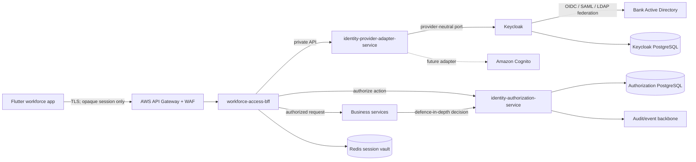

# Workforce Authentication and Authorization — Service SSOT

**Up:** [docs index](../../README.md) → [platform](../README.md) → **workforce authN/authZ**

**Status:** Approved architecture and implementation baseline

**Scope:** Phase 1 bank employees and insurer representatives

**Primary identity provider for development:** Keycloak

**Production identity provider:** Decision deferred behind a provider-neutral adapter
**Out of scope for Phase 1:** Retail-customer authentication

This document is the single source of truth for workforce authentication and authorization in the bank-insurance platform. Implementations, tests, deployment manifests, and future architecture discussions must preserve the decisions and invariants recorded here unless an Architecture Decision Record explicitly supersedes them.

## 1. Accepted decisions

1. Flutter communicates only with a workforce BFF. Keycloak, Cognito, Active Directory, and internal identity services are never exposed directly to Flutter.
2. Flutter never receives OAuth access or refresh tokens. The BFF uses a token-hiding session pattern.
3. Keycloak is the initial provider and runs privately. Provider-specific behavior is isolated behind `identity-provider-adapter-service` so Cognito or another standards-compliant provider can replace it.
4. `identity-authorization-service` is the business source of truth for partner users, roles, permissions, insurer/branch scopes, hierarchy, certification metadata, grants, and denials.
5. Keycloak owns credentials, authentication ceremonies, provider sessions, MFA, and token issuance. It is not the source of truth for business authorization.
6. Phase 1 supports bank employees and insurer representatives. Customer identity is a later bounded context.
7. Bank Active Directory technology is not yet confirmed. The solution must support OIDC, SAML, or LDAP/AD federation without changing BFF or authorization contracts.
8. Authentication and administrative events are retained for seven years initially; retention remains configurable pending Compliance confirmation.
9. Bulk identity and privileged-access changes use maker-checker approval.
10. Authorization is default-deny and combines RBAC, attribute-based scope, and resource relationships.

## 2. Terminology

| Term | Meaning |
|---|---|
| RM | Bank Relationship Manager. An RM may also hold a valid IRDAI Specified Person qualification. |
| SP | Specified Person qualification/certificate; it is an attribute, not a synonym for RM. |
| SR | Insurer Sales Representative. Partner certification is optional in Phase 1 but is modelled for later enforcement. |
| BFF | Backend for Frontend used by the Flutter workforce application. |
| IdP | Identity provider: Keycloak initially; Cognito or another OIDC provider may replace it. |
| PEP | Policy Enforcement Point in the BFF and each business service. |
| PDP | Policy Decision Point exposed by `identity-authorization-service`. |
| Business identity | Provider-independent user record used for authorization, attribution, lifecycle, and audit. |

## 3. System context and trust boundaries



Only API Gateway and the BFF are in the public request path. The adapter, authorization service, Keycloak, databases, Redis, and business services run in private subnets and are restricted by Kubernetes NetworkPolicy and service-to-service authentication.

> **Session store decided, 2026-08-24.** The vault above is **Amazon ElastiCache for Valkey**, per
> [`ADR-011`](../architecture-review/08-architecture-decision-log.md) under
> [`CR-012`](../../governance/change-requests/CR-012-r0-platform-robustness.md). This closes a real
> contradiction rather than adding a component: WS-2 specified a Redis session vault while
> [`R0-LLD.md`](../../architecture/R0-LLD.md) §14 preferred DynamoDB and listed the choice as open.
> WS-3's R0 estate now provisions the tier, the DynamoDB `sessions` table is withdrawn, and this
> design stands as written. Two properties are added by that ADR: a **per-service ACL user with a
> key prefix**, so no other service can read the session keyspace, and the tier is explicitly
> **never** an idempotency or evidence store. The token-hiding invariant is unchanged — Flutter
> still never receives a provider token, and the tokens now sit in a shared vault rather than a
> per-service one, which is why Deepali's review of the ACL and rotation model is required.

## 4. Deployable components

### 4.1 `workforce-access-bff`

- Owns `/api/v1/auth/login`, callback, session status, refresh, and logout endpoints.
- Generates OAuth state, nonce, and PKCE material.
- Stores provider tokens encrypted in a server-side session vault.
- Gives web clients an HttpOnly/Secure/SameSite cookie and native clients a random opaque handle stored in Keychain/Keystore.
- Applies CSRF protection for cookie-authenticated browser requests.
- Acts as the first authorization PEP for workforce business APIs.
- Never validates an AD password itself and never persists a password.

### 4.2 `identity-provider-adapter-service`

- Provides a private, versioned provider-neutral API.
- Builds authorization requests and exchanges authorization codes.
- Refreshes and revokes provider sessions.
- Provisions, enables, disables, and requests credential actions for partner identities.
- Normalizes provider subject IDs, errors, and capability differences.
- Implements Keycloak first. Alternative adapters implement the same domain port.
- Remains stateless and horizontally scalable. It does not become a second identity provider.

### 4.3 `identity-authorization-service`

- Owns provider-independent business identities and lifecycle states.
- Owns insurers, branches, organizational hierarchy, role and permission catalogues, effective-dated assignments, certification metadata, direct grants, and direct denials.
- Stages and validates bulk imports and enforces maker-checker approval.
- Coordinates partner provisioning through the provider adapter using an outbox/retry workflow.
- Evaluates authorization decisions and returns a decision, reason code, matched policy, and policy version.
- Publishes auditable lifecycle and authorization events.

### 4.4 Keycloak infrastructure workload

Keycloak is a separately deployed product, not one of the three custom Spring services. Development uses the pinned Keycloak container and realm configuration in this repository. Production uses multiple replicas, a dedicated managed PostgreSQL database, restricted admin access, TLS, backups, and monitoring.

## 5. Authentication flows

### 5.1 Bank employee

1. Flutter calls the BFF login endpoint without an authenticated session.
2. The BFF creates a short-lived pending-login transaction containing state, nonce, PKCE verifier, client type, and an allow-listed return location.
3. The provider adapter returns the provider authorization URI.
4. The user completes the bank-controlled authentication ceremony. Depending on the confirmed AD technology, Keycloak brokers OIDC/SAML or uses approved LDAP federation.
5. The provider redirects only to the BFF callback.
6. The BFF verifies state and exchanges the one-time code through the provider adapter.
7. The BFF resolves the provider subject to a business identity and confirms account, employment, branch mapping, and required certification state.
8. The BFF stores provider tokens server-side and returns only an opaque platform session.

The architecture does not assume that an AD username/password can be replayed through OIDC. Direct credential forwarding is disabled unless the bank confirms an explicitly approved LDAP/direct-grant arrangement.

### 5.2 Insurer representative

1. A maker creates or imports a partner business identity in `identity-authorization-service`.
2. A different checker approves the change.
3. An outbox command provisions the provider identity through `identity-provider-adapter-service`.
4. Keycloak sends or requires a credential setup action. No initial password is stored in platform data.
5. The representative authenticates using the same authorization-code, PKCE, and token-hiding BFF flow.

### 5.3 Logout, disablement, and revocation

- Logout destroys the BFF session and asks the provider to revoke/end the provider session.
- Account disablement, branch/insurer removal, or a material permission change increments `policy_version` and invalidates cached decisions.
- Short access-token lifetime and refresh-token rotation bound the effect of missed revocation signals.
- Emergency suspension is an absolute deny even if stale grants remain.

## 6. Session and token policy

| Concern | Decision |
|---|---|
| Browser token storage | No OAuth tokens in browser storage; HttpOnly secure session cookie only |
| Native token storage | Opaque session handle in OS Keychain/Keystore; no OAuth tokens |
| Provider tokens | Encrypted in Redis/session vault, never logged |
| Access-token lifetime | Short-lived and configurable; target 5–10 minutes |
| Refresh | Rotating refresh token; reuse detection terminates the session family |
| Internal audience | Down-scoped, audience-specific token for each internal API |
| Session idle/absolute lifetime | Role- and risk-based configuration |
| Admin action | Recent authentication and MFA step-up required |
| Cookie requests | CSRF token plus Origin/Referer validation |

## 7. Identity and lifecycle model

Every business identity has:

- immutable platform user ID;
- provider and provider subject ID;
- user type (`BANK_EMPLOYEE` or `INSURER_REPRESENTATIVE`);
- lifecycle state (`PENDING`, `ACTIVE`, `SUSPENDED`, `DISABLED`, `EXPIRED`);
- employee ID or partner personnel reference;
- insurer tenancy for partner users;
- effective dates;
- policy version;
- branch and hierarchy assignments;
- certification records;
- auditable maker/checker provenance.

Bank employee identity and RM certificate validity are synchronized from AD when those attributes are available. Insurer representative certification can be entered or bulk-uploaded through the administration frontend and is optional in Phase 1. The data model supports later mandatory enforcement without schema replacement.

## 8. Authorization model

### 8.1 Decision input

```json
{
  "subjectId": "user-uuid",
  "action": "lead.read",
  "resource": {
    "type": "LEAD",
    "id": "lead-uuid",
    "branchCode": "BELAPUR",
    "insurerCode": "ICICI_PRU",
    "ownerId": "rm-a",
    "assignedUserIds": ["rm-a"],
    "sharedWithPartner": true
  },
  "context": {
    "channel": "WORKFORCE_FLUTTER",
    "correlationId": "..."
  }
}
```

### 8.2 Policy layers

- **RBAC:** roles grant stable business permissions.
- **ABAC:** user type, lifecycle, certification, insurer, branch, time, and resource attributes constrain those permissions.
- **Relationship rules:** owner, assignee, shared partner, and reporting hierarchy affect resource visibility.

Permissions describe business actions, not URLs. An endpoint can require more than one permission and can impose contextual conditions.

### 8.3 Precedence

```text
account/global suspension
  > explicit scoped deny
  > direct scoped grant
  > role-derived scoped grant
  > default deny
```

Additional invariants:

- Cross-insurer partner access is always denied.
- Branch scope is intersected with, never expanded by, a role grant.
- Missing or expired mandatory RM certification denies regulated selling actions but does not automatically deny non-selling work.
- `ACCESS_ALL` is an explicit, separately audited scope. It never silently bypasses tenant isolation, separation of duties, or regulatory qualification.
- Break-glass grants require a reason, checker approval, expiry, and enhanced audit.

### 8.4 Initial permission vocabulary

| Area | Example permissions |
|---|---|
| Lead | `lead.create`, `lead.read`, `lead.assign`, `lead.share_partner`, `lead.revoke_partner` |
| Advisory | `suitability.perform`, `quote.create`, `quote.compare` |
| Proposal | `proposal.create`, `proposal.submit`, `proposal.view` |
| Policy | `policy.view`, `policy.download` |
| Partner operations | `partner_user.create`, `partner_user.bulk_import`, `partner_user.disable` |
| Authorization administration | `role.assign`, `entitlement.grant`, `entitlement.deny`, `break_glass.approve` |
| Audit and reporting | `audit.read`, `report.branch.read`, `report.insurer.read` |

The insurer, rather than an RM, issues the policy. RM selling authority is represented by proposal/advisory actions and qualification gates.

## 9. Worked scope examples

- RM A mapped to Belapur can see eligible Belapur leads only.
- RM D mapped to Belapur and Kharghar can see eligible leads in both branches, subject to assignment and action rules.
- ICICI Prudential SR P mapped to Belapur and Kamothe can see only ICICI Prudential leads in those branches that are partner-visible.
- ICICI Prudential SR Q mapped to Kharghar cannot see Belapur leads.
- An HDFC representative cannot see an ICICI Prudential lead even when both users share the same bank branch.
- Revoking partner sharing removes SR visibility without removing the RM's ownership or assignment.
- A hierarchy manager may have subordinate read/report visibility without inheriting proposal-submission permission.

## 10. Data ownership

`identity-authorization-service` owns a dedicated PostgreSQL database containing, at minimum:

- `business_user`, `insurer`, `branch`;
- `user_branch_assignment`, `organization_relationship`;
- `certification`;
- `role`, `permission`, `user_role`, `role_permission`;
- `entitlement` for scoped direct grant/deny;
- `bulk_import`, `bulk_import_row`;
- `approval_request`;
- transactional `outbox_event`.

Keycloak owns a separate database managed only by Keycloak. No business service queries Keycloak tables. Neither identity datastore is placed in `bank-persistence-service`.

## 11. Initial service APIs

### Public BFF

- `POST /api/v1/auth/login`
- `GET /api/v1/auth/callback`
- `GET /api/v1/auth/session`
- `POST /api/v1/auth/logout`

### Private provider adapter

- `POST /internal/v1/auth/authorization-uri`
- `POST /internal/v1/auth/token-exchange`
- `POST /internal/v1/auth/refresh`
- `POST /internal/v1/auth/revoke`
- `POST /internal/v1/identities`
- `PATCH /internal/v1/identities/{providerSubjectId}/status`
- `POST /internal/v1/identities/{providerSubjectId}/credential-actions`

### Private authorization and administration

- `POST /internal/v1/authorization/decisions`
- `POST /internal/v1/partner-users`
- `POST /internal/v1/partner-user-imports`
- `POST /internal/v1/approval-requests/{id}/approve`
- `POST /internal/v1/approval-requests/{id}/reject`
- role, permission, branch, insurer, hierarchy, certification, and entitlement administration APIs

Every mutation requires an idempotency key and audit correlation ID. Public API error messages never reveal whether a username exists.

## 12. Events

- `IdentityCreated`, `IdentityProvisioningRequested`, `IdentityProvisioned`
- `IdentityEnabled`, `IdentityDisabled`, `IdentityExpired`
- `RoleAssigned`, `RoleRevoked`
- `EntitlementGranted`, `EntitlementDenied`, `EntitlementRevoked`
- `BranchAssignmentChanged`, `HierarchyChanged`
- `CertificationChanged`, `CertificationExpired`
- `LoginSucceeded`, `LoginFailed`, `SessionRevoked`
- `BulkImportSubmitted`, `BulkImportApproved`, `BulkImportRejected`, `BulkImportCompleted`

Events contain identifiers and non-sensitive decision metadata; they never contain credentials or raw provider tokens.

## 13. Security and operational requirements

- TLS at the edge and mTLS/service identity internally.
- AWS WAF, rate limiting, credential-stuffing detection, and generic login errors.
- MFA for all production workforce users; step-up MFA for privileged changes.
- Secrets in AWS Secrets Manager and encryption keys in KMS.
- PII-safe structured logging and immutable audit evidence.
- Keycloak admin API reachable only from the provider adapter and approved operations tooling.
- NetworkPolicy denies direct BFF-to-Keycloak and business-service-to-Keycloak access.
- Database least privilege, encryption at rest, backups, point-in-time restore, and India-region residency.
- Liveness, readiness, metrics, traces, alerts, and provider dependency health.
- No authentication fail-open. Authorization dependency failures deny sensitive writes; narrowly defined cached read decisions may continue only within their policy TTL.

## 14. Delivery slices

### Foundation implemented first

- Provider-neutral ports and Keycloak adapter.
- Token-hiding BFF login/session seams.
- Authorization service schema and deterministic precedence evaluator.
- Partner-user provisioning seam.
- Local Keycloak, PostgreSQL, and Redis environment.
- Unit, context, migration, and contract-test foundations.

### Follow-up slices

1. Confirm AD type and configure the correct Keycloak federation/broker.
2. Complete maker-checker bulk-import workflow and administration UI contract.
3. Add event outbox relay and audit-consumer integration.
4. Integrate authorization PEPs into Lead, Proposal, and other domain services.
5. Add production Kubernetes/Helm, KMS, Secrets Manager, NetworkPolicy, and autoscaling.
6. Conduct threat modelling, penetration testing, DR testing, and Compliance sign-off.
7. Implement and test a Cognito adapter only if the provider decision selects Cognito.

## 15. Open decisions

- Exact bank AD protocol and authoritative attribute names.
- Final Keycloak-versus-Cognito production choice.
- Final session idle/absolute lifetimes by role.
- Exact RM certificate attributes available from AD and reconciliation frequency.
- Final regulatory retention period and break-glass approver group.

These decisions are configuration or adapter concerns and do not change the accepted service boundaries.

## 16. Instructions for future contributors and AI agents

1. Read this document before changing authentication, authorization, BFF sessions, workforce identity, branch scope, insurer tenancy, or partner-user lifecycle.
2. Do not expose an identity provider directly to Flutter.
3. Do not return provider access or refresh tokens to Flutter.
4. Do not put branch, insurer, hierarchy, or certification policy in Keycloak-only roles.
5. Do not query Keycloak's database or share the authorization database with another service.
6. Preserve default-deny, tenant isolation, branch intersection, maker-checker, and audit requirements.
7. Record any superseding decision in `docs/platform/architecture-review/08-architecture-decision-log.md` and update this SSOT in the same change.
