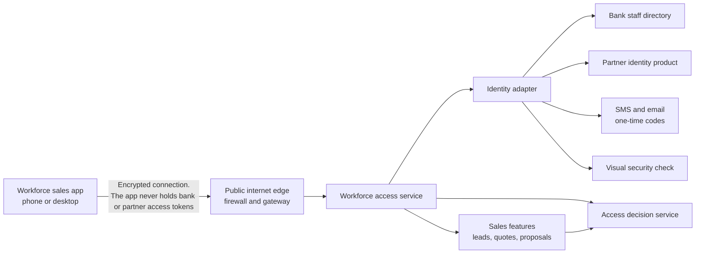

# Workforce sign-in and access control — start here

**Audience:** anyone new to the team, and any stakeholder who needs to understand how people get into the insurance sales application and what they are allowed to do.  
**You do not need** the source-code repository, product jargon, or prior architecture papers to read these pages.  
**Status:** draft for architecture and security review. Not a signed production approval.

These pages are written to paste into Confluence as a parent page plus child pages. Each page stands on its own. Terms are defined in ordinary language the first time they appear.

---

## What this application is

Bank relationship managers and insurance-partner staff use a **workforce sales application** (phone and desktop) to help an existing bank customer buy life insurance.

Two different questions sit behind every screen:

1. **Sign-in (authentication)** — prove this person is who they say they are.
2. **Access control (authorisation)** — decide whether this person may do *this* action, on *this* record, *right now*.

They are not the same thing. A person can sign in successfully and still be refused a sale, a quote, or another user’s customer list.

---

## Who signs in

| Person | How they identify themselves | Whose password it is |
|---|---|---|
| **Bank relationship manager** (and other bank employees) | Bank **employee ID** | The **bank’s existing password**, checked against the bank directory. This application never creates, stores, or resets that password. |
| **Insurance partner staff** (people who work for an insurer, not the bank) | **Corporate email address** | A **password created for this application**. First-time, forgotten, and expired passwords are handled through **Unlock User**, not a separate “Forgot password” link. |

Both people must complete a **six-digit one-time password** after the password is accepted. The same code is sent to the **registered mobile number and the registered email**. Until that code is confirmed, they do not reach the home screen.

Customers of the bank (people buying a policy for themselves) **do not** use this sign-in. That is a later product.

---

## The picture in one minute

Read it left to right:

- The **app** talks only to the **workforce access service**. It never talks to the bank directory, the partner identity product, or the access decision service.
- The **identity adapter** is a private translator. Today the partner identity product is **Keycloak**. Bank staff passwords are checked through the **bank’s existing directory check**, reached via the bank’s private API gateway — not by plugging the application cluster into the bank directory.
- The **access decision service** is the only place that answers “may this person do this?”. Keycloak (or any identity product) is **not** the source of business permissions.

If mermaid diagrams do not render in your Confluence, the sentences above are the same picture.

---

## What a successful sign-in looks like

1. The person chooses **Bank** or **Insurance partner**.
2. They enter their identifier, password, and a visual security check (captcha).
3. The correct password store checks the password (bank directory, or partner identity product).
4. After three wrong passwords the account is **locked**. After thirty days without a sign-in, Unlock User is required.
5. On a correct password, a **six-digit code** is sent to **both** registered mobile and email.
6. Only after that code is accepted does the application create a signed-in session and send the person to the home screen for their role.
7. The phone or browser **never** receives the bank’s or Keycloak’s access tokens. The workforce access service keeps those tokens in a server-side vault and gives the app only an opaque session (a cookie on the web, or a random handle in the phone’s secure store).

Where the password is **typed** (inside the sales app, or on a bank-hosted sign-in page) is **still an open security decision**. Both options keep tokens off the device. See [Decisions that are still open](./06-decisions-still-open.md).

---

## What happens after they are in

Every sensitive action (create a lead, produce a quote, submit a proposal, see another branch’s book) is asked of the **access decision service**.

The answer is **allow** or **deny**, plus a reason that can be replayed years later. If the decision service is slow or down, the answer is **deny** — never “let them through because we could not check”.

Permissions are business actions (“create a lead”, “submit a proposal”), not web addresses. A partner from one insurer never sees another insurer’s work. A relationship manager’s branch list **narrows** what they can see; a role never silently widens it. Selling actions additionally require a valid **Specified Person** certificate **at the moment of the action**, not merely at sign-in yesterday morning.

---

## Pages in this set

| Page | Read it when you want to know |
|---|---|
| [How the pieces fit together](./01-how-the-pieces-fit.md) | What each service is for, and what it must never do |
| [Sign-in, one-time password, lock and unlock](./02-journeys.md) | Step-by-step journeys, including Unlock User |
| [What the app asks the backend](./03-what-the-app-asks.md) | Screens mapped to requests, and the exact error messages people see |
| [Rules the system follows](./04-rules-the-system-follows.md) | The lock, OTP, unlock and password rules in procedure form |
| [Decisions that are still open](./06-decisions-still-open.md) | Questions security, IT and product still own — do not assume an answer |

---

## Words used in these pages

| Word | Meaning here |
|---|---|
| Workforce sales application | The phone and desktop app used by bank and partner staff. Customer self-service is not this app. |
| Workforce access service | The only backend the app is allowed to call for sign-in and session. It hides tokens from the device. |
| Identity adapter | Private translator to Keycloak, the bank directory check, captcha, and one-time-code sending. |
| Access decision service | The brain for “may they do this?”. Holds roles, branches, insurer tenancy, certificates, grants and denials. |
| Partner identity product | Software that stores partner passwords and runs the partner sign-in ceremony. Currently Keycloak; replaceable. |
| Bank directory | The bank’s system of record for employees and their bank password. |
| One-time password (OTP) | A six-digit code, valid ten minutes, sent to mobile **and** email. |
| Unlock User | The **only** recovery action on the sign-in screen. It is not “Forgot password”. |
| Session | Proof the app is talking to a signed-in person. Opaque to the device; tokens stay on the server. |
| Specified Person certificate | Regulatory qualification some bank staff hold. Checked when they **sell**, not as a condition of merely signing in. |

---

## How to publish in Confluence

1. Create a parent page titled **Workforce sign-in and access control**.
2. Create child pages using the title at the top of each file in this folder.
3. Paste the Markdown. If Confluence strips mermaid, keep the prose under each diagram — it repeats the meaning.
4. Link the child pages to each other using the titles in the table above. Do not paste repository file names, ticket codes, or internal abbreviations onto the Confluence pages.

---

## What these pages deliberately leave out

- Customer (do-it-yourself) sign-in
- A “Forgot password” link — Unlock User replaces it
- An mPIN / device-PIN sign-in — not in the login business requirements
- Creating or resetting a **bank** password inside this application
- Creating partner users (that is an administration journey with two people: one who requests, another who approves)
- Exact idle-timeout minutes and captcha difficulty — Information Security still confirms those numbers
