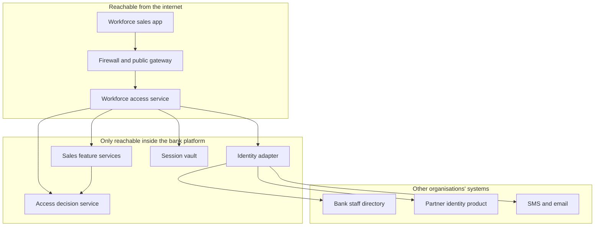

# How the pieces fit together

**Audience:** new joiners and stakeholders.  
**Purpose:** explain the moving parts of sign-in and access control without assuming you have seen the source code.  
**Companion:** [start here](./00-start-here.md)

This page answers: *what is each piece for, and what must it never do?*

---

## The two jobs, again

| Job | Everyday meaning | Who is responsible |
|---|---|---|
| **Sign-in** | “This person is Priya from Belapur branch” or “this person is an ICICI Prudential staff member.” | Bank directory for bank staff. Partner identity product (currently Keycloak) for partner staff. The **identity adapter** talks to both so the rest of the application does not. |
| **Access control** | “Priya may create a lead for this customer, but not submit a proposal because her Specified Person certificate expired this morning.” | The **access decision service**. Not Keycloak. Not the sales app. |

A signed-in session is **not** a blank cheque. Certification, branch, insurer, and “is this my customer?” are checked at the action, not frozen at breakfast.

---

## The pieces, in language a new joiner can use

### Workforce sales application

What staff see. It collects the user type (Bank / Insurance partner), shows errors in the approved wording, and displays **masked** mobile and email on the one-time-code screen (for example `98****21` and `p***@insurer.com`).

It must **never**:

- store or display bank or partner access tokens
- call the bank directory, Keycloak, or the access decision service directly
- log a password or a one-time code

### Workforce access service

The app’s only door. It:

- starts sign-in and finishes it
- holds provider tokens in a **server-side vault** (encrypted)
- gives the browser an HttpOnly cookie, or the phone a random handle in the OS keystore
- asks the access decision service before calling sales features
- exposes Unlock User, captcha, one-time-code, and (for partners only) set-password

It must **never**:

- keep a bank password
- become Keycloak’s admin console
- return tokens to the device

### Identity adapter

A private translator so the access service and the rest of the platform do not speak Keycloak, the bank directory, or next year’s identity product.

It:

- builds the sign-in request and exchanges the one-time authorisation code
- asks the bank directory check (through the bank’s private API gateway) for bank staff
- creates, enables, disables, and resets **partner** credentials in Keycloak **after** an administrator has approved the person
- orchestrates captcha and one-time-code send/verify

It must **never**:

- be exposed on the public internet
- decide business permissions
- become a second staff directory

### Access decision service

The permissions brain. It holds, for every workforce person:

- a platform identity (not the Keycloak username)
- whether they are a bank employee or partner staff
- whether they are active, suspended, disabled, locked, or expired
- branch and reporting mapping
- insurer tenancy for partners
- roles and permissions
- Specified Person (and similar) certificates with dates
- explicit extra grants and explicit denials
- a **policy version** so an auditor can replay “why was this allowed on that Tuesday?”

Every sales feature **also** asks this service. Trusting only the access service would mean one compromised door unlocks the house.

It must **never**:

- store passwords or one-time codes
- treat Keycloak roles as the truth for selling insurance

### Partner identity product (currently Keycloak)

Good at passwords, sign-in screens, multi-factor options, and issuing tokens.

Not good enough, on its own, for:

- “this partner belongs to insurer A and must never see insurer B”
- “this certificate was valid at 9am and expired at 2pm, mid-quote”
- “two people must approve before a privileged user is created”
- replacing the identity product in two years without rewriting the sales app

That is why Keycloak stays, and why it does **not** replace the adapter or the access decision service.

### Bank staff directory

The bank already knows its employees. This platform **mirrors** employment and branch facts; it does not become the master. Partners **never** enter the bank directory.

### Session vault

Encrypted server-side store for sign-in in progress and for signed-in sessions. No other service may read this keyspace. It is not used as a general cache or as a place to store customer evidence.

---

## What each piece owns

| Piece | Owns | Must not own |
|---|---|---|
| Workforce sales application | Screens, the words people see, masked contact details | Tokens, passwords, permission rules |
| Workforce access service | Session, cookie or handle, public sign-in requests | Bank password storage; permission rules |
| Identity adapter | Talking to Keycloak, bank directory check, captcha, OTP delivery | Public exposure; “may they sell?” |
| Access decision service | Who the person is to the business, locks, roles, certificates, allow or deny | Passwords, OTP values, tokens |
| Keycloak | Partner passwords and partner sign-in ceremony | Bank employees as master data; selling permissions |
| Bank directory | Bank employee ID and bank password | Partners |
| SMS / email / captcha | Delivering challenges | Locking accounts; creating sessions |

---

## Rules that do not change

These are standing rules. A convenience argument does not override them.

1. The sales app talks only to the workforce access service.
2. The device never receives OAuth access or refresh tokens.
3. Keycloak is not the source of truth for “may they do this business action?”
4. Bank staff passwords are checked with the bank’s existing directory API, through the bank’s private gateway. The application cluster does not bind to the directory with LDAP.
5. Passwords and one-time codes are never written to application logs, API logs, audit logs, or monitoring.
6. If access cannot be decided in time, the action is refused.
7. Partner users are created in the access decision service first, approved by a second person, and only then provisioned in Keycloak. No starter password is stored in platform data.

---

## Two kinds of password, on purpose

| | Bank staff | Partner staff |
|---|---|---|
| Identifier | Employee ID | Corporate email |
| Password lives in | Bank directory | Partner identity product |
| Can this application reset it? | **No.** Direct them to bank password processes. Unlock User only **unlocks**. | **Yes**, only through Unlock User, after a one-time code. |
| First-time password | Not applicable | The person creates it themselves. We do not issue a temporary password. |
| Expiry | Bank policy | 60 days in this application |
| After three wrong passwords | Locked; Unlock User | Locked; Unlock User |
| 30 days unused | Must Unlock User | Must Unlock User |

---

## Session, in plain language

A person is not “in” until the one-time code succeeds.

| State | What it means | What the device holds |
|---|---|---|
| Not signed in | Sign-in screen | Nothing secret |
| Sign-in started | We have begun a secure sign-in | Nothing secret |
| Waiting for one-time code | Password was accepted | A short-lived pending handle — **not** the home screen |
| Signed in | One-time code accepted | Cookie or phone handle. **No** access tokens |
| Unlock in progress | Unlock User one-time code sent | Unlock handle only |
| Partner must set password | Unlock succeeded and a new password is required | Unlock handle. Setting the password **does not** sign them in |

This is slightly stricter than “as soon as the bank says the password is good, open the home screen”. The login business requirements require the one-time code **before** the dashboard. Until software is changed, some early builds may still open a session too early; the **intended** behaviour is the table above.

---

## Why not one box called “Keycloak”?

Fewer boxes is not simpler when it ties a replaceable vendor to regulated insurance permissions.

- Bank employment does not live in Keycloak.
- A realm role cannot honestly express “this branch **and** this insurer **and** a live certificate **and** this customer is in my book”.
- A permission granted at sign-in goes stale while a long insurance journey is still open.
- An auditor needs “policy version 17 said deny, reason: certificate expired”, not “the token had a role named X”.

Keeping the adapter and the access decision service is the **smallest** design that stays honest. Removing them is technically possible and architecturally a bad idea. That choice is recorded as an architecture decision; it is not revisited because Keycloak happens to be running in the environment.

---

## After sign-in, selling still has extra gates

Signing in does **not** prove the person may sell. A relationship manager whose Specified Person certificate lapsed overnight can still open the app and do non-selling work. The access decision service refuses quote, proposal, and similar actions until the certificate is valid again.

Partner staff who **assist** must not receive selling permissions by accident. “Partner” is not a synonym for “allowed to submit a proposal”.
