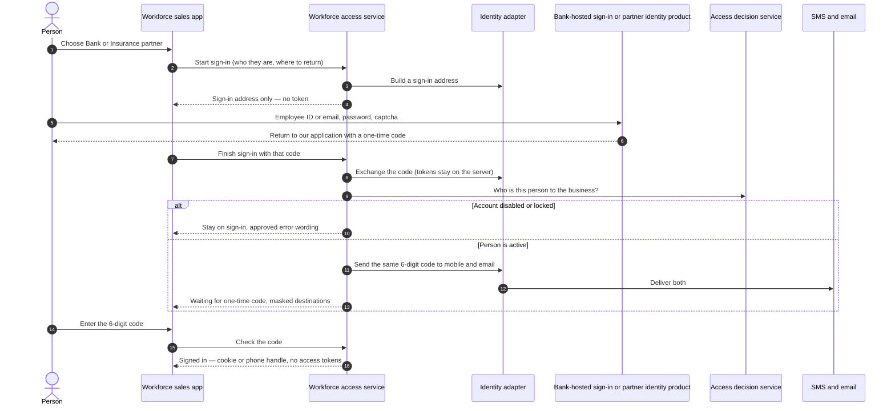
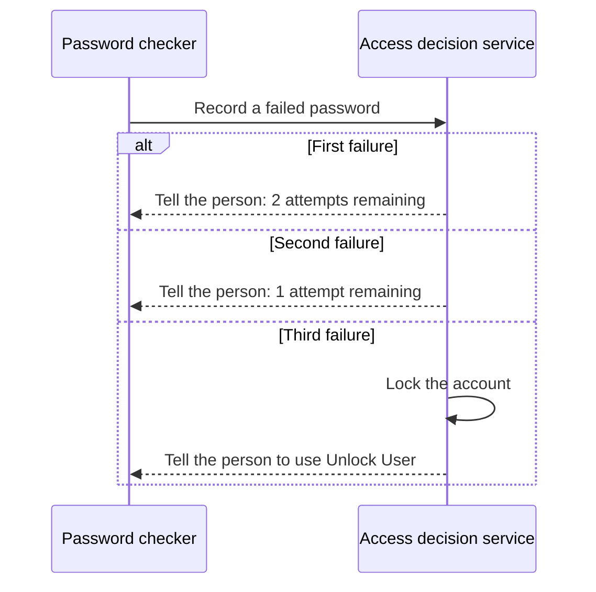
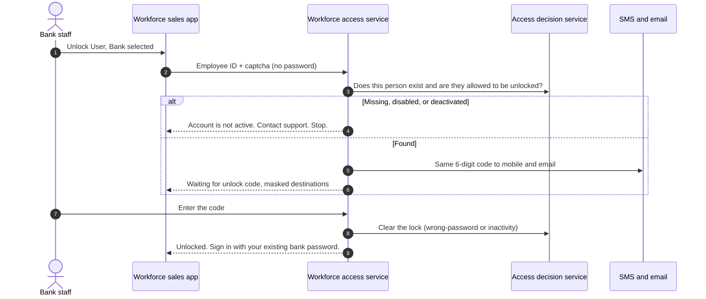
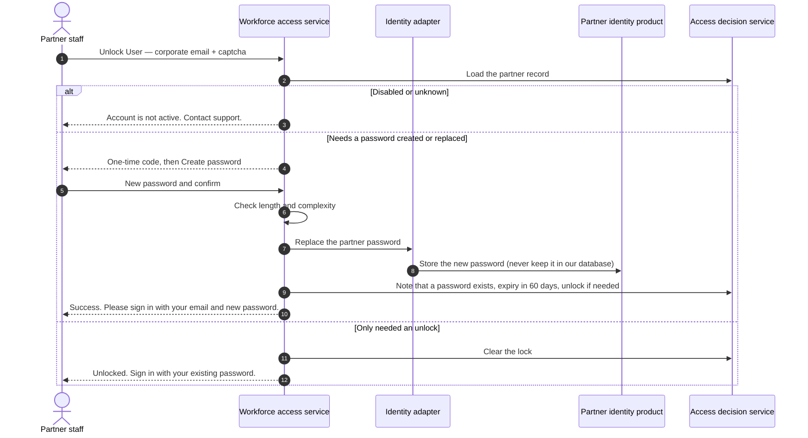
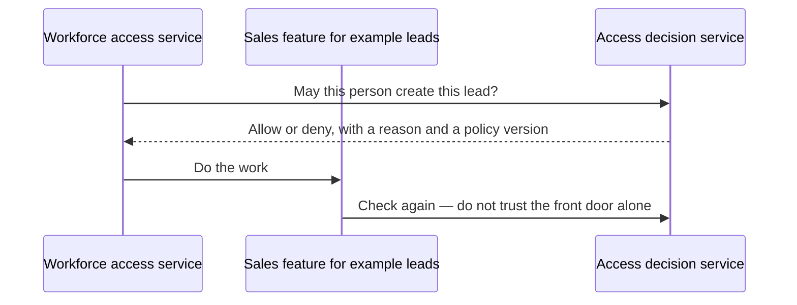

# Sign-in, one-time password, lock and unlock

**Audience:** new joiners, testers, product, operations, and security reviewers.  
**Purpose:** walk each journey as a person would experience it, then show which system does which step.  
**Companion:** [start here](./00-start-here.md) · [How the pieces fit together](./01-how-the-pieces-fit.md)

There is **no** “Forgot password” link. **Unlock User** is the only recovery action on the sign-in screen.

There is an open question: does the person type their password **inside the sales app**, or on a **bank-hosted sign-in page**? Both journeys below keep tokens off the device. Until security and architecture close that question, the public backend **does not** accept a login password in its body. See [Decisions that are still open](./06-decisions-still-open.md).

---

## Journey A — password on a bank-hosted page (what the public backend supports today)

Use this mental model: the sales app opens a secure page to collect the password; our application only receives a one-time “yes, this person signed in” code, then we still send **our** one-time password to mobile and email.

**What “success” means:** home screen for that role, after the six-digit code, not after the password alone.

**What the device never sees:** Keycloak or bank access tokens.

---

## Journey B — password typed in the sales app (not approved yet)

This is closer to the field list in the login business requirements. It is **not** switched on. If it is ever approved:

- the app would send identifier, password, and captcha to the workforce access service
- the access service would verify captcha, then ask the adapter to check the bank directory or the partner password
- the password would never be logged or stored
- tokens would still never return to the device
- the one-time code step would be **the same** as Journey A

Until that approval exists, engineers must not invent a “login with password” request on the public backend.

---

## Wrong password and lock

A **successful signed-in session** (after the six-digit code) resets the counter to zero and records the time of last successful sign-in.

Five wrong **one-time codes** do **not** lock the account. They end that attempt and send the person back to sign-in.

Thirty days without a successful sign-in also requires Unlock User, with a different message from the three-password lock.

Whether a bank employee lock must also be written back into the bank directory is still an IT / security question.

---

## One-time code: check, resend, expiry

| Rule | Value |
|---|---|
| Length | Exactly six digits |
| Where it goes | The **same** code to registered mobile **and** registered email |
| Lifetime | 10 minutes from creation, unless a new code replaces it |
| Wrong guesses | 5 per attempt, then back to sign-in, account **not** locked |
| Resend wait | 2 minutes |
| Resend limit | 3 per attempt |
| Old code after resend | Immediately useless |
| Code after success | Immediately useless |
| Code from another person or another attempt | Useless |

If both SMS and email fail to send, the person sees a delivery-failure message and is not treated as signed in.

---

## Unlock User — bank relationship manager

Unlock User **does not** change the bank password. If the password itself is the problem, they must use bank password processes.

---

## Unlock User — insurance partner staff

Outcomes depend on **why** they opened Unlock User. The screens must support all of these; they may infer the case from account state or ask the person.

| Situation after the unlock code succeeds | What happens | Password |
|---|---|---|
| First time — they have never created a password | Go to **Create password** | They create the first password |
| They forgot the password | Go to **Create password** | New password replaces the old |
| Password older than 60 days | Go to **Create password** | New password valid for the next 60 days |
| Locked, but they still know the password | Unlock and return to sign-in | Unchanged |
| Already active, nothing to fix | Tell them the account is already active | Unchanged |
| Disabled or deactivated | Error. Stop. Support. | Unchanged |
| Bank staff with a password problem | Unlock only; never create a bank password here | Unchanged |

**After a partner creates or resets a password they are not signed in.** They return to the partner sign-in screen and use the new password plus a new one-time code.

---

## Sign-out

Sign-out destroys the server session, expires the cookie or phone handle, and asks the partner identity product (when relevant) to end its session. Using the browser Back button after sign-out must not resurrect a signed-in page.

How long a session may sit idle, how long it may last in total, and whether two devices may be signed in at once are **Information Security** numbers. They are not invented in these pages.

---

## After they are in: asking permission for a business action

If the decision takes too long, treat it as **deny**. Do not retry in a tight loop. Do not fail open.

---

## What we will not build on these journeys

- A Forgot password link for bank or partner
- Create-password screens for **bank** staff
- An mPIN as a way into this application
- Automatically signing a partner in after they set a password
- Showing the Keycloak admin console to bank users
