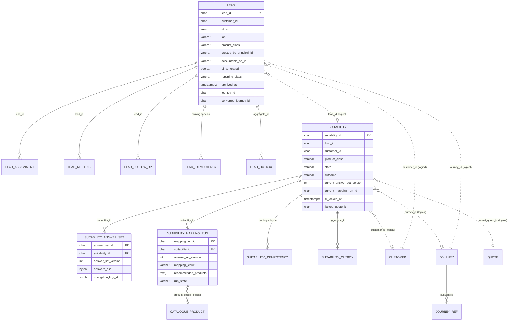

# 03 — Lead + Suitability e2e physical schema (R0)

**Workstream:** WS-3  
**Work item:** [`DATA-003`](./DATA-003.work-item.yaml) · origin [`SUG-20261009-lss`](../../governance/registers/SUGGESTION-REGISTER.md#sug-20261009-lss--lead-and-suitability-e2e-schema)  
**Plan:** [`PLAN-010`](../../governance/plans/PLAN-010-lead-suitability-e2e-schema.md)  
**Owner:** Aarti — Principal Insurance Data & Database Architect  
**Co-owners (joint review):** Mahesh (boundaries / archive mechanism) · Deepali (encryption outcome) · Shailja (retention / PII class) · Rajal (behaviour SSOT)  
**Status:** `AI-DRAFTED` — design DDL only. Human `S07-G5` / T3 signatures outstanding. Not a Flyway apply.  
**Stage:** S08 design delta for S11 Lead / Suitability runtime. Apply remains S09.

Spoken name is **Lead**. Physical schema is `lead_lms`; aggregate table is `lead` (`SUG-20261009-lms`). Identifiers stay `lead_id`. `ADR-014` D1 allowed keeping schema `opportunity`; that option is closed for this pack.

---

## 1. What this pack is

The e2e persistence contract for **one RM-assisted Life sale from Lead create through Suitability lock**, traced from:

| Source | Authority | What it supplies |
|---|---|---|
| Lead BRD (`DOC-005`) | Behaviour SSOT | Create, dedupe, assign, meeting capture, close, diary/eligible |
| Suitability BRD (`DOC-005`) | Behaviour SSOT | Savings/ULIP questionnaire, save/resume, mapping, lock after final BI |
| `10-lead-module-hld.md` | Architecture | R0 cut, ownership, OPEN conflicts |
| `01-domain-model` §4.1 / §4.3 | Invariants | `INV-LED-*`, `INV-SUI-*`, `INV-ACT-03` |
| `02-information-model` §4.2 / §4.4 | Logical attributes | Classification and retention |
| `DATA-002` W1 | CR-013 / C-RET-1 | `ARCHIVED`, `archived_at`, 7-year attribution columns |

Companion DDL:

- [`schemas/04-lead_lms.sql`](./schemas/04-lead_lms.sql)
- [`schemas/06-suitability.sql`](./schemas/06-suitability.sql)

Neighbour schemas already designed (`customer`, `consent`, `journey`, `catalogue`, `quotation`) are **logical** references only. This pack does not add cross-schema `FOREIGN KEY` (`DR-OWN-08`).

### 1.1 What this pack is not

- Flyway applied to a running service (`DR-MIG-04`).
- Campaign / bulk Lead create, meeting-completion workflow, meeting SMS (`BOOT` / Lead BRD §4.2).
- Term questionnaire (`BR-SUIT-002` — Term skips this set).
- Seller override of mapping (`Suitability BRD` §4.2). Mapping rules live in Administration / Catalogue, not duplicated here.
- DATA-002 remainder: `issuance_mode`, off-platform Policy ingest, MIS reader path, outbox on every other schema.
- A human signature on `S07-G5`, Board 4 or Board 6.

---

## 2. E2e slice (tables that must exist)

```text
Search ETB customer → CREATE Lead → Start Onboarding (exception hold)
        → ASSIGN certified SP (+ optional meeting)
        → Suitability (Savings/ULIP) save/resume/map
        → Suitable products → final BI locks suitability
        → Journey refs carry lead_id + suitabilityId
```

| Schema | Table | Role on the path |
|---|---|---|
| `lead_lms` | `lead` | Lead aggregate / working inbox |
| `lead_lms` | `lead_assignment` | Append-only owner history |
| `lead_lms` | `lead_meeting` | Optional Screen-7 meeting intent |
| `lead_lms` | `lead_follow_up` | Free-text notes (⚑ encrypted) |
| `lead_lms` | `idempotency_record` | INV-IDM-01 |
| `lead_lms` | `outbox_event` | Same-transaction publish (`ADR-012`) |
| `suitability` | `suitability` | Assessment header (one current row per lead) |
| `suitability` | `suitability_answer_set` | Versioned ⚑ ciphertext of answers |
| `suitability` | `suitability_mapping_run` | INSERT-only mapping evidence |
| `suitability` | `idempotency_record` | INV-IDM-01 |
| `suitability` | `outbox_event` | Same-transaction publish |
| `customer` | `customer` / `customer_snapshot` | ETB identity; snapshot at journey (logical) |
| `consent` | `consent` | Later on the same `lead_id` (logical) |
| `journey` | `journey` / `journey_ref` | Stage + `suitabilityId` ref (logical) |
| `catalogue` | `product` | Mapping output codes (logical) |
| `quotation` | `quote` | Final-BI lock target (logical) |

Term leads: **no** `suitability` row (`BR-SUIT-002`). Absence means Not Started / not applicable.

---

## 3. ER diagram (physical inside a schema; dashed = logical)



**Physical FK** exists only inside `lead_lms` and inside `suitability`.  
A `lead_id` / `journey_id` / `customer_id` on another schema is a **logical** reference. The owning service validates via API before insert (`DR-OWN-08`).

---

## 4. Lead (`lead_lms`) — table catalogue

### 4.1 `lead_lms.lead`

Mutable aggregate. Optimistic `version`. `lead_id` is ULID, immutable (`BR-LEAD-001/002`).

| Column | Type | Req | Class / ret | Notes |
|---|---|---|---|---|
| `lead_id` | `CHAR(26)` PK | ✅ | INTERNAL · **RET-7Y** | C-RET-1 — never working-lead class |
| `customer_id` | `CHAR(26)` | ✅ | INTERNAL · RET-7Y | ETB only |
| `state` | `VARCHAR(20)` | ✅ | INTERNAL · RET-7Y | See §4.4 |
| `lob` | `VARCHAR(16)` | ✅ | INTERNAL · **RET-7Y** | `LIFE` at R0; immutable |
| `product_class` | `VARCHAR(16)` | ✅ | INTERNAL · RET-WORKING-LEAD | `TERM` \| `SAVINGS` \| `ULIP`; immutable (`BR-LEAD-006`) |
| `source` | `VARCHAR(16)` | ✅ | INTERNAL · RET-7Y | `RM` \| `IPR`. Campaign/self-service still refused (`AC-8`) |
| `created_by_actor_type` | `VARCHAR(32)` | ✅ | INTERNAL · RET-7Y | `BANK_RM` \| `INSURER_PARTNER_REP` (`D-018` / `INV-LED-04`) |
| `created_by_principal_id` | `VARCHAR(64)` | ✅ | INTERNAL · RET-7Y | Actual originator (`BR-OWN-002`) |
| `lead_generator_principal_id` | `VARCHAR(64)` | ✅ | INTERNAL · RET-7Y | Reporting generator (may differ for Non-SP) |
| `assigned_sp_id` | `VARCHAR(64)` | ⭘ | INTERNAL · RET-WORKING-LEAD | Certified AU Bank RM. Null until assignment |
| `assigned_ipr_id` | `VARCHAR(64)` | ⭘ | INTERNAL · RET-WORKING-LEAD | Insurance RM / FLS when collaborating |
| `fulfiller_principal_id` | `VARCHAR(64)` | ⭘ | INTERNAL · RET-WORKING-LEAD | Current working owner |
| `accountable_sp_id` | `VARCHAR(64)` | ⭘ | INTERNAL · **RET-7Y** | Written **once** at first completed assignment (`INV-ACT-03`, `D-019`). Null allowed in `NEW` |
| `accountable_sp_cert_ref` | `JSONB` | ⭘ | INTERNAL · **RET-7Y** | `{certificateNumber, lobScope, validFrom, validTo}` snapshotted with the first assign |
| `branch_id` | `VARCHAR(64)` | ⭘ | INTERNAL · RET-WORKING-LEAD | Branch context |
| `need_analysis_state` | `VARCHAR(20)` | ✅ | INTERNAL · RET-WORKING-LEAD | `NOT_STARTED` \| `IN_PROGRESS` \| `COMPLETED` (`AC-4`) |
| `insurer_id` | `VARCHAR(64)` | ⭘ | INTERNAL · RET-WORKING-LEAD | Unknown at create (`BR-LEAD-005`) |
| `partner_visible_from` | `TIMESTAMPTZ` | ⭘ | INTERNAL · RET-WORKING-LEAD | Set when `AC-4` first holds |
| `exception_state` | `VARCHAR(24)` | ✅ | INTERNAL · RET-WORKING-LEAD | `NONE` \| `BLOCKED` \| `HOLD_FOR_APPROVAL` \| `PASSED` |
| `exception_ref` | `VARCHAR(64)` | ⭘ | INTERNAL · RET-WORKING-LEAD | AUBIMA case id |
| `activity_status` | `VARCHAR(40)` | ⭘ | INTERNAL · RET-WORKING-LEAD | Configurable disposition (Lead BRD §14.2). No closed CHECK |
| `bi_generated` | `BOOLEAN` | ✅ | INTERNAL · RET-WORKING-LEAD | First successful BI |
| `bi_generated_at` | `TIMESTAMPTZ` | ⭘ | INTERNAL · RET-WORKING-LEAD | |
| `reporting_class` | `VARCHAR(16)` | ✅ | INTERNAL · RET-WORKING-LEAD | `DIARY` \| `ELIGIBLE` (`BR-BI-*`) |
| `journey_id` | `CHAR(26)` | ⭘ | INTERNAL · RET-WORKING-LEAD | Active journey (resume pointer) |
| `converted_journey_id` | `CHAR(26)` | ⭘ | INTERNAL · **RET-7Y** | Set once (`INV-LED-02`) |
| `closed_reason` | `VARCHAR(40)` | ⭘ | INTERNAL · RET-WORKING-LEAD | Master-driven |
| `closed_remarks_enc` | `BYTEA` | ⭘ | CONFIDENTIAL [P] ⚑ · RET-WORKING-LEAD | Required by Product when reason = Other |
| `closed_remarks_key_id` | `VARCHAR(50)` | ⭘ | INTERNAL | Present iff remarks ciphertext is |
| `config_versions` | `JSONB` | ✅ | INTERNAL · RET-7Y | INV-CFG-03 |
| `expires_at` | `TIMESTAMPTZ` | ✅ | INTERNAL · RET-WORKING-LEAD | Ageing horizon |
| `archived_at` | `TIMESTAMPTZ` | ⭘ | INTERNAL · RET-7Y | Working-inbox archive after terminal (`INV-LED-08`) |
| `retain_until` | `TIMESTAMPTZ` | ⭘ | INTERNAL | Working-column eligibility after archive. Attribution columns are never purged by this |
| `created_at` / `updated_at` / `version` | timestamps / `BIGINT` | ✅ | INTERNAL | Optimistic lock |

**State CHECK** (`DR-INT-03`):  
`NEW` \| `ASSIGNED` \| `CONTACTED` \| `QUALIFIED` \| `CONVERTED` \| `DISQUALIFIED` \| `EXPIRED` \| `ARCHIVED`.

Post-quote insurer labels (Proposal Form Pending … Policy Issued) are **not** Lead states (`OPEN-LEAD-STAGE` closed by `D-021`). Journey / Proposal / Policy own them.

**Process-further guard (application, not a second state):** `INV-LED-10` — `assigned_sp_id` and `accountable_sp_id` must identify a certified `BANK_RM` before suitability. DDL CHECK: any state other than `NEW` / `DISQUALIFIED` / `EXPIRED` / `ARCHIVED` requires `accountable_sp_id IS NOT NULL`.

**Stale information-model note.** `02-information-model` §4.2 still says `createdByActorType` is always `BANK_RM` and `accountableSpId` is mandatory at origination. Domain §4.1 / `INV-LED-04` / `D-018` / `D-019` superseded that. This DDL follows the later Product decision. Do not "fix" Product behaviour in the store (`00-design-rules` §8).

### 4.2 `lead_lms.lead_assignment`

Append-only. `DELETE`/`UPDATE` revoked. Physical FK → `lead_lms.lead.lead_id`.

| Column | Notes |
|---|---|
| `assignment_id` PK ULID | |
| `lead_id` | |
| `rm_id` | Target SP / owner recorded on this event |
| `assigned_ipr_id` | Optional Insurance RM recorded with the same event |
| `assigned_at` | |
| `assigned_by` | Actor |
| `reason` | Reassignment reason; `OPEN-D1` SLA/attribution is Product, not a column default |
| `assignment_kind` | `CREATE_ASSIGN` \| `REASSIGN` |

### 4.3 `lead_lms.lead_meeting`

Optional meeting **capture** (Lead BRD Screen 7, `D-019`). Meeting **completion** is out of scope.

| Column | Notes |
|---|---|
| `meeting_id` PK | |
| `lead_id` FK | |
| `meeting_type` | `ONLINE` \| `IN_PERSON` |
| `scheduled_at` | Date + time; time-window 08:00–20:00 is application validation |
| `meeting_link_enc` | ⚑ mandatory when `ONLINE` |
| `encryption_key_id` | Required when link ciphertext is present |
| `created_by` / `created_at` | |

### 4.4 `lead_lms.lead_follow_up`

Unchanged intent: encrypted free-text notes (`note_enc` + `encryption_key_id`).

### 4.5 Indexes (Lead)

| Index | Why |
|---|---|
| `ux_lead_converted_journey` partial unique | INV-LED-02 |
| `ux_lead_dedupe_open` partial unique on `(created_by_principal_id, customer_id, product_class)` where `bi_generated = false` and state not terminal | Lead BRD Table 20 / `BR-DEDUPE-*` |
| `ix_lead_customer_lob` | Book lookup |
| `ix_lead_state_expires` | Ageing job |
| `ix_lead_inbox_sp` | RM inbox by `assigned_sp_id`, excluding `ARCHIVED` |
| `ix_lead_inbox_ipr` | Insurance RM inbox by `assigned_ipr_id`, excluding `ARCHIVED` |
| `ix_lead_insurer_visible` partial | `AC-4` predicate |
| `idempotency_record.idempotency_key` PK | INV-IDM-01 |
| `ix_lead_outbox_unpublished` partial | `ADR-012` publisher |

Archive mechanism: **same table + `ARCHIVED` + `archived_at`**. Partition vs archive-table vs dump is still joint Aarti/Mahesh (`DEC-20260825-01` §12). This pack does not pick a second mechanism.

---

## 5. Suitability — table catalogue

### 5.1 Header `suitability.suitability`

One **current** assessment per lead (`BR-SUIT-005`). A Term lead has no row.

| Column | Type | Req | Notes |
|---|---|---|---|
| `suitability_id` | `CHAR(26)` PK | ✅ | Suitability Assessment ID |
| `lead_id` | `CHAR(26)` | ✅ | Logical. Partial unique on non-`SUPERSEDED`/`ABANDONED` |
| `journey_id` | `CHAR(26)` | ⭘ | Logical |
| `customer_id` | `CHAR(26)` | ✅ | Proposer = bank customer on the Lead |
| `lob` | `VARCHAR(16)` | ✅ | Inherited; immutable |
| `product_class` | `VARCHAR(16)` | ✅ | `SAVINGS` \| `ULIP` on this questionnaire (`BR-SUIT-001`) |
| `questionnaire_version` | `VARCHAR(20)` | ✅ | Rule-pack version (`GAP-007`) |
| `mapping_rule_version` | `VARCHAR(20)` | ⭘ | Set on first mapping run |
| `state` | `VARCHAR(24)` | ✅ | See §5.4 |
| `outcome` | `VARCHAR(16)` | ⭘ | `ELIGIBLE` \| `NOT_ELIGIBLE` |
| `current_answer_set_version` | `INTEGER` | ✅ | Points at latest saved ciphertext |
| `current_mapping_run_id` | `CHAR(26)` | ⭘ | Latest CURRENT mapping |
| `selected_product_code` | `VARCHAR(100)` | ⭘ | Cleared when a saved edit invalidates mapping |
| `last_screen_id` | `VARCHAR(40)` | ⭘ | Resume (`BR` save/exit) |
| `edit_lock_actor_id` | `VARCHAR(64)` | ⭘ | Single active editor (Suitability BRD §5.1) |
| `edit_lock_until` | `TIMESTAMPTZ` | ⭘ | Session / TTL release |
| `last_updated_by` | `VARCHAR(64)` | ⭘ | Dashboard "last user" |
| `bi_locked_at` | `TIMESTAMPTZ` | ⭘ | Final BI success — lock (`Suitability BRD` §15) |
| `locked_quote_id` | `CHAR(26)` | ⭘ | Logical quote that locked the row |
| `override_actor_id` / `reason` / `at` | | ⭘ | `INV-SUI-02` columns; **unused** by the BRD happy path (override is out of BRD scope) |
| `evidence_document_ref` | `VARCHAR(512)` | ⭘ | Suitability PDF |
| `config_version_ref` | `VARCHAR(64)` | ✅ | |
| `created_at` / `updated_at` / `version` | | ✅ | Header is mutable until `LOCKED` |

### 5.2 `suitability.suitability_answer_set` (INSERT-only)

Answers are **RESTRICTED** ⚑ and never queryable plaintext (`PII-01`, information model §4.4).

| Column | Notes |
|---|---|
| `answer_set_id` PK | |
| `suitability_id` FK | |
| `answer_set_version` | Monotonic per assessment |
| `answers_enc` | AES ciphertext of the JSON document below |
| `encryption_key_id` | |
| `last_screen_id` | Screen saved in this version |
| `created_by` / `created_at` | |

Logical JSON **inside** the ciphertext (not columns):

| Key | BRD source | Notes |
|---|---|---|
| `policyFor` | Screen 1 | `SELF` \| `OTHER` |
| `lifeAssured` | Screen 2 | Present when not Self; ⚑ nested PII |
| `lifeStage` | Screen 3 | |
| `riskPreference` | Screen 4 | Seller-captured; no derived risk score (`BR-RISK-002`) |
| `primaryGoal` | Screen 5 | |
| `occupation` / `education` | Screen 6 | Prefill allowed; editable |
| `annualIncomeInr` | Screen 6 | Exact amount ⚑ |
| `tobacco` / `medicalCondition` | Screen 6 | Yes/No only; detailed declaration is Proposal |
| `existingLifeCover` / `existingCoverAmountInr` | Screen 6 | |
| `tentativePremiumInr` / `premiumAmountInr` | Screens 6–7 | |
| `premiumFrequency` | Screen 7 | `ANNUAL` \| `SINGLE` |
| `premiumPayingTerm` / `policyTerm` | Screen 7 | Dynamic options; values stored, not the option catalogue |
| `questionnaireVersion` | | Echo of header at save |

Proposer DOB/age are **not** copied as a Suitability SoR (`DR-PII-04`). Age used for mapping is stored on the **mapping run** as a derived integer.

### 5.3 `suitability.suitability_mapping_run` (INSERT-only)

| Column | Notes |
|---|---|
| `mapping_run_id` PK | |
| `suitability_id` FK | |
| `answer_set_version` | Which ciphertext was evaluated |
| `mapping_rule_version` | Grid version |
| `proposer_age_years` | Derived at evaluation; not DOB |
| `premium_amount_inr` / `premium_frequency` / `ppt` / `policy_term` | Mapping inputs that are not ⚑ |
| `mapping_result` | `PRODUCTS` \| `NONE` |
| `recommended_products` | `TEXT[]` of catalogue `product_code` (logical) |
| `evaluated_at` | |
| `run_state` | `CURRENT` \| `SUPERSEDED` \| `INVALID` |
| `evaluated_by` | |

A saved edit of a Completed assessment: application inserts a new answer set, marks prior mapping `INVALID`, sets header `state = IN_PROGRESS`, clears `selected_product_code` (Suitability BRD §14.2). Header `suitability_id` **does not change**.

### 5.4 Status mapping (BRD ↔ store)

| BRD dashboard status | Store |
|---|---|
| Not Started | **No row** (or Term: never a row) |
| In Progress | `state = IN_PROGRESS` |
| Completed | `state = COMPLETED` and current mapping `PRODUCTS` |
| No Suitable Product Found | `state = NO_PRODUCT_FOUND` (mapping `NONE`) |
| Completed and Locked | `state = LOCKED` after `bi_locked_at` |

Domain machine extras kept for invariant compatibility, unused by the Savings/ULIP BRD happy path: `SUPERSEDED`, `EXPIRED`, `ABANDONED`, `OVERRIDDEN`.

**OPEN-SUI-IMMUTABLE.** `INV-SUI-01` says a `COMPLETED` row is immutable and a correction mints a **new** `suitability_id`. The Suitability BRD (behaviour SSOT, `DOC-005`) says the same Assessment ID stays, answers are versioned, and lock happens only after final BI. This pack stores **versioned children + mutable header until `LOCKED`** so S11 can implement the BRD without a schema change. If Compliance later requires `INV-SUI-01` literally, the partial unique on `lead_id` already allows a new header and `SUPERSEDED` on the old one. Do not silently pick the Product outcome — Rajal / Shailja own it.

---

## 6. Integrity the platform may rely on

| Invariant | Store enforcement |
|---|---|
| `INV-LED-01` terminal | Application transition table; CHECK stops garbage states |
| `INV-LED-02` one converting journey | Partial unique `converted_journey_id` |
| `INV-LED-04` workforce create | CHECK `created_by_actor_type IN ('BANK_RM','INSURER_PARTNER_REP')`; `source IN ('RM','IPR')` |
| `INV-LED-06` on-platform `lead_id` | Logical NOT NULL on suitability / journey / consent (already) |
| `INV-LED-08` archive ≠ delete | `ARCHIVED` + `archived_at`; inbox indexes omit it |
| `INV-LED-10` SP before suitability | CHECK + service gate |
| `INV-ACT-03` accountable SP | Trigger: first NULL→value allowed; later UPDATE rejected |
| `BR-LEAD-006` product class | CHECK + origination-immutability trigger |
| `BR-DEDUPE-*` | Partial unique open-lead key |
| `INV-SUI-02` override completeness | CHECK on `OVERRIDDEN` |
| `INV-IDM-01` | Idempotency table in the owning schema |
| `ADR-012` | `outbox_event` in `lead_lms` and `suitability` |
| PII-01 | No plaintext ⚑ columns; no index on ciphertext |
| `DR-OWN-08` | No cross-schema FK |

---

## 7. Load, bottleneck, safe range

R0 business load: one RM, one ETB customer, one Life policy (Term **or** Savings/ULIP), one Group A insurer (`BOOT.md` WS-3 objective; `CR-015`).

Amplification on this slice: **1 Lead → 0..1 Suitability header → N answer-set versions (seller edits, small N) → 1..M mapping runs (M ≈ edits+1)**. Sequential, not fan-out.

**Actual bottleneck at R0** is not these tables. It is CBS lookup, questionnaire UX, and later provider quote latency.

**Next downstream limit:** connection pool per new Lead / Suitability service. Do not add pods to hide a pool-starved Aurora (`DR-REC-01`).

**Recovery:** Multi-AZ failover. Do not serve a stale `LOCKED` assessment from cache past TTL. Money-path recovery stays reconciliation, not restore (`DR-REC-02`) — this slice has no payment rows.

---

## 8. Verdict (draft)

| | |
|---|---|
| **Decision** | `APPROVED_WITH_OBSERVATIONS` as AI-drafted design for the Lead + Suitability e2e slice |
| **Severity** | `D1` — BRD/HLD columns now expressible; restore and purge still unproven (`D2` until S09). `OPEN-SUI-IMMUTABLE` is Product/Compliance, not a D0 |
| **Integrity guarantee** | Keys, CHECKs, partial uniques, INSERT-only children, accountable-SP trigger, no cross-schema FK — **this slice only** |
| **What must not be claimed** | That Flyway has been applied; that Term has a questionnaire; that mapping rules live in this schema; that PPHI is satisfied |

Cite: [`04-operating-and-review-contract.md` §4](../../context/roles/principal-insurance-data-database-architect/04-operating-and-review-contract.md#4-standard-aarti--dba-decision-output).

---

## 9. Traceability

| This section | Sources |
|---|---|
| §2–4 | Lead BRD §4, §6, §9.9, §10–11, §14, §17; HLD §4–6; `INV-LED-*`; `DATA-002` §4.1 |
| §5 | Suitability BRD §4–16; information model §4.4; `INV-SUI-01/02` |
| DDL | `schemas/04-lead_lms.sql`, `schemas/06-suitability.sql`, `schemas/90-routines.sql` |
| Neighbours | `03-customer.sql`, `05-consent.sql`, `12-journey.sql`, `07-catalogue.sql` |
