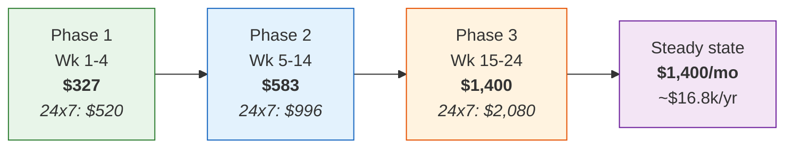

# 03 — Cost Estimate

**Up:** [UAT environment plan](./README.md)

All figures **USD per month**, `ap-south-1` (Mumbai), on-demand list pricing, no Savings Plans.
Two columns throughout: **24×7** (what it costs if nobody switches anything off) and
**Optimised** (with the schedule in [04](./04-cost-optimisation-and-scheduling.md) applied).

### Pricing assumptions

| Assumption | Value |
|---|---|
| Hours in a month | 730 |
| **Optimised running hours** | **~300** (41% uptime — Mon–Fri 08:30–21:00 + Sat 09:00–14:00) |
| EKS control plane | $0.10 /hr |
| `m7g.large` / `m7g.xlarge` | ~$0.0857 / ~$0.1714 /hr |
| Spot discount | ~65% off on-demand |
| Aurora Serverless v2 | ~$0.12 /ACU-hr · storage ~$0.115 /GB-mo |
| NAT Gateway | ~$0.056 /hr + ~$0.056 /GB processed |
| ElastiCache `t4g.micro`/`small`/`medium` | ~$0.017 / $0.034 / $0.068 /hr |
| MSK `kafka.t3.small` | ~$0.051 /hr/broker + storage |
| CloudWatch Logs ingest | ~$0.63 /GB |

**Confidence: ±20%.** These are list prices at time of writing. The two line items that most
often blow past estimate are **CloudWatch Logs ingest** (driven by how chatty the services are)
and **NAT data processing** (driven by image pull volume — which is exactly what the free S3
Gateway Endpoint mitigates).

---

## Phase 1 — Weeks 1–4

| Component | 24×7 | Optimised |
|---|---:|---:|
| EKS control plane | 73 | 73 |
| Worker nodes — 3 × `m7g.large` | 188 | 77 |
| EBS `gp3` — 3 × 50 GB | 14 | 14 |
| NAT Gateway (hourly) | 41 | 41 |
| NAT data processing | 18 | 6 |
| ALB × 1 | 18 | 18 |
| Aurora Serverless v2 — 1 cluster, ~1 ACU avg | 88 | 36 |
| Aurora storage + backup (20 GB) | 4 | 4 |
| ElastiCache `cache.t4g.micro` | 12 | 12 |
| S3 (50 GB + requests) | 4 | 4 |
| ECR (50 GB) | 5 | 5 |
| Secrets Manager (25 secrets) | 10 | 10 |
| KMS (2 CMK) | 3 | 3 |
| CloudWatch Logs (40 GB, 7-day) | 28 | 14 |
| Route 53 + ACM + EIP | 6 | 6 |
| Data transfer out | 8 | 4 |
| **Total** | **$520** | **$327** |

**Saving: 37%.** Note what does *not* move: the EKS control plane, NAT hourly, ALB, ElastiCache,
and storage together are $92 of irreducible baseline — 28% of the optimised bill. In Phase 1 the
schedulable share is high, which is why the percentage saving is good here and declines later.

---

## Phase 2 — Weeks 5–14

| Component | 24×7 | Optimised |
|---|---:|---:|
| EKS control plane | 73 | 73 |
| Worker nodes — 3 × `m7g.xlarge` | 375 | 154 |
| Karpenter Spot (CI + batch burst) | 22 | 11 |
| EBS `gp3` — 4 × 60 GB | 22 | 22 |
| NAT Gateway + data processing | 71 | 51 |
| ALB × 2 (public + internal) | 36 | 36 |
| API Gateway (HTTP API) | 5 | 5 |
| AWS WAF (1 ACL + 4 managed rule groups) | 14 | 14 |
| Aurora — `core` cluster, ~1.5 ACU avg | 131 | 54 |
| Aurora — `regulated` cluster, ~0.8 ACU avg | 70 | 29 |
| Aurora storage + backup (60 GB) | 10 | 10 |
| ElastiCache `cache.t4g.small` | 25 | 25 |
| DynamoDB on-demand (4 tables) | 18 | 10 |
| SNS + SQS | 3 | 2 |
| S3 (150 GB) | 9 | 9 |
| ECR (100 GB) | 10 | 10 |
| Secrets Manager (45 secrets) | 18 | 18 |
| KMS (4 CMK) | 6 | 6 |
| CloudWatch Logs (80 GB, 7-day) | 55 | 28 |
| Route 53 / ACM / EIP / misc | 8 | 8 |
| Data transfer | 15 | 8 |
| **Total** | **$996** | **$583** |

**Saving: 41%** — the best of the three phases. Compute is at its highest share of the bill and
compute is fully schedulable. DynamoDB on-demand also contributes: it bills per request, so it
costs almost nothing overnight without any scheduling logic at all.

---

## Phase 3 — Weeks 15–24 and steady state

| Component | 24×7 | Optimised |
|---|---:|---:|
| EKS control plane | 73 | 73 |
| Worker nodes — 4 × `m7g.xlarge` | 500 | 206 |
| Karpenter Spot (load test + batch) | 33 | 33 |
| EBS `gp3` — 6 × 80 GB | 44 | 44 |
| **Amazon MSK — 3 × `kafka.t3.small` + storage** | **147** | **147** |
| NAT Gateway + data processing | 86 | 61 |
| ALB × 2 + CloudFront | 58 | 58 |
| API Gateway | 10 | 10 |
| AWS WAF (edge + regional) | 28 | 28 |
| Aurora — 3 clusters, ~4 ACU avg combined | 350 | 144 |
| Aurora reader (`regulated`), ~1 ACU | 88 | 36 |
| Aurora storage + backup + cross-region copy | 35 | 35 |
| **ElastiCache `cache.t4g.medium` × 2 Multi-AZ** | **100** | **100** |
| DynamoDB on-demand (7 tables) + PITR | 45 | 28 |
| SNS / SQS / Lambda | 8 | 6 |
| S3 (400 GB) | 22 | 22 |
| ECR (150 GB) | 15 | 15 |
| Secrets Manager (70 secrets) | 28 | 28 |
| KMS (6 CMK) | 10 | 10 |
| Amazon Managed Prometheus | 45 | 25 |
| **Amazon Managed Grafana** (3 editors + 10 viewers) | **77** | **77** |
| Athena + Glue (MIS) | 25 | 25 |
| CloudWatch Logs (150 GB, 7-day) | 100 | 50 |
| **GuardDuty + Security Hub + Config** | **65** | **65** |
| AWS Backup (cross-region → `ap-south-2`) | 30 | 30 |
| Route 53 / ACM / EIP / misc | 12 | 12 |
| Data transfer + cross-region | 45 | 30 |
| **Total** | **$2,080** | **$1,400** |

**Saving: 33%** — and the drop from Phase 2's 41% is the important number in this document.

### Why the saving rate falls

The bolded rows above are **always-on**: MSK, ElastiCache Multi-AZ, Managed Grafana, GuardDuty /
Security Hub / Config. Together they are **$389/month that no shutdown schedule can touch** — 28%
of the optimised Phase 3 bill, up from effectively $12 in Phase 1.

This is the structural argument behind the whole plan: **scheduling optimises the schedulable, so
the real lever is deferring the un-schedulable.** Every month MSK arrives earlier than needed is
$147 that no amount of automation recovers. That is why Phase 3's component list is late and
short rather than "the target architecture, but smaller".

---

## Programme totals

### Build-out, weeks 1–24 (~5.5 months)

| Phase | Duration | Optimised | 24×7 |
|---|---|---:|---:|
| Phase 1 | 1.0 month | $327 | $520 |
| Phase 2 | 2.3 months | $1,341 | $2,291 |
| Phase 3 | 2.3 months | $3,220 | $4,784 |
| **Total** | **5.5 months** | **~$4,900** | **~$7,600** |

**Saved during build-out: ~$2,700 (36%).**

### Steady state after go-live

| | Monthly | Annual |
|---|---:|---:|
| Optimised | $1,400 | **~$16,800** |
| 24×7 | $2,080 | ~$25,000 |
| **Annual saving** | | **~$8,200** |

Indicative INR at ₹88/USD: build-out ~₹4.3 lakh optimised (vs ~₹6.7 lakh), steady state
~₹14.8 lakh/year (vs ~₹22 lakh). **Confirm the FX rate with finance** — it is not an
architecture input and it moves.

---

## Cost trajectory

---

## Where this estimate is most likely to be wrong

Ranked by expected size of error:

| # | Risk | Direction | Mitigation |
|---|---|---|---|
| 1 | **CloudWatch Logs volume.** 16+ chatty Spring Boot services at `DEBUG` can produce 5× the assumed ingest | ↑ up to +$200/mo | `INFO` default in UAT; 7-day retention; sample access logs; consider shipping to S3 instead of CloudWatch for bulk |
| 2 | **Load testing in Phase 3.** A sustained test suite breaks both the node sizing and the schedule | ↑ $100–400/mo | Budget test windows explicitly; use Spot generators; scale ACU back down after |
| 3 | **Aurora ACU consumption.** The 1–2 ACU average assumes genuinely low UAT concurrency | ↑ or ↓ 30% | `max_capacity` caps the downside. Measure after Phase 1 and re-baseline |
| 4 | **NAT data processing.** Large images × frequent deploys | ↑ +$30–60/mo | S3 Gateway Endpoint (free, Phase 1); slim base images; layer caching |
| 5 | **Managed Grafana user count.** Per-user, per-month — it grows quietly as squads onboard | ↑ $5–9 per user | Quarterly user audit; viewers not editors by default |
| 6 | **AWS list price changes / FX** | ↕ ±10% | Re-baseline quarterly |

---

## Recommended budget lines

Set AWS Budgets with alerts at **60% / 85% / 100%** to the Solution Architect and Platform Lead:

| Phase | Monthly budget | Rationale |
|---|---:|---|
| Phase 1 | $450 | Optimised estimate + ~35% tolerance while the schedule beds in |
| Phase 2 | $750 | |
| Phase 3 / steady state | $1,750 | |

Also enable **AWS Cost Anomaly Detection** on the UAT account. In an environment that is supposed
to be idle 59% of the time, an anomaly detector is unusually effective — anything running at 03:00
on a Sunday is, by definition, an anomaly worth a page.

---

**Next:** [04-cost-optimisation-and-scheduling.md](./04-cost-optimisation-and-scheduling.md) — how the saving is actually realised.
