# 05 — Lead Times & External Dependencies

**Up:** [UAT environment plan](./README.md)

The infrastructure in [02](./02-component-and-sizing-matrix.md) can be provisioned in about a
week. **It is not what will delay Phase 1.** What delays Phase 1 is a set of approvals and
whitelists that live outside engineering, several of which take longer than the phase itself.

This page exists so those are started in week 0 rather than discovered in week 3.

---

## Start these in week 0 — before any Terraform is written

| # | Dependency | Lead time | Owner | Blocks |
|---|---|---|---|---|
| 1 | **1SB whitelisting of the UAT NAT egress EIP** | **2–4 weeks** *(external)* | PO + 1SB relationship | **GATE-P4 4.3** |
| 2 | **1SB UAT distributor credentials** | **2–6 weeks** *(external)* | PO | **GATE-P4 4.3** |
| 3 | **AWS account vending** — dedicated `uat` account under the Org | 1–3 weeks | Bank Cloud CoE | Everything |
| 4 | **Site-to-Site VPN / Direct Connect** for tester access from the bank network | **3–6 weeks** | Bank Network | UAT usability |

These four are the critical path. Items 1 and 2 are the ones that historically slip, they are
already flagged as an external dependency in `R0-SCOPE.md` §6, and **neither can be accelerated by
engineering effort.** They are relationship-paced.

### The EIP ordering problem

There is a sequencing trap in item 1 worth calling out explicitly:

> 1SB whitelists an IP address. That address is the UAT NAT Gateway's Elastic IP. The EIP cannot
> be requested from 1SB until the VPC and NAT Gateway exist — but the whitelist takes 2–4 weeks,
> which is most of Phase 1.

**Mitigation:** allocate the Elastic IP as the *very first* provisioned resource — an EIP can be
allocated and held before the NAT Gateway that will use it exists — and send it to 1SB on day 1.
Then build the rest of the landing zone while the whitelist request is in flight. This converts a
serial dependency into a parallel one and is worth roughly two weeks on the critical path.

It also reinforces the single-NAT decision in [02](./02-component-and-sizing-matrix.md): one EIP
to whitelist, not three.

---

## Start in weeks 1–2

| # | Dependency | Lead time | Owner | Blocks |
|---|---|---|---|---|
| 5 | **DNS delegation** for the UAT hostname | 1–2 weeks | Bank Network / DNS | Ingress, TLS |
| 6 | **Bank AD/SSO federation metadata** for Keycloak | 2–4 weeks | Bank IAM | **GATE-IAM-P1** |
| 7 | **TLS certificate** for the bank domain (or ACM validation rights) | ~1 week | Bank PKI | Ingress |
| 8 | **Synthetic / masked test data set** | ~2 weeks | PO + Data | Meaningful UAT |
| 9 | **VPC CIDR allocation** — non-overlapping with bank and prod ranges | ~1 week | Bank Network | VPC creation |
| 10 | IaC baseline (Terraform/CDK) + state backend | 1–2 weeks | Platform team | Everything |

**Item 8 is not optional and not merely a data task.** No production PII may enter UAT. If the
masked data set is not ready, UAT runs on synthetic records that may not exercise real edge
cases — which weakens every test result that follows. Start it early enough that it is not the
thing compromised under schedule pressure.

**Item 6** gates the WS-2 identity gate specifically. Phase 1 can run Keycloak standalone with
local users, so it does not block the environment — but it does block `GATE-IAM-P1`, so the
federation metadata request should go in during week 1 even though it is not needed until later.

---

## Start before Phase 3

| # | Dependency | Lead time | Owner | Blocks |
|---|---|---|---|---|
| 11 | **Security review / VAPT slot** for the UAT endpoint | **3–4 weeks to book** | Bank InfoSec | Phase 3 exit |
| 12 | **Compliance sign-off** on audit schema and retention | Organisationally paced | Compliance | GATE-P4 4.4, Phase 3 exit |
| 13 | **Architecture review approval** (PO / Compliance / Sponsor) | Organisationally paced | Sponsor | **Phase 2 and 3 provisioning** |
| 14 | Load-test scenarios and data volumes | 2 weeks | QA Lead | Phase 3 exit |

**Item 13 is the governance gate on this whole plan.** Per the triage in the
[README](./README.md#governance-position), Phases 2 and 3 are *costed but not authorised* — the
architecture review is still a recommendation. Book that approval conversation early; it is a
calendar dependency, not an engineering one, and it sits in front of ~$1,400/month of committed
spend.

**Item 11** is booked, not requested — InfoSec calendars fill weeks ahead. Book the slot in
Phase 2 for a Phase 3 date.

---

## Timeline view

```mermaid
gantt
    title UAT environment — dependencies vs. build
    dateFormat X
    axisFormat W%d

    section External (start wk 0)
    1SB EIP whitelist         :crit, a1, 0, 4
    1SB UAT credentials       :crit, a2, 0, 6
    AWS account vending       :crit, a3, 0, 3
    VPN / Direct Connect      :a4, 0, 6

    section Bank internal
    DNS delegation            :b1, 1, 3
    Bank AD federation        :b2, 1, 5
    TLS certificate           :b3, 2, 3
    Masked test data          :b4, 2, 4

    section Build
    Phase 1 infrastructure    :done, c1, 1, 4
    Phase 2 infrastructure    :c2, 4, 14
    Phase 3 infrastructure    :c3, 14, 24

    section Approvals
    Architecture review sign-off :crit, d1, 2, 8
    InfoSec VAPT slot booking    :d2, 10, 14
```

The shape to notice: **the external bars start before the build bars and run past Phase 1's
infrastructure work.** Phase 1's infrastructure is done in week 4; Phase 1's *exit criteria* are
not met until the 1SB whitelist and credentials land. Provisioning is not the bottleneck.

---

## Decisions the platform team must make in week 1

None of these are blockers if decided quickly, but all of them are expensive to reverse later:

| Decision | Recommendation | Why |
|---|---|---|
| **IaC tool** | Terraform *or* CDK — pick one and commit | The environment is rebuilt often; drift between two tools is worse than either tool |
| **Node OS** | Bottlerocket | Smaller attack surface, and faster boot — which matters when the cluster starts 22 times a month |
| **Pod identity** | EKS Pod Identity, not IRSA | Simpler trust policy, no per-role OIDC provider configuration |
| **Node autoscaling** | Karpenter (not Cluster Autoscaler) | Per [architecture-review/04](../architecture-review/04-aws-infrastructure-architecture.md); also does the node scale-in for the shutdown schedule for free |
| **GitOps** | Argo CD, app-of-apps | |
| **Secrets** | External Secrets Operator → Secrets Manager | Not sealed-secrets — secrets should not live in git in any form |
| **Ingress** | ALB via AWS LB Controller; API Gateway added Phase 2 | |
| **Image build** | `docker buildx`, multi-arch `amd64` + `arm64` | **Prerequisite for Graviton.** If this is not done in Phase 1, the ~20% compute saving is lost |
| **Account strategy** | Dedicated `uat` account | Namespace isolation is not an audit boundary |

---

## Risks to register

Candidates for [`RISK-REGISTER.md`](../../governance/registers/RISK-REGISTER.md) — raised here,
to be registered by the risk owner rather than minted by an agent:

| Risk | Impact | Likelihood | Mitigation |
|---|---|---|---|
| 1SB whitelist/credentials slip past week 4 | **GATE-P4 4.3 cannot close** — the current gate stays open | Medium-High | Request in week 0 with a pre-allocated EIP; escalate through the 1SB relationship, not through engineering |
| Architecture review not approved before week 5 | Phase 2 provisioning stalls; squads outgrow Phase 1 capacity | Medium | Book the approval conversation now; Phase 1 sizing has `max: 6` headroom to absorb ~2 weeks of slip |
| Bank InfoSec rejects single NAT / single-AZ data tier in UAT | +$80–350/mo | Low-Medium | Raise the design with InfoSec in week 1, not at the Phase 3 review |
| Multi-arch image build not done in Phase 1 | ~20% compute saving lost across all phases | Medium | Make it a Phase 1 exit criterion for the platform team |
| Shutdown schedule disabled after a failed morning start | Silent return to 24×7; ~$8.2k/year | **Medium-High** | Alert on failed *starts*; ship the `hold-until` override on day one so nobody needs to disable the schedule |

That last risk is the one most likely to actually materialise. The schedule will not be
undermined by a technical failure — it will be undermined by one bad morning and a frustrated
squad lead. Design for that.

---

**Next:** [06-platform-team-request-forms.md](./06-platform-team-request-forms.md) — copy-paste tickets.
