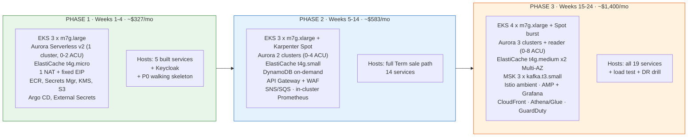

# UAT Environment — Phased Infrastructure Plan & Cost Model

**Up:** [docs index](../../README.md) → [platform](../README.md) → **UAT environment plan**
**Role:** Solution Architect → Platform / Cloud Engineering team
**Region:** `ap-south-1` (Mumbai) · **Cloud:** AWS only · **Compute:** Amazon EKS
**Status:** ⚠️ **Provisioning request + planning input.** Phase 1 is actionable now. Phases 2–3
are conditional — see [Governance position](#governance-position).

---

## What this is

The [architecture review](../architecture-review/README.md) says *what* the platform looks like
at target state — ~16 microservices on EKS, database-per-service, Kafka event backbone. It does
not say **what to buy, when, at what size, and what it costs**.

This folder closes that gap for the **UAT environment only**. It is written to be handed
straight to the platform team as a provisioning request: every component has a phase, a
configuration, a quantity, and a reason. It also states what the environment must **not** run —
because in a test environment, the things you switch off are worth more than the things you
right-size.

**Headline:** UAT reaches full-platform capability over three phases across ~24 weeks, ending at
**~$1,400/month** with scheduling optimisations applied, versus **~$2,080/month** if left running
24×7. Phase 1 starts at **~$327/month**.

---

## How to read this

| # | Document | Answers |
|---|----------|---------|
| 1 | [01-phase-plan-and-scope.md](./01-phase-plan-and-scope.md) | What lands in each phase, why, and the entry/exit criteria |
| 2 | [02-component-and-sizing-matrix.md](./02-component-and-sizing-matrix.md) | **The request table** — every component, config, quantity, per phase |
| 3 | [03-cost-estimate.md](./03-cost-estimate.md) | Line-item monthly cost per phase, 24×7 vs optimised, programme total |
| 4 | [04-cost-optimisation-and-scheduling.md](./04-cost-optimisation-and-scheduling.md) | The shutdown schedule, how to implement it, and 16 further cost levers |
| 5 | [05-lead-times-and-dependencies.md](./05-lead-times-and-dependencies.md) | **Start these in week 0** — external dependencies that will delay you |
| 6 | [06-platform-team-request-forms.md](./06-platform-team-request-forms.md) | Copy-paste ticket text, one per phase |

**Platform team in a hurry:** read [02](./02-component-and-sizing-matrix.md) and
[06](./06-platform-team-request-forms.md). **Finance/sponsor in a hurry:** read
[03](./03-cost-estimate.md).

---

## The three phases at a glance



The growth is deliberate and one-directional: **every always-on managed service is introduced as
late as its dependent workload allows**, because always-on services are the ones the shutdown
schedule cannot save you from. MSK alone is $147/month that no cron job can reclaim — so it
arrives in Phase 3, with the audit/reporting consumers that need it, and not a week earlier.

---

## The five decisions that drive this plan

1. **Aurora PostgreSQL Serverless v2 with `min_capacity = 0`**, not provisioned RDS. It
   auto-pauses when idle and resumes in under 15 seconds, so the database follows the shutdown
   schedule with no automation at all — while keeping the same engine as production. This single
   choice is worth ~60% of the database bill.
2. **Graviton (`m7g`) everywhere.** ~20% cheaper than the Intel equivalent and better
   price/performance for JVM workloads. Cost: the platform team must publish multi-arch images
   (`docker buildx --platform linux/amd64,linux/arm64`) from Phase 1.
3. **One Aurora cluster in Phase 1, database-per-service *logically*.** The target architecture's
   database-per-service rule is about ownership boundaries — separate schema, separate role, no
   cross-database grants, own Flyway history. In UAT those boundaries are enforced with grants,
   not with nine separate clusters. Physical split happens at Phase 2 (regulated data) and
   Phase 3, not on day one.
4. **A single NAT Gateway, not one per AZ.** Saves $82/month, and the resulting *single* fixed
   egress EIP is actually an advantage — it is the one IP the platform team has to get whitelisted
   by 1SB, which is the longest external lead time on the project.
5. **No Savings Plans or Reserved Instances for UAT.** An environment deliberately switched off
   ~59% of the time has too low a utilisation floor to commit to. Commit those for production
   instead. Buying a 1-year Compute Savings Plan for a scheduled-off UAT is the most common and
   most expensive mistake in this category.

---

## Cost summary

| | Phase 1 | Phase 2 | Phase 3 / steady state |
|---|---|---|---|
| **24×7** | $520 /mo | $996 /mo | $2,080 /mo |
| **Optimised** | **$327 /mo** | **$583 /mo** | **$1,400 /mo** |
| Saving | 37% | 41% | 33% |

Build-out cost, weeks 1–24: **~$4,900 optimised** vs ~$7,600 at 24×7.
Steady-state UAT after go-live: **~$16.8k/year** vs ~$25k at 24×7.

Note the saving *percentage* falls as the environment matures. That is not a failure of the
optimisation — it is the always-on tail (MSK, ElastiCache, Managed Grafana, GuardDuty) growing as
a share of the bill. It is the reason [04](./04-cost-optimisation-and-scheduling.md) argues for
deferring always-on services rather than only scheduling the schedulable ones.

Full line-item breakdown and all pricing assumptions: [03-cost-estimate.md](./03-cost-estimate.md).

---

## The optimisation schedule (summary)

| Window (IST) | State |
|---|---|
| Mon–Fri 08:30 – 21:00 | **UP** |
| Mon–Fri 21:00 – 08:30 | DOWN |
| Sat 09:00 – 14:00 | **UP** (defect-fix / regression window) |
| Sat 14:00 – Mon 08:30 | DOWN |
| Bank public holidays | DOWN |

≈ **296 running hours/month against 730** — 41% uptime, 59% off. With a documented override for
overnight load tests and joint 1SB testing windows, so the schedule never blocks the work it
exists to fund. Mechanism, override design, and failure guardrails:
[04-cost-optimisation-and-scheduling.md](./04-cost-optimisation-and-scheduling.md).

---

## Governance position

Triaged through the [AIGEM pipeline](../../governance/README.md) before this document was written.
Freshness check: `VERDICT: FRESH` (exit 0).

```text
SUG-20260811-u1t · "Phased UAT environment + AWS infrastructure requirement plan"

Stage:      SPLIT VERDICT — the request spans two lifecycle positions
            Phase 1  → SF0 PREREQUISITE. WS-1 is at Phase 4 whose objective is literally
                       P4-UAT-SIGNOFF, and GATE-P4 criterion 4.3 ("at least one bank caller
                       exercises quote + proposal against UAT") cannot be met without a UAT
                       environment. It also gates GATE-IAM-P1 for WS-2.
            Phase 2-3 → SF3 PREMATURE. Depends on the architecture review, which is still a
                       recommendation not approved by PO/Compliance/Sponsor.
Scope:      SC1 derived — serves P4-UAT-SIGNOFF (gate criteria 4.3, 4.5) and GATE-IAM-P1.
            Rule SC-1 beneficiary named.
Necessity:  Phase 1  MUST now (blocks the open gate)
            Phase 2-3 SHOULD as a planning artefact · MUST at their target stage
Verdict:    ADMIT  — SUG-20260811-u1t · this plan document + the Phase 1 provisioning request
            PARK   — SUG-20260811-u2p · Phase 2-3 *execution*, unparks on
                     architecture-review approval by PO + Compliance + Sponsor
Priority:   Phase 1 P1 now (hard P1 override: blocking dependency) · Phase 2-3 P4 / P1 at target
Type:       INFRA (T3 — new environment, external dependencies, spend commitment)
Recorded:   docs/governance/registers/SUGGESTION-REGISTER.md §3 (full records)
            docs/governance/registers/PARKED-BACKLOG.md §1 (SUG-20260811-u2p)
```

Three consequences of that triage, which the platform team should treat as binding:

- **Phase 1 is not blocked by anything internal.** It can start immediately; every open
  compliance question in the [decision log](../architecture-review/06-security-compliance-and-nfrs.md)
  gates Phase 3, not Phase 1.
- **Phase 2 and 3 are costed but not authorised.** Provisioning them requires the architecture
  review to be approved and the spend to be sponsored. Treat the numbers as a forecast for that
  approval conversation, not as a purchase order.
- **Kafka/MSK sits in Phase 3 deliberately.** `CURRENT-STATE.yaml` lists "Kafka / event backbone"
  as out of scope until the integration-architecture stage. Phase 3 is where its consumers
  (Audit, Notification, Reporting) land. Phase 2's async needs are served by SNS+SQS, which is
  pay-per-request and therefore free when the environment is switched off.

---

## What this plan deliberately excludes

| Excluded | Why |
|---|---|
| **Production environment** | Different sizing, different availability targets, Multi-AZ everywhere, Savings Plans, no shutdown schedule. Needs its own model. |
| **A dev AWS environment** | The repo already ships `docker-compose.yml` and `docker-compose.identity.yml`. Developers work locally through Phase 1. Revisit at Phase 2 only if local compose stops being representative. |
| **DR warm standby in `ap-south-2`** | Phase 3 provisions cross-region *backup* to prove the restore runbook. A warm standby is a production control and roughly doubles the bill. |
| **Bank-internal network charges** | Direct Connect / VPN ports, bank chargebacks, and inter-DC transfer are outside the AWS bill and outside this estimate. |
| **Licences and third-party tooling** | Grafana Enterprise, commercial APM, Kubecost paid tier, load-test SaaS. In-cluster/open-source equivalents are assumed throughout. |
| **Non-production data acquisition** | Synthetic/masked test data generation is effort, not infrastructure. Tracked as a dependency in [05](./05-lead-times-and-dependencies.md). |

---

## Estimate confidence

The sizing is derived from the service inventory in
[02-target-microservices-architecture.md](../architecture-review/02-target-microservices-architecture.md)
and a per-pod model of 250m CPU / 1Gi memory requests for a Spring Boot 3.3 / JDK 21 service under
UAT load. That model is stated explicitly in
[02-component-and-sizing-matrix.md](./02-component-and-sizing-matrix.md) so it can be challenged
with one number rather than re-derived.

**Treat the cost figures as ±20%.** They are built from public `ap-south-1` on-demand list
pricing at the time of writing, and three things move them: AWS list-price changes, actual image
size and log volume (both of which drive NAT and CloudWatch charges harder than people expect),
and how much load testing Phase 3 actually does. Re-baseline against real Cost Explorer data at
the end of Phase 1 — one month of measured spend is worth more than any amount of further
estimating.

---

## Related

- Target architecture this environment hosts: [architecture-review/02](../architecture-review/02-target-microservices-architecture.md)
- AWS service choices this plan implements: [architecture-review/04](../architecture-review/04-aws-infrastructure-architecture.md)
- Data architecture and per-service datastores: [architecture-review/05](../architecture-review/05-data-architecture.md)
- NFRs the Phase 3 load test must prove: [architecture-review/06](../architecture-review/06-security-compliance-and-nfrs.md)
- Delivery phases this infrastructure plan tracks: [architecture-review/07](../architecture-review/07-delivery-roadmap-and-estimate.md)
- Workforce identity components hosted from Phase 1: [authentication-authorization](../authentication-authorization/README.md)
