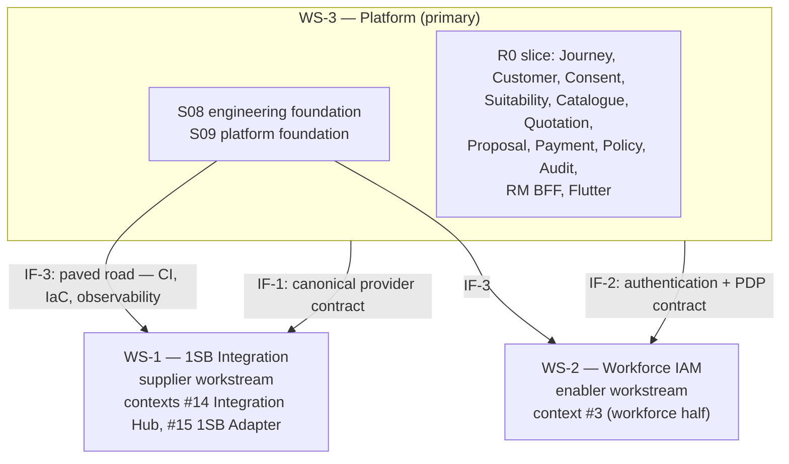

# WS-3 — Architecture Registration Proposal

**Proposed under:** [CR-010](../../governance/change-requests/CR-010-context-module-and-safe-autopilot.md)
**Author:** Mahesh — Principal Insurance Platform Architect (Board 1 / R2)
**Counterpart:** Rajal's Product charter for WS-3 (concurrent, separately authored)
**Board 1 verdict:** [`board-1-architecture-mahesh.md`](../../governance/change-requests/CR-010/verdicts/board-1-architecture-mahesh.md)
**Status:** AI-DRAFTED architecture proposal. **The orchestrator transcribes §7 into
`CURRENT-STATE.yaml`; I do not edit that file** ([`04-GATE-AND-SIGNOFF-MODEL.md §4`](../../application-lifecycle-bible/04-GATE-AND-SIGNOFF-MODEL.md):
only Mahesh + Rajal jointly, as humans, may edit it).

---

## 1. What is being registered, and why it is an architecture matter

[`01-POSITION-ASSESSMENT.md` GAP-D](../../application-lifecycle-bible/01-POSITION-ASSESSMENT.md)
is correct and it is a **structural** finding, not a Product one:

> Governance evaluates stage fit against a workstream. If the platform is not a workstream, then
> platform foundation work — CI, IaC, the Consent service, the Flutter app — belongs to no
> workstream, and therefore triages as out of scope.

That is an architecture defect in the governance model's routing, and routing is mine. The system
has been faithfully excluding the foundation because the thing the foundation belongs to was never
registered. Rajal owns *what* WS-3 delivers and *why*. I own **the technical shape of the
workstream, its boundaries, its interfaces to WS-1 and WS-2, the gate it must pass, and the
standing constraints it adds.**

Product scope for WS-3 is Rajal's charter. This document is deliberately silent on it.

---

## 2. The technical shape of WS-3

| Property | Value |
|---|---|
| **Id** | WS-3 |
| **Name** | AU Bank Insurance Distribution Platform |
| **Scope, architecturally** | The 19 bounded contexts in [`business-problem-statement.md §6`](../../context/business-problem-statement.md) **minus** #15 (WS-1) and the workforce half of #3 (WS-2), plus the Flutter client and the platform's own engineering and runtime foundations |
| **Primary deliverable at R0** | Twelve services plus one Flutter application, sequenced in [`03-solution-architecture-r0.md §3`](./03-solution-architecture-r0.md) — **not** nineteen |
| **Relationship to WS-1** | WS-1 becomes a **supplier workstream** delivering contexts #14 and #15 behind an interface WS-3 owns |
| **Relationship to WS-2** | WS-2 is an **enabler workstream** delivering context #3 (workforce half) behind an interface WS-3 consumes |
| **Current stage** | **S08 — Engineering Foundation**, with S09 running overlapped |
| **Current gate** | GATE-S08, state `OPEN` |
| **Architecture authority** | This document plus [`01`](./01-domain-model-and-invariants.md)–[`05`](./05-nfr-catalogue.md) and the existing [`architecture-review/`](../architecture-review/README.md) |

### 2.1 Why S08 and not S06, S07 or S11

The temptation is to register WS-3 at S06 or S07 because its domain and solution architecture were
incomplete. I reject that, for a specific reason.

| Candidate | Why not |
|---|---|
| S06 / S07 | The gaps were real but they were **documentation-shaped**, and they are closed by this increment (see the evidence files). Registering at S06 would put the workstream three stages behind the code that already exists and would make every existing service out of scope for maintenance |
| S10 / S11 | S11 needs a UI that does not exist, six services that do not exist, and two P0 compliance gaps (GAP-006/007) that are explicitly labelled build-freeze. Registering at S11 would legitimise starting the sixteen missing contexts, which [`03-REALIGNMENT-PLAN.md §4`](../../application-lifecycle-bible/03-REALIGNMENT-PLAN.md) correctly identifies as repeating the original error at four times the scale |
| **S08** | The binding constraint is not knowledge, it is **machinery**. Roughly 20,000 lines of Java in a regulated financial application have never been built or tested by an automated system. Every gate criterion at E3 or E4 downstream depends on machinery S08 installs. S08 is where the workstream actually is |

S09 runs **overlapped**, not sequential, for one architectural reason: the S08 deployment pipeline
is an extension of the S09 platform, and building them in series produces a CI pipeline with
nowhere to deploy followed by a platform with nothing proven to deploy onto. The S09 stage file
states this as an entry criterion; I am ratifying it as the sequencing decision.

### 2.2 The registration does **not** move WS-1

WS-1's `L7 — Hardening` classification stays true — **for a component**. Re-parenting changes what
WS-1 is *hardening for*, not how far along it is. Nothing in this proposal demotes WS-1's stage, and
any reading of it that does is a misreading.

---

## 3. Workstream topology and interface contracts



### IF-1 — WS-3 ↔ WS-1 (supplier)

| Aspect | Contract |
|---|---|
| **Consumer** | Quotation, Proposal, Payment, Policy — via Integration Hub only. **No WS-3 service calls the 1SB Adapter directly** |
| **Language** | Bank-canonical. Provider vocabulary terminates inside `adapter.<provider>.*` (INV-ACL-01) |
| **Style** | Async-poll for quote and proposal; sync for payment session and status (seams S-09…S-13, S-16) |
| **Correlation** | WS-3 owns `journeyId` and the business aggregate ids; WS-1 owns `jobId` and provider references. WS-1's `jobId` is never a bank-caller handle (ID-03) |
| **Attribution** | The Hub injects `distributorId` and agent identity server-side. WS-1 **must reject** a caller-supplied value (INV-DIS-01) — today this is only partial (C3 🟡) |
| **Idempotency** | Server-derived keys from the WS-3 aggregate id; WS-1's existing 24-hour idempotency contract is preserved unchanged |
| **Failure semantics** | `PARTIAL` is success; no automatic retry on submit; poll-to-recover. WS-1's existing rules become the platform contract, not the exception |
| **Evolution** | Adding a provider is a new adapter behind the Hub's routing policy — never a change to Quotation, Proposal, Payment or Policy. This is S07-VT-08 and it is the reason the Hub exists |
| **Ownership of change** | WS-1 may change adapter internals freely; any change to the canonical contract at the Hub boundary is an ARCH/ADR decision and a WS-3 concern |

### IF-2 — WS-3 ↔ WS-2 (enabler)

| Aspect | Contract |
|---|---|
| **Consumer** | RM Workspace BFF for session; every WS-3 service for authorisation |
| **Session** | Token-hiding BFF. Flutter never receives OAuth tokens (standing constraint). WS-3 consumes an opaque session, never a provider token |
| **Authorisation** | Query the PDP (`identity-authorization-service`). WS-3 never derives entitlements from IdP claims, and never treats the IdP as the source of truth for business authorisation (standing constraint) |
| **Failure** | **Fail closed.** A PDP timeout is a deny, never a degraded allow (seam S-02) |
| **Attributes WS-3 depends on** | Principal id, roles, branch, hierarchy, insurer scope, **SP certification validity** (INV-LED-03) |
| **Gap** | WS-2 excludes retail-customer authentication. R0-SCOPE puts self-service in Day-1 scope. **Unresolved** — condition C-07 in the Board 1 verdict |
| **Ownership of change** | WS-2 owns the identity implementation; WS-3 owns which decisions it asks for. Neither may change the PDP contract unilaterally |

### IF-3 — Foundation paved road (WS-3 → WS-1, WS-2)

The S08/S09 foundation is built **once, in WS-3, and consumed by all three workstreams**. Building
a second pipeline or a second IaC estate for WS-1 would recreate at the platform level exactly the
duplication that the shared `bank-common-*` libraries correctly avoid at the code level.

| Provided | Consumed by |
|---|---|
| Application CI: build, test, coverage, ArchUnit, static analysis | WS-1, WS-2, WS-3 |
| Security scanning: secret, SAST, SCA, image, SBOM | all |
| Test infrastructure: Testcontainers, WireMock, contract tests, E2E harness, performance harness | all |
| IaC modules, environments, deployment and rollback | all |
| Secrets management, KMS hierarchy | all |
| Observability substrate | all |

**Consequence for WS-1, stated explicitly.** WS-1 Phase 4 criteria 4.1 (sandbox E2E in CI), 4.6
(performance smoke) and 4.7 (coverage gates green) are **not achievable by WS-1 effort**. They
depend on IF-3 deliverables. That is why they must be `BLOCKED` on a named prerequisite rather than
`OPEN` — see §5.

---

## 4. The gate I require at S08

WS-3 does not leave S08 on my signature until **GATE-S08 as defined in
[`stages/S08-engineering-foundation.md §5`](../../application-lifecycle-bible/stages/S08-engineering-foundation.md)**
is met — criteria S08-G1 through S08-G10, at the evidence levels that file states. I am not
re-writing those criteria; changing a stage's exit criteria requires its own CR
([`14-CHANGE_CONTROL.md §1`](../../governance/14-CHANGE_CONTROL.md)), and the criteria as written
are correct.

What I add is the **architecture-specific admission rule** that makes the gate mean something:

> **AR-S08 — No stage passes S08 until the application has the same enforcement the governance
> documents already have.**
>
> The governance model is validated on every pull request by `ci-checks.py`, `validate-context.py`,
> `FreshnessCheck.java` and a link checker. The banking software it governs has, until this
> increment, had none. That inversion — noted as mechanism #2 in
> [`01-POSITION-ASSESSMENT.md §7`](../../application-lifecycle-bible/01-POSITION-ASSESSMENT.md) —
> is the defect S08 exists to correct, and the gate must be able to detect its recurrence.

Operationally, AR-S08 means the fifteen fitness functions in
[`03-solution-architecture-r0.md §7`](./03-solution-architecture-r0.md) that are marked *from S08*
must be **executing and failing builds**, demonstrated by a deliberately-broken pull request per
S08-VT-01…VT-05. A pipeline that runs but blocks nothing is gate-shaped configuration, not a gate.

**Merging the CR-010 `application-ci.yml` workflow does not satisfy S08-G1.** The workflow file is
a mechanism; S08-G1 requires evidence level E4 — a run history. Until there is a green run on a
pull request, the criterion is `OPEN` with the mechanism present, which is a materially better
position than before and is still not a pass.

### 4.1 Architecture approval conditions carried into GATE-S08

These are the items I will check as the `AP` approver at S08, over and above the stage criteria.

| # | Check |
|---|---|
| AR-S08-1 | FF-01…FF-07 and FF-11, FF-15 executing and demonstrated to fail a bad PR |
| AR-S08-2 | `allowEmptyShould(true)` removed from ArchUnit configuration (TD-007) — a rule that vacuously passes is worse than no rule, because it reports green |
| AR-S08-3 | The layer-dependency rules of [`03 §6`](./03-solution-architecture-r0.md) enforced in **every** module, not only `1sb-integration-service` |
| AR-S08-4 | No new bounded context implemented during S08 (realignment sequencing constraint §4) |
| AR-S08-5 | Contract tests exist at the integration ↔ persistence seam (closes TD-014's testing half) |

---

## 5. WS-1 Phase 4 criteria — the architecture re-statement

[`03-REALIGNMENT-PLAN.md §2 Move 1`](../../application-lifecycle-bible/03-REALIGNMENT-PLAN.md)
assigns this re-statement to *Mahesh + Swapnali*. Rule GS-3 is the governing rule: *if a criterion's
blocker is a missing prerequisite, mark it `BLOCKED` and name the prerequisite.*

| # | Criterion | Today | **Architecture re-statement** | Named prerequisite |
|---|---|---|---|---|
| 4.1 | Sandbox E2E suite runs in CI | `BLOCKED` on GATE-4.1-SANDBOX-E2E | **`BLOCKED`** — correct, and the prerequisite is broader than the sandbox: the E2E harness itself is an S08-E03-S05 deliverable | IF-3 · S08-E03-S05 · GATE-4.1-SANDBOX-E2E |
| 4.2 | OpenAPI published; consumer collection available | `PARTIAL` | **`PARTIAL`** — unchanged. Closable by WS-1 effort | — |
| 4.3 | A bank caller exercises quote + proposal against UAT | `BLOCKED` | **`BLOCKED`** — unchanged, and additionally: **no UAT environment exists**, which is an S09-E02-S01 deliverable, not only an external-partner dependency | DEP-001 · DEP-002 · S09-E02-S01 |
| 4.4 | Compliance review of audit schema and log samples | `OPEN` | **`OPEN`** — correct. Needs no CI; explicitly *not* stopped by Move 1. Architecture note: the four audit-model additions in [`02-information-model.md §5`](./02-information-model.md) should be in front of Shailja **before** she reviews, or the review will be repeated | — |
| 4.5 | Operations runbook | `OPEN` | **`OPEN`** — correct. Owner is Shivanshi (named by CR-008) | — |
| 4.6 | Performance smoke: p95 quote under nominal concurrency | `BLOCKED` on DEP-003 | **`BLOCKED`** — and the deeper blocker is that the criterion had **no threshold and no load definition**. Now supplied: NFR-LAT-03 and CAP-A6 | GAP-017 (now closed by [`05`](./05-nfr-catalogue.md)) · S08-E03-S07 performance harness · DEP-003 |
| 4.7 | Coverage gates green; QA-001 closed or waived with expiry | `PARTIAL` | **`BLOCKED`, not `PARTIAL`** | IF-3 · S08-E02-S01 |

### 5.1 The one criterion I am changing, and why

**4.7 moves from `PARTIAL` to `BLOCKED`.** JaCoCo is configured in `build.gradle.kts` and has never
executed on a pull request. A criterion whose closure depends on machinery that does not yet run is
`BLOCKED` by Rule GS-3, and calling it `PARTIAL` implies someone can close it by trying harder. It
returns to `PARTIAL` the moment application CI produces a green run, and closes when the service
threshold is set and met.

This is a Board 1 + Board 5 re-statement. **Swapnali's QA concurrence is required** and is not mine
to record; her verdict is authored separately by Rajal's lane.

> **This re-statement changes no exit criterion.** It changes the recorded *state* of criteria
> against Rule GS-3. Under [`14-CHANGE_CONTROL.md §1`](../../governance/14-CHANGE_CONTROL.md) that
> is not a criteria change and needs no separate CR — but it is inside CR-010's scope and is
> recorded here so it is visible rather than silent.

---

## 6. Standing constraints WS-3 adds

Existing standing constraints are unchanged and remain binding. WS-3 adds seven. Each is
SF4/REJECT-class: violating one is not a design debate.

| # | Constraint | Enforced by |
|---|---|---|
| SC-W3-1 | **No quote is produced without a valid, unexpired suitability assessment** | INV-QUO-01 · FF-12 · control C1 |
| SC-W3-2 | **No proposal is submitted without an unexpired consent grant** | INV-PRP-01 · control C2 |
| SC-W3-3 | **Premium payment executes only on the customer's device; no API path issues a payment link into an RM session** | INV-PAY-01 · FF-14 · control C4 |
| SC-W3-4 | **A policy is never issued against a payment that is not `RECONCILED`** | INV-POL-01 |
| SC-W3-5 | **No WS-3 service calls a provider adapter directly; all provider traffic routes through the Integration Hub** | ArchUnit + network policy |
| SC-W3-6 | **Journey Orchestration holds stage and references only — never another context's business decision** | INV-JRN-02 · FF-04 |
| SC-W3-7 | **Render.com is dev-preview only and is never a data path for PII, production or production-like data** | ADR-001 · control C6 |

SC-W3-1 through SC-W3-4 are restatements of non-waivable regulatory controls at the architecture
layer. They are listed as standing constraints so that AIGEM triage rejects a violating item in
three steps rather than discovering it at a review board.

---

## 7. Exact YAML for `CURRENT-STATE.yaml` — architecture-owned fields

**Transcribe, do not paraphrase.** These are the fields I am authorised to specify. Product fields
(`current_objective`, `current_deliverable`, `current_scope`) come from Rajal's charter; I have left
them as explicit placeholders rather than inventing Product scope.

Every path below was verified to exist at the time of writing, because `ci-checks.py` fails the
build on a missing `authority` or `routing` destination.

### 7.1 New workstream block — insert as the **first** entry under `workstreams:`

WS-3 is listed first because routing resolution treats the first key as the owning workstream, and
WS-3 is the primary workstream.

```yaml
  - id: WS-3
    name: "AU Bank Insurance Distribution Platform"
    authority:
      # Rajal's WS-3 Product charter is added here by the orchestrator once its path is fixed.
      - "docs/au-bank-insurance-platform/requirements/R0-SCOPE.md"
      - "docs/platform/ws3-platform/00-WS3-ARCHITECTURE-REGISTRATION.md"
      - "docs/application-lifecycle-bible/README.md"

    lifecycle:
      canonical_stage: "S08 — Engineering Foundation"
      current_phase: "Foundation Recovery Increment — S08 with S09 overlapped"
      stage_status: IN_PROGRESS
      next_stage: "S09 — Platform & Environment Foundation"

    # current_objective / current_deliverable / current_scope: from Rajal's WS-3 charter.

    current_gate:
      id: GATE-S08
      state: OPEN
      exit_criteria:
        - id: "S08-G1"
          criterion: "CI builds and tests every module on every PR"
          state: OPEN
          owner: "Amit / Engineering"
        - id: "S08-G2"
          criterion: "Merge to main impossible without a green pipeline"
          state: OPEN
          owner: "Amit / Engineering"
        - id: "S08-G3"
          criterion: "Coverage thresholds enforced; QA-001 closed"
          state: OPEN
          owner: "Swapnali / QA"
        - id: "S08-G4"
          criterion: "ArchUnit and static analysis enforced"
          state: OPEN
          owner: "Amit / Engineering"
        - id: "S08-G5"
          criterion: "Secret, SAST, SCA and image scanning in the pipeline"
          state: OPEN
          owner: "Deepali / Security"
        - id: "S08-G6"
          criterion: "Test infrastructure operational at every pyramid level"
          state: OPEN
          owner: "Swapnali / QA"
        - id: "S08-G7"
          criterion: "No PII in logs, proven by automated test"
          state: OPEN
          owner: "Deepali / Security"
        - id: "S08-G8"
          criterion: "Engineering and secure coding standards published and adopted"
          state: OPEN
          owner: "Amit / Engineering"
        - id: "S08-G9"
          criterion: "Pipeline feedback under 10 minutes at p95; flake under 1%"
          state: OPEN
          owner: "Shivanshi / SRE"
        - id: "S08-G10"
          criterion: "A new engineer can build, test and ship in under a week"
          state: OPEN
          owner: "Amit / Engineering"
      approvers: ["Amit / Engineering", "Swapnali / QA", "Mahesh / Architecture", "Deepali / Security", "Shivanshi / SRE"]

    completed_stages: []
```

### 7.2 WS-1 lifecycle amendment — supplier re-parenting

Replace the WS-1 `lifecycle` block with the following. **`canonical_stage`, `current_phase` and
`stage_status` are unchanged**; only the parenting statement is added.

```yaml
    lifecycle:
      canonical_stage: "L7 — Hardening"
      current_phase: "Phase 4 — Hardening & consumer enablement"
      stage_status: IN_PROGRESS
      next_stage: "Phase 5 — Expand LOBs (Health → Motor)"
      # CR-010: WS-1 is a SUPPLIER workstream to WS-3, delivering bounded contexts
      # #14 Integration Hub and #15 1SB Adapter behind interface IF-1
      # (docs/platform/ws3-platform/00-WS3-ARCHITECTURE-REGISTRATION.md §3).
      # Re-parenting does not change WS-1's stage: L7 remains correct for a component.
      parent_workstream: WS-3
      delivers_bounded_contexts: ["#14 Integration Hub", "#15 1SB Adapter"]
```

### 7.3 WS-2 lifecycle amendment — enabler

```yaml
    lifecycle:
      canonical_stage: "L4/L6 — Foundation into first vertical slice"
      current_phase: "Phase 1 — Foundation implementation"
      stage_status: IN_PROGRESS
      next_stage: "Phase 2 — Bank AD federation + production IdP decision"
      # CR-010: WS-2 is an ENABLER workstream for WS-3, delivering the workforce half of
      # bounded context #3 Identity & Access behind interface IF-2. WS-2 does not deliver
      # retail-customer identity; that gap is tracked as condition C-07 on CR-010.
      parent_workstream: WS-3
      delivers_bounded_contexts: ["#3 Identity & Access (workforce)"]
```

### 7.4 WS-1 Phase 4 criteria — state changes only

Within the existing WS-1 `current_gate.exit_criteria`, change **only** criterion 4.7. All other
criteria keep their current state.

```yaml
        - id: "4.7"
          criterion: "Coverage gates green; QA-001 closed or explicitly waived with expiry"
          state: BLOCKED
          owner: "Swapnali / QA"
          blockers: ["S08-G3"]
          # CR-010 / Rule GS-3: JaCoCo is configured but has never executed on a pull request.
          # Closure depends on the WS-3 S08 foundation (IF-3), not on WS-1 effort.
          # Returns to PARTIAL on the first green application-CI run.
```

The same change is required in `GATE-EVIDENCE.yaml` for WS-1 criterion 4.7 (`state: BLOCKED`, with
a blocker entry naming `S08-G3`, type `HARD`, owner `Amit / Engineering`). That file is
orchestrator-owned this increment; I propose the content and do not write it.

### 7.5 Standing constraints — append

```yaml
  # --- WS-3 platform constraints (CR-010) ---
  - "No quote is produced without a valid, unexpired suitability assessment"
  - "No proposal is submitted without an unexpired consent grant"
  - "Premium payment executes only on the customer's device; no API path issues a payment link into an RM session"
  - "A policy is never issued against a payment that is not RECONCILED"
  - "No platform service calls a provider adapter directly; provider traffic routes through the Integration Hub"
  - "Journey Orchestration holds stage and references only, never another context's business decision"
  - "Render.com is dev-preview only and is never a data path for PII or production-like data"
```

### 7.6 Routing table for WS-3 — insert **before** the `WS-1:` key under `routing:`

Closed over all sixteen canonical work types, as `ci-checks.py` asserts. Every destination exists.

```yaml
  WS-3:
    FUNC: ["docs/au-bank-insurance-platform/po-drive/03-PROGRAMME-TODO.md"]
    BUG: ["docs/au-bank-insurance-platform/po-drive/03-PROGRAMME-TODO.md"]
    NFR: ["docs/platform/ws3-platform/05-nfr-catalogue.md", "docs/au-bank-insurance-platform/po-drive/03-PROGRAMME-TODO.md"]
    ARCH: ["docs/platform/architecture-review/08-architecture-decision-log.md", "docs/platform/ws3-platform/00-WS3-ARCHITECTURE-REGISTRATION.md"]
    SEC: ["docs/platform/ws3-platform/04-security-architecture.md", "docs/governance/registers/RISK-REGISTER.md"]
    COMP: ["docs/au-bank-insurance-platform/po-drive/03-PROGRAMME-TODO.md", "docs/governance/registers/RISK-REGISTER.md"]
    INFRA: ["docs/au-bank-insurance-platform/po-drive/03-PROGRAMME-TODO.md"]
    DEBT: ["docs/au-bank-insurance-platform/po-drive/03-PROGRAMME-TODO.md"]
    REFACTOR: ["docs/au-bank-insurance-platform/po-drive/03-PROGRAMME-TODO.md"]
    QA: ["docs/au-bank-insurance-platform/po-drive/03-PROGRAMME-TODO.md"]
    OPS: ["docs/au-bank-insurance-platform/po-drive/03-PROGRAMME-TODO.md"]
    SPIKE: ["docs/au-bank-insurance-platform/po-drive/03-PROGRAMME-TODO.md"]
    DOC: ["docs/governance/registers/SUGGESTION-REGISTER.md"]
    MIGRATION: ["docs/platform/architecture-review/08-architecture-decision-log.md", "docs/au-bank-insurance-platform/po-drive/03-PROGRAMME-TODO.md"]
    GOV: ["docs/governance/", "docs/au-bank-insurance-platform/po-drive/03-PROGRAMME-TODO.md"]
    IDEA: ["docs/governance/registers/PARKED-BACKLOG.md"]
```

**Two notes for the orchestrator.**

1. If Rajal's WS-3 charter introduces a dedicated WS-3 backlog file, substitute it for
   `03-PROGRAMME-TODO.md` throughout §7.6 **and** add it to `authority` in §7.1. The programme TODO
   is used here because it exists today and `ci-checks.py` rejects a route to a path that does not.
2. Routing is where GAP-D is actually fixed. Move 4 item 3 of the realignment plan asks for
   *"routing entries for the new work types the platform generates (UI/UX, IaC, pipeline)"*. There
   are no new **work types** — the sixteen are closed and correct. A Flutter story is `FUNC`, a
   Terraform module is `INFRA`, a pipeline stage is `INFRA` or `QA`. What was missing was a
   **workstream** for them to belong to, and §7.1 supplies it. Adding work types would break the
   closure `ci-checks.py` enforces and is neither necessary nor correct.

### 7.7 Gate-evidence ledger for WS-3

`GATE-EVIDENCE.yaml` needs a matching WS-3 ledger with `gate_id: GATE-S08`,
`current_stage: "S08 — Engineering Foundation"`, `next_stage: "S09 — Platform & Environment
Foundation"`, `bible_stage: S08`, `state: OPEN`, `required_approvers: [Engineering, QA,
Architect, Security, Operations]`, and one criterion entry per S08-G1…G10 carrying
`required_evidence_level` exactly as the stage file states (E4 for G1–G7 and G9, E2 for G8, E3 for
G10). Owners are as in §7.1. Content is proposed here; the file is orchestrator-owned.

---

## 8. What this registration deliberately does not do

| Not done | Why | Owner |
|---|---|---|
| Define WS-3 Product scope, objective or deliverable | Rajal's authority | Rajal |
| Edit `CURRENT-STATE.yaml`, `GATE-EVIDENCE.yaml` or CR-010 | Orchestrator-owned this increment; and stage state is human-only under Rule 04 §5 | Orchestrator |
| Change any WS-1 or WS-2 exit criterion | Changing exit criteria needs its own CR | — |
| Register a fourth workstream for the Flutter client | The client is part of WS-3, not a peer. A separate workstream would put the UI outside the journey it renders | — |
| Add new work types to the routing model | The sixteen are closed and correct (§7.6 note 2) | — |
| Authorise starting the sixteen missing bounded contexts | Explicitly forbidden until S08 and S09 pass | — |

---

**Signed:** Mahesh — Principal Insurance Platform Architect (Board 1 / R2)
**signature_status:** `AI-DRAFTED — mandatory human signature outstanding`
**Date:** 2026-08-16
