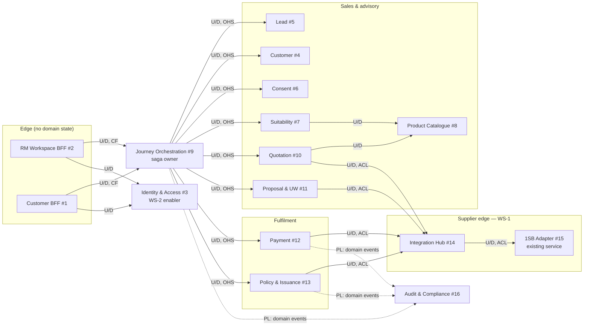
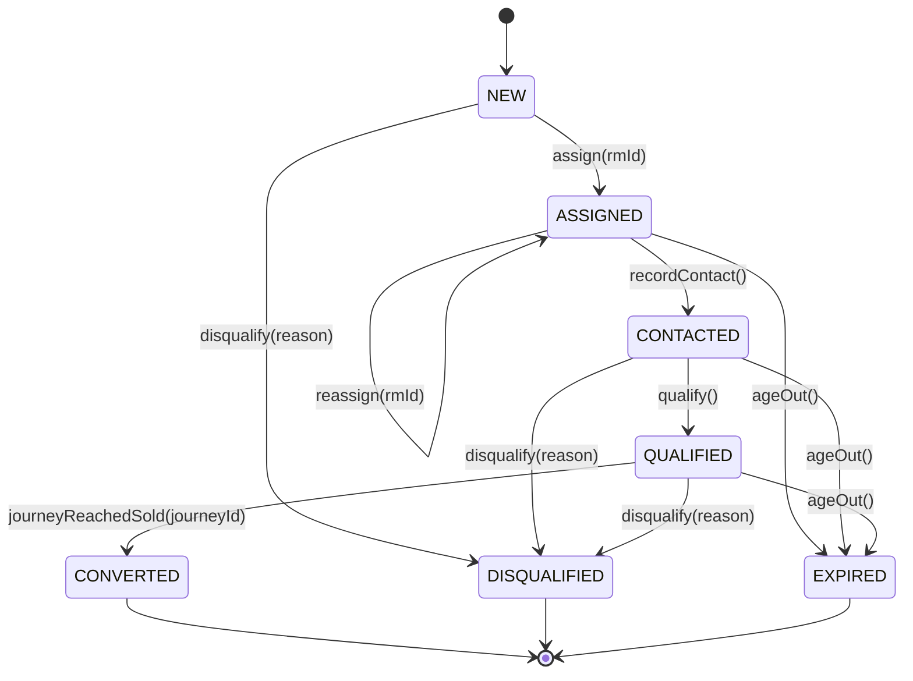
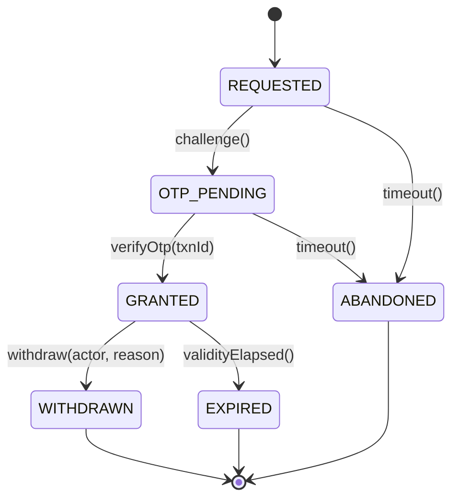
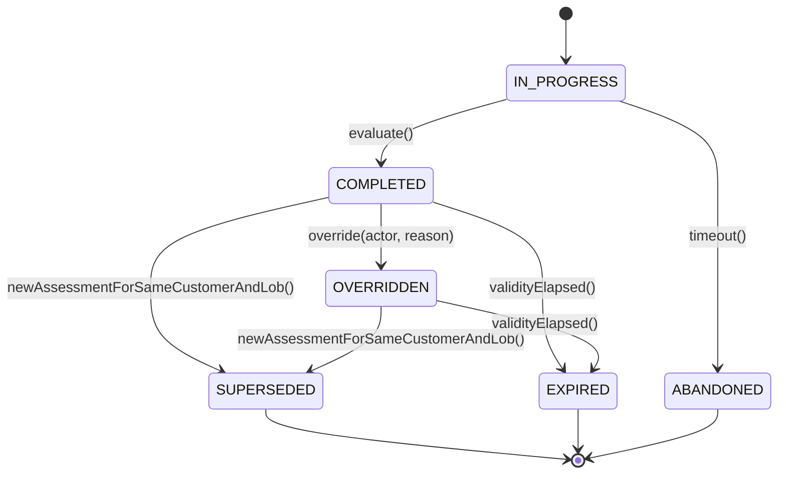
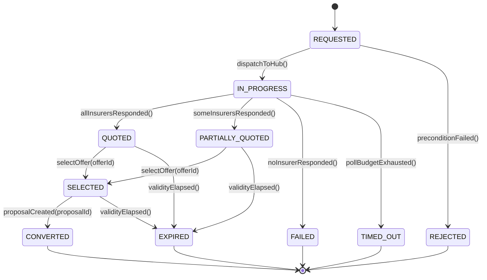
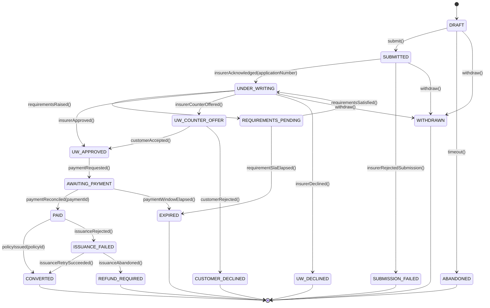
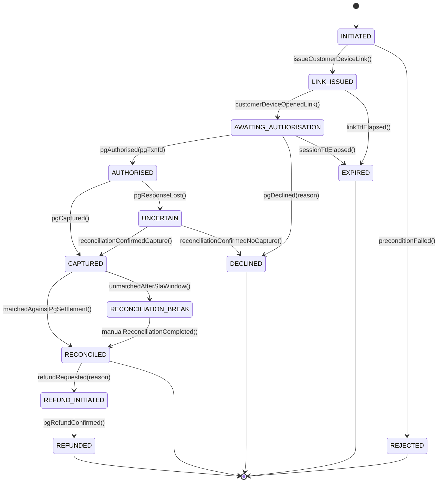
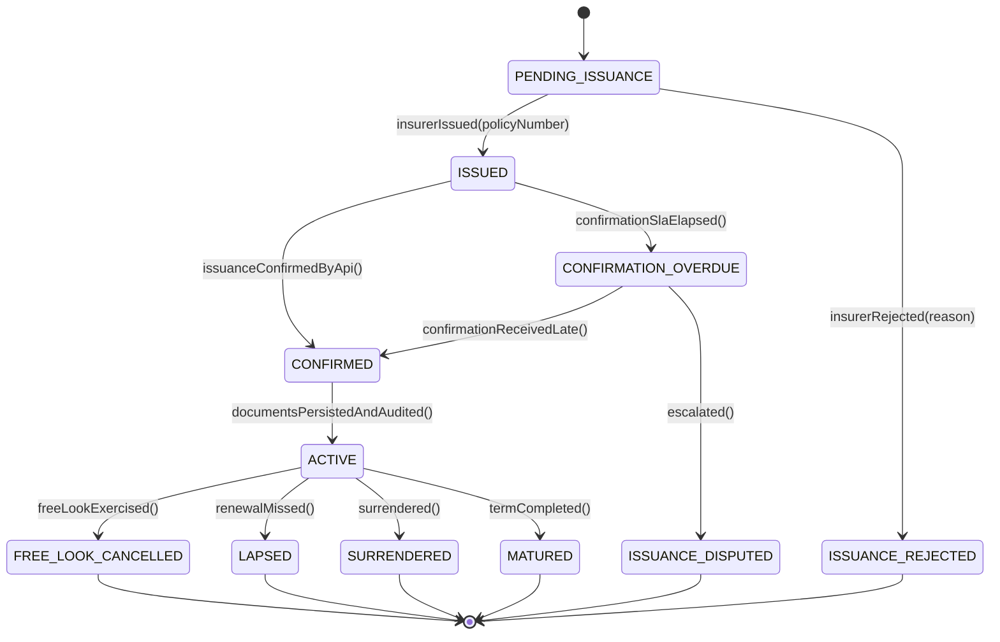
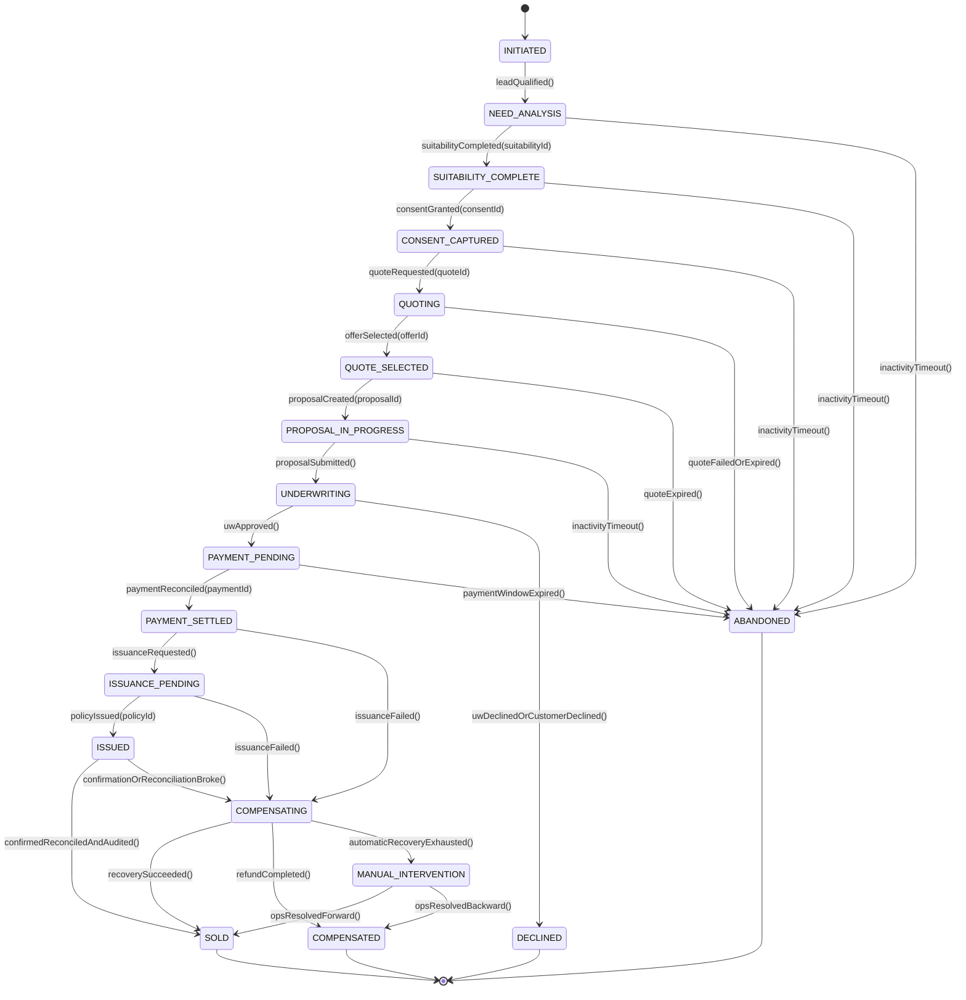

# WS-3 — Platform Domain Model, State Machines and Invariants

**Workstream:** WS-3 — AU Bank Insurance Distribution Platform (proposed under CR-010)
**Stage:** S06 — Domain & Information Architecture
**Owner:** Mahesh — Principal Insurance Platform Architect (Board 1)
**Co-owner for the logical data model:** Aarti — Principal Insurance Data & Database Architect
**Status:** AI-DRAFTED architecture baseline. Board 1 verdict is recorded in
[`../../governance/change-requests/CR-010/verdicts/board-1-architecture-mahesh.md`](../../governance/change-requests/CR-010/verdicts/board-1-architecture-mahesh.md).
Mandatory human Architecture and Data signatures are outstanding.

**Revision 2026-08-20 — HLD review round R0-actors/LOB/configuration** (`SUG-20260820-hr0`):
§2.4 replaces the implied single-actor reading with the two-actor R0 model and makes Specified
Person a certification attribute; §2.4.1 gates and insurer-scopes the Insurance Partner
Representative; §2.4.2 makes the opportunity the single origination point and un-defers context #5;
§2.5 makes LOB a first-class dimension from release 1; §2.6 makes configuration a first-class
dimension independent of any front end. New invariants: INV-ACT-01…04, INV-LED-04…07,
INV-CFG-01…03, INV-LOB-01/02. Decisions: ADR-004…ADR-007.

**Companion documents**

| Document | Content |
|---|---|
| [`02-information-model.md`](./02-information-model.md) | Canonical entities, attributes, types, classification, retention, system of record |
| [`03-solution-architecture-r0.md`](./03-solution-architecture-r0.md) | Component/deployment view and seam semantics for the R0 slice |
| [`00-WS3-ARCHITECTURE-REGISTRATION.md`](./00-WS3-ARCHITECTURE-REGISTRATION.md) | Workstream registration, re-parenting and standing constraints |

---

## 1. Why this document exists

[`stages/S06-domain-architecture.md §6`](../../application-lifecycle-bible/stages/S06-domain-architecture.md)
records the S06 position as 🟡 Partial with five named holes: context relationships, platform
aggregates, the journey saga, platform-wide invariants, and the data ownership matrix. It says
plainly that *"the saga gap is the important one"* because payment-succeeded-but-issuance-failed is
routine in bancassurance.

This document closes the conceptual half of that gap. It is deliberately written so that an
engineer can implement directly from it: every state machine enumerates its legal transitions,
every invariant is phrased as an assertion a test can make, and every invariant names the component
that enforces it and the behaviour on violation.

It does **not** decide physical schema, datastore technology, indexing or messaging technology —
those are S07/S09 concerns and are recorded in [`03-solution-architecture-r0.md`](./03-solution-architecture-r0.md).

---

## 2. Bounded context map — relationships, not just a list

The 19 contexts are enumerated in
[`business-problem-statement.md §6`](../../context/business-problem-statement.md) and
[`architecture-review/02-target-microservices-architecture.md`](../architecture-review/02-target-microservices-architecture.md).
Those are a *target state*. What was missing — S06-E01-S02 — is the **relationship** between them.
This section supplies it for the contexts the R0 journey needs.

Relationship vocabulary used below is the standard strategic-DDD set:
**U/D** upstream–downstream · **ACL** anti-corruption layer at the downstream side ·
**CF** conformist (downstream accepts upstream's model) ·
**OHS** open host service (upstream publishes a stable contract) ·
**PL** published language · **SK** shared kernel.



### 2.1 Relationship register

| # | Upstream | Downstream | Relationship | Why, and what crosses the seam |
|---|---|---|---|---|
| R-01 | Journey Orchestration | RM/Customer BFF | OHS + CF | The BFF conforms to the journey's published stage model. A BFF that reimplements journey state re-creates ARCH-005's failure mode |
| R-02 | Journey Orchestration | Lead, Customer, Consent, Suitability, Quotation, Proposal, Payment, Policy | U/D, OHS | Journey holds only references and stage; it never holds a copy of another context's authoritative state |
| R-03 | Suitability | Product Catalogue | U/D, CF | Suitability reads eligibility rules; it does not own product definitions |
| R-04 | Quotation | Product Catalogue | U/D, CF | Quote validates product/insurer availability before fan-out |
| R-05 | Quotation, Proposal, Payment, Policy | Integration Hub | U/D, **ACL** | Domain services speak bank-canonical only. Hub owns routing; provider shapes stop at the adapter |
| R-06 | Integration Hub | 1SB Adapter | U/D, **ACL** | Existing ArchUnit rule confines 1SB types to `adapter.onesb.*`. The Hub generalises the same rule per adapter |
| R-07 | Identity & Access (WS-2) | every context | U/D, OHS | Contexts consume an authenticated principal and a PDP decision; none re-derives entitlements |
| R-08 | every context | Audit & Compliance | PL (published language: domain events) | Audit consumes a versioned event language. Producers never write to the audit store directly |
| R-09 | Consent | Suitability, Quotation, Proposal | U/D, OHS | A consent reference is a value passed downstream; consent evidence itself is never copied |
| R-10 | Payment | Policy & Issuance | U/D via Journey saga | **Deliberately not direct.** Coupling payment to issuance directly is what makes the paid-but-not-issued failure unrecoverable |

### 2.2 Language boundary — where the same word means different things

S06-E01-S03. These four are the ones that actually bite.

| Word | In context A | In context B | Translation point |
|---|---|---|---|
| **Status** | Proposal: `UNDER_WRITING`, insurer-driven | 1SB Adapter: `BankApplicationStatus` normalised from the provider string (`domain/model/BankApplicationStatus.java`) | 1SB Adapter normalises; Integration Hub passes the normalised value; Proposal maps it onto its own aggregate state |
| **Quote** | Quotation: an aggregate with offers and a selection | 1SB Adapter: a `QuoteJob` — an async correlation record (`domain/model/QuoteJob.java`) | Quotation owns the business aggregate; the adapter's job id is an external reference only |
| **Customer** | Customer context: CIF-linked profile snapshot | Proposal: proposer/life-assured member roles | Party snapshot taken at proposal start; the proposal never re-reads the live profile mid-case |
| **Payment** | Payment context: an attempt with reconciliation | Policy: the precondition for issuance | Journey saga mediates; see [§5](#5-the-journey-saga) |

### 2.3 Why each context exists — the distinct-reason-to-change test

S06-E01-S04 and S06-VT-01. A context that always changes with another is not a context.

| Context | Its one reason to change |
|---|---|
| Lead (the **opportunity** record — §2.4) | Bank sales-management policy: origination, assignment, ageing, campaign |
| Customer | CBS contract and ETB profile semantics |
| Consent | Regulatory consent wording, sequencing and evidence obligations (IRDAI/DPDP) |
| Suitability | Need-analysis methodology and the IRDAI suitability obligation |
| Product Catalogue | Insurer product/eligibility matrix and effective dating |
| Journey Orchestration | The shape of the sale process itself |
| Quotation | Multi-insurer price discovery and comparison semantics |
| Proposal & UW | Insurer application capture and underwriting interaction |
| Payment | Money movement, the bank PG contract, and reconciliation |
| Policy & Issuance | Issued-policy record and document custody |
| Integration Hub | Which provider serves which LOB/product |
| 1SB Adapter | The 1SB API contract |
| Audit & Compliance | Regulatory evidence obligations |

**Contexts I deliberately did not create.** No "Journey Read Model" context, no "Rules Engine"
context, no "Document" context for R0. Each would be a noun without an independent reason to
change, and AP-01 forbids promoting a noun to a boundary.

### 2.4 The R0 actor model — two actors, one of them certified

**This section supersedes any earlier reading in which "Certified SP" was a separate actor or a
separate channel.** R0 has **two** on-platform human actors. The customer is a *participant*, not
an on-platform actor: in R0 the customer's device receives an OTP challenge and a payment link and
touches nothing else (`SC-W3-3`, control **C4**).

| Actor | Identity plane | Who they are | What they may do in R0 | What they are never |
|---|---|---|---|---|
| **Bank RM** | Workforce — Bank AD federated (`ID-01`) | Bank employee. **Holds the IRDAI Specified Person certification.** Accountable SP on every record | Sole origination right (§2.4.2). Need analysis, suitability, consent, quote, proposal, payment initiation, the whole regulated journey | Never anonymous on a record; never replaceable as the accountable SP |
| **Insurance Partner Representative (IPR)** | Partner — provisioned in Identity & Access after maker-checker (`ARCH-022`), separate realm | Employee **of one insurer**, on-platform to assist the RM or the customer in completing the journey | **Assist only** — scoped read, product view and selection **within their own insurer**, assistance annotations | **Never an SP.** No solicitation, no advice, no origination, no accountability transfer |

**Rule AC-1 — Specified Person is a certification attribute on the RM, not an actor and not a
channel.** It is modelled as certification state on the workforce principal, sourced from Identity
& Access (`ARCH-022`, `ID-20`):

```yaml
rmProfile:
  principalId: "..."
  actorType: BANK_RM
  spCertification:
    certificateNumber: "..."       # IRDAI Specified Person certificate
    issuingAuthority: "..."
    lobScope: [LIFE]               # the LOBs the certificate covers — see 2.5
    validFrom: "YYYY-MM-DD"
    validTo:   "YYYY-MM-DD"
    status: ACTIVE | EXPIRED | SUSPENDED | WITHDRAWN
```

An RM whose certification is `EXPIRED`, `SUSPENDED` or out of `lobScope` **fails closed on
regulated actions at the moment of the action** — not at login, and not with a warning
(`ID-20`). An RM with no certification is still a valid principal; they simply cannot perform a
regulated action.

**Rule AC-2 — the R0 actor-type vocabulary is closed at three values:**

```text
BANK_RM · INSURER_PARTNER_REP · SERVICE
```

**Mapping to the WS-2 vocabulary, so there is one model and not two.**
[`authentication-authorization/README.md`](../authentication-authorization/README.md) already types
its principals `BANK_EMPLOYEE` and `INSURER_REPRESENTATIVE`, and already states that SP is an
attribute rather than a synonym for RM. `BANK_RM` is the R0 refinement of `BANK_EMPLOYEE` — the
subset carrying an origination right and an SP certification — and `INSURER_PARTNER_REP` is
`INSURER_REPRESENTATIVE`. These are one vocabulary with a mapping, not two. Which spelling WS-2
adopts on the wire is WS-2's to settle; recorded as OPEN-D12.

`CERTIFIED_SP` is **not** an actor type and **not** a channel value: it was a certification wearing
an actor's clothes, and modelling it as an actor produces two principals for one human and two
audit trails for one sale. `CUSTOMER` and `CALL_CENTRE_AGENT` are real actor types at later
horizons (`15 §3`, `15 §6`) and are deliberately absent from R0 — R0 has no customer session and no
call centre.

**Rule AC-3 — adding an actor type is an authorization change, not an architecture change**
(`JS-08`). The same capability serves every actor; what differs is the permitted action set. There
is no `ipr-quote-service`.

#### 2.4.1 IPR visibility is gated, insurer-scoped, and enforced at the query layer

**Rule AC-4 — an IPR principal sees nothing until the RM has created the opportunity *and*
completed need analysis and suitability.** Before that state the record is **invisible**: it is not
returned by any query, in any projection, at any endpoint. Not greyed out, not filtered in the BFF,
not hidden by the UI.

The visibility predicate, stated once so it is implementable and testable:

```text
visible_to_IPR(record) :=
        record.opportunityCreatedBy.actorType = BANK_RM
    AND record.needAnalysisState        = COMPLETED
    AND record.suitabilityState        IN (COMPLETED, OVERRIDDEN)
    AND record.insurerId                = principal.insurerId
    AND principal.actorType             = INSURER_PARTNER_REP
```

**Rule AC-5 — insurer scoping is a data-layer predicate, not a UI rule and not a service-layer
`if`.** Every read executed on behalf of an `INSURER_PARTNER_REP` principal carries a mandatory
`insurer_id = :principalInsurerId` predicate applied by the persistence layer itself, so a query
that omits it cannot be written rather than being caught in review (`FF-17`). This is `TI-15` and
`ID-17` applied to reads: a control that lives in the presentation tier is one HTTP client away
from absent.

**Rule AC-6 — assist-only is a permission set, and the RM stays the accountable SP.** The
accountable Specified Person on a record is the originating RM. It is set at origination and is
immutable for the life of the record; no IPR action, assignment or handover moves it. An IPR is
granted no regulated-sales action at any journey stage:

| Action | `BANK_RM` (SP-certified) | `INSURER_PARTNER_REP` |
|---|---|---|
| `opportunity.create` | ✅ **sole right** | ❌ |
| `needanalysis.submit` · `suitability.submit` | ✅ | ❌ |
| `consent.capture` | ✅ (customer device OTP) | ❌ |
| `quote.request` · `offer.select` | ✅ | ❌ |
| `proposal.submit` | ✅ | ❌ |
| `payment.issueLink` | ✅ | ❌ |
| `product.view` · `product.select` | ✅ | ✅ **own insurer only** |
| `journey.view` | ✅ | ✅ **gated + own insurer only** (`AC-4`) |
| `assistance.annotate` | ✅ | ✅ |

> **Compliance point, stated in the HLD because it must not be discovered in build.** The IPR is
> **not** a Specified Person. Their presence on a journey must never become solicitation or advice.
> The architecture therefore (a) grants them no regulated action, (b) keeps the accountable SP
> immutable and always an RM, and (c) attributes every IPR action separately in the audit trail so
> the solicitation record produced for IRDAI is unambiguous about who did what. **Which actions
> require which certification remains Shailja's determination, not mine** (`ID-21`, `JS-09`) —
> recorded as OPEN-D9.

**Rule AC-7 — every action is audited with its actor's capacity.** `AuditEvent` carries
`actorType`, `actorInsurerId` (IPR only), `actingCapacity` (`SP_ACCOUNTABLE` | `ASSIST_ONLY`) and
`assistedActorId` (the accountable RM, on every IPR event). An audit trail that records "an action
occurred on this journey" without recording *in what capacity* cannot answer the only question a
mis-selling review asks.

#### 2.4.2 Origination is RM-only, and the opportunity is the single origination point

R0 is **ETB-only**. Only the RM sees the ETB customer base, and only the RM may originate.

**Rule AC-8 — context #5 is the single origination point.** Its aggregate is the **opportunity**:
the record that answers *why are we contacting this person*. Every downstream aggregate — journey,
suitability assessment, consent grant, quote, proposal, payment, policy — is reachable only from an
opportunity, and every one of them carries its reference. There is no second way into the funnel in
MVP: no BFF-created journey, no quote without an opportunity, no proposal assembled outside one.

> **Naming.** The North Star capability model calls this record the **Opportunity** (`CAP-102`,
> [`12 §2`](../../context/roles/mahesh-principal-insurance-platform-architect/12-journey-segregation.md)).
> `CURRENT-STATE.yaml`, the BRD and the S03 acceptance criteria call the context **Lead** and its
> identifier `leadId`. This document keeps `Lead`/`leadId` — the registered, Product-owned labels —
> and states here, normatively, that they denote the opportunity. Re-labelling is Rajal's to make,
> is behaviour-neutral, and is recorded as OPEN-D10. **The identifier is not the point; the single
> origination rule is.**

**Rule AC-9 — origination is un-deferred.** [`03-solution-architecture-r0.md §3`](./03-solution-architecture-r0.md)
previously deferred context #5 to S13 while `CURRENT-STATE.yaml` `current_scope.in_scope` lists
*"Lead service (context #5) — create, resume, status"* (the context is named **Opportunity** since `ADR-005`; the state file still carries the old label) as R0 scope. That was drift between an
architecture document and the ratified state file, and the state file wins. Context #5 is Wave 1.

### 2.5 Line of business is a first-class dimension from release 1

R0 sells one Term Life product. Health and General follow immediately on the same template
(`VIN-001 §8`, [`11 §2`](../../context/roles/mahesh-principal-insurance-platform-architect/11-line-of-business-segregation.md)).
The LOB boundary is therefore **not retrofittable**: it is cheap to carry now and becomes a data
migration across every table the moment a second line exists.

**Rule LB-1 — `lob` is mandatory and non-null on every business entity, every configuration
record, every audit event and every authorization request, from release 1.** No default. No
nullable column. No `WHERE lob IS NULL` fallback. A missing LOB is a rejection, not an inference.

**Rule LB-2 — the LOB vocabulary is frozen at three values from release 1:**

```text
LIFE · HEALTH · GENERAL
```

R0 populates `LIFE` only. `HEALTH` and `GENERAL` exist in the enumeration, in the configuration
partitioning and in the authorization model from day one, and are simply unpopulated. Freezing the
list now is what makes `LS-06`'s onboarding test answerable: *could Health be added without
changing this vocabulary?*

**Rule LB-3 — LOB and product class are different dimensions, and R0 has been conflating them.**
`lob = LIFE`; `productClass = TERM`. Recording `lob = TERM` — as
[`02-information-model.md §4.2`](./02-information-model.md) did — makes the first savings product a
schema change and the first Health product a migration. Corrected in this revision.

**Rule LB-4 — everything that varies by line is LOB-partitioned from release 1:** product and
eligibility, journey step definitions, business rules, field validations, document checklists,
commission, and routing policy. The partition is a first-class key `(lob, …)` in the configuration
model (§2.6), not a column added later.

**Rule LB-5 — LOB partitioning is not LOB forking.** Party, opportunity, consent evidence, journey
identity, payment mechanics, document storage, policy portfolio and audit remain shared and
single-instance (`LS-01`). Partitioning the *rules* is what makes the Health cell possible;
duplicating the *evidence* is what makes it unauditable.

### 2.6 Configuration is a first-class dimension — no exceptions

`ARCH-010` already states that compliance-sensitive behaviour is configuration-driven. This
revision extends it to the whole R0 behaviour surface and, importantly, **decouples it from
front-end availability**.

**Rule CF-1 — no business branch on a product, insurer, LOB or channel literal.** No
`if (insurer == …)`, no `switch (productCode)`, no `if (lob == LIFE)` in any business path.
Behaviour that differs is resolved from configuration; code that differs per insurer lives only in
that provider's adapter package (`INV-ACL-01`). Enforced by `FF-18`.

**Rule CF-2 — the configuration domains, enumerated so the list is closed rather than aspirational:**

| Configuration domain | Partition key | Consumed by |
|---|---|---|
| Product and plan definitions | `(lob, insurerId, productCode, version)` | Product Catalogue #8 |
| Product eligibility rules | `(lob, insurerId, productCode, version)` | Suitability #7, Quotation #10 |
| Journey step definitions and transitions | `(lob, journeyType, version)` | Journey Orchestration #9 |
| Business rules and rule packs (consent, suitability) | `(lob, ruleSet, version)` | Consent #6, Suitability #7 |
| Field validation rules | `(lob, formId, fieldId, version)` | BFF #2 and the owning service |
| Document checklists / requirements | `(lob, insurerId, productCode, version)` | Proposal & UW #11 |
| Role → permission grants, including the IPR gate (`AC-4`…`AC-6`) | `(lob, actorType, roleId, version)` | Identity & Access #3 (PDP) |
| Commission structures | `(lob, insurerId, productCode, version)` | *namespace reserved in R0; no consumer until R1* |
| Provider routing policy | `(lob, productClass, version)` | Integration Hub #14 |
| Attribution values (`distributorId`, SP licence resolution) | `(lob, version)` | Integration Hub #14 (`INV-DIS-01`) |

**Rule CF-3 — configuration is versioned and append-only.** A change publishes a **new version**
with an effective-dated activation window; it never edits an active record in place. Every business
record stores the configuration version that governed it, because a suitability outcome from
March must remain explicable under March's rules, not today's.

**Rule CF-4 — configuration is seedable, and the seeds are source-controlled.** Every configuration
domain ships with idempotent seed artefacts held in the repository and applied by the same
mechanism in every environment. A rule-pack change is a new seeded version plus an activation, not
a code deployment.

**Rule CF-5 — the configuration layer is independent of any front end.** There is no admin UI in
R0, and there may be none in R1; administrators may have no interface at all. **That changes
nothing here.** The configuration store, its versioning, its seeding and its resolution contract
ship in R0. The UI is a later consumer of a layer that already exists — which is the only ordering
that does not require re-platforming the rules when the UI arrives. This supersedes the earlier R0
trade in [`03-solution-architecture-r0.md §3`](./03-solution-architecture-r0.md) under which a
rule-pack change required a redeployment.

---

---

## 3. Aggregates and consistency boundaries

S06-E02-S01 and validation test S06-VT-02: *walk each business transaction; count the aggregates it
must update atomically; never more than one.*

| Aggregate | Context | Root identity | Transactional consistency boundary | Deliberately outside the boundary |
|---|---|---|---|---|
| `Lead` — the **opportunity** (`AC-8`) | Lead #5 | `leadId` | Opportunity + its assignment history + follow-ups | Customer profile, journeys spawned from it |
| `CustomerProfile` | Customer | `customerId` (bank CIF ref) | Profile snapshot + contact set | CBS record itself (external SoR) |
| `Consent` | Consent | `consentId` | Consent grant + its immutable evidence record | Everything else; consent is referenced, never copied |
| `SuitabilityAssessment` | Suitability | `suitabilityId` | Assessment + answers + outcome + override record | Product catalogue entries |
| `Quote` | Quotation | `quoteId` | Quote + all its `Offer` entities + the selection | The adapter's `QuoteJob`; insurer-side quote identifiers |
| `Proposal` | Proposal & UW | `proposalId` | Proposal + form values reference + `UnderwritingCase` + requirements | Payment, Policy, insurer decision record beyond its normalised status |
| `Payment` | Payment | `paymentId` | Payment + its attempts + reconciliation record | Proposal, Policy |
| `Policy` | Policy & Issuance | `policyId` | Policy + issued document references + confirmation record | Payment, Proposal |
| `Journey` | Journey Orchestration | `journeyId` | Journey stage + external references + party snapshot | Every other aggregate's internal state |
| `AuditEvent` | Audit & Compliance | `eventId` | A single event — append-only, never updated | Everything |

**`UnderwritingCase` is an entity inside `Proposal`, not its own aggregate.** It has no lifecycle
independent of the proposal it underwrites, and making it an aggregate would force a distributed
transaction on every requirement update. It becomes a candidate aggregate only if the business
begins servicing underwriting cases that outlive their proposal — recorded as the revisit trigger.

**`Offer` is an entity inside `Quote`.** Selecting an offer must be atomic with invalidating the
alternatives (INV-QUO-05); splitting `Offer` out would make that a cross-aggregate transaction on
the busiest path in the system.

### 3.1 Identity and referencing

S06-E02-S04.

| Rule | Statement |
|---|---|
| ID-01 | Every aggregate root carries a bank-minted, opaque, non-sequential identifier. Provider identifiers are never aggregate identity |
| ID-02 | Cross-context references are by root identifier plus context, never by embedded object graph |
| ID-03 | Provider identifiers (`reqId`, `applicationNumber`, insurer policy number) live in an `externalRefs` map on the owning aggregate and on `Journey`, and are never returned to a bank caller as the primary handle — the existing 1SB rule (`reqId` is not surfaced) generalised |
| ID-04 | An aggregate is archived, never deleted, until its retention horizon expires; disposal produces an audit record (see [`02-information-model.md`](./02-information-model.md)) |
| ID-05 | Every aggregate root carries a non-null `lob` (`LB-1`). It is set at creation from the opportunity and is immutable thereafter |
| ID-06 | Every aggregate on the sale path carries the originating `leadId` (`AC-8`). An aggregate that cannot name its opportunity cannot be created |

---

## 4. State machines

Notation: every diagram enumerates the **legal** transitions. Any transition not drawn is illegal
and must be rejected by the aggregate, not by the caller. Terminal states are marked `[*]` targets.

### 4.1 Lead — the opportunity

The origination record. Created **only** by an SP-certified Bank RM (`AC-8`, INV-LED-04) and the
single entry point to the funnel: no journey, quote or proposal exists without one.



| Transition | Trigger | Guard |
|---|---|---|
| `[*] → NEW` | `opportunity.create` by a `BANK_RM` principal | Creator is `BANK_RM` **and** holds a valid SP certification covering the opportunity's `lob` (INV-LED-04, INV-LED-05). An `INSURER_PARTNER_REP` is refused — there is no code path that admits one |
| `NEW → ASSIGNED` | RM assignment or auto-allocation | Target RM holds a valid SP certificate for the `lob` (INV-LED-03) |
| `ASSIGNED → ASSIGNED` | Reassignment | Previous owner retained in assignment history; SLA restart is a Product decision, recorded as OPEN-D1 |
| `* → EXPIRED` | Ageing job | Configurable ageing horizon; no journey in a non-terminal stage references this lead |
| `QUALIFIED → CONVERTED` | `JourneySold` event | Exactly one journey may convert a lead (INV-LED-02) |

### 4.2 Consent

Consent is modelled as a **grant with immutable evidence**, not as a mutable record. Withdrawal
creates a new state on the grant; it never edits the captured evidence.



`GRANTED` is the only state that satisfies a downstream consent precondition. There is no
`GRANTED → GRANTED` re-affirmation: a re-consent produces a **new** `Consent` aggregate carrying a
new statement version, which is what makes versioned evidence auditable.

### 4.3 Suitability assessment



`COMPLETED` carries an `outcome` of `ELIGIBLE | NOT_ELIGIBLE` and a recommended product set.
`OVERRIDDEN` exists because the business anticipated an override path
([`knowledge-base/07-information-model-and-rules.md`](../../au-bank-insurance-platform/knowledge-base/07-information-model-and-rules.md)
lists "Suitability — eligibility, recommendation, override, versioning"). **Who may override, and
whether an override may unblock quote, is a Compliance and Product decision, not an architecture
one** — recorded as OPEN-D2 and blocked behind GAP-007.

### 4.4 Quote



`PARTIALLY_QUOTED` is a first-class success state, not a degraded one — it carries forward the
existing and correct 1SB rule *"partial success is success"*
([`1sb-integration-service-architecture.md §1`](../../1sb-insurance-integration/architecture/1sb-integration-service-architecture.md)).
`REJECTED` is the state a quote enters when the suitability hard-gate refuses it; it exists so the
refusal is auditable rather than a bare HTTP 403 with no domain record.

### 4.5 Proposal



`ISSUANCE_FAILED` and `REFUND_REQUIRED` are the states the S06 stage file says are missing and
expensive. `PAID → ISSUANCE_FAILED` is the *paid-but-not-issued* case; it is a **non-terminal**
state with two defined exits, which is precisely what makes the money recoverable.
`WITHDRAWN` is not permitted after `AWAITING_PAYMENT` — once a payment window is open, exit is via
expiry or refund, never via a silent withdrawal that strands a paid premium.

### 4.6 Payment

Payment carries the C4 device-isolation control, so the state machine makes the device binding
explicit rather than leaving it to the UI.



`UNCERTAIN` is mandatory, not defensive engineering. Every payment integration eventually loses a
response, and a system with no `UNCERTAIN` state resolves that ambiguity by guessing. Note also
that `RECONCILED` — not `CAPTURED` — is the state that permits issuance, which is what makes the
four-part "sold" definition in
[`R0-SCOPE.md §2`](../../au-bank-insurance-platform/requirements/R0-SCOPE.md) enforceable rather
than aspirational.

### 4.7 Policy



**R0 scope note.** R0 delivers `PENDING_ISSUANCE → ISSUED → CONFIRMED → ACTIVE` plus
`ISSUANCE_REJECTED` and `FREE_LOOK_CANCELLED`. `LAPSED`, `SURRENDERED` and `MATURED` are modelled
now because omitting them would let the R0 implementation treat `ACTIVE` as terminal and hard-code
that assumption into the schema; they are not implemented in R0. This is the one place in this
document where I model beyond the R0 slice, and the reason is that the cost of the omission is a
migration, not a feature.

`ACTIVE` requires *documents persisted and audited* — the fourth limb of the "sold" definition. A
policy that the insurer has issued but whose evidence the bank cannot produce is not `ACTIVE` here.

---

## 5. The journey saga

S06-E02-S05 and S06-VT-05 — the artefact the stage file says does not exist.

The saga is **orchestrated**, not choreographed. Journey Orchestration owns it. The reason is
AP-05 and a specific regulatory one: an orchestrator produces a single, queryable, attributable
record of where a sale is and why it stopped, which is exactly what the legacy AU Beema Portal
cannot produce and what the platform was funded to provide. A choreographed event chain distributes
that record across ten services and reconstructs it only by log archaeology.



### 5.1 Failure and compensation matrix

S06-VT-05 pass condition: *every failure has a defined compensation or a defined manual procedure*.

| # | Failure point | Business consequence | Compensation | Automatic? | Owner of the manual path |
|---|---|---|---|---|---|
| F-01 | Suitability service unavailable at quote | RM cannot quote | None. **Fail closed** — quote is refused (C1 is non-waivable). Journey holds at `SUITABILITY_COMPLETE` pending | n/a | — |
| F-02 | Consent captured, journey then abandoned | Consent evidence exists for a sale that never happened | Consent grant remains valid until its own expiry; journey records `ABANDONED` with the consent reference retained for the retention horizon. **No deletion** | Yes | — |
| F-03 | Quote expires mid-proposal | Priced offer no longer valid | Proposal held in `DRAFT`; journey returns to `QUOTING` for a re-quote. Previously captured proposal values are retained and re-applied | Yes | — |
| F-04 | Proposal submitted, insurer never acknowledges | Unknown whether the insurer has the application | Poll by external reference until the poll budget is exhausted, then `SUBMISSION_FAILED` and an operations task. **Never re-submit blind** — the existing 1SB no-retry-on-submit rule | Partial | Operations (Shivanshi runbook) |
| F-05 | **Payment captured, issuance fails** | Customer has paid for no policy | Journey → `COMPENSATING`. Bounded issuance retry; if exhausted, `Proposal → REFUND_REQUIRED` and `Payment → REFUND_INITIATED`. Refund is a **money movement**, so it is maker-checked and never auto-executed above the configured threshold | Retry yes; refund no | Operations + Finance |
| F-06 | **Issued, confirmation never received** | Bank cannot prove the sale | `Policy → CONFIRMATION_OVERDUE`, then reconciliation against the insurer status API. If still absent → `ISSUANCE_DISPUTED` | Partial | Operations + insurer escalation |
| F-07 | **Payment captured, reconciliation break** | Money received that cannot be matched | `Payment → RECONCILIATION_BREAK`. Journey stays out of `SOLD`. Manual reconciliation is the defined procedure; **no timeout auto-resolves a money break** | No | Finance |
| F-08 | PG response lost after authorisation | Duplicate-charge risk | `Payment → UNCERTAIN`; the next reconciliation cycle resolves it. Re-initiation is blocked while `UNCERTAIN` (INV-PAY-04) | Yes | — |
| F-09 | Integration Hub cannot route (no adapter for product) | Quote or proposal cannot proceed | Fail fast with a routing error; journey stays at its current stage. Product decides fallback to Group B redirect | Yes | Product |
| F-10 | Audit event emission fails | Regulated action with no evidence | Producer writes to a durable local outbox and retries. **The business transaction is not rolled back**, but the journey cannot reach `SOLD` until audit persistence is confirmed (INV-JRN-05) | Yes | — |

> **The rule embedded in F-05, F-07 and F-10:** nothing on the money or evidence path is resolved by
> a timeout. Timeouts resolve *availability* questions; they must never resolve *financial
> correctness* questions. That is the same principle
> [`08-SRE-READINESS-CANON.md`](../../application-lifecycle-bible/08-SRE-READINESS-CANON.md) states
> from the operations side.

### 5.2 Cross-aggregate consistency decisions

S06-E03-S04: where eventual consistency is acceptable, and where it is not.

| Interaction | Consistency | Justification |
|---|---|---|
| Offer selection ↔ invalidating sibling offers | **Strong** (single aggregate) | Two selected offers on one quote is a mis-sale |
| Payment attempt ↔ payment aggregate state | **Strong** | Money |
| Payment `RECONCILED` ↔ Proposal `PAID` | **Eventual, bounded, monitored** | Cross-context. Bound: reconciliation SLA (NFR-DAT-03). A breach is a `RECONCILIATION_BREAK`, not a silent lag |
| Journey stage ↔ owning aggregate state | **Eventual** | Journey is a projection of references; it is never the authority. INV-JRN-02 forbids reading business decisions from the journey |
| Suitability outcome ↔ quote precondition | **Strong at the point of use** | The quote service re-validates the assessment at request time; it does not trust a cached flag on the journey |
| Consent grant ↔ proposal submission precondition | **Strong at the point of use** | Same reason. C2 is non-waivable |
| Domain event ↔ audit record | **Eventual via outbox, at-least-once** | Duplicate audit records are acceptable and de-duplicable; missing ones are not |

---

## 6. Invariants

Format: `INV-<CTX>-<nn>`. Every row states the assertion in testable terms, the component that
enforces it, and what happens when it is violated (S06-E03-S03: *per invariant, not generically*).
`Control` links the invariant to the non-waivable control catalogue in
[`07-SECURITY-COMPLIANCE-CANON.md §3`](../../application-lifecycle-bible/07-SECURITY-COMPLIANCE-CANON.md).

### 6.1 Compliance hard-gates (S06-E03-S02)

| ID | Assertion | Enforced at | On violation | Control |
|---|---|---|---|---|
| INV-QUO-01 | A `Quote` may leave `REQUESTED` only if a `SuitabilityAssessment` exists for the same `customerId` **and** `lob`, is in `COMPLETED` or `OVERRIDDEN`, has `outcome = ELIGIBLE`, and is not `EXPIRED` at the instant of the check | `QuotationService.request()` — server side, before any Hub call | Reject with `403 SUITABILITY_REQUIRED`; persist `Quote` in `REJECTED`; emit `QUOTE_REJECTED_NO_SUITABILITY` | **C1** |
| INV-PRP-01 | A `Proposal` may leave `DRAFT` only if a `Consent` in `GRANTED` exists for the same `customerId`, covering the required purpose set, unexpired at submit time | `ProposalService.submit()` | Reject with `403 CONSENT_REQUIRED`; proposal stays `DRAFT`; emit `PROPOSAL_BLOCKED_NO_CONSENT` | **C2** |
| INV-DIS-01 | `distributorId` and the SP licence identifier on any outbound provider request are resolved from server-side configuration and the authenticated principal. A caller-supplied value in the request body is rejected, never ignored | Integration Hub, before adapter dispatch | Reject with `422 ATTRIBUTION_NOT_CALLER_SUPPLIED`; emit a security event | **C3** |
| INV-PAY-01 | A payment link is bound to a customer-device channel (SMS/email to the customer's registered contact, or a QR presented for scan). No API path issues a payment link into an RM session, and no RM principal may complete authorisation | `PaymentService.issueLink()` and the PG redirect handler | Reject with `403 PAYMENT_DEVICE_ISOLATION`; emit a security event | **C4** |
| INV-ACT-01 | A regulated action is executed only by a principal whose `actorType = BANK_RM` **and** whose SP certification is `ACTIVE`, unexpired and covers the resource's `lob`, evaluated **at the instant of the action**, not at login | PDP decision (`ID-20`) re-checked by the owning domain service (`ID-08`) | Reject with `403 SP_CERTIFICATION_REQUIRED`; emit a compliance event | **C3** |
| INV-ACT-02 | An `INSURER_PARTNER_REP` principal is granted no regulated-sales action at any journey stage (`AC-6`). The permitted set is view, product view/select and assistance annotation, all insurer-scoped | PDP grant model, sourced from configuration (`CF-2`); default deny | Reject with `403 ASSIST_ONLY_ACTOR`; emit a compliance event | **C3** |
| INV-ACT-03 | The accountable Specified Person on a record is the originating RM. It is written once at origination and no subsequent action, assignment or handover changes it | Lead aggregate at creation; column is immutable at the store | Write rejected at the store; emit an integrity alert | **C3** |
| INV-ACT-04 | Every audit event carries `actorType`, `actingCapacity` (`SP_ACCOUNTABLE` \| `ASSIST_ONLY`), and — for an `INSURER_PARTNER_REP` — `actorInsurerId` and `assistedActorId` | Audit ingestion schema validation | Event rejected at ingestion; the emitting transaction is retried by the outbox | **C8** |
| INV-LOG-01 | No log record at any level contains a value matching the regulated field patterns (PAN, Aadhaar, mobile, email, DOB, income, health answer) | Logging framework converter + a CI log-scan test | Build fails; at runtime the converter masks | **C5** |
| INV-DAT-01 | Every persisted store, backup, log destination and archive resolves to an AWS India region | IaC policy check pre-apply + a residency attestation job | `terraform apply` blocked; running drift raises an O0 | **C6** |
| INV-AUD-01 | Every audit record and raw payload is written to an immutable store with a `retain_until` no earlier than event time + 7 years, and no code path performs `UPDATE` or `DELETE` on it | Store-level permission (INSERT-only role) + Object Lock + an immutability test | Write rejected at the database/object-store layer, not by application logic | **C7** |
| INV-AUD-02 | Every state transition on every aggregate in §4 emits exactly one audit event carrying actor, actor type, resource, outcome, `journeyId`, `distributorId`, `agentId`, `traceId` | Aggregate transition hook + a per-journey completeness test | Transition is committed; event is written via outbox and retried. Journey cannot reach `SOLD` (INV-JRN-05) | **C8** |

### 6.2 Aggregate invariants

| ID | Assertion | Enforced at | On violation |
|---|---|---|---|
| INV-LED-01 | A `Lead` in a terminal state accepts no further transitions | `Lead` aggregate | `409 ILLEGAL_TRANSITION` |
| INV-LED-02 | At most one `Journey` may drive a `Lead` to `CONVERTED` | `Lead` aggregate, on the conversion event | Second event is idempotently ignored; a differing `journeyId` raises an integrity alert |
| INV-LED-03 | A `Lead` may only be assigned to a principal holding a currently valid SP certification for the LOB | Lead assignment, reading WS-2 certification metadata | `422 RM_NOT_CERTIFIED` |
| INV-LED-04 | A `Lead` may be created **only** by a principal with `actorType = BANK_RM` (`AC-8`). No other actor type, no BFF path and no service-to-service path may originate one | Lead aggregate factory + PDP `opportunity.create` grant | `403 ORIGINATION_RM_ONLY`; emit a compliance event |
| INV-LED-05 | A `Lead` is created only for a customer inside the creating RM's ETB book, and carries a non-null `lob` covered by the creator's SP certification | Lead aggregate at creation | `422 CUSTOMER_NOT_IN_BOOK` / `422 LOB_NOT_CERTIFIED` |
| INV-LED-06 | Every `Journey`, `SuitabilityAssessment`, `Consent`, `Quote`, `Proposal`, `Payment` and `Policy` references exactly one `leadId`, and none may be created without it (`AC-8`, ID-06) | Each aggregate's factory + a NOT NULL foreign reference | `422 OPPORTUNITY_REQUIRED` |
| INV-LED-07 | A `Lead` and everything reachable from it is returned to an `INSURER_PARTNER_REP` principal only when `AC-4`'s visibility predicate holds; otherwise the record does not appear in any result set | Persistence-layer mandatory predicate (`AC-5`), not a service filter | Row is absent — never a `403` that confirms existence |
| INV-CFG-01 | No business code path branches on an insurer, product, LOB or channel literal (`CF-1`); behaviour that varies is resolved from configuration | ArchUnit + `FF-18` | Build fails |
| INV-CFG-02 | A configuration record is never updated in place. A change creates a new version with an effective-dated activation window (`CF-3`) | Configuration store: INSERT-only on the versioned table | Write rejected at the store |
| INV-CFG-03 | Every business record that was produced under a rule stores the configuration version that governed it | Owning aggregate at creation | `422 CONFIG_VERSION_REQUIRED` |
| INV-LOB-01 | Every business entity, configuration record, audit event and authorization request carries a non-null `lob` from one of `LIFE`, `HEALTH`, `GENERAL` (`LB-1`, `LB-2`) | NOT NULL + CHECK constraint at the store; schema assertion test | Write rejected at the store; build fails on a nullable `lob` column |
| INV-LOB-02 | `lob` and `productClass` are distinct attributes; no product class value may appear in a `lob` column (`LB-3`) | CHECK constraint + schema assertion test | Write rejected at the store |
| INV-CNS-01 | A `Consent` evidence record is write-once. Statement text, statement version, CIF, OTP transaction id, timestamp and source IP are all mandatory and immutable | Consent aggregate + INSERT-only store | Write rejected at the store |
| INV-CNS-02 | A `Consent` may reach `GRANTED` only from `OTP_PENDING` with a verified OTP transaction id | Consent aggregate | `409 ILLEGAL_TRANSITION` |
| INV-SUI-01 | A `SuitabilityAssessment` in `COMPLETED` is immutable. A correction produces a new assessment and marks the old one `SUPERSEDED` | Suitability aggregate | `409 ASSESSMENT_IMMUTABLE` |
| INV-SUI-02 | An `OVERRIDDEN` assessment records overriding actor, reason and timestamp, and the override is itself an audited event | Suitability aggregate | Transition refused without a complete override record |
| INV-QUO-02 | A `Quote` carries at least one `Offer` in `QUOTED` or `PARTIALLY_QUOTED`, and zero offers in `FAILED` | Quote aggregate on poll completion | Quote transitions to `FAILED`, not to a zero-offer success |
| INV-QUO-03 | `Offer.premium.amount > 0` and `Offer.benefits.sumAssured > 0` for any offer that may be selected | Quote aggregate on offer ingestion | Offer marked `INVALID` and excluded from selection; a partial error is surfaced |
| INV-QUO-04 | An `Offer` may be selected only while the `Quote` is inside its validity window | Quote aggregate | `409 QUOTE_EXPIRED` |
| INV-QUO-05 | Selecting an offer atomically marks every sibling offer `NOT_SELECTED`; a quote never has two offers in `SELECTED` | Quote aggregate, single transaction | Transaction rolls back |
| INV-PRP-02 | A `Proposal` references exactly one `Offer`, and that offer's `Quote` was in `SELECTED` when the proposal was created | Proposal aggregate | `422 INVALID_OFFER_REFERENCE` |
| INV-PRP-03 | A `Proposal` cannot reach `AWAITING_PAYMENT` unless it is `UW_APPROVED` | Proposal aggregate | `409 ILLEGAL_TRANSITION` |
| INV-PRP-04 | A `Proposal` cannot be `WITHDRAWN` at or after `AWAITING_PAYMENT` | Proposal aggregate | `409 WITHDRAWAL_NOT_PERMITTED` |
| INV-PRP-05 | Proposal form values containing PII are persisted only in the encrypted payload store, never in the proposal's own queryable columns | Proposal repository + a schema assertion test | Persistence rejected; test fails the build |
| INV-PAY-02 | A `Payment` exists for exactly one `Proposal`, and at most one `Payment` per proposal may be in a non-terminal state | Payment aggregate, uniqueness constraint | `409 PAYMENT_ALREADY_IN_PROGRESS` |
| INV-PAY-03 | `Payment.amount` equals the selected `Offer.premium.amount` plus tax as quoted, to the paise | Payment aggregate at initiation | `422 PREMIUM_MISMATCH`; emit a financial-control alert |
| INV-PAY-04 | No new payment attempt may be initiated while a prior attempt for the same proposal is `AUTHORISED` or `UNCERTAIN` | Payment aggregate | `409 PAYMENT_STATE_UNCERTAIN` |
| INV-PAY-05 | A `Payment` reaches `RECONCILED` only on a match against a PG settlement record on `pgTxnId` **and** amount | Reconciliation process | Stays `CAPTURED`; on SLA breach → `RECONCILIATION_BREAK` |
| INV-PAY-06 | A refund is never executed automatically above the configured maker-checker threshold | Payment aggregate + maker-checker | Refund held pending second authorisation |
| INV-POL-01 | A `Policy` may not be created before its `Payment` is `RECONCILED` | Policy aggregate at creation | `409 PAYMENT_NOT_RECONCILED` |
| INV-POL-02 | `Policy.policyNumber` is unique per insurer and immutable once set | Policy aggregate + a unique constraint | Write rejected at the store |
| INV-POL-03 | A `Policy` reaches `ACTIVE` only when policy document references are persisted **and** the issuance audit event is confirmed written | Policy aggregate | Stays `CONFIRMED`; raises an operations task on SLA breach |
| INV-JRN-01 | A `Journey` stage transition is legal only per §5; unknown transitions are rejected and alerted | Journey aggregate | `409 ILLEGAL_TRANSITION` + integrity alert |
| INV-JRN-02 | A `Journey` never stores a business decision (eligibility, price, UW outcome); it stores stage plus references | Journey aggregate schema + an ArchUnit-style assertion | Build fails |
| INV-JRN-03 | Every `Journey` in a non-terminal stage has a defined next action and an inactivity horizon | Journey aggregate | Journey with no horizon fails validation at creation |
| INV-JRN-04 | A `Journey` reaching `COMPENSATING` may never be silently closed; it exits only to `SOLD`, `COMPENSATED` or `MANUAL_INTERVENTION` | Journey aggregate | Transition rejected |
| INV-JRN-05 | A `Journey` reaches `SOLD` only when policy is `ACTIVE`, payment is `RECONCILED`, issuance is confirmed, and all four audit events are persisted | Journey aggregate | Stays in `ISSUED` or `COMPENSATING` |
| INV-IDM-01 | Every mutating platform API accepts an idempotency key; a repeat with the same key and body returns the stored result, and a repeat with a different body returns `409` | Shared idempotency filter | Per the existing `bank-common` idempotency contract |
| INV-ACL-01 | No type from a provider SDK or provider wire model appears outside that provider's adapter package | ArchUnit, per adapter | Build fails — the existing `adapter.onesb.*` rule, generalised |

### 6.3 Invariant placement summary (S06-VT-04: 100% placed)

| Enforcement layer | Invariants |
|---|---|
| Aggregate (in-process, transactional) | INV-LED-01/02/03/04/05/06, INV-CNS-02, INV-SUI-01/02, INV-QUO-01…05, INV-PRP-01…04, INV-PAY-01…04/06, INV-POL-01/03, INV-JRN-01/03/04/05, INV-CFG-03 |
| Database / object-store constraint | INV-CNS-01, INV-AUD-01, INV-POL-02, INV-PRP-05, INV-PAY-02, INV-ACT-03, INV-CFG-02, INV-LOB-01, INV-LOB-02 |
| Cross-cutting filter or library | INV-IDM-01, INV-LOG-01 |
| Persistence-layer mandatory predicate | INV-LED-07 — insurer scoping and IPR gating are applied where the query is built, never above it (`AC-5`) |
| Authorization decision point (PDP) + service re-check | INV-ACT-01, INV-ACT-02 |
| Integration Hub boundary | INV-DIS-01, INV-ACL-01 |
| Process (reconciliation, outbox) | INV-PAY-05, INV-AUD-02, INV-ACT-04 |
| Infrastructure policy-as-code | INV-DAT-01 |
| Build-time architecture test | INV-JRN-02, INV-ACL-01, INV-LOG-01, INV-CFG-01, INV-LOB-01/02 |

Every invariant in §6.1 and §6.2 is placed. None is left to "the caller will do it".

---

## 7. Canonical domain events

S06-E05-S03. Events are the published language to Audit, Notification and Reporting. Payload rule:
**identifiers, state and attribution — never PII, never money-bearing detail beyond the amount and
currency needed for reconciliation.**

| Event | Emitted by | Key payload | Consumers |
|---|---|---|---|
| `OpportunityCreated` | Lead | leadId, customerId, rmId, lob, accountableSpId | Journey, Audit, Reporting |
| `LeadQualified` | Lead | leadId, customerId, rmId, lob | Journey, Audit, Reporting |
| `JourneyVisibleToPartner` | Journey | leadId, journeyId, lob, insurerId, gatedOn | Audit, Reporting |
| `PartnerAssistanceRecorded` | Journey | journeyId, actorId, actorInsurerId, actingCapacity=`ASSIST_ONLY`, assistedActorId | Audit |
| `ConsentGranted` | Consent | consentId, customerId, statementVersion, otpTxnId | Journey, Audit |
| `ConsentWithdrawn` | Consent | consentId, actor, reason | Journey, Audit, Notification |
| `SuitabilityCompleted` | Suitability | suitabilityId, customerId, lob, outcome, validUntil | Journey, Audit |
| `SuitabilityOverridden` | Suitability | suitabilityId, actor, reason | Audit, Reporting |
| `QuoteRequested` / `QuoteCompleted` | Quotation | quoteId, lob, offerCount, partialErrorCount | Journey, Audit, Reporting |
| `QuoteRejectedNoSuitability` | Quotation | quoteId, customerId, reason | **Audit (mandatory), Reporting** |
| `OfferSelected` | Quotation | quoteId, offerId, insurerCode, premium | Journey, Audit |
| `ProposalSubmitted` | Proposal | proposalId, applicationNumber, insurerCode | Journey, Audit |
| `UnderwritingDecision` | Proposal | proposalId, decision, requirementCount | Journey, Audit, Notification |
| `PaymentLinkIssued` | Payment | paymentId, channel, expiresAt | Journey, Audit, Notification |
| `PaymentAuthorised` / `PaymentCaptured` | Payment | paymentId, pgTxnId, amount, currency | Journey, Audit |
| `PaymentReconciled` | Payment | paymentId, settlementRef | Journey, Audit, Reporting |
| `PaymentReconciliationBreak` | Payment | paymentId, expected, observed | **Audit, Operations alert** |
| `PolicyIssued` | Policy | policyId, policyNumber, insurerCode | Journey, Audit, Notification |
| `PolicyIssuanceFailed` | Policy | proposalId, paymentId, reason | **Journey (drives COMPENSATING), Audit, Operations alert** |
| `JourneySold` | Journey | journeyId, policyId, paymentId, leadId | Lead, Audit, Reporting |
| `JourneyCompensating` | Journey | journeyId, failurePoint | Operations alert, Audit |

**Versioning policy.** Events are additive-only within a major version: adding an optional field is
compatible; removing or retyping a field requires a new major version, and both versions are
published until every consumer has migrated. Consumers must ignore unknown fields.

---

## 8. Canonical model and provider neutrality

S06-E05-S01/S02 and S06-VT-08.

The canonical vocabulary already exists and is good — see
[`canonical-model/contexts.md`](../../1sb-insurance-integration/canonical-model/contexts.md). This
document promotes it from *adapter-scoped* to *platform-scoped* without changing a single term. The
rule that made it work stays and is generalised:

> **Provider vocabulary terminates at the adapter.** `manufacturerId`, `reqId`, `typeOfQuote`,
> `memberSequenceNumber`, `applicationStatus` and every other 1SB term appear only inside
> `adapter.<provider>.*`. Platform contexts speak `insurerCode`, `quoteId`, `mode`,
> `memberSequence`, `bankStatus`.

Scanning the canonical vocabulary in §4–§7 of this document for provider-shaped concepts returns
none. S06-VT-08 passes on the model as written; enforcing it in code is INV-ACL-01, which is an
S08 CI obligation.

---

## 9. Ubiquitous-language glossary delta

New or sharpened terms this document introduces. It supplements — does not replace —
[`knowledge-base/09-glossary.md`](../../au-bank-insurance-platform/knowledge-base/09-glossary.md).

| Term | Meaning in this platform | Not to be confused with |
|---|---|---|
| **Journey** | The orchestrated cross-context sale, owning stage and references only | A user session; a UI flow |
| **Sold** | Policy `ACTIVE` — issued, confirmed, reconciled and audited | Payment captured; policy issued |
| **Offer** | A priced, selectable proposition from one insurer inside a `Quote` | A 1SB `quote[]` array element |
| **Quote** | The aggregate holding the request, all offers and the selection | The adapter's `QuoteJob` correlation record |
| **Assessment validity** | The window in which a `SuitabilityAssessment` may gate a quote | Quote validity |
| **Attribution** | The server-derived `distributorId` + agent identity on every outbound request | A caller-supplied field |
| **Reconciliation break** | Captured money that cannot be matched to a settlement record within SLA | A failed payment |
| **Uncertain payment** | Authorised with a lost response; resolvable only by reconciliation | A declined payment |
| **Compensating** | A journey actively recovering from a post-payment failure | A failed journey |
| **Manual intervention** | Automatic recovery exhausted; a named human owns the outcome | An abandoned journey |
| **Evidence** | An artefact a third party can independently open | A status assertion |
| **Specified Person (SP)** | A certification attribute held by a Bank RM: certificate number, LOB scope, validity window, status (`AC-1`) | An actor, a role name, or a channel |
| **Accountable SP** | The originating RM recorded on a record and immutable for its life (INV-ACT-03) | Whoever most recently touched the journey |
| **IPR** | Insurance Partner Representative — an insurer's employee, assist-only, insurer-scoped, never an SP (`AC-6`) | A bank employee; a certified seller; a second RM |
| **Opportunity** | The origination record, context #5, created only by an RM; the single entry to the funnel (`AC-8`) | A journey; a quote; a campaign list |
| **LOB** | `LIFE`, `HEALTH` or `GENERAL` — an isolation and partition dimension present from release 1 (`LB-1`, `LB-2`) | A product class such as `TERM` (`LB-3`) |
| **Configuration version** | The append-only, effective-dated version of a rule that governed a business record (`CF-3`) | A deployment; a feature flag toggle |

---

## 10. What this document deliberately leaves open

Recorded honestly, with an owner and a target. None of these is claimed closed.

| ID | Open item | Why it is not mine to close | Owner | Target |
|---|---|---|---|---|
| OPEN-D1 | Lead reassignment: does SLA reset, and who receives conversion attribution? | Business rule, not architecture (Aarti raises the same question in her operating contract §5) | Rajal + BA | Before S11 entry |
| OPEN-D2 | Suitability override: who may override, and may an override unblock quote? | Regulatory permissibility — blocked behind GAP-007 | Shailja + Rajal | Before S11 entry |
| OPEN-D3 | Consent statement set, versioning and sequencing | Blocked behind GAP-006; D-011 is open in the business decision log | Shailja + Rajal | Before S11 entry |
| OPEN-D4 | Quote validity window, assessment validity window, payment link TTL, requirement SLA — the actual numbers | Product/Compliance parameters. The state machines are correct without them; the guards are configuration | Rajal + Shailja | Before S11 entry |
| OPEN-D5 | Maker-checker threshold for automatic refund | Financial control policy | Shailja + Finance | Before S11 entry |
| OPEN-D6 | Group B redirect journey states | Out of the R0 platform slice per R0-SCOPE §3; modelled at S13 | Rajal | S13 |
| OPEN-D7 | Field-level attribute sheets ratified at S03 (GAP-016) | S03 is Product/BA-owned. [`02-information-model.md`](./02-information-model.md) supplies the architecture-side model; formal GAP-016 closure needs BA + Rajal sign-off | Rajal + BA | Before S11 entry |
| OPEN-D8 | Audit reconstruction walkthrough (S06-G7, evidence level E3) | Requires a completed journey to reconstruct; no journey runs end to end today | Mahesh + Swapnali | At S11 |
| OPEN-D9 | The exact IPR permitted-action set: which assistance actions stop short of solicitation and advice for a non-SP partner employee | Compliance determination, not architecture. §2.4.1 ships the **gate** and a default-deny posture; the **threshold** is Shailja's (`ID-21`, `JS-09`) | Shailja + Rajal | Before S11 entry |
| OPEN-D10 | Naming reconciliation: context #5 is registered as *Lead* in `CURRENT-STATE.yaml`, the BRD and the S03 acceptance criteria, and as *Opportunity* (`CAP-102`) in the North Star capability model | A Product-owned label on a Product-owned scope entry. Behaviour-neutral; this document keeps the registered labels (`AC-8`) | Rajal | S13, or at the next scope ratification |
| OPEN-D12 | Wire spelling of the actor-type vocabulary: WS-2 types principals `BANK_EMPLOYEE` / `INSURER_REPRESENTATIVE`; this document refines them to `BANK_RM` / `INSURER_PARTNER_REP` | WS-2 owns its published contract (IF-2). The mapping in §2.4 makes them one model; one spelling should survive before the PDP contract is frozen | Deepali + Amit (WS-2) | Before GATE-IAM-P1 exit |
| OPEN-D11 | Whether an IPR may act across more than one insurer where a group operates multiple licensed entities | A distribution-agreement question with a compliance edge. R0 assumes exactly one `insurerId` per partner principal (`AC-5`) and fails closed on anything wider | Rajal + Shailja | Before R1 partner onboarding |

---

**Signed:** Mahesh — Principal Insurance Platform Architect (Board 1 / R2)
**signature_status:** `AI-DRAFTED — mandatory human signature outstanding`
**Date:** 2026-08-16 · **revised** 2026-08-20 (HLD review round — actors, LOB, configuration)
