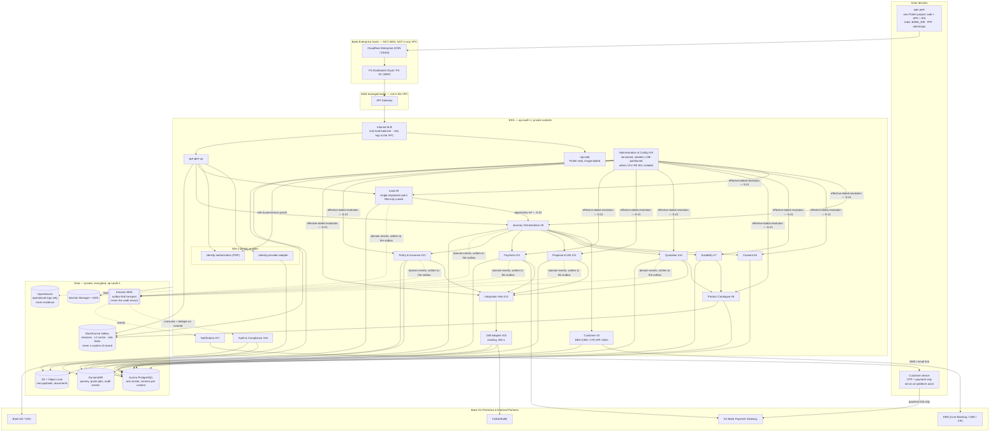

# WS-3 — Ratified Solution Architecture for the R0 Slice

**Workstream:** WS-3 — AU Bank Insurance Distribution Platform (proposed under CR-010)
**Stage:** S07 — Solution & Security Architecture (epics S07-E01, S07-E02, S07-E04, S07-E06)
**Owner:** Mahesh — Principal Insurance Platform Architect (Board 1)
**Status:** AI-DRAFTED architecture baseline. Human Architecture signature outstanding; Deepali's
security sign-off (S07-G3/G4) and Aarti's data sign-off (S07-G5) are **mandatory and separate**.

**Revision 2026-08-20 — HLD review round R0-actors/LOB/configuration** (`SUG-20260820-hr0`):
§2.1 states the two-actor model and makes Specified Person a certification attribute; §2.2 adds the
LOB and configuration dimensions; §3 brings Opportunity (#5) into Wave 1 and Configuration (#19)
into a new Wave 0b, withdrawing the earlier rule-pack-by-deployment trade; §4 redraws the component view;
§5 adds seams S-20…S-22; §7 adds fitness functions FF-16…FF-21. Decisions: ADR-004…ADR-007.

**Revision 2026-08-25 — Lead-domain R0 pull** (`CR-013`, `ADR-014`): spoken name is Lead;
working inbox archives after convert + reconciled payment + issued policy; off-platform
sales are Policy ingest; Administration UI and Reporting/MIS are R0 W4 on the isolated
read path; `issuanceMode` is mandatory; PPHI mapping is condition C-PPHI-1. Unchanged:
RM-only origination, configuration **layer** in W0b, no Lead writer for ops, GATE-S08
criteria, no business service before the foundation floor.

**Revision 2026-08-24 — R0 robustness round** (`SUG-20260824-gp1` … `gp5`, [`CR-012`](../../governance/change-requests/CR-012-r0-platform-robustness.md)):
five infrastructure layers that were deferred are admitted into R0 — hybrid bank connectivity,
centralised egress inspection, a managed cache tier, an event backbone and an operational search
pipe. In this document: §4 gains the platform-tier deployment properties; §5 adds seams
S-23…S-26; **§5.1 is rewritten** — there *is* a backbone, and the transactional outbox stays in
front of it as the source of truth; §5.2 states why idempotency does not move into the cache; §5.3
adds the three new dependency classes; §7 adds FF-22…FF-28; §8 adds the tiers that are deliberately
**not** in the DR region. Decisions: ADR-009…ADR-013. Unchanged: the service set, the waves, the
gates, the actor model, one Aurora cluster (`ADR-008`), and every fail-closed rule.

**Companions:** [`04-security-architecture.md`](./04-security-architecture.md) ·
[`05-nfr-catalogue.md`](./05-nfr-catalogue.md) ·
[`01-domain-model-and-invariants.md`](./01-domain-model-and-invariants.md) ·
[`06-architecture-justification-and-review-answers.md`](./06-architecture-justification-and-review-answers.md)
(why these services / merge rejections / datastore & caching / direct-insurer future — **explains
this document, decides nothing**, `HA-02`)

**Stakeholder pack** (compiled views of *this* file and its companions, not a second source of
truth): [`../../architecture/R0-HLD.md`](../../architecture/R0-HLD.md) walks the R0 picture for
humans; [`../../architecture/R0-LLD.md`](../../architecture/R0-LLD.md) is the S09 AWS bill of
materials for the CTO and platform team. Rule `HA-02` still applies: if those files and this
document disagree, **this document wins**.

---

## 1. What this document adds to the existing architecture review

The eight-part [`architecture-review/`](../architecture-review/README.md) is a strong artefact set
and is **not replaced**. [`stages/S07-solution-architecture.md §6`](../../application-lifecycle-bible/stages/S07-solution-architecture.md)
rates S07 🟢 *Strong, with two real gaps*, and names four open items:

| Open item from S07 §6 | Closed where |
|---|---|
| **GAP-017 — NFR numbers missing** | [`05-nfr-catalogue.md`](./05-nfr-catalogue.md) |
| Threat model not per-trust-boundary | [`04-security-architecture.md §4`](./04-security-architecture.md) |
| **S07-E01-S05 — no R0 build order** | §3 of this document |
| Backup/DR design — RTO/RPO not set, recovery not designed | [`05-nfr-catalogue.md`](./05-nfr-catalogue.md) NFR-DR-\* and §8 of this document |

So this document supplies the **R0 minimum service set with a build order**, the **seam-by-seam
synchronous/asynchronous decision with idempotency and failure semantics**, and the
**fitness-function list**. Everything else in the architecture review stands as written.

---

## 2. The R0 slice, stated as a boundary

R0 is defined by [`R0-SCOPE.md`](../../au-bank-insurance-platform/requirements/R0-SCOPE.md) and
narrowed to a build order by [`03-REALIGNMENT-PLAN.md §4`](../../application-lifecycle-bible/03-REALIGNMENT-PLAN.md),
which is explicit: *do not build the sixteen missing bounded contexts before S08 and S09 pass*, and
S11 needs *perhaps six of them thinly implemented*.

> **The R0 slice: one RM, one ETB customer, one Term product, one insurer, end to end.**
> Lead → need analysis → suitability → consent → quote → proposal → payment on the
> customer's device → issued policy → reconciled → audited. Through a real UI. Admin and MIS
> read the same slice on an isolated path. Off-platform policies enter by MIS ingest.

**Not in R0:** DIY-only journeys at scale, Health/Motor, NTB, Group B redirect, campaign and bulk
Lead origination, Notification breadth beyond the transactional minimum, a second aggregator.

### 2.1 The actors — two, and only one of them sells

The normative model is [`01-domain-model-and-invariants.md §2.4`](./01-domain-model-and-invariants.md).
Stated here because it determines the service boundaries below, not merely the screens:

| Actor | Plane | Role in R0 | Bounded by |
|---|---|---|---|
| **Bank RM** | Workforce, AD-federated | The certified **Specified Person**. Sole origination right; performs every regulated action; stays the accountable SP on the record for its life | `AC-1`, `AC-8`, INV-ACT-01, INV-ACT-03, INV-LED-04 |
| **Insurance Partner Representative (IPR)** | Partner, maker-checker provisioned | Insurer employee assisting the RM or the customer. **Assist only** — no origination, no regulated action, own-insurer product view and selection, gated read | `AC-4`, `AC-5`, `AC-6`, INV-ACT-02, INV-LED-07 |
| *Customer* | — | **Not an on-platform actor in R0.** Their device receives a consent OTP and a payment link; it reaches no platform service | `SC-W3-3`, control **C4** |

**Specified Person is a certification attribute on the RM principal — not an actor row and not a
channel** (`AC-1`, `AC-2`). It carries a certificate number, an LOB scope, a validity window and a
status, is sourced from Identity & Access (`ARCH-022`), and is evaluated at the instant of each
regulated action rather than at login (INV-ACT-01).

### 2.2 Two dimensions that are cheap now and unaffordable later

Both are architecture properties of R0 even though R0 exercises only one value of each. That is the
whole point of naming them here.

| Dimension | R0 value | Why it is present from release 1 |
|---|---|---|
| **Line of business** — `LIFE` \| `HEALTH` \| `GENERAL` | `LIFE` only, `productClass = TERM` | Health and General follow R0 on the same template. `lob` is mandatory and non-null on every entity, configuration record, audit event and authorization request (`LB-1`…`LB-5`, INV-LOB-01/02). Retrofitting it is a migration across every table on the sale path |
| **Configuration** | Backend store, versioned and seeded; **R0 admin UI** (`ADR-014`) | Rules, journey steps, field validations, document checklists, product eligibility and role permissions are resolved from configuration, never branched in code (`CF-1`…`CF-5`, INV-CFG-01…03). The layer still ships in W0b; the UI is now in R0 W4 |

---

## 3. R0 build order — closing S07-E01-S05

Ordered by what unblocks the most, and gated on the foundation. **No business service starts before
GATE-S08 and the S09 critical path**, per the sequencing constraint in the realignment plan. `W0b`
is the first thing built after that gate, because every wave beneath it reads from it.

| Wave | Component | Bounded context | Why here | Deployable unit |
|---|---|---|---|---|
| **W0 — platform foundation** | *(no services — pipeline, IaC, environments)* | — | S08 + S09. See [`00-WS3-ARCHITECTURE-REGISTRATION.md`](./00-WS3-ARCHITECTURE-REGISTRATION.md) | — |
| **W0b — configuration layer** | **Configuration (Administration & Config, backend only)** | #19 | Every wave below resolves rules, journey steps, validations, checklists, eligibility and permissions from it. Building it after the services that read it is how hardcoded branches get written and never removed (`CF-5`) | service |
| W1 | **Lead** | #5 | **The single origination point (`AC-8`).** Working inbox: create, resume, convert, archive. Nothing on-platform downstream may exist without one (`AC-9`). Off-platform Policy ingest does **not** create a Lead | service |
| W1 | Journey Orchestration | #9 | Everything else attaches to it; building it late forces journey state into the BFFs | service |
| W1 | Integration Hub | #14 | Places the existing 1SB adapter behind a routing seam before four services depend on it directly | service |
| W1 | Customer | #4 | ETB lookup is the entry to every journey | service |
| W1 | Product Catalogue (Term only) | #8 | Suitability and Quotation both need it; Term-only keeps it thin | service |
| W2 | Consent | #6 | **C2.** Blocking dependency for proposal; append-only store is simple and must be right first time | service |
| W2 | Suitability & Recommendation | #7 | **C1.** The hard-gate that makes the existing quote path lawful | service |
| W2 | Quotation | #10 | Wraps the existing adapter capability in the platform aggregate and the C1 gate | service |
| W3 | Proposal & UW-Tracking | #11 | Depends on quote selection and consent | service |
| W3 | Payment | #12 | **C4.** Money path; depends on UW approval | service |
| W3 | Policy & Issuance | #13 | Depends on reconciled payment | service |
| W3 | Audit & Compliance | #16 | **C7/C8.** Must exist before the first regulated journey completes, not after | service |
| W4 | NIP BFF | #2 | Token-hiding session for NIP-APP. One BFF per channel. Admin/MIS are role-gated routes on this BFF, never a second public BFF (`ADR-015`) | service (stateless) |
| W4 | NIP-APP (Flutter) | — | One Flutter project: web + Android APK + iOS IPA. RM, IPR, admin and ops share it; perspective is PDP role. Web on EKS `nip-web`; APK on Play Store; IPA on App Store (`ADR-015`) | app |
| W4 | Notification (transactional minimum) | #17 | Payment link delivery to the customer device is a C4 dependency, not a nice-to-have | service |
| W4 | **Administration UI** | #19 | R0 W4 **screens inside NIP-APP**, not a second app (`ADR-015`). Reads configuration; never the Lead writer (`ADR-014`, C-ISO-1) | role on NIP-APP |
| W4 | **Reporting & MIS** | #18 | Stakeholder R0: funnel, sold, on- vs off-platform, onboarding gap. Event-fed / replica only (`ADR-014`, C-ISO-1) | service |
| W3 | **Off-platform Policy ingest** | #13 | MIS upload of offline / portal sales. `source=OFF_PLATFORM`. Not `lead.create` (C-ING-1) | API on Policy |
| Deferred | Lead **campaign and bulk** origination | #5 | Single-RM create and MIS Policy ingest are in R0. Campaign/bulk Lead create stays out | R1 |
| Deferred | Customer BFF, Direct Insurer Adapter | #1 | Not on the assisted R0 path | S13 |

**Sixteen deployable services plus one workforce app (NIP-APP), not two apps.** Customer BFF and the
direct-insurer adapter remain the deferred remainder. Campaign/bulk Lead create stays out.

**Administration & Config moves from a deferred artefact to a W0b service, and this supersedes the
earlier trade.** The previous revision delivered it as versioned configuration artefacts consumed
at startup, accepting that a rule-pack change required a deployment until S13. That trade is
withdrawn: it made the deployment pipeline the rule-change mechanism, which is exactly the coupling
`CF-1` exists to prevent, and it would have been discovered as technical debt the first time
Compliance changed a consent statement. R0 ships the store, the version model, the effective-dated
resolution contract and the seeds (`CF-3`, `CF-4`). **The admin UI is in R0 W4** (`ADR-014`): it
consumes the layer; it does not replace it (`CF-5` still forbids hardcoded fallbacks).

**Why origination moves into Wave 1.** The earlier revision deferred context #5 and began journeys
from a customer lookup. `CURRENT-STATE.yaml` `current_scope.in_scope` lists *"Lead service
(context #5) — create, resume, status"* as R0 scope; the ratified state file wins over an
architecture document (`AC-9`). Beginning a journey from a lookup also creates a second way into
the funnel, which is precisely what `AC-8` forbids: every downstream module consumes the
opportunity, and a journey with no opportunity has no accountable SP, no `lob` and no
origination record.

---

## 4. Component and deployment view



**Deployment properties for R0**

| Property | Decision |
|---|---|
| Region | `ap-south-1`; DR `ap-south-2`. Non-negotiable — control C6 |
| Compute | EKS, per ARCH-002. Every service stateless at pod level |
| Perimeter & Edge Ingress | **Cloudflare Enterprise (SaaS, not AWS, not in any VPC)** → **F5 Distributed Cloud / F5-XC (SaaS WAF, not AWS, not in any VPC)** → **Amazon API Gateway** (Proxy 1 of 2; first AWS hop) → **Internal ALB** (Proxy 2 of 2; the only load balancer, and the only hop inside the VPC). **No public / External ALB.** Apigee is a known bank plane and is **not drawn** until `SPIKE-001` (`ADR-018` §7). Every service, datastore, cache node, broker and search domain is in a private subnet |
| **Bank connectivity** (`ADR-009`) | **EBS APIs (CBS / CIF)** and Bank AD are reached by **attaching as a spoke** to the existing `AU-CTO-NETWORK` Transit Gateway — not a second hub. Site-to-Site VPN from day one; Direct Connect via the **existing** DX Gateway. `dev` may stub them; **`uat` and `prod` may not**. A journey evidenced against a stub is not evidence. Workload VPCs have **no IGW** |
| **Egress** (`ADR-010`) | 100% of egress and inter-VPC traffic is inspected: TGW → AWS Network Firewall → NAT with the allowlisted Elastic IPs. Domain allowlist, drop-by-default. The 1SB mTLS session is passed intact rather than decrypted. This is not a mesh and does not replace `NetworkPolicy` |
| **Cache** (`ADR-011`) | One ElastiCache for Valkey replication group per environment: BFF sessions, an L2 read-through layer behind the in-process L1, and per-principal rate-limit counters. Per-service ACL user and key prefix. **Never** idempotency, a system of record, or a way to serve configuration past TTL |
| **Event backbone** (`ADR-012`) | Amazon MSK, 3 brokers, SASL/IAM per topic, fed by the **transactional outbox, which remains the source of truth**. No regulatory evidence exists only in a topic |
| **Operational search** (`ADR-013`) | One VPC-only OpenSearch domain per environment for application, firewall, flow and broker logs, 30 d hot → delete at 90 d. It holds no evidence and satisfies no gate |
| Customer device | Reaches the **payment gateway only**, never a platform service. That is what makes C4 an architecture property rather than a UI convention |
| Database | **Ownership per context, one cluster at R0** (`ADR-008`, amending `ARCH-004`). Each context owns its own schema with its own credential and its own migration history, and no service reads another's tables — that half is invariant. The physical topology is not: R0 runs **one Aurora cluster with a schema per context**, and the first physical split follows the **LOB-cell / shared-platform seam**, not the service boundary. The existing shared `bank-persistence-service` stays scoped to the integration job/correlation store and audit ingestion — it is **not** extended to the R0 business contexts |
| Render.com | Dev preview only. Never a PII data path. See ADR-001 in [`../architecture-review/08-architecture-decision-log.md`](../architecture-review/08-architecture-decision-log.md) |
| **Partner (IPR) exposure** | The partner surface enters through the **same** API Gateway and the same BFF contract as the RM surface. There is no partner-specific service and no partner-specific journey path (`AC-3`); the difference is entirely the PDP decision and the query-layer scope (`AC-5`) |
| **Actor scoping** | Every read on behalf of an `INSURER_PARTNER_REP` principal is constrained at the persistence layer by `insurer_id` **and** the `AC-4` visibility predicate. A repository method that can be called without them does not exist (`FF-17`) |
| **LOB** | `lob` is a non-null column on every business and configuration table from the first migration (`LB-1`). Physical partitioning at R0 is an index prefix, not a partition key (`DATA-001` / OPEN-I6); the logical dimension is not negotiable |
| **Configuration** | One store, LOB-partitioned, append-only versioned, effective-dated, seeded from source-controlled artefacts. Services resolve through a port and cache to the resolution TTL; no service embeds a rule (`CF-1`…`CF-4`) |

---

## 5. Seam catalogue — synchronous vs asynchronous, with semantics

S07-E02-S01 and S07-E02-S05. Every seam names its style, its idempotency mechanism, its timeout
posture and its behaviour when the far side fails. A seam with no failure row is an undesigned seam.

Legend: **Sync** = caller waits · **Async-poll** = accepted then polled ·
**Async-event** = fire-and-forget through a durable outbox.

Twenty-six seams. S-20 to S-22 arrived in the 2026-08-20 revision and carry origination,
configuration resolution and the gated partner read. S-23 to S-26 arrived in the 2026-08-24
robustness round and carry the four infrastructure seams that now exist: publish, consume, cache
and the bank path.

| # | Seam | Style | Idempotency | Timeout / retry | On failure |
|---|---|---|---|---|---|
| S-01 | Flutter → BFF | Sync | Client-generated `Idempotency-Key` on mutations | 5 s edge budget | Typed error; journey stage unchanged |
| S-02 | BFF → PDP (WS-2) | Sync | n/a (read) | 300 ms, no retry | **Fail closed** — deny. Default-deny is not degradable |
| S-03 | BFF → Journey Orchestration | Sync | Key propagated | 3 s | Error surfaced; no partial stage advance |
| S-04 | Journey → Customer | Sync | n/a (read) | 2 s, 1 retry | Journey holds at `INITIATED`; RM sees a retryable error |
| S-05 | Customer → CBS | Sync | n/a (read) | 3 s, 1 retry | Cached snapshot if within freshness window; otherwise fail. **No stale-unbounded fallback on identity data** |
| S-06 | Journey → Consent | Sync | Key on grant | 2 s | Consent not granted; journey cannot advance. Fail closed |
| S-07 | Journey → Suitability | Sync | Key on evaluate | 3 s | Assessment not completed; **quote refused** (C1). Fail closed |
| S-08 | Quotation → Suitability (gate check) | Sync | n/a (read) | 500 ms, no retry | **Fail closed** — `403 SUITABILITY_REQUIRED`. A cache miss is a refusal, never an allow |
| S-09 | Quotation → Integration Hub (create) | **Async-poll** | Key derived from `quoteId` | Submit: 3 s connect / 30 s read, **no automatic retry** | Poll by external reference to recover state. Re-submitting a possibly-processed quote is the failure mode this rule exists to prevent |
| S-10 | Hub → 1SB Adapter | **Async-poll** | Adapter's existing job/idempotency contract | Existing `onesb.client.*` budgets | `PARTIAL` is success (INV-QUO-02); zero offers → `FAILED` |
| S-11 | Quotation poll loop | Async-poll | Job-level optimistic lock (`integration_job.version`) | Backoff 1 s → 30 s cap, bounded attempts | Budget exhausted → `TIMED_OUT`, journey → `ABANDONED` with a re-quote path |
| S-12 | Proposal → Hub (submit) | **Async-poll** | Key derived from `proposalId` | Submit: no automatic retry | Poll; on exhaustion `SUBMISSION_FAILED` + operations task (F-04) |
| S-13 | Payment → AU Bank PG (session) | Sync | Key derived from `paymentId` | 3 s / 15 s | `REJECTED`; proposal stays `AWAITING_PAYMENT` |
| S-14 | PG → Payment (authorisation result) | **Callback, at-least-once** | `pgTxnId` deduplication; replay-protected | n/a | Missing callback → `UNCERTAIN`, resolved by reconciliation (F-08). **Never** by assumption |
| S-15 | Payment reconciliation ← PG settlement | **Batch, scheduled** | Idempotent match on `pgTxnId` + amount | Daily + on-demand | Unmatched past SLA → `RECONCILIATION_BREAK`, manual procedure (F-07) |
| S-16 | Policy → Hub (issuance confirm) | Sync + scheduled re-check | `policyId` | 3 s / 15 s | `CONFIRMATION_OVERDUE` → re-check → `ISSUANCE_DISPUTED` (F-06) |
| S-17 | any service → Audit | **Async-event via transactional outbox, delivered over MSK** (S-23 + S-24) | `eventId` de-duplication at the consumer | At-least-once, retried until acknowledged | Business transaction commits; journey blocked from `SOLD` until the audit **write** confirms — not until the topic accepts the message (INV-JRN-05, F-10) |
| S-18 | Payment/Policy → Notification | Async-event | `eventId` | At-least-once | Notification failure never blocks the journey; it raises an operations task |
| S-20 | BFF → Opportunity (create / resume / status) | Sync | Client `Idempotency-Key` on create | 2 s | `403 ORIGINATION_RM_ONLY` for any non-`BANK_RM` principal (INV-LED-04). Fail closed |
| S-21 | any service → Configuration (resolve) | Sync, read-through cache to the resolution TTL | n/a (read) | 300 ms, no retry | **Fail closed** — a service that cannot resolve its rules refuses the action rather than falling back to a compiled-in default. There is no compiled-in default (`CF-1`) |
| S-22 | Partner surface → BFF → gated read | Sync | n/a (read) | 3 s | Records outside `AC-4` and `insurer_id` scope are **absent from the result set**, never a `403` on a named record — a refusal that names an id confirms the id (INV-LED-07) |
| S-19 | Journey → compensation tasks | Async-event + durable task | `journeyId` + failure point | Bounded automatic attempts | Exhaustion → `MANUAL_INTERVENTION` with a named owner (F-05) |
| S-23 | `outbox-publisher` → MSK topic | **Async publish, at-least-once** | Outbox row id; broker-side idempotent producer | Retry with backoff, unbounded — the row is not acknowledged until the publish succeeds | Nothing is lost: the outbox row remains. Delivery is **delayed**, and outbox age (NFR-DAT-05) is the alert that fires |
| S-24 | MSK topic → `#16` Audit / `#17` Notification consumer | **Async consume, replay-tolerant** | `eventId` de-duplication at the consumer, mandatory | Bounded attempts, then DLQ per consumer group | The evidence write is the completion condition, never the offset commit. A DLQ entry is an operations task, and `SOLD` stays blocked |
| S-25 | any service → cache tier (Valkey) | **Sync, best-effort** | n/a (read-through) | 50 ms, no retry | **A miss is a read, never an error.** Fall through to the owning store. Cache unavailable degrades latency and never changes an authorisation or a configuration outcome |
| S-26 | `#4` Customer / Keycloak → bank systems over the TGW | Sync | n/a (read) | Per S-05 / WS-2 budgets | Typed `503` naming the dependency class. `dev` may stub CBS and AD; `uat` and `prod` may not |

### 5.1 The event backbone, and why the outbox stays in front of it — S07-E02-S03

**Superseded 2026-08-24 by `ADR-012`.** This section previously argued that R0 needed no broker.
The argument was sound about the *mechanism* and wrong about the *timing*, and both halves are worth
keeping in view.

What it got right, and what is retained unchanged: **the transactional outbox**. Twelve of the
twenty-six seams are synchronous because a human is waiting in session; the genuinely asynchronous
ones (S-17, S-18, S-19) are fan-out to non-blocking consumers, and the outbox is what makes them
safe. A service writes its business change and its outbox row in **one local transaction**. That is
the whole answer to the dual-write problem, and a broker does not replace it — "commit, then
publish" is two writes with no shared transaction, which loses an event on a crash and duplicates a
business change on a retry.

What it got wrong: **its own revisit trigger fires inside R0.** The trigger was "a third distinct
consumer class, sustained outbox lag, or Reporting entering scope at S13". R0 already has three
consumer classes in the design — audit (S-17), notification (S-18) and compensation (S-19) — and
without a broker each new consumer is another poller against the producing service's own database,
so every consumer becomes a change to the producer's data-access pattern. Waiting for the trigger
meant adopting a broker in the middle of the vertical slice, while the audit path was being
evidenced for a gate. That is the worst of the three available moments.

> **Decision (`ADR-012`):** R0 provisions **Amazon MSK** and **keeps the transactional outbox**.
> The outbox is the source of truth and the replay log; the topic is transport and fan-out.
> `outbox-publisher` (S-23) publishes; consumers (S-24) dedupe on `eventId` and tolerate replay.
>
> **The rule that cannot be traded:** no regulatory evidence exists only in a topic. `#16` Audit
> writes DynamoDB and the S3 WORM archive, and *that write* satisfies INV-JRN-05 (`FF-26`).
> Retention on a topic is an operational parameter; retention on evidence is a licence condition.
>
> **Revisit trigger, both directions.** Toward removal: R0 completing with one real consumer class
> and no replay ever used makes the broker a cost to withdraw. Toward growth: sustained consumer lag
> that partition-level scaling cannot absorb, or a cross-region consumer.

AP-09 still applies, and it is worth being precise about what it says here. The objection to Kafka
was never that Kafka is wrong; it was that a platform which has not run one service in a real
environment should not adopt infrastructure it cannot operate. That objection is now answered by
**shape rather than by absence**: three brokers sized for AZ availability rather than throughput,
managed rather than self-run, with the outbox in front so that a broker outage delays events instead
of losing them. The operational surface it adds is real and is recorded as `RISK-014`, not
explained away.

### 5.2 Idempotency standard — S07-E02-S05

| Aspect | Decision |
|---|---|
| Header | `Idempotency-Key`, required on every mutating platform API (INV-IDM-01) |
| Derivation | Client-supplied at the edge; **server-derived** for service-to-service seams, from the owning aggregate id plus operation — so a retry of an internal call cannot invent a new key |
| Storage | Key → `{requestFingerprint, responseSnapshot, createdAt}` in the owning service's store |
| **Not the cache** | `ADR-011` provisions a shared cache tier and **refuses to hold idempotency in it.** The record must be written in the same transaction as the business change; a cache cannot be transactionally consistent with a database write, and idempotency that is only mostly right on the money path is worse than none. The target-state review's "ElastiCache for idempotency" line is rejected by name so it is not rediscovered as a good idea |
| Retention | 24 hours, matching the existing adapter contract |
| Replay, same body | Return the stored response with its original status |
| Replay, different body | `409 IDEMPOTENCY_KEY_CONFLICT` |
| Missing key | `400 MISSING_IDEMPOTENCY_KEY` |
| Money path | Payment additionally enforces INV-PAY-04: no new attempt while a prior one is `AUTHORISED` or `UNCERTAIN`. Idempotency alone does not prevent a double charge across two distinct keys |

### 5.3 Resilience policy per dependency class — S07-E02-S04

| Dependency class | Timeout | Retry | Breaker | Bulkhead | Degraded mode |
|---|---|---|---|---|---|
| PDP (WS-2) | 300 ms | none | none | shared | **None — fail closed** |
| CBS | 3 s | 1, on 5xx/connect | yes | per-dependency | Snapshot within freshness window |
| Product Catalogue | 500 ms | 1 | yes | shared | Read cache |
| Integration Hub → adapter | per adapter | **none on submit**, bounded on poll | yes, **per provider** | **per provider** | Partial-quote success; provider isolation |
| AU Bank PG | 3 s / 15 s | none on session create | yes | dedicated | No degraded mode on the money path |
| Configuration resolution | 300 ms | none | no | shared | **None — fail closed.** Cached values serve until their TTL; an expired cache with an unreachable store refuses the action. A compiled-in fallback would be the hardcoded branch `CF-1` forbids, arriving through the back door |
| Outbox → MSK (S-23) | 2 s | unbounded with backoff | no | dedicated worker | Queue in the outbox and alert on outbox age; **never drop** |
| MSK → consumer (S-24) | per consumer | bounded, then DLQ | no | per consumer group | DLQ + operations task. `SOLD` stays blocked until the evidence write lands |
| Cache tier (S-25) | 50 ms | none | no | shared | **Read through to the owning store.** A cache miss or outage is latency, never a different answer |
| Bank systems over the TGW (S-26) | per S-05 | 1 on connect failure | yes | per dependency | Typed `503`. DX loss falls to VPN automatically; both down is a CBS outage, not a degraded mode |

Per-provider bulkheads are Shivanshi's §8 requirement and they are an **architecture** property,
not a runtime tuning knob: one failing insurer must not consume the connection budget that makes
every other insurer look down.

---

## 6. Internal architecture pattern — S07-E01-S03

Every WS-3 service adopts the pattern the 1SB service already proves:

```
api/          HTTP entry points only. No adapter imports.
application/  Use-case orchestrators. No HTTP, no SQL, no provider types.
domain/       Aggregates, value objects, ports. Zero framework annotations.
adapter/      Provider and infrastructure implementations of ports.
```

| Rule | Enforced by |
|---|---|
| `application.*` must not import `adapter.*` | ArchUnit |
| `domain.*` must not import framework annotations | ArchUnit |
| `api.*` must not import `adapter.*` | ArchUnit |
| provider types confined to `adapter.<provider>.*` | ArchUnit (INV-ACL-01) |
| no cross-service database access | ArchUnit + IAM, verified in the S09 IaC scan |

This is not a style preference. It is what makes S07-VT-08 (replace 1SB with another aggregator;
change confined to the adapter layer) answerable rather than hopeful.

---

## 7. Fitness functions — S07-E06-S03

S07-G8 requires that every automatable constraint has one. This is the list; building them is S08
work (`GATE-S08` criterion S08-G4).

| # | Constraint | Fitness function | Stage it must run from |
|---|---|---|---|
| FF-01 | Provider types confined to the adapter | ArchUnit rule per adapter, `allowEmptyShould(false)` — closes TD-007 | S08 |
| FF-02 | Layer dependency direction | ArchUnit | S08 |
| FF-03 | No Flyway or JPA in `1sb-integration-service` | ArchUnit + build-file assertion | S08 |
| FF-04 | Journey holds no business decision (INV-JRN-02) | Schema assertion test over the journey aggregate | S08 |
| FF-05 | No PII in logs (C5 / INV-LOG-01) | Log-scan test over a full suite run | S08 |
| FF-06 | Coverage floors | JaCoCo verification failing the build | S08 |
| FF-07 | 100% branch coverage on control paths C1–C10 | Filtered coverage report | S08 |
| FF-08 | Every region-pinned resource in an India region (C6 / INV-DAT-01) | IaC policy-as-code, pre-apply | S09 |
| FF-09 | No public data store, no unencrypted store, no wildcard production IAM | IaC policy-as-code | S09 |
| FF-10 | Audit store rejects UPDATE and DELETE (C7 / INV-AUD-01) | Immutability test attempting deletion | S09 |
| FF-11 | No secret in repository, image or config | Secret scanning, pre-commit + CI | S08 |
| FF-12 | Suitability gate cannot be bypassed (C1 / INV-QUO-01) | Negative contract test on every quote entry point | S11 |
| FF-13 | Attribution never caller-supplied (C3 / INV-DIS-01) | Negative test injecting `distributorId` | S11 |
| FF-14 | Payment link never issued to an RM channel (C4 / INV-PAY-01) | Negative journey test | S11 |
| FF-15 | Contract compatibility at every service seam | Consumer-driven contract tests in CI | S08 |
| FF-16 | Origination is RM-only (`AC-8` / INV-LED-04) | Negative test attempting `opportunity.create` as an `INSURER_PARTNER_REP` and as a service principal, on every entry point | S11 |
| FF-17 | IPR reads are insurer-scoped and gated (`AC-4`, `AC-5` / INV-LED-07) | Repository-level test asserting every read path for a partner principal emits both predicates; plus a negative journey test attempting a cross-insurer and a pre-suitability read | S08 (static) · S11 (journey) |
| FF-18 | No business branch on an insurer, product, LOB or channel literal (`CF-1` / INV-CFG-01) | ArchUnit rule over `application.*` and `domain.*`, plus a literal-scan for known insurer and product codes | S08 |
| FF-19 | `lob` is non-null everywhere and never carries a product class (`LB-1`, `LB-3` / INV-LOB-01/02) | Schema assertion over every migration: no nullable `lob`, no `lob` value outside the frozen vocabulary | S08 |
| FF-20 | Configuration is append-only and versioned (`CF-3` / INV-CFG-02) | Immutability test attempting an in-place update of an `ACTIVE` configuration record | S09 |
| FF-21 | Every regulated action re-checks SP certification at the action (INV-ACT-01) | Negative test executing each regulated action with an expired, suspended and out-of-LOB-scope certification | S11 |
| FF-22 | **100% of egress is inspected** (`ADR-010`) | IaC policy-as-code: any route table whose `0.0.0.0/0` target is not the Transit Gateway fails the plan. Plus a runtime check that no NAT gateway exists in a workload VPC | S09 |
| FF-23 | **Nothing writes evidence or idempotency to the cache** (`ADR-011`) | Static check that the idempotency and audit ports have no cache-backed implementation, plus a negative test asserting a cache-unavailable idempotency write still refuses rather than succeeding | S09 static · S11 journey |
| FF-24 | **Cache keyspace is owned per service** (`ADR-011`) | IaC assertion that each deployable has its own Valkey ACL user with a key-prefix grant, and a negative test attempting a cross-prefix read | S09 |
| FF-25 | **Every event has a registered, backward-compatible schema** (`ADR-012`) | CI check against the Glue Schema Registry: a producer whose payload has no registered schema, or breaks backward compatibility, fails the build | S08 |
| FF-26 | **No regulatory evidence exists only in a topic** (`ADR-012`) | Test asserting a journey cannot reach `SOLD` on a topic acknowledgement alone — the audit store write is the completion condition. Plus a check that no gate query reads from MSK | S11 |
| FF-27 | **No restricted attribute reaches a search index** (`ADR-013`) | Scheduled scan of the OpenSearch index mapping and a sampled document scan for regulated field patterns, in addition to FF-05 at emission | S09 |
| FF-28 | **The log pipeline cannot write the audit archive** (`ADR-013`) | IAM assertion: the Firehose and Fluent Bit roles have no permission on the audit event table or the `audit-archive` bucket, and the audit role has no permission on the search domain | S09 |

Twenty-eight constraints, twenty-eight machine checks. **None of them runs today**, which is the
S08 finding restated in architecture terms rather than process terms. `FF-22` … `FF-28` are the
robustness round's half of that finding: five layers were added, and each one is bounded by a check
rather than by a paragraph. Six of the seven are IaC or CI assertions, so they land in the S09 lane
with the infrastructure that needs them rather than adding to the application backlog.

---

## 8. Availability, backup and recovery architecture

Closing the fourth S07 §6 open item. Numbers and verification methods are in
[`05-nfr-catalogue.md`](./05-nfr-catalogue.md); the design is here.

| Concern | R0 design |
|---|---|
| Compute availability | Minimum 2 pods per service across ≥ 2 AZs; pod disruption budget prevents simultaneous drain |
| Relational store | Aurora PostgreSQL Multi-AZ with automated failover; PITR enabled |
| Key-value store | DynamoDB with point-in-time recovery |
| Object store | S3 with versioning, Object Lock on the 7-year classes, cross-region replication to `ap-south-2` |
| Backup | Automated per store, encrypted with the store's CMK, retained per the retention class |
| **Restore** | A restore is executed and timed at S09 (S09-G7). *A backup that has never been restored is a hypothesis* — the stage file's phrase, and it is correct |
| DR | Warm standby in `ap-south-2`. Full active-active is explicitly **not** R0 — it multiplies cost and consistency complexity before a single journey has run |
| **Bank path in DR** | A Transit Gateway with its own VPN attachment exists in `ap-south-2` from the same change as the primaries (`ADR-009`, LLD `D16`). Every other DR row assumed the standby could serve a journey; a journey needs CIF and needs an RM to authenticate against Bank AD, so a standby with no bank path can start pods and answer nothing |
| **Cache, broker and search in DR** | **Deliberately absent.** Sessions are re-established by re-authentication, the L2 cache rebuilds on first miss, events are **replayed from the outbox** (which lives in Aurora and is therefore already covered), and operational logs are not evidence. A tier is replicated when it holds something that cannot be reconstructed |
| Money-path recovery | Reconciliation is the recovery mechanism for payment state, not database restore. Restoring a database does not resolve whether the PG captured a payment |

**Degraded-mode inventory.** Each entry states what still works, and — critically — what must *not*
be allowed to work.

| Failure | Still available | Deliberately unavailable |
|---|---|---|
| 1SB unreachable | Existing journeys readable; proposals in UW readable; policy documents | New quotes, new proposal submissions |
| PDP unreachable | Nothing authorised | **Everything.** Fail closed |
| Consent service unreachable | Quotes on an existing consent | New consent capture, new proposal submission |
| Suitability unreachable | Existing quotes readable | **All new quotes** (C1) |
| Payment gateway unreachable | Journeys up to `UW_APPROVED` | Payment link issuance |
| Audit store unreachable | All business operations, buffered by outbox | Journey completion to `SOLD` |
| Event backbone (MSK) unreachable | **All business operations.** The outbox row commits with the business change, so nothing is lost — delivery is delayed and outbox age alerts (`NFR-DAT-05`) | Journey completion to `SOLD`, because the audit **write** has not happened |
| Cache tier unreachable | **Everything**, at higher latency: reads fall through to the owning store | New sessions are re-established rather than resumed; per-principal rate limits degrade to per-pod until it returns |
| Egress inspection unreachable | Journeys already in the platform, all reads | **All provider and payment traffic.** Firewall down is no egress — correct, and an outage with a named runbook (`ADR-010`) |
| Bank path (DX **and** VPN) down | Journeys already started, with cached identity inside its freshness window | New ETB lookups and any AD-federated login. **No unbounded stale identity fallback** (`S-05`) |
| Search domain unreachable | **Everything.** It is an operational tool | Nothing business-facing. Investigation gets harder, which is an SRE incident and never a compliance one |
| Configuration store unreachable | Everything whose rules are still inside their cache TTL | **Every action whose rules have expired from cache.** There is no compiled-in fallback to degrade onto (`CF-1`) |
| Identity & Access certification lookup unreachable | Read paths | **Every regulated action** — an unverifiable SP certification is a refusal, not an assumption (INV-ACT-01) |

---

## 9. What this document does not decide

| Item | Owner | Why not here |
|---|---|---|
| Physical schema, indexes, partitioning per context | Aarti | **Design drafted** in [`data-architecture/`](../data-architecture/README.md) (`DATA-001`). Human signature and S09 Flyway apply remain |
| Autoscaling policy, HPA/KEDA targets, node sizing, broker/cache/search node classes | Shivanshi | S07 §7 lists it as premature; S14 sizes it. The robustness round fixes the *shapes* (§4) for availability, never the instance classes |
| Multi-region active-active | Mahesh + Shivanshi | Premature; warm standby is the R0 posture |
| Cost model | Shivanshi + Kalpana | S09 output |
| Flutter application architecture, design system, state management | Mahesh + Rajal | S05 is 🔴 Missing (GAP-009); a UI architecture without a design baseline would be invented, not derived |
| Group B redirect journey | Rajal | Out of the R0 platform slice |
| The exact IPR permitted-action set — where assistance ends and solicitation begins | **Shailja** | `ID-21` / `JS-09`: I build the gate and ship it default-deny; the threshold is a compliance determination. Recorded as OPEN-D9 in [`01`](./01-domain-model-and-invariants.md) |
| Physical partitioning of the `lob` dimension per store | Aarti | **R0 decision:** index prefix, not a partition key — [`01 §5`](../data-architecture/01-physical-design.md#5-open-i6--lob-partitioning) |
| Exact MIS report catalog and row-level access on the admin/MIS UI | Rajal + Deepali + Shailja | Surfaces are in R0 W4 (`ADR-014`); the catalogue and authz matrix are not invented here |
| Topic partition counts, retention windows, consumer-group IAM matrix | Shivanshi + Deepali | The **backbone** is decided (§5.1, `ADR-012`). Its operational parameters and its access matrix are not architecture's to set |
| Firewall rule-set curation and the managed-IPS alert→drop date | Deepali + Shivanshi | `ADR-010` is a security control: the interim posture is Deepali's acceptance, not an architecture preference |
| The bank's side of the connectivity — VPN termination, prefixes, firewall change, DX order | Shivanshi + bank network | `ADR-009` decides the **pattern**; the bank's own work is external and tracked as a dependency, not designed here |
| Cost envelope for the five new layers | Shivanshi + Kalpana | S09 output. `RISK-012` is open against it; the per-environment shapes in the LLD §1.4 exist so the answer is not "production, three times" |

---

**Signed:** Mahesh — Principal Insurance Platform Architect (Board 1 / R2)
**signature_status:** `AI-DRAFTED — mandatory human signature outstanding`
**Date:** 2026-08-16 · **revised** 2026-08-20 (HLD review round — actors, LOB, configuration) · **revised** 2026-08-24 (R0 robustness round — ADR-009…ADR-013)
