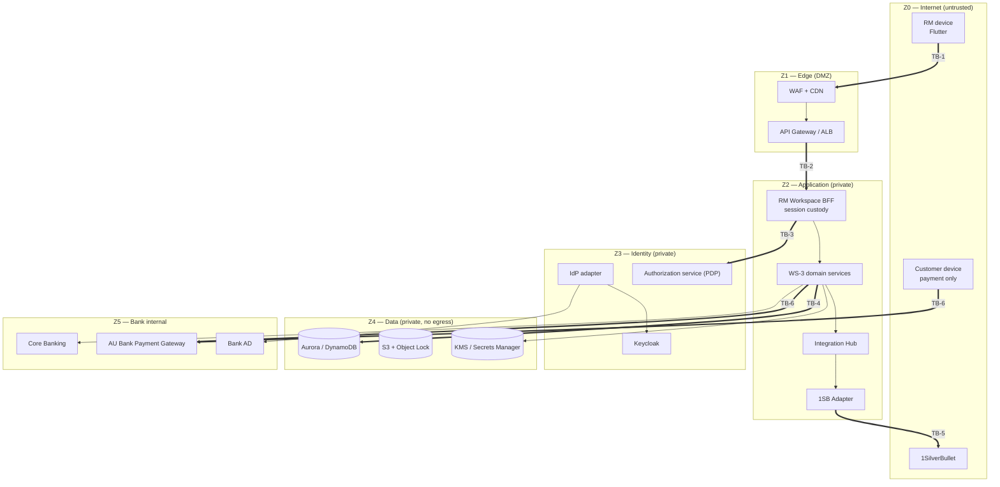

# WS-3 — Security Architecture for the R0 Slice

**Workstream:** WS-3 — AU Bank Insurance Distribution Platform (proposed under CR-010)
**Stage:** S07 — Solution & Security Architecture (epic S07-E03)
**Jurisdiction:** S07-E03 is **Deepali's** epic. Deepali owns the security property, the residual
risk and the Board 4 verdict; Mahesh owns how the design is structured.
**Status:** **AI-DRAFTED by Architecture as an input to Board 4, not as a Security verdict.**
S07-G3 (threat model) and S07-G4 (security architecture) both require a **human** Security
signature ([`04-GATE-AND-SIGNOFF-MODEL.md §5`](../../application-lifecycle-bible/04-GATE-AND-SIGNOFF-MODEL.md):
Deepali is `AP/B/H` at S07). Nothing in this document satisfies that requirement.

**Companions:** [`03-solution-architecture-r0.md`](./03-solution-architecture-r0.md) ·
[`05-nfr-catalogue.md`](./05-nfr-catalogue.md) ·
[`01-domain-model-and-invariants.md`](./01-domain-model-and-invariants.md)

---

**Revision 2026-08-20 — HLD review round R0-actors/LOB/configuration** (`SUG-20260820-hr0`):
§3 separates the Partner principal class from Workforce, states Specified Person as an RM
certification attribute, and adds the gated, insurer-scoped, assist-only IPR controls.

---

## 1. Position

The security *standards* in this repository are strong —
[`architecture-review/06-security-compliance-and-nfrs.md`](../architecture-review/06-security-compliance-and-nfrs.md)
covers edge, identity, secrets, encryption, network and attribution, and the WS-2
[authentication/authorization SSOT](../authentication-authorization/README.md) is well argued.

What [`stages/S07-solution-architecture.md §6`](../../application-lifecycle-bible/stages/S07-solution-architecture.md)
records as missing is a **per-trust-boundary threat model**. A standards list says what controls
exist; a boundary model says what an attacker reaches when one fails. This document supplies the
boundary model, the identity architecture across four principal classes, and the four
platform-specific security properties that carry regulatory weight: PII handling, key and secret
management, payment device isolation, and audit immutability.

---

## 2. Trust boundaries

S07-E03-S02. Six boundaries. A boundary is a place where the assumption *"the caller is who it
claims to be and may do what it asks"* has to be re-established.

| ID | Boundary | What crosses | What must never cross |
|---|---|---|---|
| **TB-1** | Internet → Edge | TLS 1.3 HTTPS; session cookie | OAuth access or refresh tokens (standing constraint); any direct datastore reach |
| **TB-2** | Edge → Application | Authenticated session, correlation id | Unauthenticated request; caller-supplied `distributorId` |
| **TB-3** | Application → Identity | Authorization query (subject, action, resource, context) | Business data; any request that assumes an allow on PDP failure |
| **TB-4** | Application → Data | Least-privilege, per-service credential, TLS | Cross-service database access; a service account with UPDATE/DELETE on audit |
| **TB-5** | Application → Provider (1SB) | Bank-canonical payload translated at the adapter, over an IP-allowlisted egress | Provider types leaking inward; secrets in payloads or logs |
| **TB-6** | Application/Customer → Payment Gateway | Payment session reference; PG callback | Card or account data into the platform; an RM principal on the authorisation path |

**Boundary rule.** Every boundary is default-deny and every boundary re-authenticates. Being inside
the VPC is not an authorisation.

---

## 3. Identity architecture — four principal classes

S07-E03-S03. The four classes are genuinely different and conflating them is a common source of
authorisation defects. **Partner was separated from Workforce in the 2026-08-20 revision:** an
insurer's employee is not a bank employee, is not in bank AD, and does not hold a bank RM's grant
set (`ID-12`, `AC-6`).

| Class | Who | Authentication | Session | Authorisation |
|---|---|---|---|---|
| **Workforce** | RM (the certified **Specified Person**), branch manager, ops — **bank employees only** | Bank AD/SSO federated through the provider-neutral IdP adapter (ARCH-018) | **Token-hiding BFF session.** Flutter receives an opaque session cookie; the BFF holds provider tokens (ARCH-019, standing constraint) | PDP decision: default-deny RBAC + ABAC + relationship rules (ARCH-020), plus SP certification evaluated at the action (INV-ACT-01) |
| **Partner** | **Insurance Partner Representative (IPR)** — an insurer's employee. Separate plane, separate realm; **never federated into bank AD** (`ID-12`) | Identity & Access provisions the principal to the IdP after maker-checker (ARCH-022) | Same token-hiding BFF session pattern; no partner-specific session mechanism | Default-deny, **assist-only** grant set (INV-ACT-02) plus a mandatory `insurer_id` query-layer predicate (`AC-5`, INV-LED-07) |
| **Customer** | ETB retail customer | **Out of WS-2 Phase 1 scope.** For R0, the customer is authenticated only by the payment gateway on their own device, plus an OTP challenge at consent capture | No platform session in R0 | n/a in R0 |
| **Workload** | Service-to-service | Workload identity (IRSA), mutual TLS in-mesh; no static credential in any pod | n/a | Per-service least-privilege IAM plus explicit service-to-service allow lists |

> **Compliance point, carried in the security architecture as well as the domain model.** The IPR
> is **not** a Specified Person. Their presence on a journey must never constitute solicitation or
> advice. Three architectural properties carry that obligation — no regulated grant, an immutable
> accountable SP, and separately attributed audit — and none of them is a UI behaviour. **Which
> assistance actions remain lawful for a non-SP is Shailja's determination** (`ID-21`, `JS-09`),
> recorded as OPEN-D9; the platform ships default-deny until she sets it.

### 3.1 The customer-identity gap, stated plainly

R0-SCOPE §2 A2 puts **self-service and hybrid journeys in scope from Day 1**, and self-service
requires a *customer* principal. WS-2's scope explicitly excludes retail-customer authentication
(`CURRENT-STATE.yaml` WS-2 `out_of_scope`). Those two statements cannot both hold for a Day-1
self-service journey.

I do not resolve this here. It is recorded as **finding A-F03** in the Board 1 verdict
([`board-1-architecture-mahesh.md`](../../governance/change-requests/CR-010/verdicts/board-1-architecture-mahesh.md))
and as an architecture condition, because the resolution is a Product scope decision (Rajal) with a
Security design consequence (Deepali) — not an architecture preference.

### 3.2 Authorisation model — S07-E03-S04

| Property | Decision |
|---|---|
| Default | **Deny.** No resource is reachable without an explicit allow |
| Model | RBAC (role) + ABAC (branch, insurer, hierarchy, certification) + relationship (assignment, sharing) |
| Precedence | Explicit deny and suspension beat any grant |
| PDP placement | `identity-authorization-service`. The IdP is never the source of truth for business authorisation (standing constraint) |
| Double enforcement | The BFF enforces coarse-grained access; the **owning domain service re-enforces** object-level authorisation. A BFF-only check is a broken-object-level-authorisation defect waiting for a direct-call path |
| Certification gate | Specified Person is a **certification attribute on the RM principal**, not an actor type or a channel (`AC-1`). An RM whose certification is expired, suspended or outside the resource's LOB scope cannot originate an opportunity (INV-LED-04), be assigned one (INV-LED-03) or perform any regulated action (INV-ACT-01). Evaluated **at the action**, not at login; expiry is an event, not a cached attribute |
| Actor-type vocabulary | Closed at `BANK_RM`, `INSURER_PARTNER_REP`, `SERVICE` for R0 (`AC-2`). `CERTIFIED_SP` is not an actor type — modelling a certification as an actor produces two principals and two audit trails for one human |
| Assist-only enforcement | An `INSURER_PARTNER_REP` holds no regulated-sales grant at any journey stage (INV-ACT-02), and the accountable SP on a record is immutable and always the originating RM (INV-ACT-03). The permitted set — gated read, own-insurer product view/select, assistance annotation — is itself configuration (`CF-2`), not code |
| Partner visibility | Gated **and** scoped: a record is returned to a partner principal only once the RM has created the opportunity and completed need analysis and suitability, and only for the partner's own `insurer_id` (`AC-4`). Applied as a mandatory predicate at the persistence layer (`AC-5`), so an unscoped query cannot be written rather than being caught in review (`FF-17`) |
| Non-enumeration | An out-of-scope record is **absent from the result set**, never a `403` on a named identifier — a refusal that names an id confirms the id exists (seam S-22) |
| Attribution of assistance | Every partner action is audited with `acting_capacity = ASSIST_ONLY`, `actor_insurer_id` and `assisted_actor_id` (INV-ACT-04), so the solicitation trail presented to IRDAI is single-threaded to one accountable SP |
| Configuration-sourced permissions | Role-to-permission grants, including the partner gate, are versioned configuration (`CF-2`, `CF-3`). A permission change is a seeded version with an activation window, and the version that governed a decision is recoverable seven years later |
| Caching | PDP decisions may be cached only for the duration of a single request. A longer cache converts a revocation into a delay |
| Failure | **Fail closed** (seam S-02) |

---

## 4. Threat model per trust boundary — S07-E03-S01

STRIDE per boundary. Every threat carries a mitigation or is recorded as an open risk with an owner.
This is the artefact S07-G3 requires; a **human Security signature is required for it to count**.

### TB-1 — Internet → Edge

| STRIDE | Threat | Mitigation | State |
|---|---|---|---|
| S | Session token theft from the device | Token-hiding BFF; no OAuth token on the device; short session TTL; device binding on the session cookie | Designed, unimplemented |
| T | Request tampering in transit | TLS 1.3; HSTS | Designed |
| R | RM denies an action | Every action audited with actor attribution (INV-AUD-02) | Partially designed |
| I | Enumeration of customers via lookup endpoints | Rate limiting per principal; opaque identifiers; no PII echoed in responses (PII-03) | Designed |
| D | Volumetric or application DoS | WAF managed rules, Shield, per-principal rate limits | Designed |
| E | Privilege escalation by role claim manipulation | Roles resolved server-side by the PDP; never read from a client-supplied claim | Designed |

### TB-2 — Edge → Application

| STRIDE | Threat | Mitigation | State |
|---|---|---|---|
| S | Forged internal call bypassing the gateway | Services accept traffic only from the mesh with workload identity; no service is internet-routable | Designed |
| T | **Attribution spoofing** — caller supplies `distributorId` | INV-DIS-01: server-side injection at the Hub; caller-supplied values **rejected**, not ignored | Partially implemented in the adapter (C3 🟡) |
| I | Verbose errors leaking internal structure | RFC 7807 problem details with no internal identifiers; provider errors normalised at the adapter | Implemented in the adapter |
| E | Reaching a domain service directly, skipping BFF checks | Domain services re-enforce object-level authorisation (§3.2) | Designed |

### TB-3 — Application → Identity

| STRIDE | Threat | Mitigation | State |
|---|---|---|---|
| S | Forged authorisation response | mTLS between service and PDP; response bound to the request | Designed |
| T | Policy tampering | Policy changes are maker-checked and audited (WS-2 A.4) | Designed, unproven |
| D | **PDP unavailable → fail open** | Explicit fail-closed with no retry (seam S-02); an availability incident must never become an authorisation incident | Designed |
| E | Stale entitlement after revocation | Request-scoped decision caching only | Designed |

### TB-4 — Application → Data

| STRIDE | Threat | Mitigation | State |
|---|---|---|---|
| T | **Audit record altered or deleted** | INSERT-only service role; Object Lock on the archive; deletion-refusal test (FF-10) | Intent stated in the migration; **not enforced or tested** |
| I | Cross-service data reach | Database-per-service; per-service credential; ArchUnit + IAM; verified in the IaC scan (FF-09) | Designed |
| I | PII in a queryable column or an index | INV-PRP-05; restricted attributes only in the encrypted payload store (`02-information-model.md` PII-01) | Designed; `raw_payload.payload_enc` exists today |
| I | PII in backups or logs | Backups encrypted with the store CMK; log-scan test (FF-05) | Converter exists, **unproven** (C5 🟡) |
| E | Over-broad database role | Least-privilege roles; wildcard IAM blocked pre-apply (FF-09) | Designed, S09 |

### TB-5 — Application → 1SB

| STRIDE | Threat | Mitigation | State |
|---|---|---|---|
| S | Credential compromise → sales attributed to the bank | Credentials in Secrets Manager; rotation exercised; IP allowlisted egress; emergency revocation procedure | TD-006 open: the secrets provider is a **stub** |
| T | Response tampering | TLS; response normalisation at the adapter; certificate pinning recommended for production |Designed |
| R | Dispute over what was submitted | Raw request/response archived encrypted for 7 years (`raw_payload`) | Implemented in the adapter |
| I | PII in outbound logs | Body never logged; only `reqId` extracted | Implemented in the adapter |
| D | One slow insurer exhausting all capacity | Per-provider bulkhead, concurrency cap, breaker (seam S-10) | Designed |
| E | Provider payload driving internal behaviour | ACL at the adapter; provider types confined (INV-ACL-01, FF-01) | Implemented and ArchUnit-tested |

### TB-6 — Payment boundary

The highest-consequence boundary in the platform, and the one carrying a named RBI obligation.

| STRIDE | Threat | Mitigation | State |
|---|---|---|---|
| S | **Payment completed on the RM device** | INV-PAY-01: link issued only to a customer channel; RM principal rejected on the authorisation path; `deviceChannel` and `linkIssuedTo` are audited evidence fields | **Not implemented** — C4 🔴 |
| T | Payment amount altered between quote and charge | INV-PAY-03: charged amount must equal the quoted premium to the paise; mismatch raises a financial-control alert | Designed |
| R | Customer denies authorising | PG transaction reference plus the audit chain from offer selection to capture | Designed |
| I | Payment link forwarded or replayed | Single-use, short TTL, bound to the payment id; expiry is a state (§4.6 of the domain model) | Designed |
| D | Callback flood | Authenticated, rate-limited callback endpoint with replay protection | Designed |
| E | **Forged PG callback marking a payment captured** | Callback authenticated and integrity-checked; `pgTxnId` verified against the initiated session; **capture is confirmed by reconciliation (S-15), never by callback alone** | Designed |

> The last row is the one that matters. A callback-only capture path means a forged callback issues
> a policy for money the bank never received. Making `RECONCILED` — not `CAPTURED` — the
> precondition for issuance (INV-POL-01) turns that from a trust assumption into a control.

### 4.1 Threats accepted as open

| ID | Threat | Why open | Owner | Target |
|---|---|---|---|---|
| SEC-OPEN-1 | Customer principal undefined for self-service (§3.1) | Product scope decision required first | Rajal + Deepali | Before S11 entry |
| SEC-OPEN-2 | No tokenisation capability for Aadhaar references | No tokenisation service exists in the repository | Deepali + Aarti | Before S11 entry |
| SEC-OPEN-3 | Secrets provider is a stub (TD-006) | S09 deliverable | Shivanshi + Deepali | GATE-S09 |
| SEC-OPEN-4 | No SAST, SCA, secret or image scanning | S08 deliverable | Amit + Deepali | GATE-S08 |
| SEC-OPEN-5 | Data residency unverified on the current Render.com deployment | Deployment predates the residency control | Shivanshi + Shailja | **Immediate** — see the Security verdict |
| SEC-OPEN-6 | No penetration test has been performed | S12 activity per the security canon | Deepali | S12 |

---

## 5. Cryptography, keys and secrets — S07-E03-S05 / S07-E03-S06

| Concern | Decision |
|---|---|
| In transit, external | TLS 1.3; TLS 1.0/1.1 disabled at the runtime |
| In transit, internal | Mutual TLS in the service mesh |
| At rest | KMS envelope encryption, AES-256, **CMK per data class**: one for `RESTRICTED`, one for `CONFIDENTIAL`, one for audit/archive. Not one platform key — blast radius is the point |
| Key ownership | Bank-owned CMKs. No provider-managed key protects regulated data |
| Rotation | Annual CMK rotation; credential rotation per class, **exercised at least once** (S09-E04-S04) |
| Crypto agility | Algorithm and key reference are configuration; no algorithm literal in application code |
| Secrets storage | AWS Secrets Manager. Zero secrets in source, image, config file or environment variable baked into an image |
| Secrets retrieval | Workload identity; no static credential in a pod |
| Emergency revocation | A credential or partner key can be revoked and replaced under incident conditions, and the procedure is **exercised** (S09-E04-S05) |
| Verification | Secret scanning pre-commit and in CI (FF-11); a historical repository scan performed once |

**Present state:** `libs/bank-common-secrets` exists and TD-006 records the AWS provider as a stub.
Until S09 closes it, every claim in this table above the "Present state" line is a design, not a
control.

---

## 6. PII handling

Derived from the classification in [`02-information-model.md §2`](./02-information-model.md).

| # | Rule | Enforcement |
|---|---|---|
| PII-A | `RESTRICTED` attributes are stored only in encrypted form with the restricted CMK, never in a queryable column or index | Schema assertion (FF-04 pattern), review |
| PII-B | No `RESTRICTED` or ⚑ attribute in any log at any level | Framework converter + CI log-scan (FF-05) |
| PII-C | API responses never echo customer identifiers; `applicationNumber` and `journeyId` only | Contract test |
| PII-D | Personal data is referenced across contexts, never copied — with two audited exceptions (consent `contactUsed`, customer snapshot) | Design review, data ownership matrix |
| PII-E | Analytical read models carry no PII | Event payload rule |
| PII-F | Every read of a `RESTRICTED` attribute by a human principal is itself audited | Audit event on restricted read |
| PII-G | Disposal at the retention horizon produces an audit record | S09-E06-S06 |

PII-F is an addition to what the repository currently states. Access logging on restricted data is
routinely the first thing a regulator asks for and the last thing a platform builds.

---

## 7. Payment device isolation — the C4 control, as architecture

The business statement records this as an **RBI cyber-security obligation**: premium payment may
not be accepted on a bank employee device. Treated as a UI rule it will eventually be violated;
treated as an architecture property it cannot be.

| Layer | Property |
|---|---|
| Topology | The customer device reaches the **payment gateway only**. There is no network path from a customer device to a WS-3 service in R0 (§4 of the solution architecture) |
| Domain | `Payment.deviceChannel` and `Payment.linkIssuedTo` are mandatory attributes; `LINK_ISSUED` is a distinct state |
| Invariant | INV-PAY-01 — no API path issues a link into an RM session; no RM principal may complete authorisation |
| Delivery | Notification sends the link to the customer's **registered** contact, or the RM presents a QR the customer scans. The RM never holds a payable URL |
| Evidence | `PaymentLinkIssued` audit event carries the channel and destination; a link issued to an RM contact is detectable after the fact, not merely prevented |
| Test | FF-14 — a negative journey test asserting an RM-initiated payment cannot be completed in an RM session |

---

## 8. Audit immutability

| Property | Mechanism |
|---|---|
| Append-only | Service account holds `INSERT` only on `audit_event`. Enforced by the grant, not by application code |
| Archive immutability | S3 Object Lock in compliance mode for the 7-year classes |
| Tamper evidence | `sequence_no` per `journeyId` makes a missing event detectable (`02-information-model.md §5`) |
| Separation | Audit events do not flow through operational logging (S09-E05-S06). An operational log rotation must never be able to destroy regulatory evidence |
| Proof | Deletion-refusal test (FF-10) and a per-journey completeness test |
| Retention | `RET-7Y-IMMUTABLE` from event time |

**Present state:** the intent is in the migration comments; the grant, the Object Lock, the
sequence number and the tests do not exist. C7 is 🔴 and C8 is 🟡 for exactly this reason.

---

## 9. Security logging and detection — S07-E03-S08

| Event class | Emitted on | Destination |
|---|---|---|
| Authentication outcome | every attempt | Security event store (separate from operational logs) |
| Authorisation denial | every deny | Security event store |
| Attribution rejection (INV-DIS-01) | caller-supplied `distributorId` | Security event store + alert |
| Payment device-isolation rejection (INV-PAY-01) | every attempt | Security event store + alert |
| Restricted-data read by a human principal | every read | Audit store (PII-F) |
| Secret access failure | every failure | Security event store + alert |
| Maker-checker self-approval attempt | every attempt | Security event store + alert |

Alerting on the middle four is deliberate: each is a control *working*, and a control that fires
repeatedly is either under attack or misunderstood by a caller. Both are worth a page.

---

## 10. Submission to Board 4

This document is an Architecture input. The Board 4 verdict — including its conditions and the
outstanding mandatory human signature — is recorded separately in
[`board-4-security-deepali.md`](../../governance/change-requests/CR-010/verdicts/board-4-security-deepali.md).

**Drafted by:** Mahesh — Principal Insurance Platform Architect, for Deepali's ratification
**signature_status:** `AI-DRAFTED — mandatory human Security signature outstanding (S07-G3, S07-G4)`
**Date:** 2026-08-16 · **revised** 2026-08-20 (HLD review round — actors, LOB, configuration)
