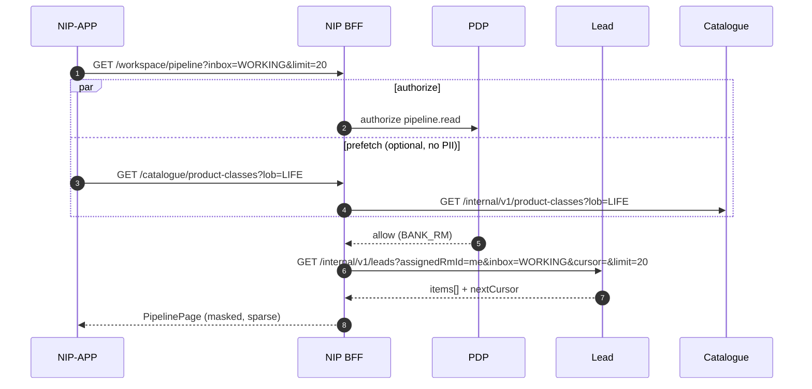

# 07 — NIP BFF lead landing & create API LLD (R0)

**Workstream:** WS-3 · **Horizon:** H0 / R0 assisted Term  
**Owner:** Mahesh (Board 1) — public contract · Amit (Board 2) — Java records / consumer tests  
**Status:** `AI-DRAFTED` · T3 · human Board 1 / 4 / 6 signatures outstanding  
**Origin:** `SUG-20260907-ldc` · `EPIC-003` · `ARCH-023` · `PLAN-004`  
**Machine contract:** [`nip-bff-lead-phase.openapi.yaml`](./nip-bff-lead-phase.openapi.yaml)
(internal-team documentation: operation intent, parameter purpose, field meaning)  
**Java sketches:** [`08-nip-bff-lead-phase-java-records.md`](./08-nip-bff-lead-phase-java-records.md)

This file is the **consumer-ready expansion** of the R0 HLD contract *sketch* for screens
`SCR-02` … `SCR-05` only: the RM landing inbox, ETB customer search, identity confirm, Term
intent, duplicate handling, and lead create. It is **not** a published OpenAPI portal drop
(that remains S12-E06-S01) and it is **not** an implementation of NIP BFF or Lead (#5).

Figma is **reference only** ([R0-SCOPE A11](../../au-bank-insurance-platform/requirements/R0-SCOPE.md#2-working-decisions-locked-unless-overturned)).
Canonical screens are [S05 §4.3](../../application-lifecycle-bible/evidence/S05-experience-evidence.md#43-screen-inventory--closes-gap-009).

---

## 1. What this phase is

One RM, already authenticated through the token-hiding BFF session (`ADR-015`, WS-2 `A.1`),
opens NIP-APP and either resumes an **own** working Lead or creates a new one for one ETB
customer and `lob=LIFE` / `productClass=TERM`. The slice ends when `POST /leads` returns
`leadId` + `journeyId` ([`AC-LEAD-010-1`](../../application-lifecycle-bible/evidence/S03-requirements-evidence.md)).

| In this pack | Not in this pack |
|---|---|
| `SCR-02` RM pipeline (own working inbox) | ULIP / Savings / Health product pickers (BOOT `out_of_scope_now`, S11 not-in-slice) |
| `SCR-03` customer search | ULIP-leads tab (Figma; no domain aggregate) |
| `SCR-04` customer confirm (masked) | Meeting scheduler (absent from S05 R0 blueprint) — `SUG-20260907-fig` |
| `SCR-05` LOB / Term confirm + create | Consent, suitability, quote, proposal, payment (`SCR-06`+) |
| Duplicate **detection** for an active own Term lead | Campaign / bulk origination (`ADR-005`) |
| Cursor pagination + sparse list projections | Customer BFF (`#1`, R1) |

**Spoken name is Lead.** Paths are `/leads`, not `/opportunities` (`CR-013` / `ADR-014`).
Opportunity remains the durable-demand alias only. Identifiers stay `leadId` / `INV-LED-*`.

---

## 2. Actors, edge, and what the BFF may never do

| Rule | Consequence on this contract |
|---|---|
| Flutter talks **only** to `#2` NIP BFF ([HLD §5](../../architecture/R0-HLD.md#5-api-details)) | No CBS, Lead, Catalogue, or Journey URL on the device |
| Flutter never receives OAuth tokens | `Authorization` is the opaque session; tokens stay in the BFF cache (`ADR-011`) |
| BFF never holds a domain decision | Duplicate conflict is computed by Lead (#5); BFF maps `409 CONFLICT` |
| `distributorId` is never caller-supplied | Absent from every schema below |
| BFF (L4) is the error redaction boundary ([ADR-017](../../journey-execution/07-PLATFORM-ERROR-CONTRACT.md)) | Public body is `ServiceErrorResponse.toPublic()`; no origin/diagnostic |
| No PII in logs | Search values (PAN, mobile, CIF) are not logged; correlation id only |
| Bank apps never call a database | List/search are HTTP to `#5` / `#4`, never JDBC |

IPR principals: pipeline and search are RM book queries. Create is `403 ORIGINATION_RM_ONLY`
(`INV-LED-04`, `S-20`). Out-of-scope rows are **absent**, never a `403` on a named id
(`INV-LED-07`).

### 2.1 Platform conventions this pack inherits

This file does **not** invent a second API style. Every NIP BFF and internal service in R0
shares the same three rules. The lead OpenAPI is one consumer of them (`SUG-20260907-std`).

| Concern | Platform rule | What Flutter sees on this pack |
|---|---|---|
| **Versioning** | URI version on the public gateway: `/api/v1`. Cluster-private services use `/internal/v1`. Additive fields are compatible; a breaking change is `/api/v2` (not a header-only swap in R0) | Server URL already includes `/api/v1`. Resource paths in this file are unversioned relative to that base |
| **Success body** | The HTTP resource **is** the body. No `{ "success": true, "data": …, "message": … }` wrapper — that would duplicate HTTP status and fight sparse projections | `PipelinePage`, `SearchPage`, `LeadCreated`, … |
| **Error body** | One envelope everywhere: RFC 7807 `application/problem+json` = `ServiceErrorResponse.toPublic()` ([ADR-017](../../journey-execution/07-PLATFORM-ERROR-CONTRACT.md#42-public-rendering--crosses-the-trust-boundary)) | `code`, `category`, `retryable`, `incidentId`, `correlationId`. No `origin`, no `diagnostic`, no vendor text |
| **Security** | Token-hiding BFF (`ADR-015`): opaque session only; PDP fail-closed; object-level visibility in the store; CSRF on cookie/browser; native uses a Keychain handle, not a cookie | `NIPSESSION` cookie **or** `Authorization: Bearer <opaque-session>` — neither is an OAuth access token |
| **Correlation** | `X-Correlation-Id` on every hop; `Idempotency-Key` on mutations | Required headers on this spec |
| **1SB / provider APIs** | Different schemas, behind the Integration Hub. Bank BFFs never copy 1SB envelopes | Not in this file |

A `{success, data, message}` wrapper is **rejected** for this platform: HTTP status already
carries outcome; ADR-017 already standardises failure; wrapping would force every list page
to nest `data.items` and would leak a second error shape past `toPublic()`.

---

## 3. Screen → API map

| Screen | RM intent | BFF call | Projection |
|---|---|---|---|
| `SCR-02` | See my working inbox | `GET /workspace/pipeline` | List row: name, initials, masked mobile, state chip, `leadId` |
| `SCR-02` empty | CTA to search | none | Copy from S05 §4.5 |
| `SCR-03` | Find ETB customer | `GET /customers:search` | Search hit: name, initials, masked mobile, eligibility |
| `SCR-04` | Confirm identity | `GET /customers/{customerId}` **or** reuse the selected search hit | Confirm sheet: name, masked mobile, masked email. **No CIF, PAN, DOB, address** |
| `SCR-05` | Confirm Term Life | `GET /catalogue/product-classes?lob=LIFE` (usually cached) | R0: single selectable class `TERM` |
| `SCR-05` | Duplicate check | `GET /customers/{customerId}/active-leads?productClass=TERM` | Active own leads only |
| `SCR-05` | Create | `POST /leads` | `leadId`, `journeyId`, `state`, `createdAt` |
| `SCR-05` | Resume existing | `POST /leads` with `resumeLeadId` **or** `GET /leads/{leadId}` | Same create envelope, `outcome=RESUMED` |
| Success | Stay / close | none extra | Render create response. “Proceed to add other details” navigates with `journeyId` into `SCR-06` (next pack) |

Wireframe tabs “Recent leads / Recent prospects / ULIP leads” collapse to **one** pipeline
resource with an `inbox` filter. There is no Prospect aggregate
([glossary](../../au-bank-insurance-platform/knowledge-base/09-glossary.md) — Lead only).

| Wireframe tab | R0 `inbox` | Domain filter |
|---|---|---|
| Recent leads | `WORKING` (default) | Own leads, state ∉ {`ARCHIVED`}, `needAnalysisState` ≠ `NOT_STARTED` **or** a journey exists |
| Recent prospects | `UNSTARTED` | Own leads, `needAnalysisState=NOT_STARTED` and no `journeyId` |
| ULIP leads | **not served** | Parked (`SUG-20260907-fig`) |

---

## 4. End-to-end API flow

### 4.1 Landing (`SCR-02`)



The catalogue prefetch is **safe to parallelise** with the inbox: it is public-within-bank,
cached (`S-21` / `ADR-011` L1→L2), and does not wait on CBS. Do **not** prefetch full
customer snapshots.

### 4.2 Search → confirm → Term → create (`SCR-03` … `SCR-05`)

```mermaid
sequenceDiagram
    autonumber
    participant App as NIP-APP
    participant BFF as NIP BFF #2
    participant PDP as PDP #3
    participant Cust as Customer #4
    participant CBS as CBS
    participant Lead as Lead #5
    participant Jrn as Journey #9

    App->>BFF: GET /customers:search?by=MOBILE&q=…&limit=20
    BFF->>PDP: authorize customer.search
    PDP-->>BFF: allow
    BFF->>Cust: GET /internal/v1/customers:lookup
    Cust->>CBS: CIF / mobile / PAN / name lookup
    CBS-->>Cust: hits (ETB book scoped)
    Cust-->>BFF: customerId + profile (full, internal)
    BFF-->>App: SearchPage (masked only)

    Note over App: RM taps a row → confirm sheet from the hit; optional GET /customers/{id}

    par duplicate check
        App->>BFF: GET /customers/{id}/active-leads?productClass=TERM
        BFF->>Lead: GET /internal/v1/leads?customerId&productClass=TERM&active=true&assignedRmId=me
    and product class (if not cached)
        App->>BFF: GET /catalogue/product-classes?lob=LIFE
    end

    alt active Term lead exists
        BFF-->>App: 200 items[{leadId,state,journeyId}]
        App->>App: RM chooses Resume or stop
        App->>BFF: POST /leads {customerId, resumeLeadId} + Idempotency-Key
        BFF->>Lead: GET existing
        BFF-->>App: 200 outcome=RESUMED
    else no active Term lead
        App->>BFF: POST /leads {customerId, lob=LIFE, productClass=TERM} + Idempotency-Key
        BFF->>PDP: authorize lead.create
        BFF->>Lead: POST /internal/v1/leads
        Lead->>Lead: INV-LED-04/05, auto-ASSIGNED to creator
        Lead->>Jrn: open INITIATED (AC-LEAD-010-1)
        Lead-->>BFF: leadId + journeyId
        BFF-->>App: 201 outcome=CREATED
    end
```

CBS unavailable: BFF returns `503 UPSTREAM_UNAVAILABLE` with public copy matching
`AC-EXC-10` / S05 `SCR-03` error — **Do not proceed.** No fabricated customer. No journey.

### 4.3 What is synchronous vs polled

| Interaction | Style | Why |
|---|---|---|
| Pipeline, search, confirm, catalogue, active-leads, create | **Synchronous** | RM is waiting on-screen ([communication patterns](../architecture-review/03-communication-patterns.md)) |
| Lead create | Sync, ≤ 2 s (`S-20`) | Mints `leadId` + `journeyId` in one request (`AC-LEAD-010-1`) |
| Quote / proposal / payment status | **Not this pack** | Async-poll from `SCR-11` / `SCR-15` / `SCR-16` (HLD `S-09`, `S-12`) |
| Inbox freshness | Client pull-to-refresh | No server push in R0; do not poll the pipeline on a timer |

There is **no job id** on search or create. Do not invent polling here.

---

## 5. Optimisation rules (do not send the book)

### 5.1 Pagination

| Resource | Style | Default `limit` | Max `limit` | Why cursor |
|---|---|---|---|---|
| `GET /workspace/pipeline` | Opaque `cursor` | 20 | 50 | Inbox mutates while the RM scrolls; offset skips/duplicates rows |
| `GET /customers:search` | Offset `page` (0-based) **or** stop after first page | 20 | 20 | CBS search is ranked; deep pages are the wrong UX (`AC-CUST-010-1` is “the match”, not a dump) |
| `GET /customers/{id}/active-leads` | No paging | n/a | 20 hard cap | An RM should not have 20 active Term leads on one CIF; if capped, `hasMore=true` forces resume-by-id |
| `GET /catalogue/product-classes` | No paging | n/a | 8 | R0 returns one row (`TERM`) |

Cursor token: opaque, signed by Lead (#5), encodes `(updatedAt, leadId)` plus a version byte.
Clients must treat it as a blob. `hasMore=false` and omitted `nextCursor` end the walk.

**Never** return `items` plus a nested full Lead aggregate, assignment history, follow-ups, or
CIF snapshot on a list.

### 5.2 Sparse projections

| API | Fields allowed on the wire to Flutter | Fields forbidden |
|---|---|---|
| Pipeline row | `leadId`, `customerDisplayName`, `initials`, `maskedMobile`, `state`, `productClass`, `journeyId`, `journeyStage`, `updatedAt` | `cifNumber`, PAN, email, follow-ups, `accountableSpCertRef`, assignment history |
| Search hit | `customerId`, `fullName`, `initials`, `maskedMobile`, `maskedEmail`, `eligibility` | `cifNumber`, PAN, DOB, address, income, tobacco, Aadhaar |
| Confirm sheet | Same as search hit | Same forbid list. Confirm is identity, not prefill (`SCR-07` / `AC-CUST-020-*` need `CNS-DP`) |
| Create response | `leadId`, `journeyId`, `customerId`, `lob`, `productClass`, `state`, `createdAt`, `outcome` | Full customer, payment, quote |

Masking **happens in the BFF**, not in Flutter: `maskedMobile` = `+91 933****412` pattern;
`maskedEmail` = local-part keep 3 + `***@domain`. `initials` are derived from `fullName`.
`cifNumber` is **never** exposed to Flutter ([information model §4.1](./02-information-model.md#41-customer--sor-customer-context-profile-snapshot-cbs-for-the-master)).

Search-by PAN/CIF is allowed; the **request** carries the identifier, the **response** does not echo it.

### 5.3 Parallel calls (allowed)

| When | Parallel set | Do not parallelise |
|---|---|---|
| Session valid, `SCR-02` loading | Pipeline page 1 **and** product-classes | CBS search; full CIF |
| Customer selected | Active-leads **and** product-classes (if cache miss) | Prefill / consent |
| Two inbox tabs visible | Two pipeline GETs with different `inbox` | One “give me everything” bulk |

PDP authorize stays on the BFF hop; the app does not call the PDP.

### 5.4 Caching

| Resource | Client | BFF |
|---|---|---|
| Product classes | Memory for the session | L1 → L2, TTL from Configuration (`S-21`). Miss = read, never a compiled default |
| Pipeline | No cache across RM actions after create (invalidate) | No BFF cache of inbox (authorisation-scoped, mutating) |
| Search | No cache of PAN/mobile queries | No cache of CBS hits (stale identity is forbidden, `S-04`/`S-05`) |

---

## 6. Public BFF resources

Base path: `/api/v1` (gateway strips to the BFF). All calls carry `X-Correlation-Id`.
Mutations require `Idempotency-Key` ([HLD §4.3](../../architecture/R0-HLD.md#43-idempotency)).

### 6.1 `GET /workspace/pipeline`

**Query:** `inbox=WORKING|UNSTARTED` (default `WORKING`), `limit`, `cursor`.

**200** `PipelinePage`.

**Errors:** `401 SESSION_*` · `403 DEFAULT_DENY` · `503` Lead down (retryable).

Empty inbox is **200** with `items: []` (S05 empty copy), not `404`.

### 6.2 `GET /customers:search`

**Query:**

| `by` | `q` rules | Maps to CBS | In S03 AC? |
|---|---|---|---|
| `CUSTOMER_ID` | 1–20 chars, trimmed | CIF (`cifNumber`). Flutter never sees the CIF back | Yes (`AC-CUST-010-1`) |
| `MOBILE` | E.164 or 10-digit Indian; digits only after normalisation | Registered mobile | Yes |
| `PAN` | `^[A-Z]{5}[0-9]{4}[A-Z]$` | PAN (RESTRICTED). Not logged | Yes |
| `NAME` | min 3 Unicode letters; max 80 | CBS name search | **Proposed.** R0-SCOPE says “Cust ID / Mobile / PAN **etc.**”. S03 AC names three keys. Keep `NAME` in the contract so the search dropdown can exist; Rajal confirms. If rejected, BFF returns `400 VALIDATION_ERROR` for `by=NAME` |

Button enablement is client-side (non-empty + format). Server still validates.

**200** `SearchPage`. Zero hits → `items: []` (`AC-CUST-010-2`). Non-ETB → included with
`eligibility=NOT_ETB`; Continue disabled (`AC-CUST-010-3`). Out-of-book identities are
**absent** (`INV-LED-05`), not listed.

### 6.3 `GET /customers/{customerId}`

Confirm-sheet projection. `404` if the id is not in this RM’s book (absent, not named as
forbidden). `503 UPSTREAM_UNAVAILABLE` if CBS cannot re-read.

Prefer reusing the search hit when the RM has not left `SCR-03`→`SCR-04`; this GET exists for
deep links and process death.

### 6.4 `GET /customers/{customerId}/active-leads`

**Query:** `productClass=TERM` (R0 required).

An “active” lead is state ∉ {`CONVERTED`,`DISQUALIFIED`,`EXPIRED`,`ARCHIVED`} for this RM
(`assignedRmId` = caller). Cross-RM duplicates are **OPEN-LEAD-DUP** (Rajal) — R0 does not leak
another RM’s `leadId`.

### 6.5 `GET /catalogue/product-classes`

**Query:** `lob=LIFE` (R0 required).

R0 body is one element `{ "productClass": "TERM", "label": "Term Life Insurance", "selectable": true }`.
Savings / ULIP / Health are **not** returned. A Flutter build that sends `productClass=ULIP`
on create is `422 UNSUPPORTED_LOB`.

This is **not** `SCR-10` eligible products. `SCR-10` is post-suitability and is a different
resource (`GET /catalogue/offerings` in the HLD sketch).

### 6.6 `POST /leads`

**Headers:** `Idempotency-Key` required.

**Body:**

```json
{
  "customerId": "01J…",
  "lob": "LIFE",
  "productClass": "TERM",
  "resumeLeadId": null
}
```

| Field | Rule |
|---|---|
| `customerId` | Required unless `resumeLeadId` is set |
| `lob` | Must be `LIFE` in R0 |
| `productClass` | Must be `TERM` in R0 |
| `resumeLeadId` | If set, ignore create-new; return the existing lead if it is still owned by this RM and non-terminal |
| `distributorId` | **Forbidden.** `400 ATTRIBUTION_NOT_CALLER_SUPPLIED` if present |
| `forceDuplicate` | **Not in this contract.** Wireframe “Update and continue new lead” is Product-gated (`OPEN-LEAD-DUP`) |

**201 CREATED** when a new lead is minted. **200** when the idempotency key replays or
`resumeLeadId` hits. **409 CONFLICT** when an active own Term lead exists and `resumeLeadId`
was omitted — body is the public error envelope plus `errors[].code = CONFLICT` and a
non-PII pointer `errors[].field = "leadId"` / `errors[].message` = the existing `leadId` only.

Create lands the Lead in `ASSIGNED` with `assignedRmId = accountableSpId =` the creating RM
(one transaction: `[*]→NEW→ASSIGNED`). `source=RM`. Journey opens `INITIATED` and both ids
return together (`AC-LEAD-010-1`). This **supersedes** the HLD sketch’s
`POST /opportunities/{id}/journeys` *from QUALIFIED* for the assisted R0 path: Product/BA
already require `journeyId` at create. QUALIFIED remains a later Lead state on the journey,
not a precondition to open it.

**Guards:** `INV-LED-04` RM-only · `INV-LED-05` in-book ETB · SP cert covers `LIFE`
(`RM_NOT_CERTIFIED` / `SP_CERTIFICATION_REQUIRED`).

Audit: lead create is a material action ([BR-SEC-030](../../au-bank-insurance-platform/requirements/BRD-P0-CAPABILITIES.md)).

### 6.7 `GET /leads/{leadId}`

Resume / status for `SCR-02` row tap. Same visibility as pipeline. IPR: row absent if `AC-4`
fails. Returns the create-response projection plus `needAnalysisState` and `journeyStage`.
Not a dump of follow-ups.

### 6.8 Wire examples (e2e happy path)

Identifiers below are illustrative ULIDs. Masking is already applied. Flutter never sees
`cifNumber`, PAN, DOB, or a full mobile.

**1. Landing — `GET /workspace/pipeline?inbox=WORKING&limit=20`**

```json
{
  "items": [
    {
      "leadId": "01JQX4K7R8M2N3P4Q5S6T7V8W9",
      "customerDisplayName": "Abhishek Sharma",
      "initials": "AS",
      "maskedMobile": "+91 933****412",
      "state": "ASSIGNED",
      "productClass": "TERM",
      "journeyId": "01JQX4K8A1B2C3D4E5F6G7H8J9",
      "journeyStage": "INITIATED",
      "updatedAt": "2026-09-07T11:15:00Z"
    }
  ],
  "page": { "size": 20, "nextCursor": "c1.v1.opaque", "hasMore": true }
}
```

Prospects tab: same resource with `inbox=UNSTARTED`. Next page: repeat with `cursor`.
Empty inbox: `{ "items": [], "page": { "size": 20, "hasMore": false } }`.

**2. Search — `GET /customers:search?by=MOBILE&q=9331111412&limit=20`**

```json
{
  "query": { "by": "MOBILE", "resultCount": 1 },
  "items": [
    {
      "customerId": "01JQX4K7R8M2N3P4Q5S6T7V8X1",
      "fullName": "Abhishek Sharma",
      "initials": "AS",
      "maskedMobile": "+91 933****412",
      "maskedEmail": "abh*****@gmail.com",
      "eligibility": "ETB"
    }
  ],
  "page": { "page": 0, "size": 20, "hasMore": false }
}
```

Zero hits: `items: []`, `resultCount: 0` (`AC-CUST-010-2`). Non-ETB hits keep
`eligibility=NOT_ETB`; Continue stays disabled (`AC-CUST-010-3`). `q` is never echoed.

**3. Confirm (optional) — `GET /customers/01JQX4K7R8M2N3P4Q5S6T7V8X1`**

Same body as one `CustomerSummary` from the search hit. Prefer the hit when the RM has not
left `SCR-03`.

**4. Parallel after selection**

- `GET /customers/{customerId}/active-leads?productClass=TERM`
- `GET /catalogue/product-classes?lob=LIFE` (skip if session-cached)

Active none:

```json
{ "items": [], "hasMore": false }
```

Active own Term lead:

```json
{
  "items": [
    {
      "leadId": "01JQX4K7R8M2N3P4Q5S6T7V8W9",
      "productClass": "TERM",
      "state": "ASSIGNED",
      "journeyId": "01JQX4K8A1B2C3D4E5F6G7H8J9",
      "createdAt": "2026-09-07T11:15:00Z"
    }
  ],
  "hasMore": false
}
```

Catalogue (R0):

```json
{
  "lob": "LIFE",
  "items": [
    { "productClass": "TERM", "label": "Term Life Insurance", "selectable": true }
  ]
}
```

**5a. Create — `POST /leads`**

Headers: `Idempotency-Key: 550e8400-e29b-41d4-a716-446655440000`, `X-Correlation-Id`.

```json
{
  "customerId": "01JQX4K7R8M2N3P4Q5S6T7V8X1",
  "lob": "LIFE",
  "productClass": "TERM"
}
```

**201:**

```json
{
  "leadId": "01JQX4K7R8M2N3P4Q5S6T7V8W9",
  "journeyId": "01JQX4K8A1B2C3D4E5F6G7H8J9",
  "customerId": "01JQX4K7R8M2N3P4Q5S6T7V8X1",
  "lob": "LIFE",
  "productClass": "TERM",
  "state": "ASSIGNED",
  "createdAt": "2026-09-07T11:15:00Z",
  "outcome": "CREATED"
}
```

**5b. Resume — same POST**, body `{ "resumeLeadId": "01JQX4K7R8M2N3P4Q5S6T7V8W9" }`, **200**
with `outcome=RESUMED` and the same envelope.

**5c. Duplicate without resume — 409** public error, `code=CONFLICT`,
`errors[].field=leadId`, `errors[].message` = the existing ULID only (no name, no CIF).

**6. Row tap — `GET /leads/{leadId}`**

Create envelope plus `needAnalysisState` and `journeyStage`. No follow-ups.

There is **no poll** on this slice. After `201`/`200` the app navigates with `journeyId`
into `SCR-06` (next pack) or returns to the pipeline (invalidate the inbox cache).

---

## 7. Internal seams (cluster-private)

Not on the public gateway. BFF → service identity. Representative paths (Lead still rejects
non-RM at the aggregate, not only at the BFF — `INV-LED-04`):

| Service | Call | Notes |
|---|---|---|
| #3 PDP | `POST /internal/v1/authorize` | 300 ms, no retry, fail closed (`S-02`) |
| #4 Customer | `GET /internal/v1/customers:lookup?by=&q=` | Snapshot; does not write CBS. Timeout 2 s (`S-04`/`S-05`) |
| #4 Customer | `GET /internal/v1/customers/{customerId}` | Book-scoped |
| #5 Lead | `GET /internal/v1/leads?...` | Inbox + active-leads queries. Visibility predicate in the store |
| #5 Lead | `POST /internal/v1/leads` | Idempotency in **Lead’s** store, not Valkey (`ADR-011`) |
| #5 Lead | `GET /internal/v1/leads/{leadId}` | |
| #8 Catalogue | `GET /internal/v1/product-classes?lob=LIFE` | Cached |
| #9 Journey | opened by Lead on create | BFF does not call Journey to mint the id |
| #16 Audit | outbox from Lead / Customer | Search and create emit; never on the RM wait-path |

---

## 8. Errors mapped to S05 states

Public envelope: [`ServiceErrorResponse`](../../../libs/bank-common-error/src/main/java/com/bank/common/error/ServiceErrorResponse.java)
(`ADR-017`). Codes from [`ErrorCodes`](../../../libs/bank-common-error/src/main/java/com/bank/common/error/ErrorCodes.java)
— additive later if needed; this pack reuses. The public body always includes `category` so the
app can branch on class (retry vs re-login vs resume) without parsing `title`.

| HTTP | `code` | Screen | RM-visible outcome |
|---|---|---|---|
| 200 empty list | — | `SCR-02` / `SCR-03` | S05 empty copy |
| 400 | `VALIDATION_ERROR` / `MISSING_IDEMPOTENCY_KEY` | `SCR-03`/`SCR-05` | Field error; search button stays usable |
| 401 | `SESSION_INVALID` / `SESSION_EXPIRED` | any | Re-login (`SCR-01`) |
| 403 | `ORIGINATION_RM_ONLY` | `SCR-05` | IPR cannot create |
| 403 | `DEFAULT_DENY` | any | Generic deny; no named resource |
| 403 | `RM_NOT_CERTIFIED` / `SP_CERTIFICATION_REQUIRED` | `SCR-05` | Cert copy (S05 `SCR-14` family) |
| 409 | `CONFLICT` | `SCR-05` | Active lead exists — Resume CTA |
| 409 | `IDEMPOTENCY_CONFLICT` | `SCR-05` | Same key, different body |
| 422 | `CUSTOMER_NOT_IN_BOOK` | `SCR-05` | Should be rare (search already scoped) |
| 422 | `UNSUPPORTED_LOB` | `SCR-05` | Non-TERM / non-LIFE |
| 503 | `UPSTREAM_UNAVAILABLE` | `SCR-03` | `AC-EXC-10` — Do not proceed |

HLD’s `IDEMPOTENCY_KEY_CONFLICT` is the same condition as `IDEMPOTENCY_CONFLICT` in
`ErrorCodes`; the **code on the wire is `IDEMPOTENCY_CONFLICT`**.

---

## 9. POJO / OpenAPI alignment

Canonical types live in the OpenAPI file. Java record sketches in
[`08-nip-bff-lead-phase-java-records.md`](./08-nip-bff-lead-phase-java-records.md) match 1:1.
Package (when S11 implements): `com.bank.insurance.nip.bff.api.v1.lead`.

Do not generate Flutter models from internal Lead/Customer entities. Generate from **this**
OpenAPI only (`AP-5` contract-first).

---

## 10. Open questions (not silently decided)

| ID | Question | Owner | Default in this contract until answered |
|---|---|---|---|
| `OPEN-LEAD-NAME` | Is `by=NAME` an R0 search key? | Rajal + BA | Included, format-gated; drop if Product says no |
| `OPEN-LEAD-DUP` | May an RM create a second active Term lead for the same customer? | Rajal | **No.** `409 CONFLICT` + resume. Wireframe override parked with `SUG-20260907-fig` |
| `OPEN-LEAD-XRM` | If another RM already has an active Term lead on this CIF, what does this RM see? | Rajal + Shailja | Nothing (absent). Do not confirm the other `leadId` |
| `OPEN-LEAD-DISPLAY` | Human-readable label like Figma `RR 2024-001`? | Rajal | **Omitted.** `leadId` is a ULID (`ID-01`). Sequential display ids are not aggregate identity |

---

## 11. Traceability

| Contract behaviour | Authority |
|---|---|
| Search keys CIF / mobile / PAN | `AC-CUST-010-1`, R0-SCOPE §3 Customer |
| Empty search does not create a customer | `AC-CUST-010-2` |
| Non-ETB cannot start a journey | `AC-CUST-010-3`, D-009 |
| Create returns `leadId` + `journeyId`, owned by creating RM | `AC-LEAD-010-1`, `BR-LEAD-010` |
| RM-only origination | `INV-LED-04`, `ADR-005`, `VR-060` |
| In-book ETB | `INV-LED-05`, `VR-061` |
| Lead is the spoken path name | `CR-013`, `ADR-014`, `DEC-20260825-01` D1 |
| One BFF | `ADR-015` |
| Masking / no PII in logs | Standing constraint; `BR-SEC-020` |
| Idempotency on create | `INV-IDM-01`, HLD §4.3 |
| FF-15 consumer contract for this seam | [`03-solution-architecture-r0.md` FF-15](./03-solution-architecture-r0.md) |
| Screens `SCR-02`–`SCR-05` | S05 evidence §4.3–4.5 |
| ULIP / Savings / Health / meeting out | BOOT WS-3 `out_of_scope_now`; S11 §3 not-in-slice; `SUG-20260907-fig` |

---

## 12. What “done” means for this document pack

`ARCH-023` is documentation-complete when:

1. This LLD, the OpenAPI file, and the Java sketches agree on paths, fields, and codes.
2. HLD §5.1 no longer publishes `/opportunities` as the R0 create path.
3. Human Board 1 has signed the public contract (agent draft only).
4. S11 implementers can generate server stubs and Flutter clients from the OpenAPI without
   reading Figma.

Implementation of NIP BFF / Lead / Customer is **S11-E02 / S11-E06**, not this item.
