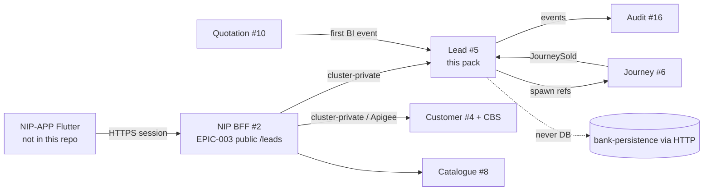

# 10 — Lead module HLD (context #5, R0)

**Status:** `AI-DRAFTED` · T3 · human Board 1 / 3 / 4 / 6 signatures outstanding  
**Origin:** `SUG-20260930-lmd` · `EPIC-005` · `ARCH-026` · `PLAN-007`  
**Authority:** Architecture design pack. Behaviour SSOT for screens remains the Lead BRD (`DOC-005`). Domain invariants remain [`01-domain-model-and-invariants.md`](./01-domain-model-and-invariants.md). Public BFF edge remains [`07-nip-bff-lead-phase-api-lld.md`](./07-nip-bff-lead-phase-api-lld.md) (`EPIC-003`).  
**Persona:** Mahesh (R2) — structure and contracts only. Does not rewrite Product semantics or claim T4.

---

## 1. What this pack is

Design the **Lead Management module** as bounded context **#5** for R0, traced from
[`Lead_Module_BRD_Detailed_CONTEXT.md`](../../au-bank-insurance-platform/requirements/brd-detailed/Lead_Module_BRD_Detailed_CONTEXT.md),
without treating the request as a greenfield rewrite of already-admitted artefacts.

| Artefact | Role in this pack |
|---|---|
| Lead BRD (DOC-005) | Business behaviour SSOT for the module |
| `01-domain-model` §4.1 / INV-LED-* | Ratified aggregate + invariants |
| EPIC-003 BFF LLD + OpenAPI | Public consumer edge (NIP-APP → NIP BFF) |
| **This HLD + sequences + API + algorithms** | Lead-service design and BRD→architecture map |

**Not from scratch.** EPIC-003 stays. This pack adds the **Lead service** face and the
algorithms the BFF must call.

---

## 2. Governing outcomes (from BRD §2–§3, platform-aligned)

1. One Lead record per Life sales opportunity on-platform (`AC-8`).
2. Collaborative visibility between Bank SP and Insurance RM **as Product decides** — see `OPEN-LEAD-ACTOR`.
3. Prevent the same creating principal from holding two unfinished leads for the same customer + product type (`BR-DEDUPE-*`, `OPEN-LEAD-DUP`).
4. Save for later or continue into suitability; insurer/plan unknown at create (`BR-LEAD-005`).
5. Reporting eligibility (Diary → Eligible) only after first successful BI (`BR-BI-*`).
6. Complete audit history; no PII in logs (standing constraint).

---

## 3. Boundaries

| Context | Owns | Must not own |
|---|---|---|
| **Lead #5** | `leadId`, productClass, ownership/assignment history, working stage machine, `biGenerated`, diary/eligible flag, remarks, close reason, resume pointer to journey | Customer master, CBS search, quote/BI payload, proposal/policy status, payment, consent, suitability answers |
| **NIP BFF** | Session, masking, public REST shaping, orchestration of search→create | Lead aggregate rules, persistence |
| **Customer #4** | ETB identity projection used at create | Lead dedupe |
| **Journey #6** | Long-running assisted path stage refs | Lead attribution / inbox |
| **Quotation #10** | BI artefacts | Lead ID minting |
| **Integration Hub #14** | Provider traffic | Lead write path |

Standing constraints that apply: bank apps never call DB or 1SB directly; Flutter never sees OAuth tokens; no PII in logs; Journey holds refs only.

---

## 4. R0 cut — BRD §4.1 mapped

| BRD in-scope item | R0 design posture | Authority |
|---|---|---|
| Manual lead create for existing bank customers | **IN** | CURRENT-STATE Lead #5; AC-8 |
| Customer search Cust ID / mobile / PAN | **IN** (BFF — EPIC-003 / ARCH-025) | EPIC-003 |
| Customer confirm with masked mobile/email | **IN** (BFF) | EPIC-003 |
| Product need: Term / Savings / ULIP | **IN** (Term + Savings/ULIP per CR-015) | CR-015 / EPIC-004 |
| Role-specific assignment RM / SP / Non-SP | **PARTIAL** — document all; **create actor = BANK_RM until OPEN-LEAD-ACTOR closes** | INV-LED-04 vs BRD §8 |
| Platform Lead ID | **IN** (ULID `leadId`, ID-01) | ADR-014; OPEN-LEAD-DISPLAY closed as omit sequential labels |
| Dedupe user+customer+product | **IN** (algorithm DOC-023) | BR-DEDUPE; OPEN-LEAD-DUP |
| Save & Close / continue to suitability | **IN** | BR-LEAD-003/004 |
| Optional meeting scheduling | **DEFER UI/API** — parked `SUG-20260907-fig`; optional fields not required for create | BOOT; BRD meeting not mandatory |
| SMS/email meeting communication | **OUT now** | BOOT notification breadth |
| Reassignment before BI | **IN** (algorithm + API); SLA/attribution **OPEN-D1** | BR-REASSIGN; OPEN-D1 |
| Closure + remarks | **IN** | BR-CLOSE-* |
| Dashboard visibility/actions | **IN** as inbox list fields (pipeline API); not full UX widgets | BRD §4.2 out for detailed UX |
| Stage/status/reporting/audit | **IN** with **OPEN-LEAD-STAGE** mapping | BRD §14 vs domain §4.1 |
| Customer 360 / Quote / Status / Notification integrations | **IN** as seams; Notification only assignment events in R0 | BRD §21; BOOT |

| Explicitly out | Why |
|---|---|
| Non-bank / prospect create | BRD §4.2; ETB only |
| Campaign / bulk origination | BOOT `out_of_scope_now`; ADR-005 |
| Meeting completion / outcome workflow | BRD §4.2 |
| RM–branch admin mapping UI | BRD §4.2 |
| Separate follow-up task system | BRD §4.2 |
| DIY / customer self-service | Programme out |

---

## 5. Aggregate sketch (Lead)

Canonical fields (logical — physical DDL is Aarti's pack):

| Field | Meaning |
|---|---|
| `leadId` | ULID, immutable (`BR-LEAD-001/002`) |
| `customerId` | Bank customer id from Customer/CBS |
| `lob` | `LIFE` |
| `productClass` | `TERM` \| `SAVINGS` \| `ULIP` — immutable after create (`BR-LEAD-006`) |
| `createdByPrincipalId` | Actual originator (`BR-OWN-002`) |
| `leadGeneratorPrincipalId` | Reporting generator (may differ for Non-SP if admitted) |
| `fulfillerPrincipalId` | Current fulfiller (SP or RM per Product) |
| `assignedRmId` / `assignedSpId` | Working owners |
| `branchId` | Branch context |
| `accountableSpId` | Immutable SP at origination (`INV-ACT-03`) — **only if creator path admits it** |
| `state` | Domain machine: NEW → … → CONVERTED / DISQUALIFIED / EXPIRED → ARCHIVED |
| `activityStatus` | Configurable disposition before BI (`BRD §14.2`) |
| `biGenerated` | Boolean; first successful BI |
| `reportingClass` | `DIARY` \| `ELIGIBLE` |
| `journeyId` | Active journey ref (nullable until spawned) |
| `closedReason` / remarks | Closure evidence |

Events (from domain catalogue): `OpportunityCreated` / Lead created, assignment changed, `LeadQualified` (first BI), `JourneySold` → convert, archive.

---

## 6. Domain state vs BRD stage — conflict surface

| Domain (`01` §4.1) | BRD stage (§14.1) | Design rule |
|---|---|---|
| NEW / ASSIGNED / CONTACTED | New (+ activity status) | Lead owns pre-BI working states |
| QUALIFIED | Quote Generated | First successful BI (`BR-BI-001`) |
| *(Journey / Proposal / Policy contexts)* | Proposal Form Pending … Policy Issued/Declined | **Not Lead aggregate copies** — Journey holds stage refs; insurer status maps in Proposal/Policy. Lead may *mirror a projection* only if Product requires dashboard fields — **OPEN-LEAD-STAGE** |
| DISQUALIFIED / Closed path | Closed | User close / not interested |
| CONVERTED → ARCHIVED | Policy Issued (outcome) then archive working inbox | ADR-014 / DEC-20260825-01 |

**Do not** implement BRD’s full insurer-status ladder as Lead state transitions. That would violate Journey-owns-refs and duplicate Proposal/Policy authority.

---

## 7. Open conflicts (must not be silently resolved)

| ID | Conflict | Owner | Interim design |
|---|---|---|---|
| **OPEN-LEAD-ACTOR** | BRD §5/§8: Insurance RM, Bank SP, Bank Non-SP may create. `INV-LED-04` / DEC-20260825-01: only `BANK_RM` may originate | Rajal + Shailja + Mahesh | R0 contracts admit **BANK_RM create only**; other BRD flows documented as deferred pending Product decision |
| **OPEN-LEAD-STAGE** | BRD §14 ladder vs domain Lead machine + Journey refs | Rajal + BA + Mahesh | Lead owns pre-BI + QUALIFIED + terminal; post-quote labels are projections from Journey/Proposal/Policy |
| **OPEN-LEAD-DUP** | Force-duplicate / “update and continue” in wireframes | Rajal | No force flag; `409` + resume (`07` LLD) |
| **OPEN-LEAD-XRM** | Visibility of another RM’s active lead | Rajal + Shailja | Absent for caller (EPIC-003) |
| **OPEN-D1** | Reassignment: SLA reset + conversion attribution | Rajal + BA | Store history; attribution follows current generator per BR-OWN-003 *provisionally* until OPEN-D1 closes |
| **OPEN-LEAD-NAME** | Name search | Rajal | Not on SCR-03 dropdown (ARCH-025) |
| **OPEN-LEAD-DISPLAY** | Sequential display id | Rajal | Omitted; ULID only |

---

## 8. Integration map (BRD §21 → platform)

| BRD integration | Platform seam |
|---|---|
| Customer 360 API | Customer #4 + Apigee CBS (ARCH-025) |
| User / Branch Mapping | WS-2 / workforce directory via PDP + config — R0 thin lists on BFF |
| Lead Service | **This pack** — Lead #5 |
| Quote API | Quotation #10 via Hub; BI success callback/event into Lead |
| Insurance Status API | Proposal/Policy + Hub — not Lead writer for insurer codes |
| Notification Service | R0: assignment events only; meeting SMS/email deferred |
| Audit / Logging | Audit #16; no PII |

---

## 9. Security & compliance posture (design only)

- PDP grant for `opportunity.create` / assign / close; default deny.
- BFF masks PII before Flutter (EPIC-003 forbid-list).
- Audit events per BRD §22 without sensitive payloads (`BR-AUDIT-002`).
- Retention: working inbox archive vs 7-year attribution (`ADR-014`, C-RET-1).

Deepali / Shailja human review required before S11 runtime; this document does not waive them.

---

## 10. Traceability

| This section | Sources |
|---|---|
| §2–4 | Lead BRD §2–4; BOOT WS-3 scope; ADR-005/014 |
| §5–6 | `01-domain-model` §4.1; BRD §14; Journey doctrine |
| §7 | DOC-005 conflict rule; EPIC-003 open questions |
| Sequences | `11-lead-module-sequences.md` |
| API | `12-lead-module-api-lld.md` + `lead-service-internal.openapi.yaml` |
| Algorithms | `13-lead-module-flows-and-algorithms.md` |

---

## 11. Done for this document

- [x] Boundaries and R0 cut table
- [x] OPEN conflicts named with interim design
- [ ] Human Board 1 / Product / Security / Compliance signatures
