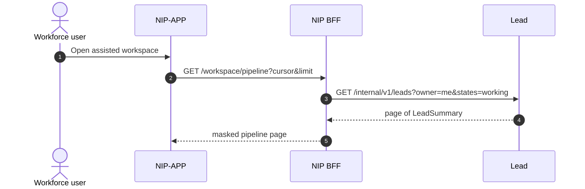
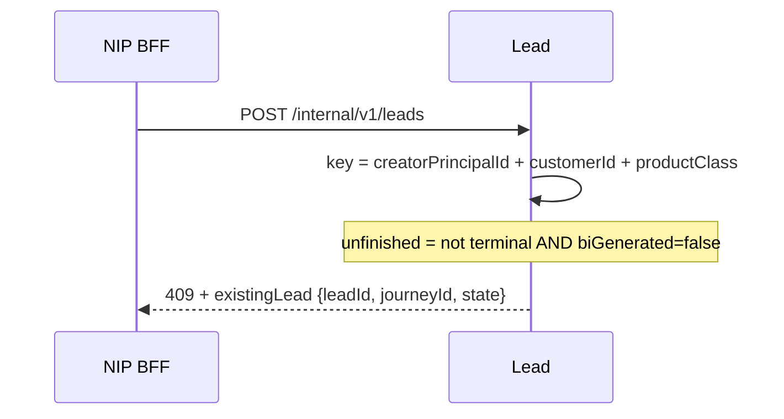
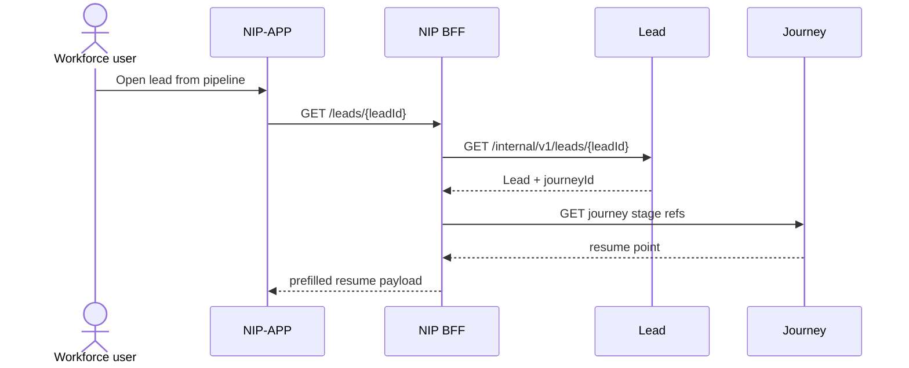
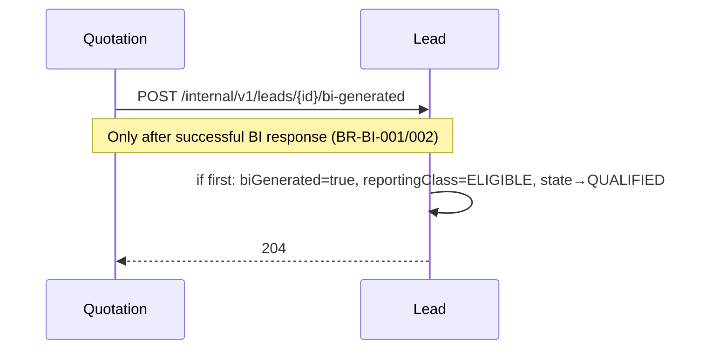
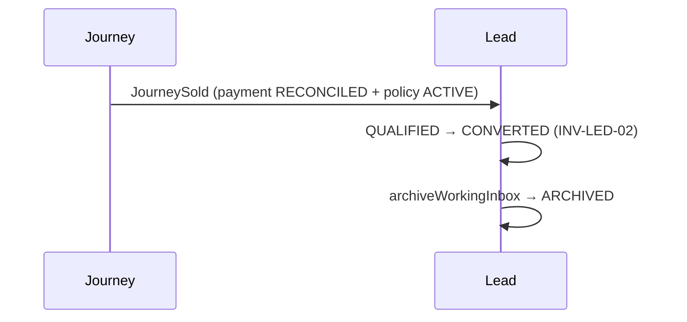
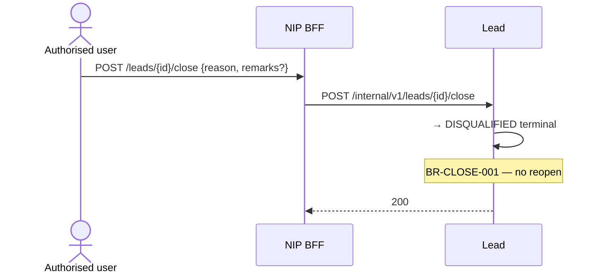

# 11 — Lead module sequences (R0)

**Status:** `AI-DRAFTED` · T3 · human Board 1 outstanding  
**Origin:** `SUG-20260930-lmd` · `EPIC-005` · `ARCH-027` · `PLAN-007`  
**Companion:** [`10-lead-module-hld.md`](./10-lead-module-hld.md) · [`07-nip-bff-lead-phase-api-lld.md`](./07-nip-bff-lead-phase-api-lld.md)  
**Actors (`D-018`):** Bank SP, Bank Non-SP, or Insurance RM may create; every create **must** assign a certified-SP Bank RM. IPR create is design-complete but runtime-gated (`OPEN-COMP-LEAD-IPR-CREATE`).

---

## 1. Landing — own pipeline (SCR-02)



Sync. Cursor pagination. Visibility is book/role-scoped (SP and current Insurance RM per BR-OWN-001).

---

## 2. Search → confirm → product → create with SP assignee (SCR-03…05)

```mermaid
sequenceDiagram
  autonumber
  actor User as Creator (SP / Non-SP / Insurance RM)
  participant APP as NIP-APP
  participant BFF as NIP BFF
  participant LED as Lead #5
  participant CUST as Customer #4
  participant CBS as CBS via Apigee
  participant JRN as Journey #6
  participant PDP as AuthZ PDP

  User->>APP: Search by CUSTOMER_ID|MOBILE|PAN
  APP->>BFF: GET /customers:search
  BFF->>LED: active-leads for caller scope (lead-first)
  LED-->>BFF: optional existingLead summary
  alt need CBS
    BFF->>CUST: resolve / search
    CUST->>CBS: Customer 360
    CBS-->>CUST: customer card(s)
    CUST-->>BFF: bank-language projection
  end
  BFF-->>APP: masked cards

  User->>APP: Confirm customer + productClass + assign certified SP RM
  Note over User,APP: Bank SP may self-assign. Non-SP and Insurance RM must select SP (BRD §8, D-016/D-018)
  APP->>BFF: POST /leads (Idempotency-Key, assignedRmId)
  BFF->>PDP: opportunity.create for creator
  PDP-->>BFF: allow / deny
  BFF->>LED: POST /internal/v1/leads
  LED->>LED: ALG-DEDUPE(creator) + INV-LED-10 assignee SP check
  alt unfinished duplicate
    LED-->>BFF: 409 CONFLICT + existing leadId
    BFF-->>APP: resume existing
  else create
    LED->>LED: mint leadId; createdBy=creator; accountableSpId=assignedRmId; state=ASSIGNED
    LED->>JRN: create journey ref (sync)
    JRN-->>LED: journeyId
    LED-->>BFF: 201 leadId + journeyId
    BFF-->>APP: success
  end
```

Rules:

- Lead-first then CBS (ARCH-025).
- Idempotency-Key on create (S-20).
- Insurer/plan absent at create (`BR-LEAD-005`).
- `productClass` immutable (`BR-LEAD-006`).
- Missing / uncertified assignee → `422 ASSIGNEE_SP_REQUIRED` / `422 RM_NOT_CERTIFIED`.

---

## 3. Dedupe conflict only



After `biGenerated=true`, same key may create a **new** lead (`BR-DEDUPE`). Another principal’s unfinished lead does not block this principal. Cross-RM **visibility** remains `OPEN-LEAD-XRM` (absent).

---

## 4. Role-specific create (BRD §8)

| Creator | Assignment at create | Sequence note |
|---|---|---|
| Bank SP (RM + SP cert) | May self-assign as `assignedRmId` | Happy path above |
| Bank Non-SP | Must select certified SP (and Insurance RM per BRD / `D-016`) | Same `POST /leads` with required assignee fields |
| Insurance RM / FLS | Selects branch + SP (`D-016`) | Same API; **runtime** blocked until `OPEN-COMP-LEAD-IPR-CREATE` closes |

---

## 5. Resume Save & Close



`BR-LEAD-004`. Regulated next steps still require the certified SP (`INV-ACT-01`).

---

## 6. Assignment / reassignment (pre-BI)

```mermaid
sequenceDiagram
  actor User as Authorised user
  participant BFF as NIP BFF
  participant LED as Lead #5
  participant PDP as AuthZ PDP

  User->>BFF: POST /leads/{id}/assignments
  BFF->>LED: POST /internal/v1/leads/{id}/assignments
  LED->>PDP: may assign? target certified?
  PDP-->>LED: allow / deny
  alt biGenerated
    LED-->>BFF: 422 REASSIGN_AFTER_BI (VAL-016)
  else
    LED->>LED: append history; update working owners
    Note over LED: accountableSpId stays immutable (INV-ACT-03)
    LED-->>BFF: 200 Lead
  end
```

`OPEN-D1` still owns SLA reset and conversion credit semantics.

---

## 7. First BI → Eligible / QUALIFIED



---

## 8. Convert → archive (ADR-014)



---

## 9. Close (pre-conversion)



---

## 10. Sync vs async

| Interaction | Mode |
|---|---|
| Pipeline, search, get, create, assign, close | Sync |
| BI mark from Quote | Sync command or durable event — same idempotent handler |
| JourneySold | Event (async) with idempotent convert |
| Assignment notification | Async outbox → Notification (R0 thin) |
| Meeting customer SMS/email | Deferred (`SUG-20260907-fig`) |

---

## 11. Done for this document

- [x] Multi-actor create with mandatory SP assignee (`D-018`)
- [x] IPR create marked Board-6 gated
- [ ] Human Board 1 signature
