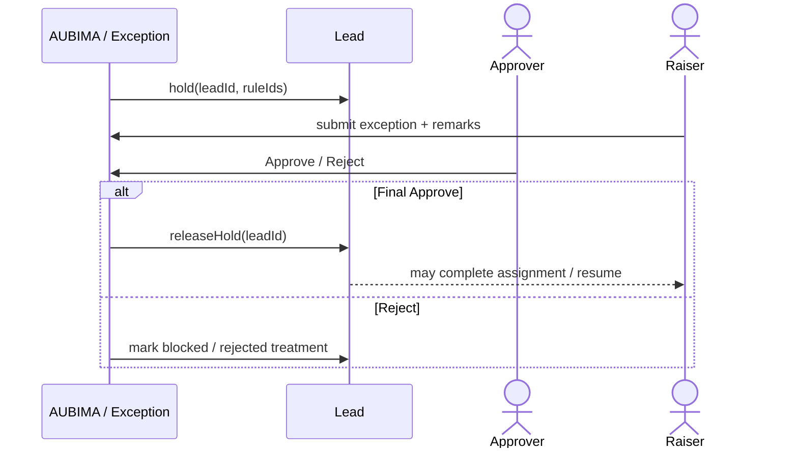
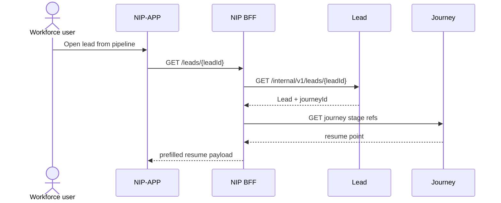
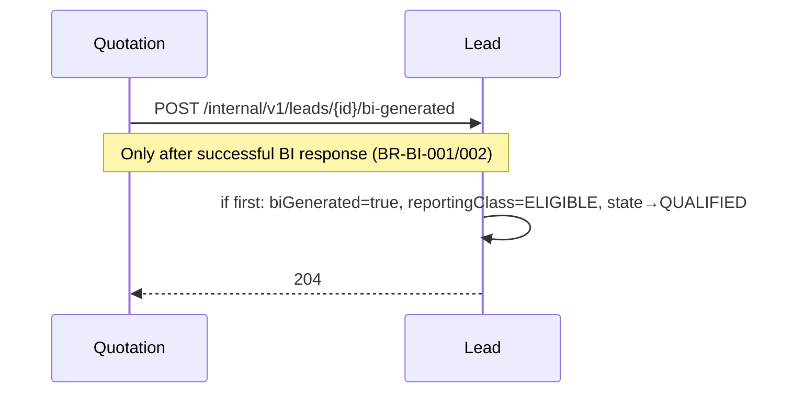
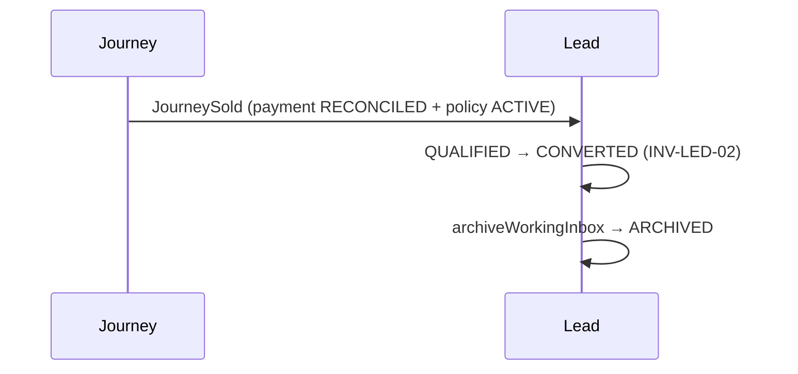
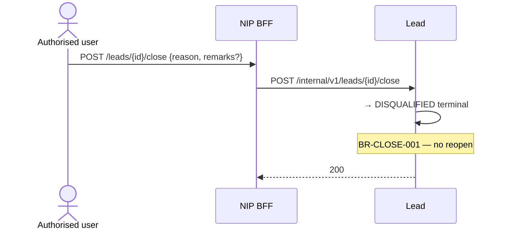

# 11 — Lead module sequences (R0)

**Status:** `AI-DRAFTED` · T3 · human Board 1 outstanding  
**Origin:** `SUG-20260930-lmd` · `SUG-20261002-lfs` · `EPIC-005` · `ARCH-027` · `D-019`  
**Companion:** [`10-lead-module-hld.md`](./10-lead-module-hld.md) · Exception Handling BRD (AUBIMA)

Canonical sequence (`D-019`): **product → dedupe → validation → create → assign SP (+ optional meeting) → process-further (SP or Insurance RM/FLS only)**.

---

## 1. Landing — own pipeline

Unchanged in shape: cursor-paginated `GET /internal/v1/leads?owner=me`.

---

## 2. Search → product → dedupe → validation → create

```mermaid
sequenceDiagram
  autonumber
  actor User as Creator (any workforce role)
  participant APP as NIP-APP
  participant BFF as NIP BFF
  participant LED as Lead #5
  participant VAL as Exception / Validation engine
  participant CUST as Customer #4

  User->>APP: Search customer + select productClass
  APP->>BFF: GET /customers:search (lead-first)
  BFF->>LED: active unfinished for creator+customer+productClass
  alt unfinished duplicate (BI not generated)
    BFF-->>APP: DedupeConflict {leadId, createdAt, productClass}
    Note over APP: Popup — Continue existing | Cancel<br/>Delete+Create shown only if OPEN-LEAD-DUP-DELETE closes YES
    alt Continue
      APP->>BFF: GET /leads/{existingId} resume
    else Delete+Create (OPEN)
      APP->>BFF: POST /leads {replaceLeadId?} 
    end
  else no unfinished duplicate
    APP->>BFF: POST /leads:preview-validation (or create with evaluate=true)
    BFF->>VAL: evaluate(customerId, productClass, context)
    VAL-->>BFF: PASS | BLOCK | APPROVAL_REQUIRED {ruleIds}
    alt BLOCK
      BFF-->>APP: 422 VALIDATION_BLOCKED — no leadId
    else APPROVAL_REQUIRED
      BFF->>LED: create Lead + exceptionHold=true
      LED-->>BFF: 201 leadId (held)
      BFF-->>APP: held — raise exception / await manager approval
    else PASS
      BFF->>LED: POST /internal/v1/leads (no SP yet)
      LED->>LED: mint leadId; state=NEW; assignedRmId=null
      LED-->>BFF: 201 leadId
      BFF-->>APP: navigate to Assignment screen
    end
  end
```

Notes:

- Dedupe key remains `(creatorPrincipalId, customerId, productClass)` with `biGenerated=false` unfinished (`BR-DEDUPE`).
- Validation examples (CASA opened last 30 days, policy-count thresholds) live in **Exception Handling config / DWH feeds** (`EH-INT-001`, `EH-INT-004`) — Lead only consumes outcomes.
- `OPEN-LEAD-VAL-TIMING`: Exception BRD says Save does not evaluate; Product asks evaluate here — wiring gated on that OPEN.

---

## 3. Post-create assignment + optional meeting (`D-019`)

```mermaid
sequenceDiagram
  autonumber
  actor User as Creator
  participant APP as NIP-APP
  participant BFF as NIP BFF
  participant LED as Lead #5
  participant PDP as AuthZ PDP

  User->>APP: Assignment screen — select certified-SP AU Bank RM
  opt Schedule meeting (optional)
    User->>APP: type Online|In-person, date, time, link if Online
  end
  APP->>BFF: POST /leads/{id}/assignments + optional meeting
  BFF->>LED: POST /internal/v1/leads/{id}/assignments
  LED->>PDP: target has SP cert for LIFE?
  PDP-->>LED: allow / deny
  LED->>LED: assignedRmId + accountableSpId = SP; state→ASSIGNED
  opt meeting present
    LED->>LED: store MeetingIntent (not completion workflow)
  end
  LED-->>BFF: 200 Lead
  alt Proceed to suitability
    Note over APP: Only AU SP or Insurance RM/FLS may continue (D-019)
    APP->>BFF: start onboarding / suitability
  else Save & Close
    APP->>BFF: return to pipeline (Diary Lead)
  end
```

Meeting capture is Lead BRD Screen 7 (optional). Meeting **SMS/email** remains deferred. Meeting **completion** stays out (BRD §4.2).

---

## 4. Exception hold → approval → resume



Lead does not implement hierarchy files; it stores hold state and reacts to AUBIMA events.

---

## 5. Process-further gate

| Step | Allowed actors |
|---|---|
| Create, dedupe choice, validation raise, assign SP, optional meeting, Save & Close | Any allowed workforce creator |
| Suitability and downstream regulated path | AU employee **SP-certified** Bank RM **or** Insurance RM/FLS (assist rules + `INV-ACT-01`) |

---

## 6. Resume Save & Close



`BR-LEAD-004`. Regulated next steps still require certified SP / allowed process-further actor (`INV-ACT-01`, `D-019`).

---

## 7. Reassignment (pre-BI)

```mermaid
sequenceDiagram
  actor User as Authorised user
  participant BFF as NIP BFF
  participant LED as Lead #5
  participant PDP as AuthZ PDP

  User->>BFF: POST /leads/{id}/assignments
  BFF->>LED: POST /internal/v1/leads/{id}/assignments
  LED->>PDP: may assign? target certified?
  PDP-->>LED: allow / deny
  alt biGenerated
    LED-->>BFF: 422 REASSIGN_AFTER_BI (VAL-016 / BR-REASSIGN-001)
  else
    LED->>LED: append history; update working owners
    Note over LED: accountableSpId stays immutable (INV-ACT-03)
    LED-->>BFF: 200 Lead
  end
```

`OPEN-D1` still owns SLA reset and conversion credit semantics. Provisional design follows `BR-OWN-003` (credit follows current ownership).

---

## 8. First BI → Eligible / QUALIFIED



Subsequent BIs link to the same `leadId` without minting a new lead (`BR-BI-003/005`).

---

## 9. Convert → archive (ADR-014)



---

## 10. Close (pre-conversion)



---

## 11. Sync vs async

| Interaction | Mode |
|---|---|
| Pipeline, search, dedupe probe, create, assign, meeting capture, close | Sync |
| Validation engine | Sync evaluate; approval workflow async |
| Exception release / reject | Event into Lead |
| BI mark from Quote | Sync command or durable event — same idempotent handler |
| JourneySold | Event (async) with idempotent convert |
| Assignment notification | Async outbox → Notification (R0 thin) |
| Meeting customer SMS/email | Deferred (`SUG-20260907-fig`) |

---

## 12. Done for this document

- [x] `D-019` create-then-assign sequence
- [x] Dedupe + validation + assignment + process-further roles
- [x] Resume, reassignment, BI, convert/archive, close sequences
- [x] OPEN conflicts named (delete; validation timing)
- [ ] Human Board 1 signature
