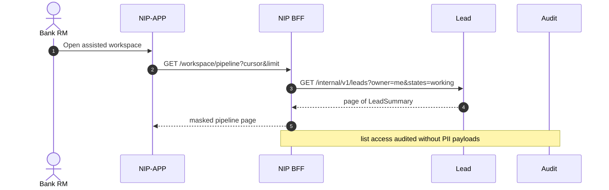
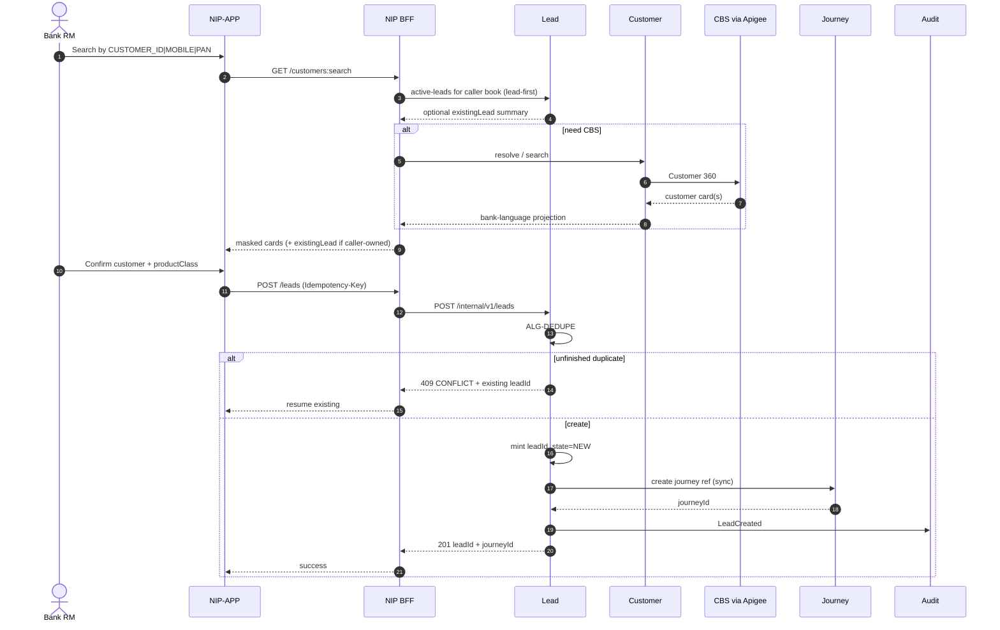
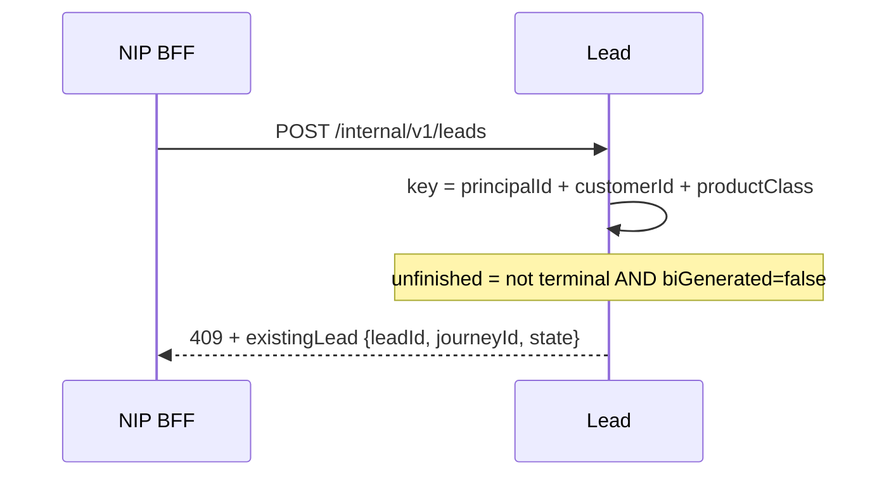
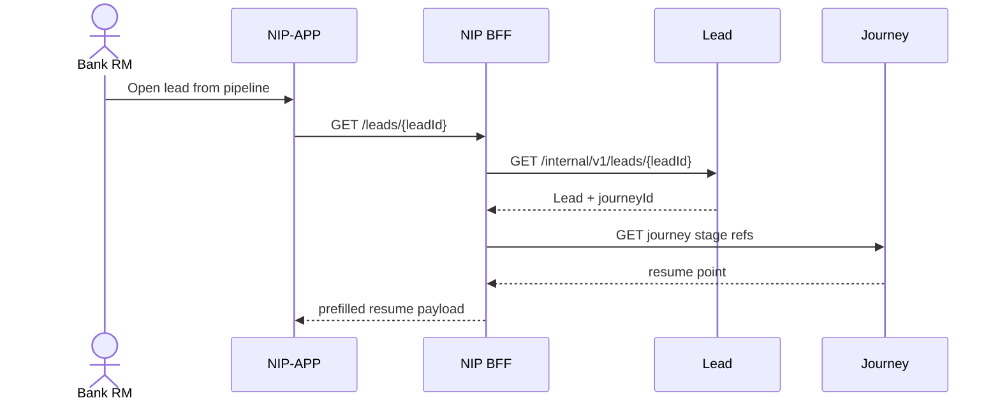
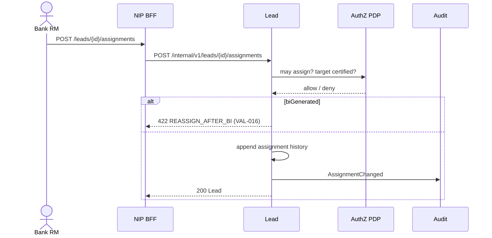
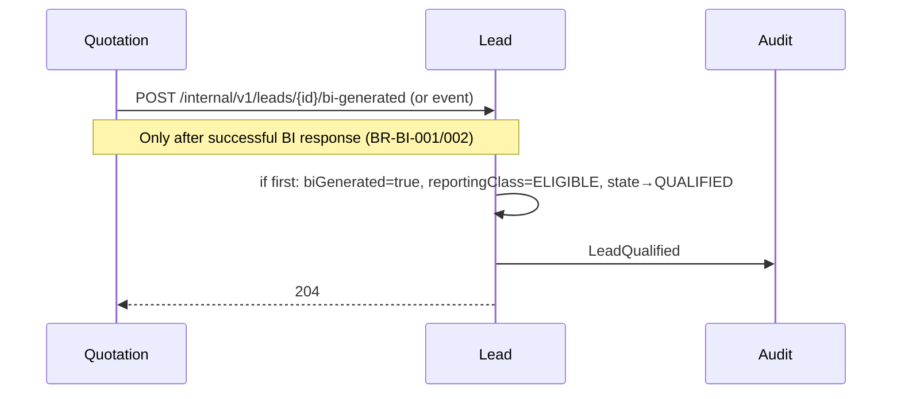
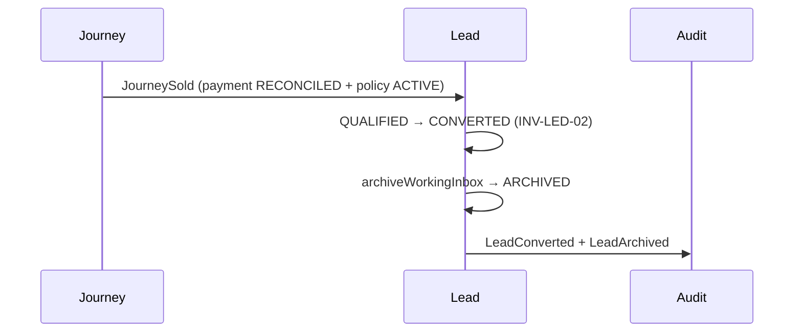

# 11 — Lead module sequences (R0)

**Status:** `AI-DRAFTED` · T3 · human Board 1 outstanding  
**Origin:** `SUG-20260930-lmd` · `EPIC-005` · `ARCH-027` · `PLAN-007`  
**Companion:** [`10-lead-module-hld.md`](./10-lead-module-hld.md) · [`07-nip-bff-lead-phase-api-lld.md`](./07-nip-bff-lead-phase-api-lld.md)

R0 default actor for create: **Bank RM** (`INV-LED-04`). BRD SP / Non-SP / Insurance RM create paths are illustrated only as *future* variants under `OPEN-LEAD-ACTOR`.

---

## 1. Landing — own pipeline (SCR-02)



Sync. Cursor pagination. No nested full Lead (EPIC-003 §5).

---

## 2. Search → confirm → product → create (SCR-03…05)



Rules:

- Lead-first then CBS (ARCH-025).
- Idempotency-Key on create (S-20).
- Insurer/plan absent at create (`BR-LEAD-005`).
- `productClass` immutable (`BR-LEAD-006`).

---

## 3. Dedupe conflict only



After `biGenerated=true`, same key may create a **new** lead (`BR-DEDUPE` table). Another principal’s unfinished lead does not block this principal (`BR-DEDUPE` row “another user”); cross-RM **visibility** remains `OPEN-LEAD-XRM` (absent).

---

## 4. Resume Save & Close



`BR-LEAD-004`: resume from last applicable journey point with stored data prefilled — Journey owns the point; Lead owns the inbox row.

---

## 5. Assignment / reassignment (pre-BI)



`OPEN-D1` still owns SLA reset and conversion credit semantics; storage always keeps history (`BR-OWN-002/003`).

---

## 6. First BI → Eligible / QUALIFIED



Multiple BIs stay on Quote; Lead does not mint a new `leadId` (`BR-BI-003/005`).

---

## 7. Convert → archive (ADR-014)



Off-platform MIS policy ingest never calls lead create (`INV-LED-09`).

---

## 8. Close (pre-conversion)

```mermaid
sequenceDiagram
  actor RM as Bank RM
  participant BFF as NIP BFF
  participant LED as Lead #5

  RM->>BFF: POST /leads/{id}/close {reason, remarks?}
  BFF->>LED: POST /internal/v1/leads/{id}/close
  LED->>LED: → DISQUALIFIED/Closed terminal
  Note over LED: BR-CLOSE-001 — no reopen; new lead needs fresh create + dedupe
  LED-->>BFF: 200
```

---

## 9. Deferred — BRD role variants (`OPEN-LEAD-ACTOR`)

| BRD flow | Sequence status |
|---|---|
| §8.1 Insurance RM creates (picks branch + SP) | Documented in BRD only; **not** R0 API until Product overturns INV-LED-04 |
| §8.2 Bank SP creates (picks Insurance RM) | Same |
| §8.3 Bank Non-SP creates (picks SP; RM derived) | Same |
| Meeting schedule + SMS/email | Parked `SUG-20260907-fig` / BOOT notification scope |

---

## 10. Sync vs async

| Interaction | Mode |
|---|---|
| Pipeline, search, get, create, assign, close | Sync |
| BI mark from Quote | Sync command or durable event — same idempotent handler |
| JourneySold | Event (async) with idempotent convert |
| Assignment notification | Async outbox → Notification (R0 thin) |
| Meeting customer SMS/email | Deferred |

---

## 11. Done for this document

- [x] Core R0 sequences
- [x] Explicit deferral of BRD multi-actor create
- [ ] Human Board 1 signature
