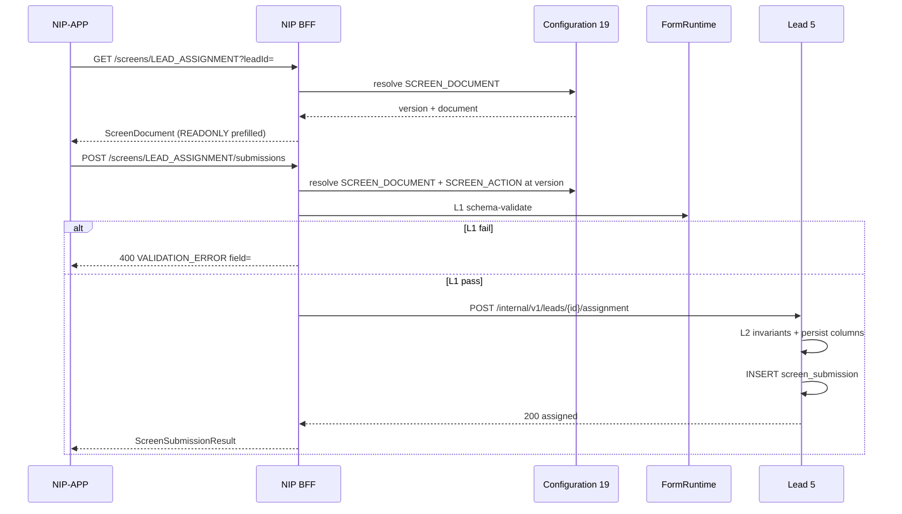

# 11 — Screen runtime: store, validate, bind, persist

**Workstream:** WS-3 · companion to [`10-nip-bff-screen-descriptor.md`](./10-nip-bff-screen-descriptor.md)  
**Owner:** Mahesh (Board 1) — seams · Aarti — physical tables · Amit — `FormRuntime` lib at S11  
**Status:** `AI-DRAFTED` · T3 · human Board 1 / 4 / Aarti outstanding  
**Origin:** `SUG-20260923-sdu` · `ARCH-026` · `ADR-021` (amended) · `ADR-007` · `CF-2`…`CF-5`

File 10 is the **wire** Flutter speaks. This file is the **runtime**: where a screen is stored,
who validates it, which **command** a submit runs, and where the values live afterwards.

The BFF still **does not hold a domain decision**
([`07` §2](./07-nip-bff-lead-phase-api-lld.md#2-actors-edge-and-what-the-bff-may-never-do)).
It loads a definition, schema-validates, maps values onto a **closed command**, and calls the
owning context. Lead still decides assignment. Journey still holds stage references only.

---

## 1. Three artefacts, three owners

| Artefact | What it is | Owner | Store |
|---|---|---|---|
| **Definition** | `ScreenDocument` + `ActionBinding` (the form *and* what submit means) | Configuration **#19** | `administration.configuration_record` (`INV-CFG-02`, append-only) |
| **Command** | Typed domain action (`CREATE_LEAD`, `ASSIGN_LEAD`, …) | The bounded context named on the binding | That context’s tables |
| **Capture** | Exact values the RM submitted, plus the config version that governed them | Same owning context | `screen_submission` (append-only evidence) |

Do **not** invent a fourth “form service” that owns insurance state. A generic form engine that
also decides “this is now ASSIGNED” would cross Lead’s boundary.

```text
Configuration #19          FormRuntime (shared lib)         Owning context
┌─────────────────┐        ┌─────────────────────┐          ┌──────────────────┐
│ SCREEN_DOCUMENT │──GET──►│ 1 schema-validate   │          │ typed command    │
│ SCREEN_ACTION   │──GET──►│ 2 resolve binding   │──HTTP──►│ 3 invariant check│
│ (seeds, versions)│        │   map fields→cmd    │          │ 4 persist SoR    │
└─────────────────┘        └─────────────────────┘          │ 5 write capture  │
                                                            │ 6 audit outbox   │
                                                            └──────────────────┘
```

Resolution is fail-closed (`S-21`, `ADR-007`): no compiled-in screen, no default binding.

---

## 2. How we store the form (definition)

### 2.1 Already decided

`ADR-007` / `CF-2` already list **field validation rules** as a configuration domain consumed by
BFF #2 and the owning service. `administration.configuration_record` already has `form_id` and
`field_id` ([`13-administration.sql`](../data-architecture/schemas/13-administration.sql)).

This pack **names two payloads** inside that store. They extend `CF-2`; they do not open a
second configuration database.

| `domain` | Partition | `payload` |
|---|---|---|
| `SCREEN_DOCUMENT` | `(lob, screenId, version)` | The `ScreenDocument` from file 10 |
| `SCREEN_ACTION` | `(lob, screenId, actionId, version)` | The binding in §4 |

R0 seeds live in git (`CF-4`). The administration UI is a later consumer of this store
(`CF-5`, `ADR-014`) and must not sit on the Lead writer. A field add is a **new version** +
`effective_from`, never an UPDATE (`INV-CFG-02`).

Physical reuse of `13-administration.sql` (Aarti owns any later column):

| Domain | `form_id` | `field_id` | `payload` |
|---|---|---|---|
| `SCREEN_DOCUMENT` | `screenId` | empty | the `ScreenDocument` |
| `SCREEN_ACTION` | `screenId` | `actionId` | the binding in §4 |

Do not add a second configuration table for screens.

### 2.2 Resolution

```
GET /internal/v1/config:resolve
  ?domain=SCREEN_DOCUMENT
  &lob=LIFE
  &screenId=LEAD_ASSIGNMENT
  &at=<now>
```

BFF `GET /screens/{screenId}` is a projection of that resolve, plus request-scoped prefill
(name, masked ref, `leadId`) written into `READONLY.value`. Prefill is **not** stored in the
seed.

`version` on the wire is the configuration version string the seed published (e.g.
`2026-09-23.1`). Every later business row stores that version (`INV-CFG-03`).

### 2.3 What is not stored here

| Data | Why not in Configuration |
|---|---|
| RM’s typed answers | Those are instance data, not rules |
| Branch / RM option lists | Workforce / org directory; `optionsUrl` fetches live |
| Catalogue commercial facts | Product Catalogue #8 (tiles may *cite* `#8`, icons stay CDN) |

---

## 3. Server-side validation (two layers)

Client validation is UX. **It is never sufficient.**

| Layer | Where | What it may decide | What it must not decide |
|---|---|---|---|
| **L1 Schema** | `FormRuntime` in NIP BFF (same lib the service can call) | Widget present, visible, required, format, length, min/max, regex, `version` still ACTIVE | “This RM may assign”, “customer is ETB”, “lead is ASSIGNED” |
| **L2 Invariant** | Owning service (Lead, Journey, …) | `INV-LED-*`, PDP, book-scope, certification, idempotency | Layout, widget type, copy |

### 3.1 L1 algorithm (deterministic, same as file 10 §4)

1. Resolve `SCREEN_DOCUMENT` at the **submitted** `version`. Missing / `SUPERSEDED` without
   replay → `409 CONFLICT` / `STALE_FORM_VERSION`.  
2. Walk fields; compute visible set from `reveals` + `visibleWhen`.  
3. Drop hidden names (anti-tamper).  
4. Apply `FieldValidation` to each visible field.  
5. If `extrasPolicy=REJECT_UNMAPPED`, reject unknown names.  
6. Pass the visible map to L2 as a typed command — **not** as a raw form blob.

Unknown `widget` on a stored definition is a seed defect (CI must fail the seed). The client
fallback (`TEXT`) must never be the server’s behaviour.

PAN / mobile in values: validate format if the field exists; **do not log the value**
(correlation id only).

### 3.2 L2 stays where it is

`POST /leads` still enforces `INV-LED-04/05`, SP cert, `distributorId` forbidden, idempotency
in Lead’s store. Assignment still fails closed if the RM is out of book. Schema-valid
`assignedRmId` can still be `403`.

---

## 4. Which submit does what — the action binding

The screen does **not** contain Java, SQL, or a URL the client invents. `actions[].id` is a
key into `SCREEN_ACTION`.

```json
{
  "screenId": "LEAD_ASSIGNMENT",
  "actionId": "continue",
  "command": "ASSIGN_LEAD",
  "ownerContext": "LEAD",
  "idempotent": true,
  "extrasPolicy": "STORE_UNMAPPED",
  "bindings": [
    { "field": "branchId", "to": "branchId" },
    { "field": "verticalId", "to": "verticalId" },
    { "field": "assignedRmId", "to": "assignedRmId" }
  ]
}
```

```json
{
  "screenId": "LEAD_PRODUCT_CLASS",
  "actionId": "continue",
  "command": "CREATE_LEAD",
  "ownerContext": "LEAD",
  "idempotent": true,
  "extrasPolicy": "REJECT_UNMAPPED",
  "bindings": [
    { "field": "lob", "to": "lob" },
    { "field": "productClass", "to": "productClass" }
  ]
}
```

Carousel tile `payload` is merged into `values` before binding (`lob`, `productClass`).

### 4.1 Closed command catalogue (R0)

New **command** = backend handler + seed. That is a service deploy, not an app-store deploy.
New **field** on an existing command = seed only (and `STORE_UNMAPPED` if it is not yet a
column).

| `command` | Owner | Internal call | Effect |
|---|---|---|---|
| `CREATE_LEAD` | Lead #5 | `POST /internal/v1/leads` | Mint `leadId` + `journeyId` (`AC-LEAD-010-1`) |
| `RESUME_LEAD` | Lead #5 | same, `resumeLeadId` | `outcome=RESUMED` |
| `ASSIGN_LEAD` | Lead #5 | `POST /internal/v1/leads/{id}/assignment` | Persist branch / vertical / RM on the Lead |
| `SELECT_PRODUCT_CLASS` | Lead #5 | patch on create or assign | Sets `lob` + `productClass` if not already set |

Parked (do not seed): `SCHEDULE_MEETING` → `SUG-20260907-fig`.

Proposal submit stays the **proposal** path (`SCR-13` / bank `ProposalDraft`), not this
catalogue. 1SB dynamic schema stops at the adapter.

### 4.2 Who decides a new action

| Seat | Decides |
|---|---|
| Rajal | The business outcome (“RM must assign before consent”) |
| R11 BA | Fields, rules, AC, which command name |
| Mahesh | `ownerContext`, that the command does not cross a boundary |
| Amit | Handler implementation + seed PR |
| Configuration | The `SCREEN_ACTION` row (git seed in R0) |
| Deepali | If the command is privileged / audit-worthy |
| Aarti | New column vs JSON extras on the aggregate |

Nobody puts an arbitrary URL or script in the screen JSON. If the binding is missing, submit
fails closed (`422 ACTION_NOT_BOUND`).

### 4.3 Submit body (file 10 + `actionId`)

```json
{
  "screenId": "LEAD_ASSIGNMENT",
  "version": "2026-09-23.1",
  "actionId": "continue",
  "leadId": "01JQX4K7R8M2N3P4Q5S6T7V8W9",
  "values": {
    "branchId": "BR-KOCHI-MGRD",
    "verticalId": "LIFE",
    "assignedRmId": "RM-4412"
  }
}
```

BFF: resolve document + binding at `version` → L1 → map → Lead command. Flutter never sees
`command` or `ownerContext`.

### 4.4 Several actions on one screen

`actions[]` on the document is the **menu**. Each `SUBMIT` id has its own `SCREEN_ACTION` row.
`NAVIGATE` / `CANCEL` have no command — the client leaves; the BFF does not invent a write.

| `actionId` | Typical `command` | Notes |
|---|---|---|
| `continue` | `CREATE_LEAD` or `ASSIGN_LEAD` | Primary path; one command per screen |
| `save_draft` | not seeded in R0 | Would need a `DRAFT_LEAD` command + Board 1 |
| `cancel` | none (`NAVIGATE`) | No capture row |

Two `SUBMIT` ids that map to the same `command` are a seed defect. The **place this is managed**
is the git seed for `SCREEN_ACTION`, not Flutter and not a workflow engine inside the BFF.

---

## 5. How captured data is used later

One submit produces **three** durable things:

```text
1. SoR columns on the aggregate     → journey behaviour, queries, invariants
2. screen_submission row            → evidence: what was typed under which version
3. Audit outbox event               → #16, BR-SEC-030
```

| Consumer | Reads | Never reads |
|---|---|---|
| Pipeline / MIS | Lead columns (`state`, `assignedRmId`, `productClass`) | Raw widget tree |
| Journey #9 | `leadId`, `journeyId`, stage **references** | Assignment JSON |
| Suitability / quote | Promoted fields on Customer/Lead, not the form blob | `quitCounselNote` unless Product promotes it |
| Proposal (`SCR-13`) | Bank `ProposalDraft` mapped by the adapter | This `ScreenDocument` |
| Support / audit | `screen_submission` + config version | |
| Flutter resume | `GET /screens/{id}?leadId=` (definition + SoR prefill) | Historic widget JSON as source of truth |

**Promotion rule:** a value that a later step *decides on* must become a first-class field on
the owning aggregate (column or typed value object). Until then it may live only in
`values_json` on the capture row (`extrasPolicy=STORE_UNMAPPED`). Suitability must not read
an unpromoted key.

### 5.1 Capture table (logical — Aarti owns physical DDL)

Owned by **Lead** for R0 screens in this pack. Persisted through
`bank-persistence-service` (`/internal/v1`), not a second database.

```text
lead.screen_submission
  submission_id          ULID PK
  lead_id                ULID NOT NULL  → lead
  customer_id            ULID
  lob                    NOT NULL       (INV-LOB-01)
  screen_id              TEXT NOT NULL
  action_id              TEXT NOT NULL
  command                TEXT NOT NULL
  config_version         TEXT NOT NULL  (INV-CFG-03)
  values_json            JSONB NOT NULL  -- visible fields only; no secrets
  outcome                ACCEPTED | REJECTED_L1 | REJECTED_L2
  correlation_id         TEXT NOT NULL
  created_by             TEXT NOT NULL
  created_at             timestamptz
```

INSERT-only. No PII in logs; `values_json` is restricted at the DB (Deepali). Idempotency of
the **command** stays in Lead’s existing store, not in this table.

---

## 6. End-to-end (assignment)



CBS / 1SB are not on this path.

---

## 7. What we refuse (runtime)

| Ask | Answer |
|---|---|
| A Form microservice that owns Lead state | No — violates context ownership |
| Bindings that call arbitrary HTTP from the client | No — closed `command` enum |
| BFF executing SQL or Flyway | No — standing constraint |
| Updating a live `SCREEN_DOCUMENT` in place | No — `INV-CFG-02` |
| Using capture JSON as Suitability input | No — promote first |
| Client-only validation | No — L1 + L2 |
| Storing raw S3 or 1SB payloads as the definition | No |

---

## 8. Traceability

| Behaviour | Authority |
|---|---|
| Config store, versions, seeds, no compiled fallback | `ADR-007`, `CF-2`…`CF-5` (incl. `SCREEN_DOCUMENT` / `SCREEN_ACTION` rows), `INV-CFG-01…03` |
| `form_id` already on `configuration_record` | `13-administration.sql` |
| BFF is not the decision maker | `07` §2, `ADR-015` |
| Journey holds references only | Standing constraint |
| Audit on material submit | `BR-SEC-030` |
| Persistence via bank-persistence | Standing constraint; Aarti physical |

## 9. Open for humans (not silently decided)

| ID | Question | Owner | Default until answered |
|---|---|---|---|
| `OPEN-SCR-PROMOTE` | Which assignment extras become Lead columns in R0 vs stay in `values_json`? | Rajal + Aarti | `branchId`, `verticalId`, `assignedRmId` are columns; everything else JSON |
| `OPEN-SCR-L1-HOME` | Must Lead re-run L1, or is BFF L1 + Lead L2 enough? | Amit + Deepali | **Both:** shared lib; Lead may call L1 again on the same version (defence in depth) |
