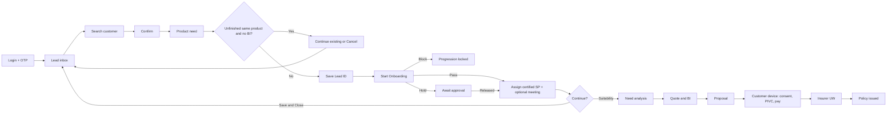
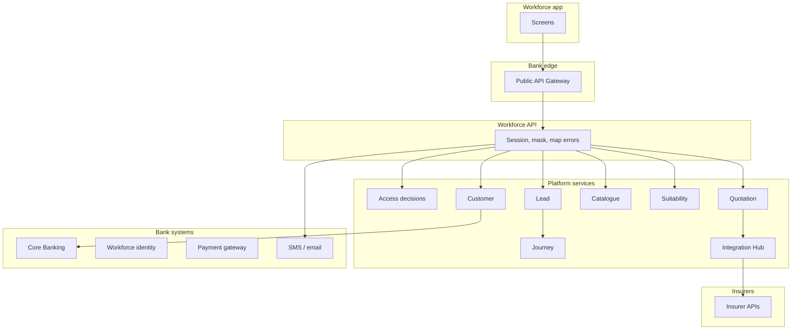
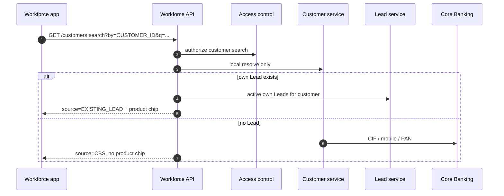
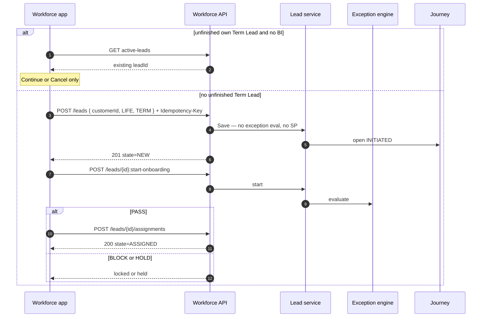

# Digital Insurance Platform — Lead Management Build Specification

**Audience:** Bank development team, vendor development team, client product and QA  
**Product:** Digital Insurance Platform — Assisted Life Insurance  
**Module:** Lead Management (plus the login entry and the modules Lead hands off to)  
**Version:** 1.1  
**Date:** 03 October 2026  
**Status:** Ready to build — sequence aligned to latest Product rules  
**Visual prototype (layout only):** [Client review prototype](https://www.figma.com/proto/JyLGAaO88ELjnyVF2FQ3Bx/For-Client-Review?node-id=208-9666&page-id=208%3A2982)

This is a **standalone** specification. Recipients do not need any other document, repository or internal glossary to start building. If the visual prototype and this page disagree, **this page wins**. Text labelled “open”, “to be confirmed” or “not in the first increment” is not a licence to invent a different rule — raise it to Product / Architecture before coding a workaround.

---

## 0. How to use this page

| You are | Read first | Then build |
|---|---|---|
| Product / BA / client | §§1–11, 20 | Confirm behaviour and acceptance |
| Workforce-app developer | §§1, 3–9, 12–16, 18–19 | Screens, navigation, API calls, errors |
| Backend / API developer | §§2, 12–17, 19 | Services, contracts, data, audit |
| QA | §§8–11, 18–20 | Cases from acceptance criteria and error catalogue |

**Spoken name is Lead.** Do not rename the object Opportunity, Case or Ticket on screens or APIs.

---

## 1. What we are building

The bank is launching a **Digital Insurance Platform** so branch and insurance staff can sell **Life Insurance** to **existing bank customers** (existing-to-bank / ETB only).

A Lead is the single sales opportunity record. It is created once, given a permanent Lead ID, and that same ID travels through suitability, quote / Benefit Illustration (BI), proposal, payment, underwriting and policy issuance.

### 1.1 Business outcome

- One Lead per Life Insurance sales opportunity.
- Bank salesperson and Insurance Relationship Manager work the same Lead together.
- The same logged-in user cannot open two unfinished Leads for the same customer and the same product type. When a Benefit Illustration is **not** yet generated, the only choices are **Continue** the existing Lead or **Cancel** — never delete or replace.
- Save stores the Lead and does **not** run exception / validation rules. **Start Onboarding** runs those rules.
- After Start Onboarding clears (or an approval hold is released), a **certified Specified Person (SP) Bank RM** must be assigned before suitability.
- A Lead can be saved for later or continued into suitability. Only an AU Bank employee who holds a current SP certification, or an Insurance RM / FLS, may process further.
- The Lead is counted as an **Eligible** business Lead only after a Benefit Illustration is successfully returned.
- Every material action is audited.

### 1.2 Product classes in this release

| Product class | Code | In Lead create? | Suitability questionnaire |
|---|---|---|---|
| Term Life Insurance | `TERM` | Yes | Separate Term questionnaire — **not yet specified**. After Lead create, Term proceeds on a Term path, not the Savings/ULIP question set. |
| Savings Plan | `SAVINGS` | Yes (full product). First API increment returns Term only — see §12. | Savings / ULIP suitability module |
| ULIP | `ULIP` | Yes (full product). First API increment returns Term only — see §12. | Savings / ULIP suitability module |
| Health | — | **Out of scope.** Do not show on the picker. | — |

Line of business is **Life only**. Do not store `lob = TERM`. Correct pair: `lob = LIFE` and `productClass = TERM | SAVINGS | ULIP`.

### 1.3 Channels and customers

| Rule | Meaning |
|---|---|
| Assisted first | A logged-in bank or insurance user sells on the customer’s behalf. |
| ETB only | Only a customer returned by Core Banking / Customer 360 may receive a Lead. No prospect / new-to-bank create. |
| No customer self-service in this increment | The customer later receives OTP, documents and a payment link on **their own device**. They do not log into the workforce app. |
| Payment never on the seller device | First-premium payment is IFT, bank payment gateway or cheque on the **customer** path. |
| Sold = policy issued | Quote, proposal or payment alone is not a sale. |

### 1.4 What is in / out of this module

**In**

- Manual Lead create for existing bank customers
- Search by Customer ID, registered mobile, PAN
- Confirm customer with masked mobile and email
- Product need: Term, Savings, ULIP
- Role-specific assignment of a certified-SP Bank RM **after** Save and Start Onboarding (Insurance RM, Bank SP, Bank Non-SP may create)
- Platform-generated Lead ID
- User-level dedupe (Continue or Cancel only when BI is absent)
- Save without exception evaluation; Start Onboarding runs Block / Hold-for-approval / Pass
- Save & Close and continue to suitability (suitability only by AU SP or Insurance RM / FLS)
- Optional online / in-person meeting capture on the assignment screen
- Reassignment before BI
- Closure and remarks
- Dashboard visibility and actions
- Stage, status, reporting and audit
- Integrations: Customer 360, user/branch mapping, Lead store, exception / validation engine, Quote, Insurance Status, notifications, audit

**Out**

- Creating non-bank customers
- Detailed dashboard widget visual design (minimum fields and actions **are** in)
- RM-to-branch / department mapping administration screens
- Meeting completion / meeting-outcome workflow
- Meeting customer SMS / email in this increment (capture the meeting; do not send customer comms yet)
- Separate follow-up task module
- Bulk upload and campaign Leads
- Health Insurance on the picker

---

## 2. Build increments (do not hide the gap)

Product behaviour below is the **full Lead module**. Architecture has already contracted the **first increment APIs** so a team can ship a working Insurance-RM Term path immediately. Build both, in this order.

| Increment | Who | Product | What the user can do | API surface |
|---|---|---|---|---|
| **L0 — Access** | Bank RM and Insurance Partner RM | — | Login, OTP, lock / unlock | Workforce session APIs (outline in §13) |
| **L1 — Lead landing and Save** | Any allowed workforce creator | Term | See own inbox, search ETB customer, confirm, Save or resume, Start Onboarding, assign a certified-SP Bank RM, receive `leadId` + `journeyId` | §16 — **specified now** |
| **L2 — Full Lead module** | Insurance RM, Bank SP, Bank Non-SP | Term, Savings, ULIP | Role-specific assignment, optional meeting capture, dashboard grid, remarks, reassign, close | §17 — **target contract** so UI and API can be built together |
| **L3 — Sale completion** | Current SP and current Insurance RM / FLS, then the customer on their device | Same Lead ID | Suitability → suitable products → quote / BI → proposal → consent → PIVC → payment → issuance | §14 — journey HLD and module hand-offs |

**L1 is not a different product.** It is the first vertical slice of the same Lead. Do not build a second Lead object for L2.

---

## 3. High-level design

### 3.1 End-to-end assisted sale

```text
Login (OTP)
   → Own Lead inbox
   → Search existing bank customer
   → Confirm identity (masked)
   → Select product need (Term / Savings / ULIP)
   → Dedupe (Continue existing | Cancel — no delete when BI is absent)
   → Save Lead (Lead ID minted; SP not yet assigned; no exception evaluation)
   → Start Onboarding → exception engine (Block | Hold-for-approval | Pass)
   → Assignment: mandatory certified-SP Bank RM + optional meeting
   → Save & Close  OR  Suitability (AU SP or Insurance RM / FLS only)
   → Suitable products / quote / Benefit Illustration   ← first successful BI = Eligible
   → Final BI (locks suitability; locks reassignment)
   → Proposal form (seller), then customer review on customer device
   → Consent OTP + Standing Instruction (annual)
   → Insurer PIVC
   → First-premium payment on customer device (IFT / PG / cheque)
   → eMandate (annual)
   → Submit to insurer → underwriting / requirements → Policy issued
```



### 3.2 System picture

The workforce application talks to **one** Workforce API. The device never calls Core Banking, never calls an insurer, never calls a database, and never holds an OAuth access token.

```text
Workforce user device (web / Android / iOS)
        │  HTTPS + opaque session (cookie NIPSESSION or Bearer session handle)
        │  CSRF on browser. Correlation id on every call.
        ▼
Public edge (bank WAF) → Public API Gateway
        ▼
Workforce API  (/api/v1)     ← only URL the app is allowed to know
        │
        ├── Access control (fail closed)
        ├── Customer service ── outbound bank API plane ── Core Banking / Customer 360
        ├── Lead service (owns Lead ID, ownership, stage, dedupe)
        ├── Catalogue (product classes / later offerings)
        ├── Journey (stage pointer only — does not copy other services’ decisions)
        ├── Suitability
        ├── Consent
        ├── Quotation ── Integration Hub ── insurer / aggregator adapters
        ├── Proposal and underwriting
        ├── Payment (sends a link to the CUSTOMER device; bank PG / IFT)
        ├── Policy and issuance
        ├── Notifications (SMS / email; 08:00–20:00 customer window)
        └── Audit (outbox; not on the user’s wait path)
```



### 3.3 Non-negotiable boundaries

| Rule | Consequence |
|---|---|
| App talks only to the Workforce API | No Core Banking, insurer, Lead-service or database URL on the device |
| Tokens stay in the Workforce API | App sends an opaque session, not an access token |
| Masking happens in the Workforce API | App never receives full mobile, full email, full Customer ID / CIF, PAN, DOB, address, Aadhaar |
| Workforce API does not own domain decisions | Dedupe conflict is decided by Lead service; API maps `409` |
| Attribution is never caller-supplied | `distributorId` is forbidden on every request |
| No PII in logs | Search values (PAN, mobile, Customer ID) are not logged; correlation id only |
| Fail closed | If access control or Core Banking is down and there is no local Lead, do not invent a customer |
| Insurer schemas stop at the Integration Hub | UI and Workforce API use bank language (`TERM`, `SAVINGS`, `ULIP`), never insurer product codes |

### 3.4 Identity planes

| User | How they sign in | Password |
|---|---|---|
| Bank RM / Bank SP / Bank Non-SP | Employee ID + **existing bank password** | Bank directory. This platform does **not** reset or change it. |
| Insurance Partner RM / FLS | Corporate email + **platform password** | Created / reset only through Unlock User. Expires in 60 days. |

**Specified Person (SP)** is a **certification on a Bank RM**, evaluated at assignment and again at every regulated action, not a second login type. A Bank user without SP certification can **Save** a Lead, run Start Onboarding, assign an SP, and Save & Close, but cannot fulfil suitability / quote / proposal.

Any allowed workforce creator (Bank SP, Bank Non-SP, Insurance RM / FLS) may Save a Lead. Insurance RM create may be switched off at runtime until Compliance confirms it; the API then returns `403 ORIGINATION_ACTOR_DENIED`. Records a caller is not allowed to see are **absent** from lists — never a `403` that names the id.

---

## 4. Users and access (Lead)

| Role | Who | During Save | After assignment |
|---|---|---|---|
| **Insurance RM / FLS** | Insurer representative mapped to one or more branches | Search, confirm, product, Save, Start Onboarding. Then selects **branch** and a **certified-SP Bank RM** | Sees and actions the Lead; can fulfil the journey |
| **Bank SP** | Bank salesperson mapped to **one** home branch; holds SP certification | Search, confirm, product, Save, Start Onboarding. May **self-assign** as the certified SP | Sees and actions the Lead; can fulfil the journey |
| **Bank Non-SP** | Bank employee who can spot an opportunity | Search, confirm, product, Save, Start Onboarding. Then selects **branch** and a **certified-SP Bank RM** | Lead **does not** appear on the Non-SP dashboard after allocation; Non-SP cannot process further |

### 4.1 Action matrix

| Action | Insurance RM | Bank SP | Bank Non-SP |
|---|---|---|---|
| Search and select customer | Yes | Yes | Yes |
| Save Lead | Yes | Yes | Yes |
| Start Onboarding | Yes | Yes | Yes |
| Assign certified-SP Bank RM | Yes | Yes (may self-assign) | Yes |
| Capture optional meeting | Yes | Yes | Yes |
| Select branch on assignment | Yes | No — home branch derived | Yes |
| View created / assigned Lead | Yes | Yes | **No** after allocation |
| Continue suitability / BI | Yes | Yes | **No** |
| Dashboard remarks | Yes | Yes | No |
| Reassign before BI | Yes, if current owner | Yes, if current owner | No |
| Close Lead | Yes | Yes | No |

### 4.2 Lead Generator, Lead Fulfiller, Created By

| Attribute | Meaning | Initial value |
|---|---|---|
| **Lead Generator (LG)** | Who is credited with generating the Lead | Creator when they are the SP; **assigned SP** when Non-SP or Insurance RM Saves |
| **Lead Fulfiller (LF)** | Who progresses the buying journey | Assigned certified-SP Bank RM (and current Insurance RM on a joint path) |
| **Created By** | The actual user who clicked Save | Always the logged-in user (needed when Non-SP Saves) |
| **Accountable SP** | Certified Bank RM written once on the first completed assignment | Never changes on later working reassignment |

Current Bank SP **and** current Insurance RM both see and action the Lead. LG and LF stay stored separately for attribution.

### 4.3 Diary Lead vs Eligible Lead

| Classification | Trigger | Dashboard | Reporting |
|---|---|---|---|
| **Diary Lead** | Created and saved before any successful BI | Visible; can resume; dedupe applies | **Not** counted as an eligible business Lead |
| **Eligible Lead** | At least one BI successfully received from Quote API | Same Lead ID continues | Counted in role-based funnel reporting |

Reaching the quote screen or clicking Generate Quote **without** a successful BI does **not** flip eligibility.

---

## 5. Lead creation flows

### 5.1 Common path (closed sequence)

1. Open Lead Creation.
2. Search existing bank customer (Customer ID **or** mobile **or** PAN).
3. Customer 360 / Core Banking returns matches.
4. User selects and confirms the customer (masked fields).
5. User selects exactly one product type.
6. System runs **user-level** dedupe (same user + same customer + same product + no BI).
7. If unfinished and BI absent: show **Continue** or **Cancel** only. Do **not** offer delete or replace.
8. **Save** the Lead. Platform mints Lead ID. State is **New**. Certified SP is **not** assigned yet. Exception rules do **not** run.
9. User clicks **Start Onboarding**. Exception / validation engine returns **Pass**, **Block**, or **Hold-for-approval**.
10. On Pass (or after an approval hold is released): assignment screen — user must select a **certified-SP Bank RM** and may optionally capture a meeting.
11. User proceeds to Suitability **only if** they are an AU SP or Insurance RM / FLS — **or** Save & Close.
12. Saved Lead stays **New** / Diary. After assignment it is visible to the current SP (and current Insurance RM).
13. First successful BI → Eligible and stage **Quote Generated**.
14. Same Lead ID continues through proposal and insurer status.

Insurer and plan are **unknown** at Save. They are filled later from quote / BI.

### 5.2 Insurance RM Saves then assigns

```text
Search → Confirm → Product → Dedupe → Save
   → Start Onboarding (Pass | Block | Hold)
   → Branch (only branches mapped to this RM)
   → Active certified-SP Bank RMs in that branch
   → Optional meeting → Save & Close or Suitability
Created By / LG = logged-in RM
Accountable SP / LF = selected Bank SP
Visible to current RM and current SP
```

### 5.3 Bank SP Saves then assigns

```text
Search → Confirm → Product → Dedupe → Save
   → Start Onboarding (Pass | Block | Hold)
   → Branch = home branch (not editable)
   → Certified SP = self (or another active SP on the home branch)
   → Optional meeting → Save & Close or Suitability
Created By / LG = logged-in SP
Accountable SP = assigned Bank SP
Visible to current SP and current Insurance RM
```

### 5.4 Bank Non-SP Saves then assigns

```text
Search → Confirm → Product → Dedupe → Save
   → Start Onboarding (Pass | Block | Hold)
   → Branch (own or another)
   → Active certified-SP Bank RMs in that branch
   → Optional meeting → Save & Close only (no Suitability)
Created By = Non-SP
LG / Accountable SP = selected SP
Visible to current SP and current Insurance RM — NOT to the Non-SP after allocation
```

If no certified SP is available in the branch, block assignment: *“No active SP is available for the selected branch.”*

**Wireframe note:** some Insurance RM screens show a **Vertical** dropdown. Confirmed flow is Branch → SP. If Vertical is kept, it is a bank-master filter between Branch and SP. Mandatory status is **open** — do not hard-code it.

### 5.5 Assignment timing (closed)

Assignment of the certified-SP Bank RM happens **after Start Onboarding clears**, not on Save and not after final BI. Later quote / proposal notes that said “assign after BI” are **not** followed. Save never evaluates exceptions.

---

## 6. Screens

Use the prototype for spacing and visual language. Field rules below are mandatory.

### 6.1 Screen 1 — Select customer to begin

```text
+---------------------------------------------+
|  <-                                         |
|  Select customer to begin                   |
|                                             |
|  Search by                                  |
|  [ Customer ID          v ]                 |
|  Enter Customer ID                          |
|  [ _______________________ ]                |
|  [          Search         ]                |
|                                             |
|  N result(s) found              Clear       |
|  +---------------------------------------+  |
|  | (AK)  Abhishek Kummar                 |  |
|  |       CIF XXXXX0433  •  ULIP          |  |
|  |       View details                    |  |
|  +---------------------------------------+  |
+---------------------------------------------+
```

| Control | Type | Mandatory | Behaviour |
|---|---|---|---|
| Search by | Selector | Yes | Customer ID, Mobile Number, PAN. Only one mode active. **No name search. No account-number search.** |
| Customer ID | Numeric / alphanumeric | If mode = Customer ID | Format follows Customer 360. Typical 1–20 `[A-Za-z0-9]`. |
| Country code | Read-only | If mobile | Show `+91`. |
| Mobile | Numeric | If mobile | Exactly **10** digits. No letters or symbols. |
| PAN | Text | If PAN | Uppercase. Exactly 10 characters, pattern `AAAAA9999A`. |
| Search | Primary button | — | Validate, call search, disable double-click. Enable only when format is valid. |
| Recent Leads / Prospects | Cards | No | If shown, authorised and masked only. Informational. |
| Get Help | Link | No | Support content from IT. |

**Rules**

- Only an existing bank customer from Customer 360 may continue.
- Customer ID and PAN are expected to return one person. Mobile may return many; the user picks.
- No match → block create. Do **not** offer “create customer”.
- Search is a material action: audit actor, search type, hashed value, result count. Never log raw PAN / mobile / Customer ID.

### 6.2 Screen 2 — Search results

| Control | Requirement |
|---|---|
| Result count / context | Show count. Do not echo the raw search value if it is PAN or full mobile. |
| Customer name | Primary identifier in the list. |
| Masked Customer ID / CIF | Last four only, e.g. `XXXXX0433`. Full CIF never on the wire. |
| Existing product chip | Shown only when this user already has a Lead (`• ULIP` / `• TERM` / `• SAVINGS`). |
| View details | Opens confirmation sheet. |
| Go Back | Return to search. |

If Core Banking is down **and** no own Lead exists: *“Customer records are unavailable right now. Do not proceed.”* Do not fabricate a customer.

If the customer is not ETB: show the row as ineligible; Continue disabled.

### 6.3 Screen 3 — Customer details confirmation

| Field | Display | Editable |
|---|---|---|
| Customer name | Full | No |
| Customer ID | Masked | No |
| Mobile | Masked, e.g. `+91 933****412` | No |
| Email | Masked, e.g. `abh*****@gmail.com` | No |
| OK / Confirm | Proceed to product need | — |
| Back / Cancel | No Lead created | — |

Additional CBS fields may be fetched for later journey steps. **Do not display** PAN, DOB, address, income, tobacco or Aadhaar on this sheet.

### 6.4 Screen 4 — Product need

| Option | Stores | Notes |
|---|---|---|
| Term Life Insurance | `TERM` | |
| Savings Plan | `SAVINGS` | |
| ULIP Plan | `ULIP` | |
| Health | — | **Do not display** |

Exactly one selection. Continue enabled only after a choice. Product type is **immutable** after create — another product needs a new Lead.

**First API increment:** the catalogue resource returns only Term as selectable. The app should still render the three product cards for L2, but L1 Save must send `TERM` or the API returns `422 UNSUPPORTED_LOB`.

### 6.5 Screen 5 — Existing Lead / dedupe

Shown **after product selection** when the **logged-in user** already has a Lead for the same Customer ID and same product type **and** that Lead has **no** BI.

| Show | Action |
|---|---|
| Lead ID, creation date, product type | Read-only |
| Continue with existing Lead | Open at the last resumable step |
| Cancel | Close; do not Save a new Lead |
| Delete and create new | **Not available** when BI is not generated (ignore that wireframe label) |

When BI **has** been generated, dedupe does **not** block a fresh Lead.

Dedupe is **not** system-wide. Another user may Save the same product Lead for the same customer.

### 6.6 Screen 6 — Lead saved

Shown after a successful Save. Exception rules have **not** run.

| Field | Type | Mandatory | Rule |
|---|---|---|---|
| Created date/time | Read-only | Yes | Server timestamp |
| Customer name | Read-only | Yes | |
| Customer ID | Masked | Yes | |
| Lead ID | Read-only | Yes | Platform-generated, permanent |
| Start Onboarding | Primary | — | Runs exception / validation. Required before assignment |
| Save & Close | Secondary | — | Diary Lead. Returns to inbox. Assignment still required before suitability |

### 6.7 Screen 6B — Start Onboarding outcome

| Outcome | What the user sees | Next |
|---|---|---|
| **Pass** | Cleared. Continue to assignment | Screen 7 |
| **Block** | Progression locked. Show the rule outcome from the exception service — do not invent copy | Lead exists; assignment and suitability are disabled |
| **Hold-for-approval** | Lead held. Assignment and suitability gated until an approver releases the hold | Resume assignment after release |

Do **not** implement approver hierarchy or exception remarks in the Lead screens. Those belong to the exception / approval module.

### 6.8 Screen 7 — Assignment and optional meeting

Shown only when Start Onboarding has **Passed** or a hold has been **released**. The certified-SP Bank RM is **mandatory**. Meeting is optional.

**7A — Insurance RM / FLS assigns**

| Field | Type | Mandatory | Logic |
|---|---|---|---|
| Branch | Dropdown | Yes | Branches available to the logged-in RM |
| Vertical | Dropdown if retained | Open | Bank master; filters SP list if kept |
| Certified SP | Dropdown | Yes | Active SP-certified Bank RMs in selected branch. Empty-state if none |
| Meeting fields | See below | No | |
| Proceed to Suitability | Primary | — | Allowed for Insurance RM / FLS after SP is assigned |
| Save & Close | Secondary | — | Diary Lead |

**7B — Bank SP assigns**

| Field | Type | Mandatory | Logic |
|---|---|---|---|
| Branch | Derived | — | Home branch, not editable |
| Certified SP | Dropdown | Yes | Defaults to self. May pick another active SP on the home branch |
| Meeting fields | See below | No | |
| Proceed to Suitability | Primary | — | Allowed — caller is SP-certified |
| Save & Close | Secondary | — | |

**7C — Bank Non-SP assigns**

| Field | Type | Mandatory | Logic |
|---|---|---|---|
| Branch | Dropdown | Yes | Own or another branch |
| Certified SP | Dropdown | Yes | Active SP-certified Bank RMs in that branch |
| Meeting fields | See below | No | |
| Proceed to Suitability | Hidden / disabled | — | Non-SP cannot process further |
| Save & Close | Primary | — | Only allowed next step |

**Optional meeting (all 7A–7C)**

| Field | Type | Mandatory | Rule |
|---|---|---|---|
| Schedule meeting | Section | No | Entirely optional |
| Meeting type | Online / In-person | If scheduling | |
| Meeting date | Date | If scheduling | Not in the past |
| Meeting time | Time | If scheduling | **08:00–20:00** only |
| Meeting link | URL | If Online | Hidden / disabled for In-person |

Meeting completion / outcome is **out of scope**. Customer SMS / email for the meeting is **not** in this increment.

### 6.10 Lead dashboard (minimum — layout later)

**Grid fields**

| Group | Fields |
|---|---|
| Lead | Lead ID, created at, last updated |
| Customer | Name, masked Customer ID, masked mobile |
| Product | Product type; insurer and plan once known |
| Ownership | Branch, Lead Generator, Lead Fulfiller |
| Journey | Stage, status, BI Generated flag |
| Activity | Meeting date/time, latest remark |
| Proposal / Policy | Proposal number, policy number, insurer status |

**Search / filter:** Lead ID, customer name, Customer ID; filters for product, stage, status, branch, LG, LF, date range. Default newest first.

**Actions (current SP and current RM only)**

| Action | Rule |
|---|---|
| Open / View | Current owners |
| Continue journey | Resume last valid step, data prefilled |
| Add remarks | Max 250 characters, append-only |
| Schedule meeting | Optional |
| Reassign | Only while stage = New **and** BI Generated = No |
| Close | Closure reason required |

Non-SP never sees this grid for allocated Leads.

---

## 7. Deduplication

**Key:** logged-in User ID + Customer ID + Product Type + “BI already generated?”

| Existing | New attempt | Outcome |
|---|---|---|
| Same user + same customer + Term + no BI | Term | Block; show existing Lead |
| Same user + same customer + Term + BI done | Term | Allow a fresh Lead |
| Same user + same customer + Term | Savings or ULIP | Allow (different product) |
| Another user has same customer + same product | Same product | Allow (user-specific) |
| Closed Lead for same customer + product | Same product | Allow, subject to any other unfinished Lead of this user |

BI Generated = a **successful** Quote API Benefit Illustration response.

---

## 8. Stages, status, ownership, close

### 8.1 Stage (platform + insurer)

| Stage | Trigger | Source |
|---|---|---|
| New | Created; no BI | Platform |
| Quote Generated | First successful BI | Quote API |
| Proposal Form Pending | Journey moves to proposal | Platform |
| Proposal Submitted | Submitted to insurer | Platform / insurer |
| Policy Pending | Processing | Insurance Status |
| Requirements Awaited | Extra documents / data | Insurance Status |
| Underwriting Queue | Insurer UW | Insurance Status |
| Policy Issued | Issued | Insurance Status |
| Policy Declined | Declined | Insurance Status |
| Closed | Authorised user closed before success | Platform |

Map insurer vocabularies through configuration. Do not hard-code one insurer’s labels.

### 8.2 Pre-BI activity status

While stage stays **New**, an activity / disposition status may be set from a **master** (no code change to add values). Indicative: Meeting Scheduled, Contacted, Follow-up Scheduled, Call Back Later, Customer Not Interested.

**Customer Not Interested closes the Lead.**

### 8.3 Reassignment (only before BI)

Current SP or current Insurance RM may reassign. Non-SP cannot.

**Same branch, different SP:** branch and RM unchanged; SP / LG updated; old SP loses visibility; new SP notified.

**Different branch:** new branch + new SP; RM **auto-assigned** for the new branch; previous owners lose visibility; audited.

After first successful BI (final BI), ownership **locks**. Show: *“Lead cannot be reassigned after BI generation.”*

Reporting credit follows **current** ownership after reassignment. Created By never changes.

### 8.4 Close

| Field | Rule |
|---|---|
| Closure reason | Mandatory. Master: Customer Not Interested, Customer Unreachable, Duplicate Lead, Invalid Customer, Already Insured, Product Not Suitable, Customer Deceased, Other |
| Closure remarks | Mandatory when Other. Max 250 characters |

Closed Leads **cannot be reopened**. Pursue again = new Lead, subject to dedupe.

### 8.5 Remarks

Entered from the dashboard. Max 250 characters. Store text, user, role, date/time. **Append-only.**

---

## 9. Meetings, notifications, reporting

### 9.1 Meeting

Optional. Online requires a link. Date not past. Time 08:00–20:00. No completion workflow.

### 9.2 Notifications

| Event | Recipient | Channel |
|---|---|---|
| Initial assignment | Assigned user | In-app |
| Reassignment | Newly assigned user | In-app |
| Meeting scheduled | Customer | **Deferred** — capture the meeting; do not send SMS / email in this increment |
| Customer comms outside 08:00–20:00 | Customer | When comms are later enabled, queue until the next window |

Do not send customer SMS / email for meetings in this increment. When that channel is later enabled, never send outside 08:00–20:00.

### 9.3 Reporting

| Metric | Definition |
|---|---|
| All Lead records | Every platform Lead including Diary |
| Eligible Leads | First successful BI |
| Diary Leads | No BI |
| Quotes / BIs | Eligible Leads; multiple BIs counted separately |
| Proposals submitted | Submitted to insurer |
| Policies issued | Policy Issued from Insurance Status |

Attribution = current LG / owner after reassignment. Store actor, role, branch, LG, LF, Created By.

---

## 10. Data the Lead must persist

| Field | Notes |
|---|---|
| `leadId` | Unique, immutable. Recommended 26-character ULID. Not a CIF. |
| `journeyId` | Opened at Save. Same sale. Inert until Start Onboarding. |
| `customerId` | Platform id from search (not the raw CIF) |
| `lob` | `LIFE` |
| `productClass` | `TERM` \| `SAVINGS` \| `ULIP` — immutable |
| `createdByUserId` / role | Actual clicker |
| `leadGeneratorUserId` | Attribution |
| `leadFulfillerUserId` | Journey owner |
| `currentSpUserId` / `currentRmUserId` | Dashboard visibility — **null** until assignment completes |
| `accountableSpUserId` | Certified Bank RM written once on first assignment; immutable after that |
| `branchId` | Current branch |
| `source` | `RM` for assisted create |
| `state` / `stage` / activity status | See §8. After Save: `NEW`. After assignment: `ASSIGNED` |
| `exceptionEvaluated` | True after Start Onboarding has run |
| `exceptionHold` | True while awaiting exception approval |
| `biGenerated` | True only after successful BI |
| `needAnalysisState` | `NOT_STARTED` \| `IN_PROGRESS` \| `COMPLETED` |
| Meeting fields | Optional; captured on assignment |
| Closure reason / remarks | If closed |
| Created / updated timestamps | UTC |

Do **not** store PAN or full mobile on the Lead as a search directory. Customer identity stays in Customer service / Core Banking.

---

## 11. Validation messages (Lead UI)

| ID | When | Message |
|---|---|---|
| VAL-001 | No search mode or value | Please enter the required customer search details. |
| VAL-002 | Mobile not 10 digits | Please enter a valid 10-digit mobile number. |
| VAL-003 | Invalid PAN | Please enter a valid PAN. |
| VAL-004 | No customer | No customer found for the entered search criteria. |
| VAL-005 | Customer 360 down | We are unable to retrieve customer details at this time. Please try again. |
| VAL-006 | No product | Please select a product type. |
| VAL-007 | No branch | Please select a branch. |
| VAL-008 | No SP | Please select an SP. |
| VAL-009 | No Insurance RM | Please select an Insurance RM. |
| VAL-010 | No SP in branch | No active SP is available for the selected branch. |
| VAL-011 | RM mapping missing | Insurance RM could not be assigned for the selected branch. Please contact support. |
| VAL-012 | Duplicate unfinished | An existing lead is available for this customer and product. Please continue with the existing lead. |
| VAL-013 | Past meeting date | Meeting date cannot be in the past. |
| VAL-014 | Meeting time window | Meeting time must be between 08:00 AM and 08:00 PM. |
| VAL-015 | Online link missing | Meeting link is mandatory for an online meeting. |
| VAL-016 | Reassign after BI | Lead cannot be reassigned after BI generation. |
| VAL-017 | No closure reason | Please select a closure reason. |
| VAL-018 | Other without remarks | Please enter closure remarks. |
| VAL-019 | Remarks too long | Remarks cannot exceed 250 characters. |
| VAL-020 | Save failed | We could not save the lead. Please try again. |
| VAL-021 | Start Onboarding blocked | This lead cannot proceed. Review the exception outcome. |
| VAL-022 | Exception hold active | This lead is waiting for approval. Assignment and suitability are not available. |
| VAL-023 | Onboarding not started | Start Onboarding before assigning an SP. |
| VAL-024 | Certified SP required | Select a certified Specified Person before continuing. |

Save must be **transactional and idempotent**. A double-click must not mint two Lead IDs. Exception evaluation is a separate Start Onboarding call.

---

## 12. Login (so the app can start)

The workforce app opens on a common login shell.

### 12.1 User types

| Tab | Identifier | Password | After OTP |
|---|---|---|---|
| Bank RM | Employee ID | Bank system password | Bank dashboard / Lead inbox |
| Insurance Partner | Corporate email | Platform password | Partner dashboard |

**There is no Forgot Password link** for either type. Account recovery is **Unlock User** only.

Bank RM password create / reset / change **does not exist** on this platform.

### 12.2 Bank RM happy path

Select Bank RM → Employee ID + bank password + Captcha → bank authentication → 6-digit OTP to registered mobile **and** email → verify → inbox.

### 12.3 Insurance Partner happy path

Select Insurance Partner → corporate email + platform password + Captcha → platform authentication → same OTP rules → inbox.

First-time partner users **create** the password through Unlock User. No temporary password is issued. Partner password expires in **60 days**.

### 12.4 OTP rules (every login)

| Rule | Value |
|---|---|
| Length | 6 digits |
| Delivery | Same OTP to mobile and email |
| Validity | 10 minutes |
| Wrong attempts | 5; then return to login. **Account is not locked** for OTP failures alone |
| Resend wait | 2 minutes |
| Max resends | 3 per session |
| New OTP | Invalidates the previous OTP |
| Used OTP | Cannot be reused |

Show only **masked** mobile and email on the OTP screen.

### 12.5 Lock / Unlock

- Lock after **3** consecutive wrong passwords. Show remaining attempts after the 1st and 2nd.
- Also treat as locked after **30 days** without login.
- Successful login resets the password-attempt counter.
- Unlock User: identifier + Captcha → OTP to mobile and email → then, for partners, create / reset password → **return to login** (do not auto-login).
- Disabled / deactivated / unknown users cannot be unlocked.
- Downloadable Unlock Guide is an IT-supplied PDF.

### 12.6 Login screen rules

| Control | Rule |
|---|---|
| User type | Bank RM or Insurance Partner; one always selected |
| Show / hide password | Allowed |
| Captcha | Required; refresh on failure |
| Sign In | Validate identifier, Captcha, then password / account state; prevent double submit |
| Unlock User | Secondary action |
| Get Help | Support content |
| Forgot Password | **Not displayed** |

---

## 13. After Lead — modules you will build next

These are not a second product. They consume the same `leadId` / `journeyId`.

### 13.1 Suitability (Savings / ULIP)

Applies only when `productClass` is `SAVINGS` or `ULIP`. Term **skips** this question set (Term questionnaire still to be issued).

Users: current Bank SP and current Insurance RM, jointly. Non-SP has no access. Only one editor at a time; the other sees read-only / “another user is editing”. Reassignment before BI carries saved answers to the new owner.

**Screen order**

1. Who is the policy for? (Self vs permitted relationship)
2. Life Assured details — only if not Self
3. Proposer life stage
4. Proposer risk preference
5. Proposer primary goal
6. Occupation, education, exact annual income, tobacco, medical condition, existing Life cover
7. System-derived tentative premium (age, income, occupation — final formula still to be confirmed)
8. Investment details: premium, frequency (annual / single), premium paying term, policy term
9. Complete → insurer-wise product mapping → **Suitable Products**

Save & Exit and Back keep answers. After a **saved** change, previous mapping and selected product are invalidated. After **successful final BI**, suitability **locks**.

If mapping returns nothing: dedicated “No suitable product” handling. Seller cannot override to an unsuitable product.

### 13.2 Quote, compare, riders, final BI

Bank-owned catalogue. Group A insurers quoted inside the platform through the Integration Hub. Group B = recommend and **redirect** to the insurer (no in-platform quote).

- List / compare / modify / share.
- Multiple BIs stay on the **same** Lead ID.
- **Final BI** is the lock event: Eligible Lead, stage Quote Generated, suitability locked, reassignment blocked.
- A toolkit / sample BI is **not** the lock event.

### 13.3 Pitch deck

Seller can share a product-first pitch. If that share creates a Diary Lead, it does **not** assign the certified SP by itself — assignment still follows the Save → Start Onboarding → assign sequence.

### 13.4 Customer buying journey (after final BI)

1. Seller continues to Proposal Form. **Application ID** is created and linked to Lead + final BI. Repeat open resumes the same Application ID. Lead stage → Proposal Form Pending.
2. Proposal sections are **API-driven** (insurer-specific). Do not hard-code one common form.
3. Seller completes sections + Agent Confidentiality Report.
4. Platform sends a secure link to the customer’s mobile and email.
5. Customer reviews the same Application ID; may edit **API-permitted** fields only.
6. Customer edits **never** change quote, riders, premium or BI and **never** regenerate BI.
7. Mandatory PDFs + declarations.
8. Annual premium: select eligible AU account + Standing Instruction.
9. Customer OTP consent.
10. Insurer-managed PIVC; status returns.
11. First premium: **IFT**, **bank payment gateway**, or **cheque** (number + image). Not on the seller device.
12. After payment, annual policies complete eMandate.
13. Platform submits to insurer when configured statuses are met.
14. Insurer may request more documents; customer uploads.
15. Optional feedback and referral.
16. Underwriting continues to issued / pending / declined.

### 13.5 Exception / approval rules

Configurable block / approval rules fire when the user clicks **Start Onboarding** (or later Resume Journey), **not** when the Lead is Saved. Outcomes are **Pass**, **Block**, or **Hold-for-approval**. If any fired rule is Block, the Lead is blocked. A hold gates assignment and suitability until an approver releases it. Do not invent rule outcomes in the app — they come from the exception / validation service.

### 13.6 Hard gates (must be unbypassable in code, not only hidden in UI)

| Gate | Rule |
|---|---|
| C1 Suitability | No quote without a valid, unexpired suitability (or the Term equivalent when specified) |
| C2 Consent | No proposal without an unexpired customer consent grant |
| C4 Payment device | Payment link / PG / IFT only on the **customer** device |
| Issuance | Policy issued only against a **reconciled** payment |

---

## 14. Workforce API conventions (all increments)

**Base URL:** `https://{env}-insurance.aubank.in/api/v1`  
`{env}` = `dev` | `uat` | `prod`

| Topic | Rule |
|---|---|
| Versioning | `/api/v1` on the public URL. Breaking change = `/api/v2`. Additive fields are compatible. |
| Success body | The resource **is** the JSON. **No** `{ "success": true, "data": ..., "message": ... }` wrapper. |
| Empty list | HTTP **200** with `items: []`. Not 404. |
| Errors | `application/problem+json`: `type`, `title`, `status`, `detail`, `code`, `category`, `retryable`, `incidentId`, `correlationId`, `timestamp`, `errors[]`. Never origin, stack, or vendor text. |
| Session | Cookie `NIPSESSION` **or** `Authorization: Bearer <opaque-session>`. Not an OAuth access token. |
| CSRF | Browser / cookie calls send `X-CSRF-Token`. |
| Correlation | `X-Correlation-Id` on every call. |
| Mutations | `Idempotency-Key` required (UUID). Same key + same body = replay. Same key + different body = `409 IDEMPOTENCY_CONFLICT`. |
| Dates | ISO-8601 UTC. |
| IDs | 26-character ULID `[0-9A-HJKMNP-TV-Z]{26}`. |

---

## 15. L1 screen → API map

| Screen | User intent | Call | Projection |
|---|---|---|---|
| Inbox | My working Leads | `GET /workspace/pipeline?inbox=WORKING` | Name, initials, masked mobile, state, `leadId` |
| Inbox (prospects) | Not-started own Leads | `GET /workspace/pipeline?inbox=UNSTARTED` | Same shape; `journeyId` may be null |
| Search | Find ETB customer | `GET /customers:search` | Masked card; product chip if own Lead exists |
| Confirm | Identity | Reuse search hit, or `GET /customers/{customerId}` | Name, masked mobile, masked email, masked CIF |
| Product | Term (L1) | `GET /catalogue/product-classes?lob=LIFE` | L1: one selectable `TERM` |
| Dedupe | Own unfinished Term? | `GET /customers/{customerId}/active-leads?productClass=TERM` | Existing `leadId` or empty. UI: Continue \| Cancel |
| Save | New Lead | `POST /leads` | `leadId`, `journeyId`, `state=NEW`, `outcome=CREATED`. No SP yet |
| Resume | Continue | `POST /leads` with `resumeLeadId` | Same body, `outcome=RESUMED` |
| Start Onboarding | Evaluate exceptions | `POST /leads/{leadId}:start-onboarding` | `PASS` / `BLOCK` / `APPROVAL_REQUIRED` |
| Assign SP | Mandatory certified SP + optional meeting | `POST /leads/{leadId}/assignments` | `state=ASSIGNED`, `accountableSpUserId` set |
| Row tap | Open from inbox | `GET /leads/{leadId}` | Sparse status + `needAnalysisState` + hold flags |

Wireframe tabs “Recent leads / Recent prospects / ULIP leads” collapse to **one** pipeline with `inbox`. There is no separate Prospect object. ULIP-only tab is not served in L1.

**Recommended call order**

1. `GET /workspace/pipeline` **in parallel with** `GET /catalogue/product-classes`
2. `GET /customers:search`
3. Optional `GET /customers/{customerId}` if the search hit was dropped
4. `GET /customers/{id}/active-leads` **in parallel with** catalogue if cache miss
5. `POST /leads` — Save returns `leadId` + `journeyId` with `state=NEW`
6. `POST /leads/{leadId}:start-onboarding` — do not skip
7. On Pass: `POST /leads/{leadId}/assignments` with certified-SP Bank RM
8. `GET /leads/{leadId}` only for an inbox row tap, not after a successful POST

**No polling** on this slice. After create, invalidate the inbox cache and navigate with `journeyId`.

---

## 16. L1 API contract (implement now)

All paths below are relative to `/api/v1`. Every call carries `X-Correlation-Id`.

### 16.1 `GET /workspace/pipeline`

**Query**

| Name | Rules |
|---|---|
| `inbox` | `WORKING` (default) or `UNSTARTED` |
| `limit` | Default 20, max 50 |
| `cursor` | Opaque. Treat as a blob. |

**WORKING:** own Leads, not archived, need-analysis started **or** a journey exists.  
**UNSTARTED:** own Leads, `needAnalysisState = NOT_STARTED` and no `journeyId`.

**200**

```json
{
  "items": [
    {
      "leadId": "01JQX4K7R8M2N3P4Q5S6T7V8W9",
      "customerDisplayName": "Abhishek Sharma",
      "initials": "AS",
      "maskedMobile": "+91 933****412",
      "state": "ASSIGNED",
      "productClass": "TERM",
      "journeyId": "01JQX4K8A1B2C3D4E5F6G7H8J9",
      "journeyStage": "INITIATED",
      "updatedAt": "2026-09-07T11:15:00Z"
    }
  ],
  "page": { "size": 20, "nextCursor": "c1.v1.opaque", "hasMore": true }
}
```

Empty inbox: `{ "items": [], "page": { "size": 20, "hasMore": false } }`.

**Forbidden on a row:** CIF, PAN, email, follow-ups, assignment history.

**Errors:** `401 SESSION_*` · `403 DEFAULT_DENY` · `503` Lead service down (retryable).

### 16.2 `GET /customers:search`

**Query**

| `by` | `q` | First hop | If no own Lead |
|---|---|---|---|
| `CUSTOMER_ID` | 1–20 `[A-Za-z0-9]`, trimmed | Local customer + own Leads | Customer 360 / CBS via bank outbound API |
| `MOBILE` | E.164 or 10-digit Indian; digits after normalise | Same | CBS registered mobile |
| `PAN` | `^[A-Z]{5}[0-9]{4}[A-Z]$` | Same | CBS PAN. Never logged |
| `NAME` | — | **Not on this screen.** Server returns `400` if sent. |

**Orchestration (do not invert)**



- Own Lead hit: **do not** call Core Banking.
- CBS down and no own Lead: `503 UPSTREAM_UNAVAILABLE` — do not proceed.
- Own Lead is enough even if CBS is down.
- Zero hits: `items: []`.
- Non-ETB: `eligibility=NOT_ETB`; Continue disabled.
- Another user’s Lead is **invisible**. Do not confirm that Lead ID.
- Response never echoes `q`. Never returns `cifNumber`, PAN, DOB, address, full mobile.

**200 (Lead-first)**

```json
{
  "query": { "by": "CUSTOMER_ID", "resultCount": 1, "source": "EXISTING_LEAD" },
  "items": [
    {
      "customerId": "01JQX4K7R8M2N3P4Q5S6T7V8X1",
      "fullName": "Abhishek Kummar",
      "initials": "AK",
      "maskedCif": "XXXXX0433",
      "maskedMobile": "+91 933****412",
      "maskedEmail": "abh*****@gmail.com",
      "eligibility": "ETB",
      "source": "EXISTING_LEAD",
      "existingLead": {
        "leadId": "01JQX4K7R8M2N3P4Q5S6T7V8W9",
        "productClass": "ULIP",
        "lob": "LIFE",
        "state": "ASSIGNED",
        "journeyId": "01JQX4K8A1B2C3D4E5F6G7H8J9",
        "updatedAt": "2026-09-23T09:42:00Z"
      },
      "existingLeadCount": 1
    }
  ],
  "page": { "page": 0, "size": 20, "hasMore": false }
}
```

Pagination: offset `page` (0-based), `limit` default/max **20**. Deep pages are the wrong UX.

Masking (Workforce API, not the app):

- Mobile: `+91 933****412`
- Email: keep 3 local characters + `***@domain`
- CIF: last four, rest `X`
- Initials: derived from `fullName`

### 16.3 `GET /customers/{customerId}`

Same public body as one search hit. `404` if the id is not in this user’s book (absent, not named as forbidden). `503` if CBS cannot re-read and no cached confirm is allowed.

Prefer the search hit when the user has not left search → confirm.

### 16.4 `GET /customers/{customerId}/active-leads`

**Query:** `productClass` required. L1: `TERM`.

Active / unfinished for dedupe = created or owned by the caller, `biGenerated=false`, and state not in `{ CONVERTED, DISQUALIFIED, EXPIRED, ARCHIVED }`. Assignment is not required for this check.

No paging. Hard cap 20. If more, `hasMore=true` and the app resumes by known id.

```json
{ "items": [], "hasMore": false }
```

or

```json
{
  "items": [
    {
      "leadId": "01JQX4K7R8M2N3P4Q5S6T7V8W9",
      "productClass": "TERM",
      "state": "ASSIGNED",
      "journeyId": "01JQX4K8A1B2C3D4E5F6G7H8J9",
      "createdAt": "2026-09-07T11:15:00Z"
    }
  ],
  "hasMore": false
}
```

### 16.5 `GET /catalogue/product-classes`

**Query:** `lob=LIFE` required.

L1 body:

```json
{
  "lob": "LIFE",
  "items": [
    { "productClass": "TERM", "label": "Term Life Insurance", "selectable": true }
  ]
}
```

This is **not** the post-suitability offering list. Cache in the session. Empty catalogue is a configuration defect (fail closed), not an empty-state illustration.

### 16.6 `POST /leads`

**Headers:** `Idempotency-Key` (required), `X-Correlation-Id`.

**Save** (does **not** assign an SP and does **not** run exception rules)

```json
{
  "customerId": "01JQX4K7R8M2N3P4Q5S6T7V8X1",
  "lob": "LIFE",
  "productClass": "TERM"
}
```

**Resume**

```json
{ "resumeLeadId": "01JQX4K7R8M2N3P4Q5S6T7V8W9" }
```

| Field | Rule |
|---|---|
| `customerId` | Required unless `resumeLeadId` is set |
| `lob` | Must be `LIFE` |
| `productClass` | Must be `TERM` in L1 |
| `resumeLeadId` | If set, ignore create fields; return the Lead if still owned by caller and not terminal |
| `assignedRmUserId` / `assignedSpUserId` | **Not accepted on Save** — use `POST /leads/{id}/assignments` after Start Onboarding |
| `distributorId` | **Forbidden** → `400 ATTRIBUTION_NOT_CALLER_SUPPLIED` |
| `forceDuplicate` / `replaceExisting` | **Do not exist** |

**201** new Lead (`outcome=CREATED`). **200** idempotent replay or resume (`outcome=RESUMED`).

```json
{
  "leadId": "01JQX4K7R8M2N3P4Q5S6T7V8W9",
  "journeyId": "01JQX4K8A1B2C3D4E5F6G7H8J9",
  "customerId": "01JQX4K7R8M2N3P4Q5S6T7V8X1",
  "lob": "LIFE",
  "productClass": "TERM",
  "state": "NEW",
  "assignedRmUserId": null,
  "exceptionEvaluated": false,
  "exceptionHold": false,
  "createdAt": "2026-09-07T11:15:00Z",
  "outcome": "CREATED"
}
```

Save lands the Lead as `NEW` with no certified SP. Journey opens `INITIATED` but stays inert until Start Onboarding. Both ids return together.

**409 LEAD_DUPLICATE_UNFINISHED** when an unfinished own Term Lead (no BI) exists and `resumeLeadId` was omitted:

- `code=LEAD_DUPLICATE_UNFINISHED`
- App shows **Continue** or **Cancel** only (VAL-012)
- `errors[].field=leadId`
- `errors[].message` = the existing Lead ID only (no name, no CIF)

Guards: caller must be an allowed workforce creator (`403 ORIGINATION_ACTOR_DENIED`). Customer must be in-book ETB. SP certification is **not** required to Save.

### 16.7 `GET /leads/{leadId}`

Inbox row tap. Same visibility as pipeline. If the caller must not see it, the row is **absent** (`404`), not a named deny. Returns the Save envelope plus `needAnalysisState`, `journeyStage`, `exceptionEvaluated` and `exceptionHold`. No follow-up dump.

### 16.8 `POST /leads/{leadId}:start-onboarding`

Runs the exception / validation engine. Required after Save, before assignment.

**200 Pass**

```json
{ "leadId": "01JQX4K7R8M2N3P4Q5S6T7V8W9", "outcome": "PASS", "exceptionHold": false }
```

**200 Hold**

```json
{ "leadId": "01JQX4K7R8M2N3P4Q5S6T7V8W9", "outcome": "APPROVAL_REQUIRED", "exceptionHold": true, "ruleIds": ["EH-INT-001"] }
```

**422 VALIDATION_BLOCKED** — Lead exists; progression locked (VAL-021).

### 16.9 `POST /leads/{leadId}/assignments`

**After** Start Onboarding has Passed or a hold has been released.

```json
{
  "assignedRmUserId": "01JQX4K7R8M2N3P4Q5S6T7V8SP",
  "meeting": {
    "type": "ONLINE",
    "date": "2026-10-12",
    "time": "10:30",
    "meetingUrl": "https://meet.example/abc"
  }
}
```

`meeting` may be omitted. On success: `state=ASSIGNED`, `accountableSpUserId` written once.

**409 EXCEPTION_HOLD_ACTIVE** or **409 ONBOARDING_NOT_STARTED**.  
**422 RM_NOT_CERTIFIED** / **422 ASSIGNEE_SP_REQUIRED** when the target is not a certified-SP Bank RM.

### 16.10 L1 Save → assign sequence



Save target: **≤ 2 seconds** on the wait path. Audit is asynchronous.

### 16.11 Caching and parallelism

| Resource | App cache | Server cache |
|---|---|---|
| Product classes | Memory for the session | Short TTL |
| Pipeline | Invalidate after Save / assign / reassign / close | Do not cache inbox |
| Search | **No** cache of PAN / mobile / CIF queries | **No** cache of CBS hits |

Allowed in parallel: pipeline + catalogue; active-leads + catalogue. Never prefetch a full customer snapshot. Never one “give me everything” bulk API.

### 16.12 L1 API errors

| HTTP | `code` | App behaviour |
|---|---|---|
| 200 empty list | — | Empty inbox / empty search copy |
| 400 | `VALIDATION_ERROR` / `MISSING_IDEMPOTENCY_KEY` | Field error; Search stays usable |
| 401 | `SESSION_INVALID` / `SESSION_EXPIRED` | Return to login |
| 403 | `ORIGINATION_ACTOR_DENIED` | Caller is not an allowed workforce creator, or Insurance RM create is switched off |
| 403 | `DEFAULT_DENY` | Generic deny; do not name the resource |
| 409 | `LEAD_DUPLICATE_UNFINISHED` | Continue or Cancel only (VAL-012) |
| 409 | `IDEMPOTENCY_CONFLICT` | Same key, different body |
| 409 | `EXCEPTION_HOLD_ACTIVE` | Assignment / suitability gated (VAL-022) |
| 409 | `ONBOARDING_NOT_STARTED` | Call Start Onboarding first (VAL-023) |
| 422 | `VALIDATION_BLOCKED` | Exception Block (VAL-021) |
| 422 | `ASSIGNEE_SP_REQUIRED` / `RM_NOT_CERTIFIED` | Pick a certified-SP Bank RM (VAL-024) |
| 422 | `CUSTOMER_NOT_IN_BOOK` | Rare if search was used |
| 422 | `UNSUPPORTED_LOB` | Non-LIFE or (in L1) non-TERM |
| 503 | `UPSTREAM_UNAVAILABLE` | Do not proceed |

---

## 17. L2 API target (full Lead module)

Implement these so SP / Non-SP, Savings / ULIP, meetings and dashboard actions work. Keep the same conventions as §14. Additive on `/api/v1` is preferred; do not invent a second Lead resource.

### 17.1 Catalogue

`GET /catalogue/product-classes?lob=LIFE` returns three selectable rows: Term, Savings Plan, ULIP.

`POST /leads` accepts `productClass` of `TERM` | `SAVINGS` | `ULIP`. Dedupe key uses that class.

### 17.2 Save stays assignment-free

`POST /leads` still accepts only `customerId`, `lob`, `productClass` (and optional `branchId` as context). Do **not** put assignee fields on Save.

Assignment is always `POST /leads/{leadId}/assignments` after Start Onboarding:

```json
{
  "assignedRmUserId": "01J...",
  "branchId": "BR-114",
  "meeting": { "type": "IN_PERSON", "date": "2026-10-12", "time": "10:30" }
}
```

| Caller | Sends on assignment | Server derives |
|---|---|---|
| Insurance RM | `branchId`, `assignedRmUserId` (certified-SP Bank RM) | LG = RM; accountable SP = selected SP |
| Bank SP | `assignedRmUserId` (self or another SP) | `branchId` = home branch; LG = SP |
| Bank Non-SP | `branchId`, `assignedRmUserId` (certified-SP Bank RM) | Created By = caller; LG = selected SP |

Reject combinations that violate §4. After Non-SP assignment, pipeline queries for that Non-SP return **no** row. Non-SP cannot call suitability.

### 17.3 Masters

| Call | Purpose |
|---|---|
| `GET /workspace/branches` | Branches the caller may pick |
| `GET /workspace/branches/{id}/sps` | Active SPs |
| `GET /workspace/branches/{id}/insurance-rms` | Active Insurance RMs |
| `GET /workspace/me` | Role, home branch, certifications, mapped branches |

Empty SP / RM lists map to VAL-010 / VAL-011.

### 17.4 Meetings

`POST /leads/{leadId}/meetings` and `PATCH` the same.

```json
{
  "type": "ONLINE",
  "date": "2026-10-12",
  "time": "10:30",
  "meetingUrl": "https://meet.example/abc"
}
```

Validate VAL-013–015. Prefer sending meeting on the assignment call. A later `POST /leads/{id}/meetings` may update the captured intent. Do **not** enqueue customer SMS / email in this increment.

### 17.5 Dashboard actions

| Method | Path | Notes |
|---|---|---|
| GET | `/workspace/pipeline` | Add filters: product, stage, status, branch, LG, LF, date, q=Lead ID / name / Customer ID |
| POST | `/leads/{id}/remarks` | `{ "text": "..." }` max 250; append-only |
| POST | `/leads/{id}/reassign` | Same-branch SP or new branch + SP; RM auto on branch change; 409 after BI |
| POST | `/leads/{id}/close` | Reason + optional remarks; 409 if already closed |
| GET | `/leads/{id}/history` | Remarks + assignment + stage changes (masked) |

### 17.6 Internal seams (not on the public URL)

Workforce API → services as HTTP. Representative private paths:

| Service | Example | Notes |
|---|---|---|
| Access | `POST /internal/v1/authorize` | Fail closed, short timeout, no retry |
| Customer | `GET /internal/v1/customers:resolve` | Local only |
| Customer | `GET /internal/v1/customers:lookup` | CBS snapshot via outbound bank API. Timeout ~2 s. Does not write CBS |
| Lead | `GET|POST /internal/v1/leads` | Visibility predicate in the store. Idempotency stored on Lead, not in a cache |
| Catalogue | `GET /internal/v1/product-classes` | Cached |
| Journey | Opened **by Lead** on Save; inert until Start Onboarding | Workforce API does not mint `journeyId` itself |
| Exception | `POST /internal/v1/leads/{id}:start-onboarding` | Lead stores hold; rules live in the exception service |
| Audit | Outbox | Never on the wait path |

---

## 18. Non-functional requirements

| Area | Requirement |
|---|---|
| Usability | Plain labels, visible required states, actionable errors |
| Performance | Search, mapping lists and create meet the platform response-time standard, excluding CBS / insurer delay. Create ≤ 2 s on the platform side |
| Security | Role-based access, PII masking, TLS |
| Privacy | Only approved fields on screen |
| Reliability | Create is transactional and idempotent |
| Availability | Aligns with platform and critical dependencies |
| Accessibility | Keyboard, labels, focus, accessible errors |
| Scalability | Growing Lead volume, many branches / SPs / RMs, insurer status updates |
| Configurability | Pre-BI statuses, closure reasons, product labels, comms window, insurer-status maps |

---

## 19. Audit (minimum)

| Event | Store at least |
|---|---|
| Customer search | Type, protected / hashed reference, user, role, time, result count, source |
| Customer selection | Customer reference, user, time |
| Lead Save | Lead ID, Created By, product, time (SP may still be empty) |
| Start Onboarding | Lead ID, outcome (Pass / Block / Hold), rule ids, time |
| Assignment / reassignment | Old and new SP, RM, branch; initiated by; time |
| Meeting create / update | Old/new type, date, time, link-present flag; notification result |
| Stage / status | Old, new, source, time |
| BI | Lead ID, BI reference, Quote result, time |
| Proposal / policy | References, old/new status |
| Close | Reason, remarks, closed by, time |
| Remark | Reference, user, role, time |

Retain per bank record-retention policy. Mask sensitive data in UI and protect it in logs.

---

## 20. Acceptance criteria (Lead)

| ID | Criterion |
|---|---|
| AC-001 | Valid Customer ID returns one customer and allows confirm |
| AC-002 | Valid PAN returns one customer and allows confirm |
| AC-003 | Shared mobile can return multiple Customer IDs; user must select |
| AC-004 | Customer not in Customer 360 cannot proceed |
| AC-005 | Mobile and email shown masked only |
| AC-006 | Only Term, Savings, ULIP on the picker (Health absent) |
| AC-007 | Insurance RM assigns a certified-SP Bank RM after Start Onboarding (branch then SP) |
| AC-008 | Bank SP may self-assign on the home branch after Start Onboarding |
| AC-009 | Non-SP assigns a certified-SP Bank RM after Start Onboarding; cannot start suitability |
| AC-010 | Non-SP does not see the Lead after allocation |
| AC-011 | Unique Lead ID generated once on Save and reused for the whole sale |
| AC-012 | Save & Close works without meeting or remarks |
| AC-013 | Diary Lead is on owner dashboards after assignment and is not Eligible |
| AC-014 | Same user cannot Save a second unfinished same-product Lead |
| AC-015 | Dedupe popup offers Continue or Cancel only; no delete when BI is absent |
| AC-016 | Same user may create a different product Lead for the same customer |
| AC-017 | Another user may create the same product Lead for the same customer |
| AC-018 | First successful BI → Eligible + Quote Generated |
| AC-019 | Multiple BIs stay on the same Lead ID |
| AC-020 | After BI, same user may create a new same-product Lead |
| AC-021 | Meeting is optional |
| AC-022 | Online meeting cannot save without a link |
| AC-023 | Meeting time outside 08:00–20:00 is blocked |
| AC-024 | Meeting is captured on assignment; customer SMS / email is not sent in this increment |
| AC-025 | Current SP and RM both see and action the Lead |
| AC-026 | Reassignment only while New and no BI |
| AC-027 | Same-branch SP reassignment keeps the RM |
| AC-028 | Cross-branch SP reassignment updates branch and auto-assigns RM |
| AC-029 | Replaced owner loses visibility; new owner gains it |
| AC-030 | Reporting credit follows current owner |
| AC-031 | Product type cannot be edited after create |
| AC-032 | Customer Not Interested closes the Lead |
| AC-033 | Other closure requires remarks |
| AC-034 | Closed Lead cannot be reopened |
| AC-035 | Remarks max 250; stored with user, role, time |
| AC-036 | Key actions write backend audit with old/new values where applicable |
| AC-SEARCH-1 | Own Lead for the key → card without a CBS hop; product chip shown |
| AC-SEARCH-2 | No Lead → CBS via Customer 360; no product chip |
| AC-SEARCH-3 | App never calls CBS, insurer or a database |
| AC-CREATE-1 | Successful Save returns `leadId` and `journeyId` together with `state=NEW` and no SP |
| AC-CREATE-2 | Save does not run exception evaluation |
| AC-ONB-1 | Start Onboarding returns Pass, Block, or Hold-for-approval |
| AC-ONB-2 | Assignment is rejected while onboarding has not run or a hold is active |
| AC-ASGN-1 | Certified-SP Bank RM is mandatory before suitability |
| AC-PROC-1 | Only AU SP or Insurance RM / FLS may process further |
| AC-EXC-CBS | CBS down and no local Lead → do not proceed; do not fabricate |

### 20.1 Login acceptance (minimum)

- Bank RM: Employee ID + bank password + Captcha + OTP every time.
- Partner RM: corporate email + platform password + Captcha + OTP every time.
- No Forgot Password. Unlock User is the only recovery.
- Bank RM cannot reset password here.
- Partner first password is created through Unlock User; user returns to login.
- 3 wrong passwords lock; remaining-attempt copy on 1st and 2nd.
- 30-day inactivity requires Unlock.
- OTP: 10 minutes, 5 tries, resend after 2 minutes, max 3 resends.

---

## 21. Open items (do not invent)

| Item | Default until Product / Architecture confirm |
|---|---|
| Vertical on Insurance RM assignment | Optional filter only if the bank supplies the master. Do not make it up. |
| Human-readable Lead number (e.g. `RR 2024-001`) | **Not** identity. Use the platform Lead ID. A display label may be added later. |
| Name search | **Off** the search dropdown. |
| Second active same-product Lead for the same user | **No** until BI exists. Continue or Cancel only. Do not delete or overwrite. |
| Another user’s Lead on the same customer | **Invisible** to this user. |
| Term suitability questions | Not specified. Do not reuse the Savings/ULIP set. |
| Tentative premium / PPT / term masters | Capture the fields; final formula is still to be confirmed. |
| Dashboard widget layout | Follow §6.10 fields and actions; visual design later. |
| Masked CIF last-four on the search card | Allowed. Full CIF still forbidden. |

---

## 22. Suggested build order for a vendor team

1. Workforce app shell + login / OTP / lock-unlock (Bank RM path first).
2. Session handling (opaque session, CSRF, correlation id).
3. Inbox + empty states.
4. Search → confirm (masking, empty, CBS-down, not-ETB).
5. Term product + dedupe (Continue \| Cancel) + Save + idempotency + 409 unfinished.
6. Start Onboarding (Pass / Block / Hold) then assignment of a certified-SP Bank RM.
7. Lead saved / assignment screen (Save & Close; optional meeting capture).
8. Product cards for Savings / ULIP (same Save → Start Onboarding → assign sequence).
9. Dashboard grid, remarks, reassign, close.
10. Suitability (Savings/ULIP) using the same Lead ID — AU SP or Insurance RM / FLS only.
11. Quote / BI lock.
12. Proposal → customer handoff → payment on customer device → issuance status.

Do not start insurer quote work until Save returns a real `leadId` and `journeyId`. Do not start payment on the seller device. Do not add Health. Do not add bulk / campaign. Do not add a second client app for web vs mobile — one workforce application, role-based screens. Do not evaluate exceptions on Save. Do not send meeting SMS / email in this increment.

---

## 23. Key business rules (pocket card)

1. Only existing bank customers.
2. Search by Customer ID, mobile or PAN only.
3. Products: Term, Savings, ULIP.
4. Every Lead has Created By. Lead Generator, Lead Fulfiller and Accountable SP are written on assignment.
5. Current SP and Insurance RM both own the dashboard row after assignment.
6. Lead ID never changes.
7. Save stores the Lead without running exceptions. Start Onboarding evaluates Block / Hold / Pass.
8. Certified-SP Bank RM is assigned after Start Onboarding clears — not on Save.
9. Only AU SP or Insurance RM / FLS may process further (suitability onward).
10. Save & Close = Diary; no meeting or remarks required.
11. Eligible only after a successful BI.
12. Many BIs, one Lead ID.
13. Dedupe = this user + this customer + this product + no BI. Continue or Cancel only.
14. Meeting optional; online link mandatory if scheduled. Customer SMS / email deferred.
15. Reassign only before BI.
16. Same-branch reassign keeps RM; cross-branch derives the new RM.
17. Credit follows current owner. Accountable SP never changes.
18. Product type cannot change.
19. Closed means closed.
20. Remarks ≤ 250 characters, append-only.
21. Backend audit is mandatory.
22. The app never talks to Core Banking, insurers or a database.
